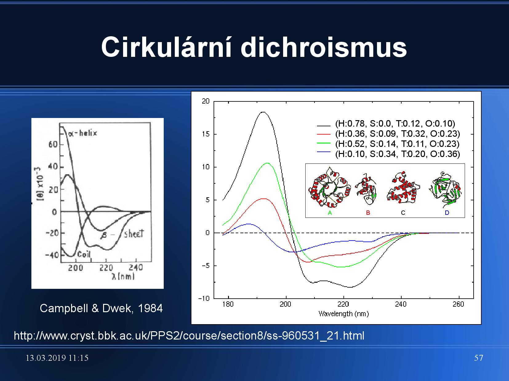
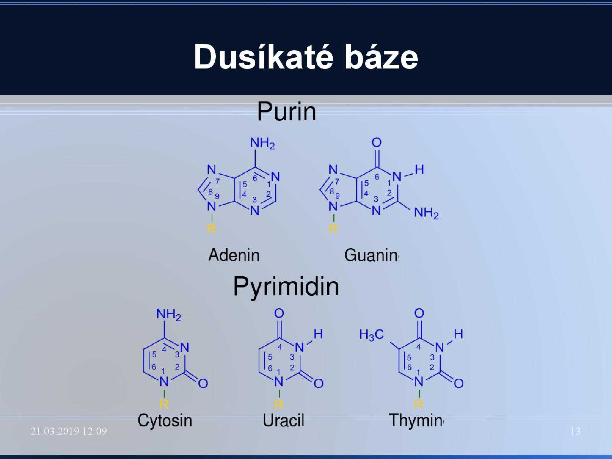
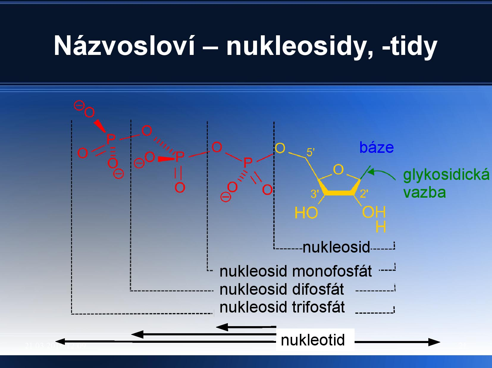
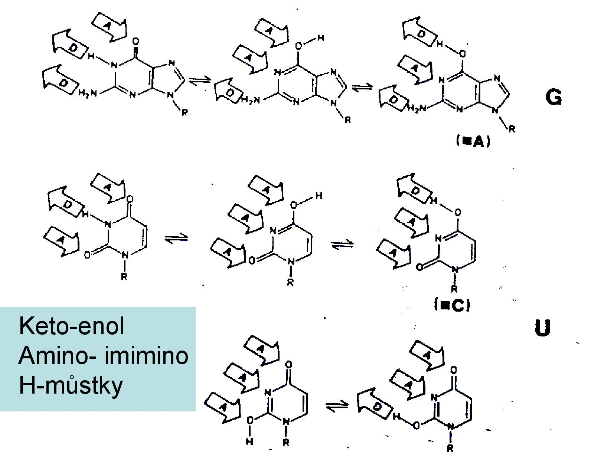
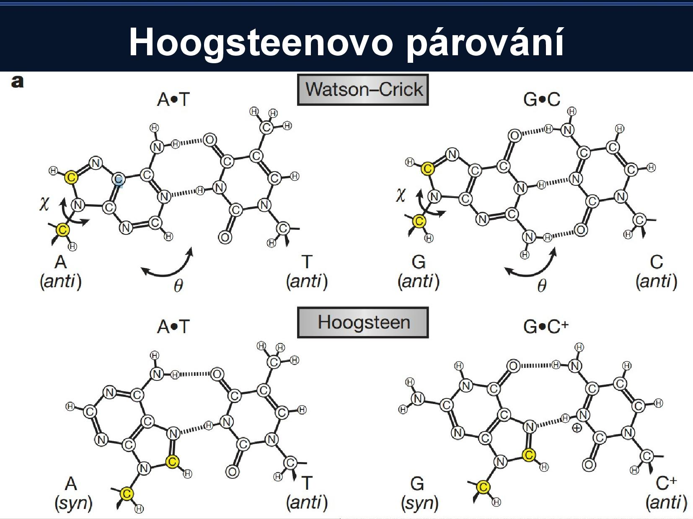
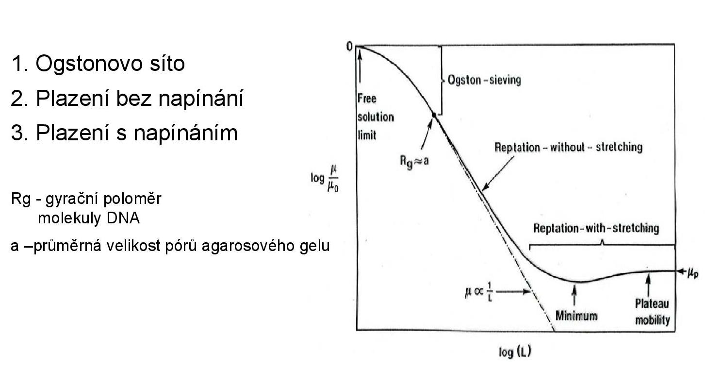
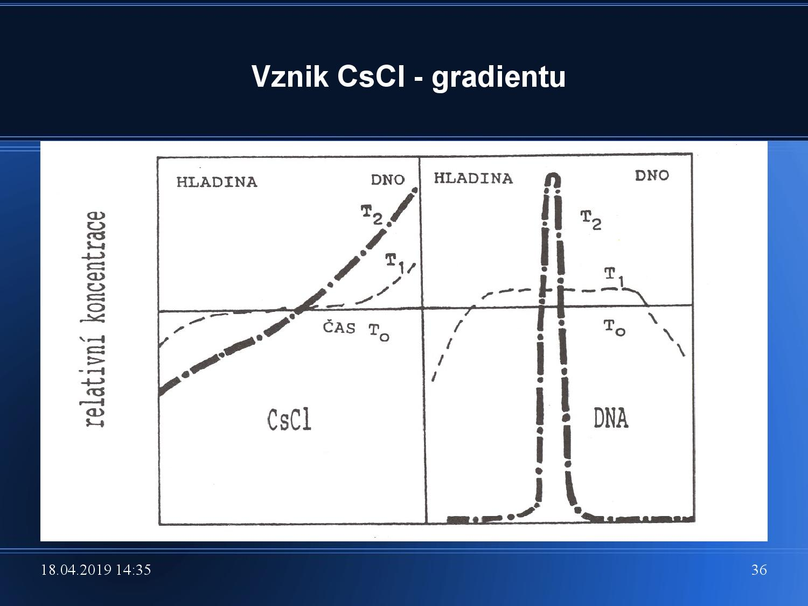

# Stavba hmoty

###### META
Tato a následující sekce jsou zkratkovité, protože se v testech příliš nevyskytují. Slouží hlavně k obecnému přehledu a shrnují povětšinou už známé věci.

- hmota se dělí na pole a látky, ale všechny formy látky mají dualistický charakter
- látky se skládají z atomů, které mají obal a jádro
    - proton: $1,673 \cdot 10^{-27} \text{kg}$, náboj $+e$
        - $e = -1,602 \cdot 10^{-19} \text{C}$
    - elektron: $9,109 \cdot 10^{-31} \text{kg}$, náboj $-e$
    - $1,675 \cdot 10^{-27} \text{kg}$, o trochu těžší než proton

###### META
Ve fotochemii přednášel Einstein. Cool.

Fotoelektrický jev
- po dopadu fotonu na destičku se uvolní elektron
- k uvolnění dojde jen pokud má foton dostatečně velký náboj
- poměr elektronů a fotonů je 1:1
- světlo má korpuskulární charakter
    - dvojštěrbinový pokus => světlo má vlnový charakter (důkaz interferencí)

**nuklid**
Látka, která se skládá z atomů jednoho prvku, které mají stejné nukleonové číslo (A).

**izotop**
Atomy jednoho nuklidu v rámci směsi více nuklidů jednoho prvku. Všechny izotopy mají stejné chemické vlastnosti, liší se ale svou hmotností a tedy i rychlostí reakcí. Někdy se používají se někdy u chemického značení, např. radioaktivního.

Základní vlastnosti atomu
- nukleony se přitahují velkou silou s krátkým dosahem
- neutrony kompenzují extrémní kladný náboj, proto jich je vždy stejně nebo více než protonů
- chemické vlastnosti udává konfigurace elektronů, hlavně těch valenčních

Radioaktivita
- jaderná přeměna (rozpad jádra) -> uvolnění záření (rychle letící částice)
- $\alpha$: rychle létající jádra $\ce{^4_2He}$, proniká vzduchem až několik cm, silně ionizující
- $\beta$: proud elektronů nebo pozitronů, je $100\times$ pronikavětší než $\alpha$ $$\ce{p -> n + e+ \\ n -> p + e-}$$
- $\gamma$: nejpronikavější (proletí několika metry betonu)
    - pozorování v mlžné komoře (páry, které kondezují, pokud jimi něco proletí)

U radioaktivity je důležitý i rozpadový zákon, který říká, kolik atomů radioaktivní látky budeme mít za určitou dobu.
$$N = N_0 \cdot e^{-\lambda t},$$
kde $\lambda$ je přeměnová konstanta. Tu můžeme spočítat například pokud známe poločas rozpadu naší látky, protože
$$\tau = \frac{\log 2}{\lambda}.$$
Zavádí se i veličina **aktivita** [Bq], která udává počet radioaktivních přeměn za sekundu.

Bohrův model atomu
- elektrony se pohybují po stacionárních drahách (hladinách) s určitým poloměrem, neztrácejí při pohybu energii
- elektron může přecházet z jedné do druhé hladiny, když pohltí/vyzáří určité _kvantum energie_
- můžeme pozorovat **emisní spektrum** atomu
    - úzké čáry, které udávají hodnotu vyzářeného záření
    - jejich hodnoty odpovídají rozdílům mezi jednotlivými hladinami
- model má několik nedostatků, funguje jen pro malé atomy
    - neumožňuje vypočítat relativní intenzitu spektrálních čar
    - nefunguje pro atom v magnetickém a elektrickém poli
    - nevysvětluje chemickou vazbu

## Kvantově-mechanický model atomu

V tomto modelu se projevuje korpuskulárně-vlnový dualismus elektronů. Aplikuje se Heisenbergův princip neurčitosti --- nemůžeme současně detekovat hybnost i polohu částic. Proto se k popisu částic používají probabilistické metody.

### Schrödingerova rovnice

Rovnice, která popisuje částice pomocí vlnové funkce $\psi$. $|\psi|^2$ pak udává pravděpodobnost toho, kde se daná částice nachází. Velikost atomu nemůžeme přesně určit, většinou se spokojíme s prostorem, kde se elektrony vyskytují s 99% pravděpodobností.

$\psi$ vyjde jako řešení Schrödingerovy rovnice, těchto řešení je nekonečně mnoho (liší se například tím, jakou energii daná částice má). Řešení popisujeme třemi čísly, která se nazývají **kvantová**.
- $n$, hlavní kvantové číslo, odpovídá energii částice
    - $E = -B/n^2$, kde $B =$ $\pu{13,6 eV}$
    - $n = 1$, atom je v základním stavu, $n > 1$, atom je v excitovaném stavu
- $l$, vedlejší kvantové číslo, udává moment hybnosti elektronu
    - hodnoty 0 až $n-1$
    - udává tvar orbitalu (prostoru), ve kterém se elektron nachází
- $m$, magnetické kvantové číslo, udává prostorovou orientaci orbitalu
    - hodnoty $-(n - 1)$ až $n-1$

###### TODO
Přidat tvary orbitalů + trik na to, jak se je naučit. Zmínit i fázi.Nalinkovat falstad.com/qmatom. Přidat obrázek z wiki: atomic\_orbital. Přidat tabulku orbitalů.

###### META
Rozpoznávání kvantových čísel z obrázku orbitalu je v testu.

Kvantová čísla pro složitější atomy
- vlnová funkce se konstruuje pomocí jednotlivých orbitalů
- elektrony se vzájemně odpuzují
- elektrony se stjeným $n$ tvoří _slupku_, se stejným $n$ a $l$ tvoří _podslupku_
    - elektrony na stejných podslupkách mají stejnou energii

Obsazování orbitalů
- obsazování podle výstavbového principu
    - nejprve jsou obsazovány orbitaly s nejnižší energií (tj. nejnižším součtem $n$ a $l$)
- Pauliho princip
    - v každém orbitalu jsou nejvýše dva elektrony, a ty se liší svým spinovým číslem
- Hundovo pravidlo
    - orbitaly se stejnou energií (tzv. degenerované) se obsazují postupně po jednom elektronu, všechny mají ze začátku stejný spin

## Periodická soustava prvků

- rozdělení podle protonového čísla, tedy podle počtu elektronů a tedy podle chemických vlastností
- dělení prvků podle toho, jaké valenční orbitaly se zaplňují jako poslední: s-prvky, p-prvky (i d-prvky a f-prvky)
- nejstabilnější stav orbitalů je u vzácných plynů, tzv. _oktetové pravidlo_
- prvky pod sebou mají podobné vlastnosti
- se Z se mění určité veličiny
    - roste atomový poloměr
        - v rámci periody je nejvyšší pro alkalické kovy
        - paradox: s obsazováním už zčásti obsazeného orbitalu se atomový poloměr zmenšuje
    - klesá ionizační energie, tedy energie kterou musíme dodat, abychom odštěpili elektron
        - v rámci periody je nejvyšší pro vzácné plyny
    - elektronová afinity klesá v každé skupině periodické tabulky s rostoucím atomovým číslem a roste v každé periodě s růstem atomového čísla
        - energie která se uvolní, když atom přijme elektron

## Molekuly

**molekula**
Stálé seskupení atomových jader obklopených elektrony; tvoří samostatnou částici. Vazby mezi jednotlivými atomy se dají zrušit jen chemickou reakcí. Elektronová struktura vázaných atomů se liší od elektronové struktury volných atomů.

Molekuly dělíme na homonukleární a heteronukleární.

### Chemická vazba

**disociační energie**
Energie, která se uvolní při přerušení chemické vazby. Je stejně velká jako vazebná energie, která vyjadřuje, jaký je pokles energie oproti stavu, kdy dva atomy vázány nejsou.

- při vzniku dochází k takovému přeskupení elektronů reagujících atomů, které vede ke snížení celkové energie soustavy
-  energie, která se uvolní při rozpadu vazby, se nazývá _disociační_
- vaznost atomu
    - C má vaznost čtyři
    - N, P tři
    - O, S dva
    - H jedna
- elektrony, které ve valenční vrstvě chybí jednomu atomu, mu mohou být "doplněny" druhým atomem

Délky vazeb
- nejkratší vazba je v $\ce{H2}$, 74,1pm
- $\ce{C-C}$ $\pu{150 pm}$, $\ce{C = C}$ $\pu{130 pm}$, $\ce{C 1. C}$ $\pu{120 pm}$
- $\ce{C-N}$ $\pu{132 pm}$
- $\ce{C - H}$ $\pu{109 pm}$
- vazba ale nemá konstantní délku, má pouze preferovanou délku, kolem které "kmitá"

Kovalentní vazba
- vzájemné sdílení dvou elektronů dvěma atomy
- dochází k překryvu elektronových hustot, elektrony se nacházejí v **molekulových orbitalech**, nejsme schopni určit, který elektron patří kterému atomu
- může být polární a nepolární, podle toho, jaký je rozdíl mezi elektronegativitami zúčastněných atomů
- molekula vzniklá z různých atomů má nenulový dipólový moment (je trochu polární, protože jeden z atomů si přitáhne sdílený elektronový pár blíže k sobě)

Koordinační vazba
- jeden atom (donor) poskytuje celý elektronový pár druhému (akceptoru), který musí mít volný valenční orbital
- vazba má parametry shodné s kovalentní vazbou, liší se jen vznikem

Iontová vazba
- atomy jsou drženy elektrostatickými silami
- iontové sloučeniny ve vodě disociují na anionty a kationty, obalené molekulami vody

Molekulové orbitaly
- kombinace atomových orbitalů, výsledkem jsou dvě různé vlnové funkce
- opět odpovídají rozložením elektronovým hustot kolem molekuly
- záleží na tom, jestli jsou jednotlivé atomové orbitaly ve fázi, nebo jestli se jejich fáze liší
    - rozlišení vazebných a antivazebných orbitalů
    - jestli vazba vznikne nebo ne záleží na tom, jestli je více elektronů ve vazebných nebo antivazebných orbitalů

### Hybridizace orbitalů

Kombinování AO, vhodné pro popis vazeb a prostorového uspořádání. Například u C se zkombinují (po excitaci) $2s$ a $2p$ orbitaly do tzv. $sp^3$ hybridizace.

Protože $s$ má nějakou danou fázi, původně symetrický $p$ který je s $s$ nyní zkombinovaný, bude najednou asymetrický; strana se stejnou fázi jako původní $s$ bude v $sp^3$ větší.
Proto tvoří C pravidelný čtyřboký jehlan s úhly 109.5strong° mezi C a H.

Uhlík může mít i hybridizaci $sp^2$ (které se neúčastní všechny tři $2p$ orbitaly, ale pouze dva z nich). Například v ethenu, kde vzniká dvojná vazba, jeden uhlík je v $sp^2$ a druhý z $p$. $\sigma$ vazba vzniká v $sp$ orbitalech, $\pi$ vazba vzniká na původních $2p$ orbitalech. Podobně existuje i $sp$ hybridizace, která se vyskytuje při vzniku trojné vazby.

Molekuly složitějších molekul
- molekuly cyklické, s jednoduchými vazbami (např. cukry)
    - trans (židlička) a cis (vanička) konfigurace
- aromatické sloučeniny (benzenové jádro, mají $4n + 2$ π elektronů)
    - planární, π elektrony jsou delokalizované a všude jsou vlastně částečně dvojné vazby, kolem kterých nejde rotovat
    - tendence reagovat přes stacking interactions, tak, aby si mraky delokalizovaných π elektronů nepřekážely

# Stavba proteinů

Proteiny se skládají z aminokyselin (AK), pro více informací o struktuře proteinů a jednotlivých AK viz [struktura NA](/bioinformatika/doc/zaklady-bioinformatiky/notes.html#Struktura nukleových kyselin) a [struktura proteinů](/bioinformatika/doc/zaklady-bioinformatiky/notes.html#Struktura proteinů) v zápiscích ze základů bioinformatiky.

Stabilizace určité konformace
- struktura samozřejmě závisí na sekvenci atp., ale určitá konformace je "pohromadě" držena slabými vazbami
    - jsou slabé, ale působí jich hodně najednou
    - mají krátký dosah, závisí na teplotě
- Van der Waalsovy interakce mezi dipóly
- vodíkové můstky
    - délka asi 3Å, 2 + 1
- stacking interakce
- hydrofobní interakce (nepolární AK jdou do jádra proteinu)
    - molekula není s vodou schopna tvořit vodíkové vazby
    - když se takové molekuly nahromadí, umožní vodě vytvořit vodíkové můstky uvnitř sebe samé, což je energeticky výhodné
- interakce s vodou v roztocích
- iontové interakce s ionty v roztocích, i uvnitř molekul

Je velice složité počítat se všemi těmito vazbami, když se například snažíme konkrétní protein namodelovat. Práci nám stěžuje i to, že kolem jednoduchých vazeb je možná rotace a vibrace (měnění délky vazby), takže proteiny jsou v čase dynamické.

**rotamery**
Dvě AK, které mají stejné chemické složení, ale ve svém R-řetězci se liší rotací v nějaké z jednoduchých vazeb. Pokud je rozdíl v úhlech veliký, můžu se liší vlastnosti obou AK.

## Aminokyseliny

###### META
Je nutné umět zkratky, vzorce i základní vlastnosti a rozdělení všech AK.

- amfoterní charakter ($\ce{NH2}$ a $\ce{COOH}$ si navzájem předají vodík), vzniká _amfion_, někdy také _zwitterion_
- dělí se na nepolární, polární a nabité polární

- dva cysteiny spolu tvoří sulfidický můstek
- všechny proteiny (alespoň hned po translaci) začínají na Met, u bakterií je to N-formylmethionin
- AK mo­hou být mod­i­fikovány (oligosacharidy, sul­fa­ti­zace, es­ter­i­fikace, fos­fory­lace, ami­dace, atd.)
- průměrná hmot­nost AA je $\pu{110 g/mol}$
- existuje i několik vzácných AK
    - selenocystein, pyrrolysin, N-formylmethionin
    - jsou kódovány STOP kodony

### Disociace AK

Měříme poměr koncentrací nedisociovaných a disociovaných kyselin.
$$\ce{HA <=> A^- + H^+} \\ K_a = \frac{[\ce{H^+}][\ce{A^-}]}{[\ce{HA}]},$$
kde $K_a$ je takzvaná _disociační konstanta_. Pokud přidáme nějakou kyselinu do vody, pH se časem ustálí na $\text{pK}_a$ kyseliny.

[Pr. 1, slidy: 23, 26]
Definujeme také _izoelektrický bod_ AK, což je bod, kdy kyselina nemá žádný náboj. Počítá se jako průměr jednotlivých $\text{pK}_a$ všech možných forem AK, podle toho, který z vodíků je odštěpený. Pro vodík v $\ce{COOH}$ je $\text{pK}_a \approx 2$, pro ten v $\ce{NH3}$ $\text{pK}_a \approx 10$.

### Další vlastnosti AK

[Pr. 1, slide 32]
**Hydrofobicita** udává, jako moc je protein hydrofobní; značí se $R$, a má kladné hodnoty pro hydrofobní proteiny.

[Pr. 1, slide 33]
Chiralita
- chirální uhlík je takový, ze kterého vychází čtyři různé substituenty
    - u AK je jím $\ce{C\alpha}$
- rozlišení optických L a D izomerů
    - L-izomer: pokud H míří k nám, COOH nahoru, potom po směru hodinových ručiček: **CO-R-N**
    - optické izomery pootáčejí rovinu polarizovaného světla
    - všechny L izomery nestáčí tuto rovinu nutně vždy na stejnou stranu (a podobně ani všechny D)
- většina přírodních AK jsou L-izomery (vyjímky například buněčné stěny bakterií)
- může se stát, že místo jednoho má molekula $k$ chirálních uhlíků, poté existuje $2^k$ forem této molekuly

## Peptidová vazba

[Pr. 1, slidy: 44, 45]
Vazba mezi dvěma AK, které se účastní původní $\ce{COOH}$ a $\ce{NH2}$ skupiny.

[Pr. 1, slide 46]
Vazba je planární, protože dvojná vazba $\ce{C=O}$ někdy přejde na vazbu $\ce{C-N}$ (tzv. _mezomerie_). Rotace je tedy možná pouze v "rozích" vazby, kolem vazeb vycházejících z $\ce{C\alpha}$.

[Pr. 1, slidy: 50, 51, 52]
Torzní úhly
- rotace kolem $\ce{C\alpha}$ jsou možné, ale kyslík a vodík si při určitých hodnotách rotace překážejí
- jsou povolené dvě konformace: **cis** a **trans**
    - zpravidla u všech proteinů se vyskytuje konformace trans
    - cis konformace jen výjimenčně u prolinu
- torzní úhly: $\varphi$ značí úhel $\ce{C-N}$, $\psi$ značí úhel $\ce{C-C}$
    - povolené hodnoty těchto úhlů můžeme zanést do tzv. _Ramachandranova grafu_
    - v Ramachandranově grafu nejprve vypíšeme oblasti pravděpodobných hodnot, teoreticky možných hodnot a nepravděpodobných hodnot, poté srovnáme naměřená data s těmito zónami
    - určité oblasti odpovídají určitým sekundárním strukturám, viz slide [Pr. 1, slide 53]

## Sekundární struktury

[Pr. 1, slide 57]
Helikální
- α helix
    - pravotočivá šroubovice
    - stabilizován vodíkovými můstky mezi vodíkem aminoskupiny a kyslíkem karbonylu
    - vzálenost vodíkových můstků je 4AK
    - 3,6 AK na otáčku
    - upostřed není dutina
    - postranní řetězce vždy směřují ven
- $3_{10}$ helix
    - interakce mezi první a třetí AK
    - vzácnejší, vyskytuje se na okrajích sekundárních struktur
- π helix
    - interakce mezi první a pátou AK
    - vzácnejší, vyskytuje se na okrajích sekundárních struktur

[Pr. 1, slide 56]
Beta struktury
- interaguje opět vodík na aminoskupině s karbonylem, ale mohou být v rámci řetězce i daleko od sebe
- paralelní a antiparalelní (ten je stabilnější)

# Metody pozorování proteinů

## Spektrofotometrie

[Pr. 2, slide 27]
Světlo: viditelné elektromagnetické záření. Pro spektrofotometrii (zde dále SFM) proteinů je vhodnější UV záření.

Lambertův-Beerův zákon
- určuje, jakým způsobem prochází světlo vzorkem
- vzorek může světlo pohlcovat (na tom naříklad záleží jeho barva), nebo rozptylovat
    - v obou případech pozorujeme intenzitu světla před a po projití vzorkem

Konkrétní znění zákona se dá vyjádřit vzorcem
$$T &= \frac{I}{I_0} \\
A &= -\log T = \varepsilon \cdot l \cdot c,$$
kde $I$ a $I_0$ značí inzentity světla, $T$ je **transmitance** vzorku, **A** je absorbance vzorku a $\varepsilon$ je molární extinkční koeficient. Pokud již známe absorbanci naší látky, můžeme pomocí tohoto vzorce například spočítat jejich koncentraci.

[Pr. 2, slide 32]
Absorbce světla molekulou
- molekula má v základním stavu
- po absorpci fotonu se dostane celá molekula do excitovaného stavu, protože jeden z jejích elektronů přejde do vyššího orbitalu
- excitovaná molekula při návratu do základního stavu vyzáří energii
- velikost vyzářené energie závisí na růzdílů energií orbitalů, mezi kterými elektron přecházel

### Spektrofotometrie v praxi

SFM je nedestruktivní metoda, což je její velká výhoda.

[Pr. 2, slide 33]
Proteiny dobře absorbují světlo kolem $\pu{225 nm}$ (tam absorbuje peptidová vazba) a případně i kolem $\pu{280 nm}$, když mají nějaké aromatické AK. Všechny AK absorbují různě moc, takže pokud známe složení proteinu a vidíme absorpční spektrum vzorku, umíme z něj vypočítat koncentraci. $\varepsilon$ pro jakýkoli protein o známé sekvenci se totiž dá dopočítat.

Nukleové kyseliny zpravidla absorbují kolem u{260 nm}. U nukleových kyselin se SFM užívá například k posouzení stupně a průběhu denaturace, nebo k posouzení homogenity. Pro sekvence DNA a RNA se koncentrace stanovuje trochu jinak,
$$100 \cdot \frac{A_{260}}{K} = c.$$
Pro dsDNA $K = 2$, pro ssDNA $K = 2,5$, pro ssDNA $K = 3$, pro oligo DNA $K = 3,3$ až $K = 5$.

## Cirkulární dichroismus

[Pr. 2, slide 52]
**lineární polarizace světla**
Udává rovinu kmitání elektrické vlny světla. Běžné světlo není polarizované, i když při odrazu k částečné polarizaci dochází.

Ke změně polarizace můžeme použít polarizační filtry, které propustí pouze světlo, které kmitá v jedné konkrétní rovině.

**cirkulární polarizace světla**
Pokud v polarizovaném světle zpozdíme kmitání magnetické složky, například o čtvrt vlny, výsledný světelný vektor, který je součtem vektoru elektrického pole a vektoru magnetického pole, se bude postupně při kmitání otáčet.

Rozlišujeme pravotočivou a levotočivou polarizaci.

Absorbce cirkulárně polarizovaného světla záleží na chiralitě molekul a na levotočivosti a pravotočivosti světla. **Cirkulární dichroismus** je rozdíl mezi absorbancí levotočivě a pravotočivě polarizovanho světla.

Cirkulární dichroismus jednotlivých SS se liší, viz obrázek. Podobně se liší CD pro protein s nějakým foldem a pro denaturovaný protein. Pokud změříme CD proteinu, můžeme z výsledné spektrální křivky zjistit procentuální podíl jednotlivých SS.

## Gelová elektroforéza

Pomocí ELFO můžeme zjistit velikost proteinu, odhalit počet proteinů nebo odhalit kontaminaci vzorku. Nejběžnější forma je **SDS-PAGE**, SDS polyakrylamidová gelová elektroforéza.

[Pr. 2, slidy: 37, 45]
Základní princip ELFO
1. do gelu dáme do několika řad (line) vzorky (zpravidla nahoru)
1. na gelu vytvoříme elektrické napětí
1. všechny vzorky putují na druhou stranu gelu (zpravidla dolů), jejich rychlost se (ideálně) liší pouze podle jejich velikosti
1. po vypnutí elektrického proudu máme nedál od startu nejlehčí vzorky, nejblíže jsou vzorky nejtěžší

Musíme zařídit, aby byl gel tak akorát hustý, a aby všechny vzorky opravdu putovaly na stejnou stranu gelu (ke stejné elektrodě). Zároveň by bylo dobré nakonec vzorky nějak obarvit, ať je vůbec vidíme.

Protože nechceme proteiny dělit podle jejich tvaru, ale jen podle velikosti, povaříme je před ELFO v denaturačních činidlech.

### Gel

Polyakrylamidový gel je sice velice náročný na přípravu, má ale výborné rozlišovací schopnosti: například při dělení DNA lze rozpoznat DNA dlouhou 500bp od 501bp.

- polykarylamidový gel, nejčastěji 3%--15%
- akrylamid $+$ bisakrylamid
    - vzniknou zesíťovaná vlákna
    - aby proběhla radikálová polymerace, potřebujeme také iniciátor (persíran amonný nebo UV-ozářený riboflavin) a stabilizátor volných radikálů (TEMED)
    - musí probíhat v anaerobních podmínkách
- jeho viskozita zajišťuje, že velkým molekulám je při pohybu kladen větší odpor než malým
    - tato konkrétní vlastnost záleží na jeho koncentraci, pro různé vzorky se používají různě koncetrované gely
    - pro srovnání velmi rozdílných vzorků se používají **gradientové gely**, jejichž hustota se seshora dolů zvyšuje

Na tento gel se nanáší ještě _zaostřovací gel_, přechod mezi ním a PAG pak tvoří jakousi "startovací linii", na kterou se seřadí a vyrovnají porovnávané vzorky.

### SDS

[Pr. 2, slide 46]
SDS (sodium dodecyl sulfát) se váže na proteiny. Velké proteiny vážou více SDS než malé proteiny. SDS má dvojí význam:
1. zabraňuje tomu, aby se proteiny samovolně opět nafoldovaly
1. má záporný náboj, který "přebije" náboj proteinů a všechny proteiny tím pádem budou putovat ke kladné elektrodě
    - větší proteiny sice budou taženy větší silou, ale zase budou více brzděny gelem

### Barvení

Proteiny chceme samozřejmě nějak vizualizovat, aby nám ELFO vůbec k něčemu byla.

[Pr. 2, slidy: 48, 49]
Coomassie Brilliant Blue
- nejběžnější barvivo
- běžně má hnědooranžovu barvu, ale když se naváže na protein, změní barvu na modrou
    - váže se několikerým způsobem, vždy ale mění barvu
    - množství proteinu se dá posoudit podle toho, jak moc modrý je výsledný obarvený roztok

Intenzita proužku vypovídá o tom, jak moc koncetrované jsou v daném místě proteiny. Zároveň ale platí, že malé proteiny se obarvují hůře, takže nebudou tak výrazné.

## Fluorescence

**fluorescence**
Světlo emitované atomem po absorbci elektromagnetického záření. Energie fluorescence pochází z přechodu částice z prvního excitovaného stavu $S_1$ do základního elektronového stavu $S_0$. Délka fluorescence je v řádu nanosekund.

Výhody
- citlivost vůči okolí molekuly (teplota, viskozita, polarita, pH atd.)
- vhodná doba trvání
- citlivost (nM koncentrace analyzováneho vzorku)
- možnost provádět pokusy s jednotlivými molekulami (protože snímáme jednotlivé fotony)

Schéma fluorometru: na fluoreskující vzorek svítíme monochromatickým paprskem, měříme emisní spektrum.

[Pr. 2, slide 62]
Jabłonského diagram
- rozebírá vibrační hladiny zákadního stavu $S_0$ a jejich schopnost absorbovat světlo, viz slide
- vlnová délka světla musí odpovídat rozdílům energií mezi energetickými slupkami
- absorpční a emisní spektra jsou si podobná

[Pr. 2, slide 64]
Z emisních spekter Trp můžeme poznat, v jakém prostředí (solventu) se nachází a jestli je uvnitř či na povrchu proteinu. Posun k červené oblasti (ale stále v rámci UV) ukazuje na přítomnost $\ce{H2O}$.

# Nové zápisky v metodách

- chceme znát i více věcí než je nstrukturu
- koncentrace, mol.hmotnost, sekvence (introny x exony -- sekvenace proteinů), SS, rozměry a tvar molekuly
- až po těchto věceh zjistíme 3D strukturu
- a až poté řešíme interakce mezi proteiny, dynamiku a mechanismus sbalování

###### TODO
Co je Assay?

== KONCENTRACE proteinů
- spektrofotometrie: 280 / 220 nm
- kolorimetrie
    - biuretová reakce a Cu(II) vazba na 4N
    - Lowry: biuret a Folinovo reagens
    - BArdfordová: Coomassie Blue G250
- denzitometrie, porovnání se standardem na ELFO

=== biuretová reakce [slide]
- biuret je kondenzát močoviny
- umí koordinovat reakci s Cu
    - podobná reakce/koordinace probíhá i na polypeptidu, němělo by záležet na konkrétní AK sekvenci
- Cu se dá chelatovat pomocí BCA, tvoří komplex, který absorbuje velmi silně

coomassie brillienat blue G-25
- přidává molekule záporný náboj
- zabarvuje se podle toho, se kterou částí proteinu reaguje
    - nedá se používat v přítomnosti detergentů

== SS + 3D Struktura
- různé druhy, závisí na torzních úhlech
- pouze na základě záměn AK můžeme získat mnoho různých struktur (SS, TS)
- elektrostatické síly, H můstky, hydrofobní interakce, disuflidové vazby

== PRÁCE S PROTEINEM
1) produkce proteinu
- kdysi z původního zdroje
- nyní rekombinantně (kvasinky, e. coli)
    - není úplně dobré dělat eukaryot. proteiny v bakteriích
    - můžeme získat mutantní formy
    - můžeme přidat afinitní značky, pomocí kterých můžeme protein "vychytávat"
- důležitá je stabilizace (chlazení, nepřítomnost proteáz, případně vychytání proteáz pomocí speciálních nerozdělitelných peptidů)

SOLUBILIZACE [slide]
- vsolování, u všech proteinů to zvyšuje rozpustnost, protože bývají více stíněny náboje AK na povrchu, už se netvoří agregáty proteinů
- vysolování, odebírání vody
- organická rozpouštědla
- detergenty, denaturační činidla (ale nebudou v nativní konformaci)
- změna pH, pro každý protein je ideální pH s vyšší rozpustností

###### TODO
Co je to chromatografie?

=== CHROMATOGRAFIE
- pokud chceme proteiny přečišťovat
1) ionexová chromat
- podklad
    - pevný, nerozpustný
    - intoy z podkladu (A, K) jsou vyměňovány za ionty v rotozku (B, C)
    - Anex, Katex [ZE SLIDU]
- protein
    - polyelektrolyt
    - vazba anexu nebo katexu podle pH a pI
    - kompetice s ostatními ionty v roztoku

- volba vhodných podmínek pro vazbu
    - nechceme vázat kontaminující proteiny
- výběr podmínek pro uvolnění z nosiče
    - druhý krok selekce (zbavení se protilátek)
- vazba na kolonu
    - můžeme preotin neustále vázat a uvolňovat
    - můžeme sbírat jednotlivé frakce

[slide schématu ionexové chromat.]

- ionexů je mnoho, liší se inertními materiály, ze kterých jsou vyrobeny

2) hydrofobní chromat
- hydrofobní zbytky AK jsou umístěny uvnitř proteinů
- malá část je exponována do vnějšího prostředí
- vazba na silně hydrofobní povrch
    - RPC --- chromatografie s obrácenými fázemi (protein už tozmotaný)
    - HIC --- hydrofobní chromatografie

HIC
- nosičem je agaróza (SPA) + hydrofobní skupiny (fenol, oktyl)
- slabé hcydrofobní interakce
- eluce
    - klesajíím gradientem solí
    - stoupajícím gradientem detergentů
    - stoupajícím pH
- proteiny nejsou denaturované
- rozdělují se podle nativní hydrofobicity

RPC
- nosič
    - imobilizovaná nepolární kapalina
    - alkylové řetěce
    - fenyl-silika
- silné hydrofob. interakce
- eluce
    - hydrofobními látkami (organic. tozpouštědla)
- protein je denaturován

3) afinitní chromat
- agaróza aktivovaná bromkyanem, navázání nejrůznějších ligandů
- ukotvení ligandu na inertní nosič na koloně
    - máme látku, která se vážěe na kolonu a zároveň fúzuje s naším proteinem
- oplach kontaminací
- odmytí cílového proteinu
    - jiným ligandem s vyšší afinitou
    - pH, iontová síla, teplota

jedna z metod: his-tag
- komplex 6 His zařazený na konci proteinů (N/C - záleží na tom, jestli ji tam chceme nechat)
    - na histidinovou vrstvu se naváže nikl (AP, HRP), Ni je ligand
- pokudp přidáme imidazol, protein se [TODO CO UDĚLÁ]

druhá z metod: biotin [slide]
- vysoce afinitní vazby mezi bioitem a avidinem
- více druhů avidinu, streptavidinů, neutravidinu (ty jsou odvozeny z avidinů)
- naváže se avidin na protein, pak avidin s proteinem na biotin v koloně
    - někdy se ale váže biotin přímo na nějako uAK

další z metody: GST
- glutation-S-transferáze
- plazmid ze ktrerého exprimujeme protein
- TODO dna wtf?

4) chromat na hydroxyapatitu
- kompex H3PO4 a Ca
- váže anionty díky kladným nábojům Ca, ale i kationty díky H3PO4
- dobře váe preoteiny
    - můžeme proteiny proplachovat, například od lipopolysacharidu, který mi tam zůstal z producenta (bakterie)

5) [to sem nepatří] HPLC
[TODO doplnit z přednášky]

6) gelová filtrace (trochu patří do chromat) [slide x2]
- dělení podle velikosti a tvaru molekul
- stacionární fáze: kuličky hydratovaného gelu
- velké molekuly proteinů budou putopat mimo kuličky gelu, malé molekuly budou vstupovat do gelu
- velké molekuly půjdou nejrychleji
    - Vcelkový = Vkuliček + Vmrtvý
    - konkrétní látka má konstantní poměr Veluční / Vmrtvý
    - vylučovací limit je Mw nejmenší molekuly, která neprojde gelem
- distribuce rozdělení pórů v gelu => rozdělení podle rychlosti

7) molekulová filtrace
- [TODO DOPLNIT Z přednášky]

## ELFO proteinů
- sds page dělí proteiny podle velikosti/hmotnosti
- nativní PAGE dělí podle náboje, někdteré proteiny do gelu nevstoupí (CN - clear native)
- [slide] 20kDa až 1200kDa, gradientový gel
- preoteiny nejsou denaturované, mohou tvořit komplexy
- alternativa je BN (blue native), je tam nadbytek coomassie blue, které dává proteinu záporný náboj, ale nedenaturuje ho (na rozdíl od SDS)

2D ELFO
- koupený gel s gradientem pH
- proteiny se budou pohybovat gelem tam, kde bude pH odpovídat jejich pI
    - izoelektrická fokusace: proteiny putují do velcie úzkých zón
    - normálně by se rozdělily taky, ale ne do úzkých zón
- tento gel se dá položit kolmo na další gel [slide]
    - proteiny putují z fokusovaných prožků a rozdělí se podle moleulová hmotsnoti
- [TODO doplnit z přednášky něco u 2D ELFO o gelech]

BARVENÍ GELU
- coomasiia je nejčastější
    - opáchneme SDS vodou
    - barvíme 1h, hnědá -> modrá
    - je nutné odbarvit methanolem, octovkou, vodou
- stříbro
    - velice citlivé
    - váže se na různé AK
    - vyvoláme Ag+ -> Ag0, získáme hnědočernou barvu
    - během vyvolávání se používá formaldehyd, glutaraldehyd
        - kovalentní modifikace proteinů, proteiny se nedají dál použít
- zinkem
    - velmi citlivé, negativní barvení
    - imidazol váže zinek (i nikl btw), elý gel je bíle opalescentní
    - kde jsou proteiny, gel zůstane průhledný
- fluorescenční
    - nejčastější nekovalentní
    - SYPRO
        - barvení v ejdnom kroku, bex fixace, bez odbarvování
        - intenzita flouorescence roste lineárně s množstvím

[TODO doplnit od fluorescenčních až po kvalitu]

HODNOCEÍ KVALITY PROTEINŮ
- jak zjistit, jestli při práci s proteinem nedošlo k nějaké chybě
- sds-page: je protein fragmentován
- wester blot - pje náš proten opravud ten, který myslíme? (protilátky)
- NMR spektrum fingerprint
- cirkulární dichroismus
- DLS (TODO: co to je?)
- chromatografie:

## Sekvenace proteinů
- někdy se stane, že DNA sekvence nepřechází celá do proteinu
- důležitá pro krystalografii, protože ta musíme znát přesnou sekvenci abychom z krystalu něco vyčetli
- umožňuje odvození SS
- odhalení dědičných poruch a dispozic k onemocněním

příprava na sekvencai
[TODO doplnit]

nalezení koncových AK
- pomocí exopeptidáz, štěpíme protein z jednoho nebo druhého konce (nejlépe pro <5 posledních AK)
- C koncová AK
    - karboxypeptidáza A a B, z hovězího pankreasu
    - ale neštěpí určité AA
- sledujeme růst koncentrací AK v rotozku, podle pořadí toho, jak se mění, odhadujeme pořadí kocnocývh AK

# Struktura nukleových kyselin

DNA a RNA se skládají z bazické, cukerné a fosfátové části. Páteř tvoří cukr (ribóza, deoxyribóza), který se střídá se zbytky kyseliny $\ce{H3PO4}$.

## Stavební jednotky

[Pr. 3, slide 2]
Kyselina trihydrogen fosforečná
- každý z vodíků může být disociován
- $\ce{H3PO4}$ někdy tvoří dimer, _pyrofosfát_ [Pr. 3, slide 3]
    - spojené makroergní vazbou (při rozštěpení se uvolní velké množtsví energie)
    - makroergní proto, že jsou k sobě blízko kyslíky (vzniká mechanické pnutí)
- trifosforečná kyselina bývá vázána v nukleotidech

Základním cukrem je ribóza a deoxyribóza. Základní strukturní vlastnosti cukrů jsou však předvedeny na glukóze.

[Pr. 3, slidy: 5, 6]
Glukóza
- pojmenování podle polohy OH skupiny na chirálním uhlíku, který je nejvzdálenější od aldehydické skupiny
    - v lineárním Fisherově zakreslení: OH vpravo -> D-forma, OH vlevo -> L-forma
- pokud dojde k vytvoření cukerného heterocyklu, můžeme rozlišit dvě formy podle polohy OH na $\ce{C1}$
    - α, OH míří dolů
    - β, OH míří nahoru

[Pr. 3, slidy: 8, 9]
Ribóza
- v NA cyklizuje do pětičetného cyklu (ribofuranóza), může ale tvořit i šestičetný cyklus (ribopyranóza)
- uhlíky se v rámci NA značí s čarou
    - fosfát je v NA vázaný na $\ce{C3}$ a $\ce{C5}$
    - na $\ce{C1}$ je přes N-glykosidickou vazbu navázána dusíkatá báze
    - na $\ce{C2}$ je OH skupina (RNA), případně tam není (DNA)
- celkově je tedy v NA (případně deoxy verze)
- cyklus **není planární** [Pr. 3, slide 10]
    - pokud $\ce{C2}$ míří na stejnou stranu jako $\ce{C5}$, je NA takzvaně _endo_ (případně C2 endo)
    - pokud míří $\ce{C2}$ na opačnou stranu, je NA _exo_ (případně C2 exo)

[Pr. 3, slide 12]
V NA tedy nacházíme **β-D-ribofuranózu**, a to buďto endo nebo exo formu. Samozřejmě v DNA je deoxy- varianta tohoto cuktu, viz slide. OH skupina má vliv na reaktivitu, DNA je proto mnohem stabilnější než RNA.

Cukr s fosfátem (navázaným přes fosfodiesterovou vazbu) tvoří tzv. _cukrfosfátovou kostru_ NA.

Dusíkaté báze
- puriny jsou na $\ce{C1}$ v cukru vázány dusíkem $\ce{N9}$, pyrimidiny dusíkem $\ce{N1}$
    - puriny jsou vlastně kondenzáty pyrimidinu a imidazolu
- Watson-Crickovo párování: párování GC, AT, na základě vodíkových můstků [Pr. 3, slide 13]
- v DNA je nahrazen thymin uracilem (který se liší jen jednou metylovou skupinou)
- kromě těchto základních se vyskytují v DNA i další, minoritní, báze: methylované báze a hydroxymethylované báze, uracil
- uracil má někdy tvar pseudouridinu, dihydrouridinu atp. [Pr. 3, slide 37]
- jeden pár bazí má asi $\pu{660 g/mol}$, neboli $\pu{660 Da}$

Párování bazí
- keto skupina je vždy akceptor
- amino skupina vždy donor
- sekundární amin, imin: mohou fungovat jako akceptor

## Struktura

[Pr. 3, slide 16]
- vlákna v DNA jsou antiparalelní, jedno je ve směru 3'->5' a druhé 5'->3'
- zaujímají strukturu dihelixu (Watson, Crick)
    - difrakční obrazec spirály má tvar X

Názvolsoví nukleotidů a nukleosidů je trochu zmatené:
- adenin - adenosin
- cytosin - cytidin
- guanin - guanosin
- thymin - thymidin
- uracil - uridin

Synklinální a antiklinální forma
- rozdělení forem podle toho, na jakou stranu je rotovaná báze
- rozlišuje se pouze u purinů
- pokud purin míří k cukrfosfátové kostře, jedná se o formu _synklinální_, v opačném případě se jedná o formu _antiklinální_
- antiklinální forma je výhodnější, a tedy častější
    - jedinou výjimkou je [Z forma DNA](#Konformace Z)

###### META
Syn a anti konfigurace [jsou na proteopedii](http://proteopedia.org/wiki/index.php/Syn_and_anti_nucleosides) s pěknými obrázky. A jsou tam i další fajn věci.

[Pr. 3, slide 42]
Keto-enol tautomery
- keto skupina
    - uhlík a kyslík vázané dvojnou vazbou
    - kyslík má vždy volný elektronový pár, funguje jako akceptor vodíkové vazby
- enol skupina je OH
- pokud budeme mít OH skupinu v blízkosti dvojné vazby, bude spontánně docházet k přeskupení na keto formu
    - Erlenmeyerovo pravidlo

[Pr. 3, slidy: 43, 44]
Amid, imid
- primární, sekundární, terciární aminy (viz slide výše)
    - pokud je dusík vázán dvojnou vazbou, jedná se o _imino_ skupinu
- pokud je amin v blízkosti keto skupiny, jedná se o amid
    - podobně existují imidy

U všech bazí můžeme pozorovat takzvané **tautomery**, konkrétně amid/imid a keto/enol formy. Přestože jsou amidové a keto formy častější, musíme při práci s NA počítat s tím, že semtam mohou mít některé báze i imidovou a enol stavbu.

[Pr. 3, slide 56]
Struktura tRNA
- tři báze dole na smyčce nemají s čím párovat, trčí ven ze smyčky
    - tvoří antikodon, párují s třemi bázemi na mRNA
    - v jedné z pozic je určitá variabilita, jev _kolísavého párování_ (wobbling) => různými triplety je kódovaná stejná AK
        - například ve třetí pozici se může nacházet inosin (hypoxantin + ribóza), který může párovat s C, U i G [Pr. 3, slide 59]
        - tRNA je méně než 64, což je počet, který by byl teoreticky nutný k zakódování všech trojic
- v horní části vázaná AK

### Hoogsteenovo párování

Běžné Watson-Crickovo párování je postavené na tom, že spolu párují pouze AT, CG, a všechny puriny jsou v antiklinální podobě. K párování ale může docházet i když jsou puriny v synklinální podobě (zvláště u adeninu, cytosin by musel mít kladný náboj).

[Pr. 3, slidy: 51, 52, 53]
To znamená, že puriny jsou "na druhé straně" schopny párovat s ještě jednou bazí. Vznikají takzvané _triády_.

[Pr. 3, slide 54]
G-kvadruplex
- čtyři guaniny v jednom patře
    - vlákno se dvakrát ohýbá (viz slide)
- velice pevná struktura
- často v telomerách na koncích chromozomu, aby nebyl degradován endonukleázami

Někdy se do běžného DNA helixu vmezeří třetí strand, který se na jedno z vláken naváže H-párováním. Toto třetí vlákno musí mít tzv. polypurinovou část, aby tuto vazbu mohlo vytvořit. Podobně se může mezi vlákna DNA vmezeřit i vlákno RNA.

## Reaktivita bazí

[Pr. 3, slide 63]
- reakce jsou stejné jako u jiných heterocyklických sloučenin
- výjimka: pyrimidiny někdy reagují s podobnou molekulou
    - u pyrimidinů je $\ce{C5=C6}$ podobná izolované dvojné vazbě
    - naříklad **thyminový dimer** (viz slide)
    - při působení UV záření
- výjimka: alkylace purinů na $\ce{N7}$ destabilizuje glykosidickou vazbu a vede k depurinaci

Většinu bazí můžeme brát jako aromatické molekuly. Součástí interakce bazí jsou tedy i stacking interakce napříč patry.

# Polymorfismus DNA

###### TODO
Eeeh, co je to ten polymorfismus?

Vývoj znalostí o struktuře DNA
- první pokusy vycházely z difrakcí rentgenového záření na částečně uspořádaných vláknech dsDNA
    - zjistilo se, že difrakce jsou někdy velice odlišné - tím se pojmenovaly konformace A--Z
- později se zkoumal rozptyl na krystalech
    - z genomové DNA nešlo udělat krystal -> krystalizovaly se oligonukleotidy, na které byla DNA rozlámaná ultrazvukem
- na těchto krystalech získáváme informace ještě podrobnější, než na vláknech
    - objev sekvenčního polymorfismu (konkrétní páry bazí si vyžadují odchylky od ideálního strukturního modelu)

Je ale třeba si uvědomit, že pokud využíváme k detekci anomálií protilátky, můžeme se nám stát, že danou strukturu naší protilátkou stabilizujeme v jedné konkrétní konformaci, i když přirozeně by ji často měnila. Protilátky tak nemusí vždy odrážet realitu.

###### Poznámka
Řekněme, že pozorujeme interakce dvou molekul v prostoru a vždy měříme úhly, pod kterými jsou spolu ve styku, z čehož se poté snažíme vyvodit, jestli spolu reagují nějak specificky. Jaké úhly pro nás v tomto případě budou zajímavé?

Jendoduchým pozorováním lze dojít k závěru, že při náhodném umístění a orientaci molekul bude nejběžnější úhel mezi nimi 90strong°, a obecně celé rozložení úhlů ude mít tvar sinusoidy.  Nejvzácnější bude tedy rovnoběžná orientace.

Pokud se tedy naše naměřené úhly budou významně lišit od pravidelné sinusoidy, má cenu se tím dále zabývat.

## Konformační polymorfismus

Jedna molekula DNA bude mít v různých prostředích různou konformaci. Konformací existuje celá řada (A--Z, s různými indexy).

Faktory ovlivňující konformaci
- humidita
    - 100%: B konformace
    - s ubývajícím množstvím vody -> DNA-A -> DNA-C
- přítomnost iontů
    - více $\ce{Mg^{2+}}$ znamená jednodušší metylaci C5' a supercoiling, což způsobuje Z konformaci
- zastoupení bazí
    - poly-A úseky, poly-AT úseky, atp., mají rozdílné vlastnosti

###### TODO
Přepsat tabulku srovnání místo obrázku slidu.

[Pr. 4, slidy: 20, 22, 24] Existují tři hlavní rodiny konformací: **A**, **B** a **Z**.

[Pr. 4, slide 38]

### Konformace B

- nejběžnější
- pravotočivá spirálovitá struktura
    - spirálovitá proto, že jednotlivé báze vlastně nechtějí být přesně nad sebou
- patra jsou vzdálená 330~350pm, působí mezi nimi stacking interakce
- fosfáty vzdálené kolem 9Å
- C1' uhlíky v rámci patra jsou v každém patře skoro stejně daleko od sebe
- ribóza je C2' endo (C2' je na stejnou stranu jako C5')
- rozlišení velkého a malého žlábku
    - důležité pro vazby molekul
    - mnoho proteinů reagujících s DNA funguje jako homodimer reagují s DNA na dvou místech
        - tyto proteiny kromě toho bývají bazické
    - do malého žlábku se váže např. molekula DAPI, která se používá k barvení [Pr. 4, slide 9]
- uprostřed helixu není žádné místo

[Pr. 4, slidy: 6, 7, 5]
###### Malý vs velký žlábek
Malý a velký žlábek lze rozlišit i na jiných konformacích DNA, kde zpravidla nejdou poznat tak dobře. Způsob jejich určení je naštěstí přesně popsán.
1. najdeme průsečík osy helixu a nějakého patra DNA
1. vedeme z tohoto bodu dvě polopřímky, každou do jednoho z C1' na obou bazích
1. rozdělíme rovinu na dvě části: tam, kde je úhel menší než 180strong° je malý žlábek, na opačné straně velký žlábek

###### META
Byly požadovány znalosti jednotlivých atomů, které se nacházejí ve velkém/malém žlábku.

### Konformace A

- pravotočivá spirálovitá struktura
- ribóza je  C2' exo, C3' endo
- uprostřed helixu je dutina, která bývá vyplněna vodou
    - někdy se stane, že dvě báze spolu interagují prostřednictvím molekuly vody

Podobnou konformaci zaujímá i heterokomplex DNA+RNA, protože OH skupina cukru z RNA musí čnít ven z helixu, tedy C2' musí být exo.

### Konformace Z

- levotočivá spirálovitá struktura
- kostra uspořádaná cik-cak
    - v sekvenci se střídají puriny a pyrimidiny
        - puriny jsou synklinální, jejich riboza je tedy přetočená a kostra vypadá cik-cak
- patra jsou si strukturou podobná ob jedno (v B jsou si podobná všechna), repetitivní je dvojice párů bazí nad sebou
- některé modifikace bazí (například methylace na C5') Z konformaci stabilizují (methyl se dobře schová mezi dvě patra)
- převládají báze G a C

## Sekvenční polymorfismus

[Pr. 4, slidy: 43, 46, 47, 49] Báze v rámci patra nejsou v rovině, ale zaujímají tvar asymetrické vrtule. Stejně tak jednotlivá patra spolu nejsou rovnoběžná, ale různě nepravidelně natočená, protože si navzájem přkážejí.

[Pr. 4, slidy: 52, 54] Natočení a posun bazí je různý u různých konformací DNA, a závisí také na místním nukleotidovém složení. Zajímavě se například chovají poly-AT regiony. [Pr. 5, slide 10]

[Pr. 4, slidy: 16, 17] Se sekvencí se nemění pouze posun bazí, ale i možné torzní úhly. Na slidu jsou znázorněny torzní úhly dvou polyadenylylových úseků s různými majoritními nukleotidy.

## Dynamický polymorfismus

[Pr. 4, slide 56]
DNA je neustále v pohybu. Jak moc a jakým způsobem záleží především na konkrétní sekvenci.

- nedá se sledovat na krystalech, musíme použít NMR nebo například fluorescenci
- jedná se vlastně o časově a prostorově lokální denaturaci
- pokud například DNA-B přechází v DNA-Z, jedna báze se může vyklopit z řetězce (flipování)
    - často proto, že reaguje s nějakým enzymem

Denaturace
- rozpad helikální struktury DNA, většinou způsobený teplem
- DNA se rozplétá od konců, nebo v sousedství utajených přerušení
- poly-AT úseky tají první, protože AT jsou spojeny jen dvěma vodíkovými můstky
- pokud k renaturaci dojde příliš rychle (např. prudkým ochlazením), ne všechny báze musí nutně skončit se svou komplentární dvojicí

## Ohyby a zalomení

K ohybům dochází v DNA hlavně na základě sekvenčního polymorfismu a na hranici dvou konformací. Naopak k zalomení především v důsledku mechanického namáhání nebo při vazbě na zakřivený povrch.

[Pr. 4, slide 66]
Ohyb vlákna
- způsoben AT bohatými oblastmi
- A a T spolu mohou reagovat napříč patry, čímž se DNA ohne
- DNA se částečně rozplete a sekvence jsou dobře dostupné
    - => často v promotorových nebo regulačních oblastech

## Další konformační anomálie

[Pr. 4, slide 69]
- lokální úseky Z-DNA, H-DNA, A-DNA, 4s DNA (uvnitř molekuly B-DNA)
- při výskytu palindromu, kde je jeden úsek DNA komplementární s nadcházejícícm úsekem na stejném vlákně, někdy na DNA vznikne kříž
- kromě kříže vlásenky, bubliny
- utajená přerušení: jedno vlákno je na kostře přerušené
    - nejsou problém, vlákna u sebe drží velkou silou
    - začíná u nich denaturace
- gapy: místa, kde chybí nějaká báze
- zlom s adhezivními (lepivými) přesahujícími konci: vlákno se lepí na vlákno podobného tvaru, nezáleží ale na jejich původu; adhezivní konce umožňují vytvářet genetické změny v DNA, můžeme je míchat

Způsoby studia strukturních anomálií
- můžeme využít hypersenzitivity anomálií
    - nukleázy (S1, mikrokokální)
    - chemické modifikace (glyoxal, chloracetaldehyd)
- můžeme detekovat chemicky značené anomlie
    -  elektronová mikroskopie
    - denaturační křivky
    - elektroforéza
    - sekvenování
    - vazba protilátek

## Vsuvka: konformace RNA

[Pr. 5, slide 2]
RNA vlásenka
- často se objevují nezvyklá párování
    - U + fosfátová skupina
    - G+U, U+U a podobně
        - někdy stabilizováno přes molekulu vody
    - G někdy tvoří vodíkový můstek s ribozou
- uracil a cytosin na špičce s ničím nepárují
    - cytosin stacking interaguje s párem pod sebou
    - uracil ční do prostoru (nejspíš málo konzervovaná pozice)
- na špičce vlásenky často UUCG a podobné

Bazická hydrolýza RNA
1. ve vysokém pH (silně zásadité) dojde k deprotonizaci $\ce{OH}$ skupiny na ribóze
1. kyslík z ribózy může nukleofilně reagovat s fosfátem z RNA kostry
1. fosfát je jen čtyřvazebný a tak jednu ze stávajících vazeb přeruší
1. RNA se rozpadne
1. fosfát posléze zůstane jen na C2' nebo C3'

Podobně fungují i enzymy štěpící RNA, je proto relativně složité je zastavit (např. u DNA stačí jen odebrat z roztoku kovy, které enzymy potřebují k rozložení DNA).

[Pr. 4, slide 77] V ribozomálním RNA jsou někdy celé sítě různých interakcí mezi nukleotidy.

[Pr. 5, slide 4] V RNA je možných mnoho různých druhů párování.

## Topologie DNA

DNA má strukturu dihelixu, viz výše. Topologie DNA se zabývá tím, jaký tvar tento dihelix zaujme v prostoru.

**supercoil**
Supercoil je termín, který popisuje přetočení nebo podtočení dihelixu DNA, které je vyústěním nějakého vnitřního tlaku, který na vlákna působí. Supercoil vzniká například v bakteriálním plazmidu. [Pr. 5, slide 14] DNA v přírodě se většinou vyskytuje právě v této formě.

Supercoilu se říká také _superhelix_, nadobrátkám někdy terciární vinutí (běžné Watson-Crickovské je sekundární).

**relaxovaná pozice**
DNA je v relaxované pozici, když nemá žádné nadobrátky. Relaxovaná cyklická DNA (například plazmid) se označuje jako CO forma ()

**twisting number (T)**
Udává počet překřížení dvou vláken DNA, která jsou spolu v dihelixu. DNA je před spočítáním $T$ nejprve vyrovnat do plochy. Znaménko udává, jestli je helix pravotočivý ($+$) nebo levotočivý ($-$).

V běžných podmínkách u lineárních B-DNA bývá $T = 10$ na každých 106bp, protože B-DNA má jednu otočku na přibližně 10.6 párů bazí. 

**writhe number (W)**
Udává počet nadobrátek, v přírodě (u bakteriálních plazmidů) bývá $W = 1$ na 200bp. Nadobrátky mohou vyústit ve dvojí typ topologie: DNA zaujme buďto toroidální tvar, nebo plektonemní tvar. Plektonemnímu tvaru se někdy říká _dvojitá nadšroubovice_.

###### Poznámka
Toroid je těleso, které vzniklo rotací nějakého tvaru kolem jedné osy. Uprstřed toroidu je díra (například donut je druh toroidu). Plektonem je v překladu "zkroucené vlákno" a vypadá spíše jako řetěz.

Znaménko udává, jestli je superhelix pravotočivý toroid ($+$) nebo levotočivý toroid ($-$). Pravotočivý toroid je matematicky totožný s levotočivým plektonemem a naopak, tedy levotočivý plektonem má znaménko ($+$).

**linking number (L, Lk)**
Shrnuje předchozí dvě čísla, je to hlavní způsob, jakým se popsiuje topologie DNA.
$$L = T + W$$
Pokud se budeme bavit o plazmidu, můžeme říct, že po úvodním spojení konců DNA, kde vznikne cyklická DNA, je $L$ konstantní. Úbytek otáček v helixu tedy bude znamenat příbytek nadotáček, a naopak.

[Pr. 5, slide 29] Supercoilování, nebo obecně změna $T$ a $W$ čísel, může někdy způsobit (nebo alespoň podpořit) změnu konformace DNA, více viz slide.

### Supercoil

DNA bývá velice dlouhé, buňka ho chce samozřejmě vměstnat na co nejmenší plochu --- s tou podmínkou, že bude stále možné čtení DNA kódu, případně replikace. A právě tento problém supercoil řeší. Supercoil se mimo to významně podílí i na procesech replikace a transkripce, protože usnadňuje přístup proteinů k sekvenci DNA (viz níže).

###### TODO
Doplnit z Albertse organizaci DNA v eukaryotické buňce (histony, nukelosomy) a přidat nějaký obrázek.

Velikost supercoilu (počet nadobrátek) se měří:
$$\Delta L &= L - L_0 \\
\sigma &= \frac{\Delta L}{L_0},$$
kde $L_0$ je $L$ relaxované DNA. $\sigma$ se nazývá superhelikální hustota a představuje počet přidaných/ubraných nadotáček vzhledem k původnímu počtu nadotáček.

Víme, že DNA je ve své nejčastější konformaci pravotočivé. Nabízí se otázka: jak je to se superhelixem u bakterií?

#### Levotočivost a pravotočivost

Teoreticky by mělo být jedno, kterou z těchto dvou forem supercoil zaujme: obě budou kompaktní, což je jeho hlavní účel. V praxi se to ale liší.
- pravotočivý supercoil utahuje pravotočivou DNA ještě více, než je utažená běžně
    - výslednou DNA prakticky není možno rozplést
- levotočivý supercoil naopak DNA trochu povolí
    - DNA se supercoilem sice zkompaktní, ale obě vláknou jsou kolem sebe namotaná volněji, než předtím
    - dobře dostupné pro enzymy, proteiny atd.

Zdá se, že je výhodnější **levotočivá** forma. To bylo potvrzeno následujícím experimentem:

[Pr. 5, slide 18]
Postup experimentu
1. v roztoku zvyšujeme koncentraci ethydium bromidu (EtBr), který zmenšuje počet otáček ($T$ číslo)
1. mizí nadobrátky, což pozorujeme při sedimentaci
    - čím více relaxovaná (=> objemná) DNA je, tím pomaleji sedimentuje
1. s dalším zvyšováním koncentrace EtBr dostaneme DNA až do relaxované formy, kde $W = 0$
1. s dalším zvyšováním najednou nadobrátky opět přibývají
    - z toho plyne, že $W$ bylo nejprve záporné, pak přešlo přes 0 a nyní je kladné => DNA je tedy běžně v levotočivé formě

###### Ethydium bromid
Iont ethidia se vzměstná mezi dvě patra DNA, přičemž se obě patra o kousek pootočí --- nově jsou vůči sobě pootočená jen o 10strong°, místo běžných 36strong°. DNA se tedy trochu povolí. Pokud přidáme ethidia dost, ubereme DNA celou jednu otáčku, čímž snížíme $T$ a zvyšíme $W$ (je-li DNA cyklická nebo má někde upevněné konce).

#### Superhelix a replikace

- při replikaci se rozplétají vlákna
    - klesá $T$, roste $W$, superhelix se "zauzlovává"
    - je nutné nějak supercoil zase oduzlovat, protože jinak by brzo nemohla replikace probíhat: buďto je nutné nějak aktivně odstranit nové kladné nadobrátky, nebo je nutné mít připravené záporné nadobrátky, které se s těmi nově vznikajícími kladnými vyruší
- u bakterií se zauzlování řeší připravováním záporných nadobrátek

O tvoření záporných nadobrátek se stará protein **HU**, který má podlouhlou, spirální strukturu.

[Pr. 5, slidy: 28, 26]
Postup
1. HU se naváže na DNA
    - díky jeho struktuře se kolem něj DNA obmotá
    - na DNA vzniknou v důsledku vazby a obmotání se záporné nadobrátky
1. na DNA se na druhé straně vytvoří kladné nadobrátky, aby vyrovnaly ty záporné
1. topoizomeráza I (TOPOI) odstraní tyto nově vytvořené "vyrovnávací" nadobrátky
1. HU protein se uvolní z vazby, a záporné nadobrátky na DNA po něm zůstanou

K podobnému jevu dochází i při transkripci.

### Topoizomerázy

Enzymy ovlivňující topologii DNA.

TOPOI
- je to monomerní protein
- štěpí jen jeden řetězec DNA
    - štěpí esterovou vazbu mezi cukrem a fosfátem
    - zůstane na vlákno navázaná
        - u eukaryot na 3' konec
        - u prokaryot na 5' konec
    - váže se přes Tyr
- ubírá jednu nadobrátku
    - konkrétně relaxuje negativní nadobrátky, které už na DNA jsou
- k funkci nepotřebuje ATP

[Pr. 5, slide 37]
TOPOI (funkce)
1. přestřihne jedno vlákno DNA
1. provleče druhé vlákno skrz mezeru
    - tímto se odtraní jedna otáčka
1. mezeru spojí (zaliguje)

TOPOII
- dvě podjednotky alfa a dvě beta
    - DNA se váže k alfa podjednotce
- štěpí oba řetězce DNA
    - štěpí esterovou vazbu mezi cukrem a fosfátem
    - zůstane na vlákno navázaná
        - u eukaryot na 3' konec
        - u prokaryot na 5' konec
    - váže se na Tyr
- přidává dvě negativní nadobrátky
    - konkrétně relaxuje jednu pozitivní nadobrátku, a vytváří jednu negativní
- k funkci potřebuje ATP

[Pr. 5, slide 42]
TOPOII (funkce)
1. přestřihne obě vlákna DNA
1. provleče mezerou druhou část helixu
    - tímto vzniknou dvě otáčky
1. mezeru zacelí

[Pr. 5, slidy: 38, 41] TOPOI i TOPOII umožňují i spojení (katenaci) dvou samostatných CO, úplně stejným postupem, jakým fungují běžně.

### Zkoumání topologie DNA

Rozlišení DNA dle topologie
- elektroforéza
- centrifugace (izokinetická, izopyknická)
- elektronová mikroskopie
- chování při denaturaci a reasociaci
    - cyklická DNA se reasociuje mnohem rychleji než lineární
- chování po interkalaci EtBr
- odolávání mechanickéu namáhání
    - linerání DNA je křehká, jako nevařená špageta
    - ccc (covalenntly connected cyclic) DNA je relativně odolná

[Pr. 5, slidy: 49, 50]
Zkoumání pohybu supercoilů
- supercoily se dají připravit experimentálně
    1. na jedné straně DNA fixovaná, na druhé má magnetickou kuličku
    1. otáčíme kolem DNA magnetické pole, kulička se otáčí taky
    1. DNA se namotává, vznikají supercoily
- supercoily se mohou po vlákně pohybovat
    - například když na DNA působíme proudící kapalinou
    - většinou se jen posunují, někdy ale coil "přeskočí" kus sekvence (hopping)

# Elektroforéza nukleových kyselin

_ELFO se dělá jak pro DNA, tak pro RNA. V tomto textu se soustředíme sice pouze na popis DNA ELFO, ale pro RNA bude vše fungovat velice podobně._

Funkce podobná [ELFO proteinů](#Gelová elektroforéza), s tím rozdílem, že NA se dají rozdělit nejen podle velikosti (hmotnosti), ale také podle topologie. [Pr. 5, slidy: 20, 21]

## Princip funkce pro DNA

- DNA má v neutrálním a bazickém prostředí záporný náboj
    - konkrétně jeden záporný náboj na jeden bp
- DNA vždy míří ke kladné katodě, není potřeba žádná molekula SDS ani nic podobného

Na každou molekulu DNA působí elektrická síla
$$F = q \cdot E,$$
kde $E$ je intenzita elektrického pole a $q$ je náboj molekuly. Působí na nic však také třecí síla gelu
$$F_t = f \cdot v,$$
kde $v$ je rychlost pohybu molekuly a $f$ je koeficient tření gelu a DNA. Po dosažení rovnovážného stavu tak platí
$$F = F_t \implies v = q \frac{E}{f}.$$
Někdy se zavádí speciální veličina _pohyblivost_, pro kterou platí
$$\mu = \frac{v}{E} = \frac{q}{f},$$
tedy dává do vztahu rychlost molekuly a sílu elektrického pole.

[Pr. 6, slide 4]
Ovlivnění pohyblivosti
- iontovou silou roztoku
    - pokud budou v roztoku kationty, mohou DNA obalit a ta bude poté putovat pomaleji
- elektrolýzou u elektrod
    - může se měnit pH, což může mít vliv na stavbu DNA a RNA
- elektroosmózou
    - elektroosmóza je putování malých nabitých iontů a vody skrz gel, které může mít opačný směr než je směr putování DNA
- tvorbou tepla
    - vlastnosti roztoku jako viskozita, odpar, vodivost a denaturace jsou ovlivněny teplem
    - vzorek se může putováním zahřívat

Protože má DNA jeden náboj na bp, je poměr mezi hmotností a nábojem DNA kostantní---to znamená, že větší DNA je sice těžší (což ji zpomaluje), ale je zároveň silněji přitahována k anodě (což ji zrychluje), čili výsledkem by mohla být konstantní rychlost putování pro všechny DNA. Naštěstí mají menší fragmenty DNA menší koeficient tření, takže se přeci jen dají na ELFO rozeznat.

## Příprava

ELFO se provádí v kapilárních systémech gelů, které částečně blokují difúzi do stran a zaručují tím, že nebudeme mít proužky příliš rozmazané. Nejčastejji se používá agarózový gel, popřípadě polyakrylamid.

[Pr. 6, slidy: 7, 9]
Agarózový gel (AG)
- agaróza je lineární polysacharid z mořských řas, složený z D-galaktózy a 3,6-anhydro-L-galaktózy
- snadno se připravuje a snadno se s ním manipuluje
- hodí se pro DNA o velikosti 1000bp -- 50000bp, při pulzní ELFO až do 2Mbp
- je to přírodní produkt (relativně drahý), takže jednotlivé šarže se mohou lišit, a to i od stejného výrobce
- koncentrovanější gel se hodí pro práci s malými molekulami DNA
    - pro 100bp--2kbp se hodí 2% agaróza
    - 5kbp -- 50 kbp se hodí 0,3% agaróza
    - zbytek mezi těmito hodnotami

Pufry
- ELFO mobilita DNA je ovlivněna složením a iontovou silou ELFO pufru
    - v nepřítomnosti iontů je elektrická vodivost velmi nízká, DNA putuje velmi pomalu a pruhy jsou rozmazané
- abychom měli homogenní elektrické pole přes celou délku bloku, potřebujeme pufr
- pokud dáme pufru moc, bude elektrický proud silný až příliš a gel se jím bude zahřívat
    - to může vést k rozkladu agarózy, denaturaci DNA a podobně
    - obecně je lepší provádět ELFO dlouho při malém napětí, než naopak
- je mnoho druhů pufrů, nejčastěji se používá TAE (pak například TBE, TPE)

Nanášecí pufry
- vzorek se při nanášení do gelu míchá s nanášecím pufrem
- zvyšují hustotu vzorku, který poté klesá dolů ke startu bloku
- barvivo usnadňuje nanášecí proces

Barviva
- první druh barviva slouží jen k tomu, abychom viděli, v jaké fázi ELFO je
    - přidáme ho na začátku ELFO
    - BPB, které putuje přibližně jako 300bp dlouhá DNA
    - XC, které putuje jako 4kbp DNA
- druhý druh se používá k odhalení míst, kam doputovalo DNA
    - přidává se většinou až po ELFO
    - EtBr, který se používá nejčastěji (interkaluje se do helixu)
        - kancerogenní
        - musí se proplachovat, protože se zachycuje i v gelu
    - SYBR Green I
        - dražší, ale nemusí se proplachovat a je mnohem citlivější
        - není kancerogenní
        - dá se přidat rovnou na začátku ELFO
    - barvení stříbrem, hlavně pro polyakrylamidové gely
        - nedá se z DNA dostat
    - DNA může být místo barvení radioaktivně označeno
    - obarvení kovalentně navázanými fluorescenčními sloučeninami

## Průběh

Průběh ELFO záleží na velikosti molekul, které pozorujeme.
[Pr. 6, slide 11]
1. molekula je velice malá (menší než 300bp -- 400bp, což je velikost molekuly agarózy): kategorie Ogstonova síta
    - bude procházet mezi molekulami gelu bez omezení rychlosti
    - rychlost pohybu není závislá na délce
1. molekula je středně velká: kategorie entropické pasti
    - v této oblasti je závislost pohyblivosti na velikosti molekuly nejsilnější
1. molekula je dlouhá, ale lineární
    - molekula se protáhne a provleče mezi molekulami gelu
    - rychlost pohybu opět není závislá na délce
    - například denaturovaná DNA

Na obrázku lze vidět porovnání délky molekuly a rychlosti, s jakou putuje v gelu. Snažíme se vždy, aby u námi pozorovaných molekul i malý rozdíl v déle způsobil velký rozdíl v rychlosti, protože poté i málo rozdílné molekuly půjdou dobře rozeznat. Vlevo na obrázku vidíme výsledek po 1D ELFO, kde nám spývají různé topoizomery. Po 2D ELFO jdou tyto topoizomery dobře rozlišit.

Faktory ovlivňující průběh
- napětí
    - při nízkém napětí je mobilita lineární DNA přímo úměrná napětí (což chceme)
    - při zvýšeném napětí nad určitou mez ($\pu{5 V/cm}$) se mění mobilita fragmentů různě v závislosti na jejich velikosti (což nechceme)
- směr elektrického pole
    - někdy se používá pulzní ELFO, kde se periodicky mění směr elektrického pole
- složení bází a teplota
    - nehrají velkou roli (na rozdíl od PAGE)
    - většinou pokojová teplota
- přítomnost interkalátorů
    - EtBr snižuje mobilitu lineární DNA o 15%

Eluce NA z gelu
- jinými slovy, když už máme vzorky rozděleny, jak je extrahovat
- zahřátím agarózy
    - většinou se na to používá speciální low melting AG, aby se nám při zahřívání nerozpadlo i DNA
- elektroelucí
    - kousek gelu vyřízneme a rozemeleme
- degaradací AG
    - to umí jen málo enzymů, protože agaróza je odolná

### Rozdělení topoizomerů DNA

Rychlost putování DNA závisí kromě velikosti molekuly i na jejím tvaru.

- ocDNA se pohybuje vždy nejpomaleji
- relativní rychlost cccDNA a lineární DNA závisí na hustotě gelu a napětí
    - řídký gel + nízké napětí: více se uplaňuje kompaktnost cccDNA
    - hustý gel + vysoké napětí: více se uplatní flexibilita lineární DNA
    - pohyblivost cccDNA navíc závisí na její nadšroubovicové hustotě

Může se nám stát, že chceme rozdělit vzorky podle velikosti i podle topologie. Bohužel velká lineární DNA může putovat stejně rychle jako menší coDNA, obě by tudíž skončily na stejném místě a nebyly rozeznatelné. Proto se někdy používá **2D ELFO**.

[Pr. 6, slide 25]
Průběh 2D ELFO
1. provedeme běžnou ELFO
    - rozdělíme vzorky přibližně podle topologie
1. přidáme EtBr, čímž rozmotáme supercoily
1. otočíme elektrické pole o 90strong° a opět provedeme ELFO
    - tentokrát se rozmotané supercoily rozdělí podél nové trajektorie podle délky

Někdy ani nepoužijeme EtBr a druhou osu ELFO vytvoříme pouze aplikací vyššího napětí. Mobilita při vyšším napětí se liší podle topologie, což nám dovoluje jednotlivé topologie rozlišit. 

Pokud nám naopak na rozdělení podle topologie nezáleží a chceme DNA dělit pouze podle velikosti, můžeme ji denaturovat.

Denaturační gely
- hlavně polyakrylamidové, používají se při sekvenaci
- denaturační činidla: močovina, formamid (méně často)
- aplikujeme vysoké napětí, ELFO se provádí při zvýšené teplotě (50strong°C)
    - DNA se rozpadne na vlákna a zůstává v lineární formě
- poté můžeme dělit pouze podle velikosti molekul DNA, s vysokým rozlišením
    - rozpoznáme od sebe i molekuly lišící se pouze o jeden nukleotid

### Pulzní ELFO

[Pr. 6, slidy: 28, 30]
- elektrické pole se periodicky mění, molekuly neputují gelem přímo, ale cik-cak
- používá se pro lepší rozlišení molekul podle délky, hlavně u delších molekul
    - dráha, kterou molekuly ujdou, je mnohem delší, takže i drobné rozdíly v jejich rychlosti mají větší možnost se projevit
    - molekuly se často musejí _reorientovat_, a jak rychle a dobře to zvládají závisí na jejich délce
- jako **standardy** se často používají konkatemery známých genomů bakteriofágů o určitých délkách, případně chromozomy S. cerevisae a S. pombe (druhy kvasinek)
    - stadard je sekvence o určité délce, která nám pomáhá odhadnout délku zkoumaných sekvencí (podobně dlouhé ekvence skončí po ELFO blízko standardu)

## Analýza ELFO

###### META
Tato sekce nebude u zkoušky, je zmíněna "jen pro naše dobro".

FIJI
- slouží k získání dat o tom, kde jsou proužky, jak jsou světlé atd.
- vyplatí se rozložit obrázek do tří barevných kanálů a studovat jen jeden z nich
- obdélníkový výběr -> analyze -> plot profile
    - získáme profil světlosti, ze kterého jde zjistit, na jakých pixelech jsou peaky (tedy zvýšené koncentrace DNA)
    - dá se vyexportovat do tabulky

FITYK
- slouží k proložení peaků funkcemi a k přesnému zjištění velikosti a polohy peaků
- otevřeme vyexportovaný intenzitogram z FIJI
- ten můžeme proložit fukncí
    - gaussovská křivka automaticky rozpozná peaky
    - z tabulky napravo přečteme, kde se naše peaky nacházejí a jakou mají velikost

# Sedimentační metody

Sedimentace slouží k analýze a případné separaci vzorků na základě jejich velikosti, molekulové hmotnosti, tvaru a hustotě. Funguje na principu odstředivé síly, jejíž velikost je závislá na hmotnosti každého ze vzorků---sedimentace tedy zpravidla probíhá v centrifuze. Teorie centrifugace byla vypracována Svedbergem.

Předpoklady
- sedimentujeme pouze malé tělísko
- zanedbáváme tepelný pohyb molekul
- jediná interakce mezi tělískem a roztokem je tření
- tyto předpoklady zjednoduší naše uvažování (a rovnice), někdy ale budeme muset přidat korekce, které odstraní vady způsobené těmito předpoklady

Rozdělení centrifugace
- podle účelu
    - analytická (AUC) zjistíme, co máme ve vzorku, v jaké formě a s jakými vazbami
    - preparativní: složí pouze k oddělení složek
- podle typu
    - izopyknická: odděluje molekuly na základě jejich vznášivé hustoty
    - izokinetická: odděluje molekuly na základě jejich hmotnosti

Zkumavku (kyvetu) se snažíme mít z nějakého odolného materiálu. Často se musíme vypořádat s tím, že molekuly u kraje kyvety o kyvetu třou a jsou pomalejší.

## Fyzikální princip

Na vzorek v kyvetě působí tři síly, **odstředivá**
$$F_o = m \cdot a = m \cdot \omega^2 \cdot r,$$
kde $\omega$ je úhlová rychlost, $r$ vzdálenost od osy otáčení a $m$ hmotnost tělíska; dále **vztlaková**
$$F_{vz} = m_k \cdot \omega^2 \cdot r,$$
kde $m_k$ je hmotnost kapaliny tělískem vytlačené; a konečně **třecí**
$$F_t = f \cdot v,$$
kde $f$ je frikční koeficient tělíska a kapaliny. $f$ se dá vypočítat s pomocí Stokesova zákona (pokud je tělísko kulové) nebo s pomocí Einsteinova zákona
$$f = \frac{R \cdot T}{N_A \cdot D},$$
kde $D$ je difúzní koeficient biomakromolekuly. Pkud tedy známe $D$, jsme schopni $f$ dopočítat, a $D$ se dá naštěstí zjistit experimentálně (závisí na tvaru a objemu molekuly).

Pro přehlednost zavádíme také veličinu **relativní odstředivá síla**
$$\text{RCF} = \frac{F_o}{m \cdot g},$$
která udává, kolikrát je odstředivá síla na ultracentrifuze větší než tíhová síla. Gravitační (tíhovou) sílu můžeme zanedbat, protože RCF se pohybuje ve stovkách tisíc.

### Sedimentační koeficient

Pokud $F_o = F_{vz} + F_t$, nastane _stacionární stav_.

$$F_o - F_{vz} &= F_t \\
V \rho r  \omega^2 - V  \rho_k  r  \omega^2 = f \cdot v &= f \cdot \frac{\text{d}v}{\text{d}t} \\
\frac{V (\rho - \rho_k)}{f} = \frac{1}{r \omega^2} \frac{\text{d}v}{\text{d}t} &= s$$

$s$ se nazývá **sedimentační koeficient** a udává se ve Svedberzích, $[S] = 10^{-13}\text{s}$. Pokud má tělísko 30S, pak urazí $\pu{3 \mu m/s}$ při sedimentačním zrychlení $\pu{1e6 ms-2}$. Sedimentační koeficient dává do souvislosti rychlost sedimentace se zrychlením, kterým na tělísko působila centrifuga.

Pokud k $s$ přidáme korekce, získáme **sedimentační konstantu**.
1. vhodná korekce na nulovou koncentraci biopolymeru
    - molekuly spolu interagují s čímž normálně nepočítáme
    - počítáme, jak rychle by asi sedimentovala jedna molekula samotná
1. korekce na tlakové rozdíly
    - extrapolace na hladinu, protože blíže ke dnu je velký hydrostatický tlak
Její hodnota zálěží na koncentraci biopolymeru, teplotě, a použité kapalině; značí se poté například $S_{0, 20, \text{w}}$.

###### Poznámka
Následující odvození se vyskytuje v prezetacích, ale v přednáškách nebylo moc dobře okomentováno a v cizích zápisech není okomentováno vůbec. Nemyslím tedy, že je moc důležité, ale projistotu ho sem dávám.
$$s &= \frac{1}{r \omega^2} \frac{\text{d}v}{\text{d}t} \\
\log \frac{r}{r_0} &= s \omega^2 (t - t_0) \\
s & = \frac{\log \frac{r}{r_0}}{\omega^2 (t - t_0)},$$
kde $\log$ značí přirozený logaritmus.

## Izopyknická a izokinetická ultracentrifugace

Izopyknická UC
- dělíme vzorky na základě jejich _vznášivé hustoty_ (neboli: hustoty)
- ve zkumavce vytvoříme gradient soli, většinou **CsCl**, do kterého se v průběhu centrifugace vzorky zařazují podle své vznášivé hustoty
    - na velikosti tolik nezáleží
    - vzorky se zastaví v hladině, kde se jejich hustota vyrovná s hustotou soli o dané koncentraci
    - gradient se tvoří sám průběhem centrifugace, není nutné jej dělat ručně
- velké molekuly tvoří úzký přesně definovaný proužek, malé molekuly jsou více rozprostřené

[Pr. 7, slide 35]
Využití izopyknické UC
- rozdělení topoizomerů
- stanovení poměru GC párů
    - GC páry jsou těžší než AT páry
    - dvě komplementární vlákna mohou mít různou vznášivou hustotu
- rozpoznání satelitních DNA
    - pokud má jeden vzorek DNA vznášivou hustotu velice odlišnouod zbytku, možná pochází z jiného organismu
- rozdělení dsNA a ssNA

U izopyknické UC záleží na hustotě CsCl, která by většinou být někde mezi vzorky, aby se mohly lépe oddělit.

Izokinetická UC
- každý vzorek se pohybuje (svou vlastní) kostantní rychlostí
    $$v = \text{konstanta} \cdot S$$
- běžně vzorky putují tím rychleji, čím dál jsou od osy otáčení, musíme tedy vytvořit speciální "zpomalovací" gradient
    - používá se sacharózový gradient (neutrální, alkalický), 5%--15% nebo 15%--30%
    - gradient musíme vytvořit ručně, na rozdíl od $\ce{CsCl}$ gradientu u izopyknické UC

Využití izokinetické UC
- rozdělení topoizomerů
- výpočet $s$ a $M$
    - sedimentační konstanty odpovídají tvaru, velikosti a hustotě (např. sedimentační konstanty ribozomů)
- detekce komplexů

[Pr. 7, slide 29]
Tvorba gradientu sacharózy
- v levé části máme málo koncentrovanou sacharózu, v právé více koncentrovanou
- když otevřeme kohoutek, nejprve se začne zkumavka plnit koncentrovanější sacharózou, časem se začnou obě koncentrace mísit
    - poměr míšení a hodnotu celkového gradientu můžeme ovlivnit šířkou dna první nádoby
- podobně se tvoří i gradienty u ELFO, když nám nestačí normální gel

## Preparativní a analytická ultracentrifugace

[Pr. 7, slidy: 6, 8]
Preparativní ultracentrifugy slouží pouze k oddělení jednotlivých složek vzorku. Jednotlivé centrifugy se liší druhem rotorů, které mají různý tvar a různé naklonění zkumavek. Vzorky se z kyvet po separaci odebírají injekční stříkačkou.

Analytické ultracentrifugy (AUC) mají kromě rotoru také zařízení, které v průběhu centrifugace měří různé veličiny vzorku (koncentraci a podobně).

Využití AUC
- pro purifikovaný biopolymer (tzv. _monodisperzní vzorek_)
    - stanovení sedimentačního koeficientu a sedimentační konstanty
    - výpočet molární hmotnosti
- pro heterogenní roztok
    - složení, počet složek, analýza reakcí složek
    - odhalení agregátů/komplexů i s jejich velikostí
- velká přesnost, zjistíme absolutní vlastnosti molekuly, nepotřebujeme standardy (na rozdíl od ELFO)

Výhody AUC
- stačí malé množství vzorku
- můžeme detekovat i kontaminaci
- můžeme detekovat interakce mezi látkami
- nedestruktivní metoda
- není třeba kalibrace pomocí standardů

### Průběh AUC

Když polymer dáme na hladinu a sedimentujeme, v průběhu centrifugace se pohybuje zkumavkou ke dnu takzvané **rozhraní**. Pozorujeme koncentrace v celé délce kyvety: na začátku bude koncentrace všude stejná, ale časem se koncenrace zvyšuje směrem ke konci kyvety. Pokud bude látek více, uvidíme několik rozhraní.

Na prvních derivacích koncentračních křivek jde vidět peaky. Nejprve můžeme pozorovat tyto peaky v čase pro jednu látku, pak pro druhou, a pak pro obě dohromady. Pokud v tomto případě vidíme kromě původních dvou peaků i nějaký nový, tvoří naše látky nějaký komplex. U tohoto komplexu můžeme pozorovat difúzní koeficient ("jak jsou peaky rozlité") i sedimentační konstantu.

Způsoby analýzy vzorku
- vzorky jsou v průhledných zkumavkách (na rozdíl od preparativní UC)
- absorbance
    - většinou u pozorování DNA
    - měříme podle ní hlavně koncetraci v jednotlivých místech kyvety
    - na rozhraní se světlo láme a nedopadá do měřiče, takže koncentraci jsme schopni určit pouze před rozhraním a za ním
    - jsme schopni rozlišit různé AK, i přirozené kofaktory proteinů
    - velice citlivá
- difrakce (interference)
    - pozorování proteinů, cukrů
    - Abbeho difraktometrie
        - na spodní část hranolu kápneme naši látku, změříme úhel totálního odrazu
        - z toho spočítáme index lomu
    - interferenční měření
        - z interferenčních obrazců na tenké vrstvě můžeme zjistit, jak tlustý je nějaký materiál
        - rayleigh interferometer - světlo prochází dvěma kyvetami (blank + náš vzorek), pozorujeme interferenční obrazce obou
    - ne tolik citlivá

Molární hmotnost můžeme vypočítat ze Svedbergovy rovnice
$$M = \frac{S R T}{D_0 (1 - \rho_k V)}.$$

### Praktické využití AUC

Zajímá nás, jakým způsobem funguje replikace u bakterií.

1. pěstujeme e. coli v atmosféře s těžkým dusíkem
1. po čase ji přesuneme do běžné atmosféry

[Pr. 7, slide 41]
Když po každém kroku změříme sedimentační koeficienty DNA, zjistíme, že na začátku byl helix těžký, poté vykazoval známky hybridního složení, a časem byl spíše lehký. Z toho (hlavně z druhého měření) je možno odvodit, že je replikace u bakterií semikonzervativní.

# Sekvenace DNA

Přečtení kódu DNA. Existuje mnoho různých metod, základní postup je ale společný (skoro) všem z nich. Poslední dobou je sekvenace rutinní záležitost, levná a relativně rychlá.

Obecný postup
1. připravíme krátké kousky DNA
1. amplifikujeme pomocí PCR
1. připravíme ssDNA
    - teplota + CsCl
1. sekvenujeme jednotlivé krátké úseky
    - části se musí překrývat, abychom věděli, jak úseky nakonec zase poskládat za sebe
        - například štěpíme stejné sekvence v několika místech
1. uspořádání nasekvenovaných částí, zjištění překryvu

**shotgun sequencing**
Termín, který popisuje postup sekvenace, který byl nastíněn výše: osekvenuje se mnoho krátkých fragmentů DNA s náhodnou délkou, které potom počítač přečte (získá _ready_) a složí dohromady.

Jakýmsi protikladem tohoto postupu je metoda _primer walking_, která prochází DNA popořadě, a je tím pádem sice jednodušší, ale také pomalejší.

**next generation sequencing**
Někdy také high-throughput sequencing --- umbrella term pokrývající všechny moderní metody sekvenování DNA. Cílem je rychlost (paralelizace), přesnost a nízká cena.

Většina sekvenačních postupů se liší už v provedení bodu 1: jak získat z dlouhého DNA kratší fragmenty. Rozlišujeme metody, při kterých štěpíme už existující DNA, a metody, kdy si sami syntetizujeme kratší kousky DNA podle původní DNA.

Hledání ORF
- open reading frame (ORF) popisuje způsob, jakým čteme trojice nukleotidů při translaci (jsou tři různé ORF, podle toho, kde začneme)
- zajímá nás, co jsou regulační oblasti a co jsou geny
    - v eukaryotech bývá často gen jen na jednom z vláken a na druhém není nic
- postup
    1. namapujeme stop-kodony; tam, kde kde dlouho nejsou, bude pravděpodobně gen (délka 200bp--400bp $\cdot$ 3)
    1. podíváme se, jestli v podezřelých oblastech končících na stopkodon začínáme na ATG (vzácně GTG, TTG)

###### Poznámka
Jak správně číst sekvence DNA?
- 3' -> 5' je **antisense** vlákno, slouží jako templát pro traskripci
- 5' -> 3' je **sense** vlákno, nebo také **kódující** -- výsledná mRNA má (až na uracil) stejnou sekvenci jako toto vlákno
- někdy mohou vznikat i antisesne transkripty, které mají regulační funkci

## Metody se štěpením DNA

Zpravidla jsou to metody starší, které se v dnešní době už tolik nepoužívají.

### Původní metody

Původní metody pracovaly hlavně s RNA, protože ta se štěpí snadněji. Využívaly štěpení přírodními látkami, konkrétně
- fosfodiesterázou hadího jedu (od 3' konce)
- fosfodiesterázou z hovězí sleziny (od 5' konce)

Postup
1. přidáme malé množství účinné látky
1. dojde k částečnému natrávení RNA
    - vzniknou kousky RNA, které jsou všechny různě dlouhé
1. u jednotlivých fragmentů analyticky zjistíme počty jednotlivých bazí
    - začínáme u nejkratšího fragmentu, potom druhý nejkratší atd...
    - postupně se dozvídáme, jaký nukleotid je na jaké pozici
    - např: G v dinukleotidu vůbec nebyl, ale v trinukleotidu je => na třetím místě je G

V současné době už nepoužíváme hadí jed, ale jsme schopni připravit stejně velké kusy DNA pomocí _restrikčních endonukleáz_. Existují ale i nové sekvenační postupy, které fragmenty s určitou přesnou délkou nepotřebují.

[Pr. 8, slide 9]
###### Restrikční endonukleázy
- homodimery (skládají se ze dvou identických podjednotek)
- váží DNA na specifických místech, v malém i velkém žlábku
    - R smyčka: velký žlábek
    - Q smyčka: malý žlábek
- rozpoznávaná místa jsou dlouhá 4bp--8bp
- často k funkci potřebují určité kationty
- štěpení se dá pozorovat i na elektroforéze
- velice přesné rozpoznání štěpného místa

Jsou to homodimery, váží se na obě vlákna DNA stejnou částí proteinu; vyžadují proto, aby na DNA byla palindromatická sekvence. Takové palindromatické sekvence však někdy způsobují i problémy (tvoří se kříže, vlásenky...), viz [polymorfismus DNA](#Další konformační anomálie).

Druhy
- REI: rozštěpí DNA např. o 1kbp dál
- REII: štěpí komplementární řetězce naproti sobě za vzniku kohezních konců
- REIII: podobně jako REI

RE pocházejí z bakterií, které se jimi brání proti bakteriofágům: bakterie mají většinu svého DNA nametylovánu, a když narazí na nenametylovanou DNA, ER ji z DNA vyštípnou.

Délku vzniklých fragmentů můžeme ovlivnit tím, jak dlouhou rozpoznávací sekvenci ER zadáme---čím kratší, tím větší je šance, že se na DNA bude nalézat.

### Chemické štěpení

DNA je štěpená na náhodně dlouhé kusy, někde uprostřed.

Postup
1. radioaktivně označíme DNA na 5' konci, abychom mohly dané DNA později detekovat
    - pomocí alkalické fosfatázy odštěpíme původní P
    - pomocí polynukleotidkinázy navážeme nový, radioaktivně značený fosfát
1. takto označenou sekvenci pošleme na několik štěpení

[Pr. 8, slidy: 19, 20]
Štěpení před G
1. přidáme dimethylsulfát (v pH 7), který se naváže na N7 na G
1. N7 na G nemůže být čtyřvazný, přeruší vazbu na ribózu
1. na ribóze je nyní volná OH skupina, na kterou se naváže piperidin
1. ribóza je destabilizována, přeruší vazbu s oběma fosfáty
1. DNA vlákno se rozpadá

Na podobném principu funguje štěpení před G + A, ale probíhá při pH 4. Samozřejmě takové štěpení nám přinese více fragmentů než štěpení před G.

[Pr. 8, slidy: 22, 23]
Štěpení před C + T
- podobný průběh jako štěpení před G, pouze za dimethylsulfát vyměníme hydrazin, který se váže na aminovou skupinu
    - pro štěpení čistě před C bychom ještě museli přidat $\ce{NaCl}$
- zbytek reakce je stejný

###### META
Ve zkouškovém testu se může objevit otázka, která bude využívat znalost konkrétních chemikálií při různých druzích štěpení. Proto ještě jednou pro přehlednost:
- dimethylsulfát + pH 7 => před G
- dimethylsulfát + pH 4 => před G a před A
- hydrazin + $\ce{NaCl}$ => před C
- hydrazin => před C a před T

[Pr. 8, slide 26]
Pozorujeme pouze strandy, které začínají na označeném 5' konci.
- rozdělíme produkty štěpení podle hmotnosti na PA gelu (70strong°)
    - jen pár pásků bude radioaktivně označených
- jsme omezeni počtem asi 100 fragmentů, a navíc samozřejmě nejsme schopni nasekvenovat označený 5' nukleotid

## Metody se syntézou DNA

###### PCR (polymerase chain reaction)
Řetězová reakce, která slouží k amplifikaci (duplikaci) určité části DNA.

Postup
1. denaturace DNA na dvě vlákna
1. vytvoření dvou primerů, které jsou komplementární k začátku a konci úseku, který chceme zkoumat
1. přidání DNA polymerázy
1. DNA polymeráza nasedne na primer a syntetizuje DNA směrem od něj
1. vzniknou dvě vlákna začínající primerem
1. pokud opět navážeme primery a přidáme DNA polymerázu, získáme sekvenci DNA omezenou z obou částí primery
    - jejich počet roste exponenciálně

Abychom mohli PCR provést, musíme znát alespoň kousek sekvence před a po námi zkoumané části, abychom mohli vytvořit odpovídající primery. Někdy se primery tvoří jen přibližně a nejsou 100% komplementární.

### Metoda terminace (Sanger)

Na rozdíl od sekvenačních metod štěpících nějaké stávající DNA na menší fragmenty funguje tento postup trochu obráceně; pomocí DNA polymerázy vytváří komplementární vlákno k sekvenovanému vláknu, a v průběhu této in vitro syntetizace dochází k samotné sekvenaci. Je to metoda vhodná hlavně pro malé vzorky.

[Pr. 8, slide 30]
Postup
- potřebujeme ssDNA, DNA primer, DNA polymeráza, dNTP (běžný deoxy trinukleotid), dideoxyNTP (trinukleotid, který na ribóze nemá žádnou OH skupinu)
- podle ssDNA tvoříme komplementární vlákno, někdy se ale stane, že se naváže ddNTP místo dNTP
    - po ddNTP se již nic navázat nemůže, polymerace DNA končí
- časem vznikne mnoho různě dlouhých úseků zakončených ddNTP

[Pr. 8, slidy: 34, 35]
ddNTP máme čtyři druhy, a ty jsou buďto fyzicky oddělené v nádobách, nebo fluorescečně označené v jedné nádobě. Skončíme tedy se čtyřmi skupinami fragmentů DNA, které jsou všechny ukončeny určitou ddNTP a my víme, kterou (buďto podle nádoby, nebo podle barvy). Stačí nám zjistit, jak dlouhá jednotlivá vlákna jsou a můžeme z nich složit celou sekvenci.

Délku jednotlivých fragmentů zjistíme pomocí ELFO --- běžně se nedělá gelová ELFO, ale kapilární ELFO doplněná chromatografií. Semtam kromě terminátoru (ddNTP) značíme i primer nebo běžné dNTP, abychom poznali, která DNA je naše nově polymerovaná a která je ta původní templátová.

### Pyrosekvenování

Při syntéze DNA (konkrétně při připojení každého dNTP) se uvolňuje proton a pyrofosfát (PPi). Právě detekce uvolněného PPi se používá v rámci pyrosekvenování.

[Pr. 8, slide 47]
Postup
1. k DNA, kterou chceme nasekvenovat, přidáme komplementární primer
1. přidáme nějaký konkrétní nukleotid (musíme vědět, který)
1. sledujeme, co se stane
    - pokud je nukleotid zařazen do naší rostoucí DNA, uvolní se PPi a proton, uvolněný PPi detekujeme
            $$\ce{DNA_n + {dNTP} ->[DNA polymeraza] DNA_{n + 1} + PPi} \\
            \ce{PPi + adenosin 5 fosfosulfat ->[sulfurylaza] ATP + SO4^{-2}} \\
            \ce{ATP + luciferin + O2 ->[luciferaza] AMP + PPi + CO2 + foton}$$
    - nakonec tedy pozorujeme záblesk; jak lze vidět z poslední rovnice, kromě fotonu se uvolní další PPi, čili reakce proběhne několikrát po sobě a uvolní se více než jeden foton
    - pokud je v sekvenci více stejných dNTP za sebou, sledujeme větší intenzitu světla

Nevýhodou této metody je, že při vyšším (8+) počtu stejných dNTP za sebou už se nám špatně detekuje jejich přesný počet. Luciferáza by mohla rozpoznat a zpracovat i běžné dATP (což nechceme), proto se použí dATP$\alpha$S, který má na P$\alpha$ síru.

#### Odhalování metylace

Bakterie mají často své DNA nametylováno, což jim pomáhá rozpoznat virovou DNA. U savců není metylováno veškeré DNA (metylace má i regulační funkci), ale je nametylována většina (70%) CpG párů --- tj. `[5'] cytosin - fosfát - guanin [3']` za sebou na jednom vlákně.

Vlastnosti CpG
- metylován je cytosin
- kdyby byla DNA čistě náhodná, CpG by v ní mělo tvořit kolem 6%, reálně jich tam je pouze 1%
- CpG jsou často v regulačních promotorových oblastech
    - mají vliv na buněčné dělení => často figurují u rakoviny
- nemetyolvané CpG je rozpoznáno TLR (tall like receptors), které detekují infekce

Proč je CpG méně, než bychom čekali? Mohlo by to být z toho důvodu, že methylcytosin se při deaminaci (což je proces, který u DNA může probíhat) mění na thymin, zatímco běžný cytosin se mění na uracil. Uracil je totiž v DNA jednoduše detekován a rychle opraven, zatímco thymin vlastně změní informaci, kterou DNA v daném místě nese. (Metylované) CpG je tedy svým způsobem nebezpečné.

Role pyrosekvenování v detekci CpG
- pokud se na jednom vlákně nachází CpG, na druhém se (také v 5' -> 3' směru) nachází také CpG, kvůli komplementarity
    - pomocí pyrosekvenování můžeme zjistit, že jeden CpG je methylován a druhý ne
- u celé DNA můžeme provést reakci $\ce{C -> U}$, zatímco C-metylovaný zůstane stejný
    - zjistíme množství a polohu všech U před a po této reakci

#### Pyrosekvenování 454

Principielně stejné jako běžné pyrosekvenování, liší se jen postupem.

Postup
1. štěpení DNA na relativně krátké úseky (500bp)
1. konce DNA jsou ligovány na primer a na biotin - tyto fragmenty se vychytávají na kuličky
1. na jedné kuličce v roztoku probíhá PCR amplifikace
    - z PCR můžeme získat ssDNA, která pochází z jedné molekuly
1. kuličky se opláchnou a převedou do olejové emulze
    - mají kolem sebe všechny potřebné proteiny, ale jsou separovány od ostatních kuliček s DNA
1. kuličky se dají do mikroreaktorů (prohlubně v desce), kde probíhá běžné pyrosekvenování
    - navrch se přisypou kuličky s enzymovými komplexy nutnými pro pyrosekvenování
    - celé reaktory se proplachují všemi čtyřmi dNTP
    - měří se luminiscence

Jediný hlavní rozdíl oproti pyrosekvenování je v tom, že P454 probíhá paralelně na mnoha fragmentech DNA najednou, je tedy rychlejší.

Využití
- sekvenace celých genomů
- sekvenace celých bakteriálních společenství
- detekce mutací ve směsi alel
- single nucleotide polymorphism (SNP)
- sekvenace transkriptomu
- objev nových genů

### Sekvenace nanopóry

Nová metoda, stále se vylepšuje. Je rychlá, ale má vysokou chybovost (10%) --- hodí se k doplnění ostatních metod.

[Pr. 8, slide 63]
Postup
1. máme dvě komůrky oddělené přepážkou, ve které je díra zakrytá fosfolipidovou dvojvrstvou
1. v této membráně vytvoříme pór, například bakteriálním toxinem, který umožní molekulám přecházet z jedné strany membrány na druhou
1. do každé komůrky vložíme jednu elektrodu
1. záporně nabité DNA putuje ke kladnému pólu přes pór v membráně
1. vlákno DNA pór ucpává a my jsme tím pádem schopni měřit výkyvy proudu, protože přes ucpaný pór nemohou procházet ionty
    - z výkyvů jsme schopni přečíst čtyři po sobě jdoucí nukleotidy
    - pomocí nanopórů lze provádět i "hmotností spektrometrii" roztoku

V případě nutnosti můžeme DNA u "vchodu" do póru zpomalit nějakým proteinem, který váže DNA. Také je možné nechat projít pórem hned po prvním strandu i druhý strand, což nám dovoluje zkontrolovat chyby.

### Další metody

Illumina - Solexa
- fixování ssDNA a primeru na sklíčko
- PCR, z fixované DNA vznikne _DNA kolonie_
- řetězec terminujeme fluorescenčním analogem dNTP (jako u Sangerovy metody)
- terminátory rozpoznáváme kamerou
- dNTP sonda lze po oskenování odštěpit, navázán zůstane jen obyčejný dNTP -> můžeme dál pokračovat v syntéze

Ion semiconductor sequencing
- při inkorporaci se uvolňuje kromě PPi i proton
- DNA leží přímo na křemíkovém čipu, který je citlivý na protony (tj. citlivý na malé změny pH)
- levná detekce, bez optických prvků
- možno sekvenovat jen krátké fragmenty

# Nezařazené poznámky
- hyperchronní efekt - ssDNA absorbuje více než dsDNA
[MOODLE] SSB někdy váže DNA přes stacking interakce na Tyr nebo Trp
