# Úvod

Histologie je nauka o tkáních. Díky novým typům značení, pokroku v molekulární genetice a novým vizualizačním technikám se histologie, ač by to tak na první pohled nevypadalo, stále řadí k dynamicky se rozvíjejícím oborům.

Jeden příklad za všechny, mechanismus šedivění vlasů. Melanocyty, které jsou nahrazovány z kmenových buněk, vyrábí melanin, který předávají keranocytům. To způsobí obarvení vlasu. Pokud však kmenové buňky vymřou, nedojde k vytvoření pigmentových buněk, tudíž vlas ztrácí pigmentaci. To nastane, je-li protein Bcl-2 na vnější mitochondriální membráně inaktivovaný.

Typy tkání
- epitelové
- pojivové
- svalové
- nervové

# Metody zkoumání

- histochemické techniky
    - specifické barvení
    - nespecifické barvení
        - získání kyselé a zásadité struktury buněk
- enzymatická histochemie
    - některé enzymy jsou odolné vůči fixaci a řezání
        - přidání bezbarvého substrátu => po reakci s enzymem se obarví
- imunohistochemie
    - použití _sekundárních protilátek_, protilátek proti protilátkám
    - označení fluorem => vznik nerozpustného produktu => klasická mikroskopie
- imunocytochemie
    - pomocí protilátek detekujeme jednotlivé buněčné struktury

## Příprava vzorku

### Odběr tkáně

**biopsie**
Odběr vzorku z živého organismu.

**nekropsie**
Odběr vzorku z mrtvého organismu.

### Fixace

- nutná, jinak se vzorek sám rozloží (autolýza)
- zastaví metabolické děje v buňce
    - zpomalením
    - denaturací enzymů

Princip funkce
- fyzikální metody
    - teplo
        - denaturace proteinů způsobujících autolýzu
    - zmražení
        - rychlá příprava vzorku
        - není třeba odvodňovat ani prosycovat pryskyřicí
        - je však nutnost zabránit vzniku krystalků vody, např. pomocí kryoprezervans (sacharóza + ethylenglykol/dimethylsulfoxid)
- chemické metody
    - imerzní
        - ponoření do fixační tekutiny
    - perfúzní
        - nástřik cév

Fixační činidla
- precipitace proteinů
    - chemická denaturace proteinů
    - např. chlorid rtuťnatý, kyselina pikrová
- denaturace a síťování kovalentních modifikací
    - formaldehyd, glutaraldehyd
    - vazba na $\ce{NH2}$ skupiny
- denaturující a odvodňující preparát
    - alkoholy
    - vysoce koncentrující metanol, etanol
- fixační směsi
    - rychlé, dokonalé fixování
    - Bouinův roztok: kys. pikrová, formaldehyd, kys. octová, voda
    - Zenkerův roztok = formaldehyd, dichroman draselný, chlorid rtuťnatý, voda
    - roztok glutaraldehydu, formaldehydu
- elektronová mikroskopie
    - glutaraldehyd + oxid osmičelý

Alkohol skvěle fixuje, čím více ethanolu, tím lépe, protože alkohol ve tkáních váže vodu a tkáně tím pádem odvodní.

### Odvodnění a projasnění

- lázeň se vzestupnou řadou etanolu
- odvodnění
    - parafíny nejsou mísitelné s vodou => nutnost vodu odstranit
- prosycení
    - rozpouštědlem zalévacího média
    - xylen, toluen, aceton

### Zalévání do vosku

- zpevnění preparátu
- rozpouštědlo mísící se s parafínem (xylol)
- parafíny, pryskyřice, zmražení

### Krájení

- krájí se na tloušťku jedné vrstvy buněk, tedy 4--10$\mu$m
- mikrotomy ("kráječe")
    - mikrotom
    - ultramikrotom
    - vibratom
    - kryomikrotom
        - bez fixace, bez zalévání, bez denaturace
- řez se dá na podložní sklo, přilepení bílek/glycerin
- řezání parafínových bločků
    - ocelový nůž
    - plátek na kapku vody na podložním sklíčku => napnutí + rozprostření
- bločky v pryskyřici
    - skleněný/diamantový nůž
    - řezy mají mezi 0,1 a 0,01$\mu$m
- řezy pro elektronovou mikroskopii
    - řez na kovovou síťku z leptané mědi

### Barvení

- účel: zviditelnění struktur a tkání
- většina barviv rozpustných ve vodě => je třeba z řezů odstranit vodu
- většina pozorovaných molekul je nabitých
    - bazofilní struktury
        - kyselé povahy, obsahují záporný náboj
        - DNA, RNA, glykosaminoglykany (ECM, lysozomy)
        - barvení bazickými barvivy
            - toluidinová modř, methylenová modř, hematoxylin
    - acidofilní (_eosinofilní_) struktury
        - jsou zásadité povahy, obsahují kladný náboj
        - cytoplazma, některé typy granul
        - kyselá barviva
            - oranž G, eosin, kyselý fuchsin
- nejčastěji barvení hematoxylinem a eosinem
    - acidofilní struktury: růžová, červená
    - bazofilní struktury: modrá, černá, purpurová
        - hematoxylin se oxidací mění na haematein
- fluorescenční techniky
    - paralelně vedle sebe několik různě obarvených struktur => vícebarevný preparát
    - velké množství barviv, všechna se specificky akumulují v jednotlivých organelách

###### META
Není třeba si pamatovat všechny barvy, stačí jen základní rozdělení uvedené výše + hematoxylin, eosin, giemsa a oranž.

Běžné barvy
- giemsa
    - krevní roztěry
- PAS barvivo
    - důkaz záporně nabitých makromolekul
    - muciny, GAG, sacharidy, polysacharidy, glykolipidy
- Nisslova substance
    - nervové buňky
    - neuronové a gliové sítě modřed
- AZAN
    - kombinace několika barviv
    - azokarmín: červená jádra
    - anilínová modř: modrá kolagenní vlákna a mucin
    - oranž G: oranžová cytoplasma a svaly, červené erytrocyty
- Weigert-van Gieson
    - Weigertův hematoxylin: šedá jádra
    - saturnová červeň: červená kolagenní vlákna
    - kyselina pikrová: žlutá cytoplasma a svalovina
- žlutý Massonův trichrom
    - hematoxylin: modrá až černá jádra
    - erythrosin: červená svalovina
    - šafrán: žlutá kolagenní vlákna, červené erytrocyty
- zelený Massonův trichrom
    - hematoxylin, kyselý fuchsin
    - světlá zeleň: zelená kolagenní vlákna, červené erytrocyty
- Weigert resorcin-fuchsin
    - resorcin fuchsin: fialová elastická vlákna
- Heidenhainův železitý hematoxylin
    - modrá až černá jádra a cytoplasma
    - barvení svalů
    - průkaz parazitů v tkáních
- impregnace stříbrem
    - hnědá až černá kolagenní a retikulární vlákna
    - barvení neuronů a glií
    - barví s vysokým prostorovým rozlišením
- kresylvioleť
    - fialová DNA, RNA
    - jádro, jadérko, granulární ER

Barva na vitální barvení
- neutrální červeň
    - neprotonovaná bezbarvá, permeabilní do buněk
    - protonovaná se obarví červeně => nemůže projít membránou
    - protonace např. v lysozomech
- Janusova zeleň
    - neoxidovaná bezbarvá, permeabilní do buněk
    - obarvování mitochondrií

## Histochemie

- využití chemických reakcí k vizualizaci struktur
- vznikající produkty
    - nesmí difundovat z místa vzniku
    - musí být nerozpustné, barevné nebo elektrodenzní
- metoda musí být specifická
- fixace nesmí blokovat funkční skupiny nebo zničit funkci prokazovaných enzymů

Histochemické detekce
 - železo
    - Perlsova reakce: tvorba tmavomodré sraženiny ferokyanidu železitého
    - odhalení hemochromatózy, hemosiderózy
- fosfáty
    - dusičnan stříbrný, fosforečnan stříbrný redukován na černý precipát stříbra (hydrochinonem)
    - studium osifikace
- DNA
    - Feulgenova reakce: hydrolýza DNA pomocí HCl
    - Schiffovo činidlo: volné aldehydové skupiny reagují s fuchsinem
- proteiny
    - imunocytochemické metody
    - polysacharidy, oligosacharidy
        - PAS reakce: oxidace kyselinou jodistou
        - aldehydové skupiny reagují s fuchsinem => purpurová sraženina
    - glykolipidy, glykoproteiny
        - značené lektiny
- enzymy
    - kyselé fosfatázy
        - Gomoriho metoda: fixace formalinem, inkubace s glycerolfosfátem sodným + dusičnanem olovnatým -> fosfátové ionty -> nerozpustný elektrodenzní fosforečnan olovnatý (lysozymy)
    - dehydrogenázy
        - Tetrazolium: reakce na barevnou sraženinu formazanu
    - detekce mitochondrií
    - peroxidáza
    - DAB 3'-diaminbenzen: vznik z peroxidu vodíku pomocí peroxidázy
    - hnědé zbarvení

Průkazové reakce
- imunocytochemie
- lektinová histochemie, hybridizace in situ
- metabolické radioaktivní značení, neboli elektromikroskopická autoradiografie

Propojení elektronové mikroskopie a autoradiografie
- k buňkám se přidá radioaktivně značený leucin
- leucin se zabuduje do proteinů
- sledování putování nově syntetizovaných proteinů

## Mikroskopie

Oko rozpozná řádově stovky $\pu{\mu m}$, světelný mikroskop stovky $\pu{nm}$, elektronový i stovky $\pu{pm}$.

Světelná mikroskopie
- sledování in vivo
- digitalizace dat
- mnohobarevná detekce
- konfokální mikroskop
    - detekce světelného signálu z jedné roviny zaostření bez kontaminace signálem nad a pod rovinou zaostření

Sledovat in vivo se dá i na tomografii, případně NMR.

Elektronová mikroskopie
- detekce elektronů
- optika je elektromagnetické povahy
- černobílé obrázky, ale existuje možnost obarvení
- typy
    - skenovací EM: svítíme na pokovovaný objekt, detekujeme, co se odrazí
    - transmisní EM: objekt prosvěcován elektrony, detekujeme jejich rozptyl
        - bez nutnosti barvení, schopni rotovat, prozařovat pod různými úhly

Průtoková cytometrie
- stroj schopný navázat suspenzi buněk (mohou být fluorescenčně značené)
    1. svítíme laserem
    1. zjišťujeme, která buňka je pozitivní pro konkrétní fluorescenci a svítí
- slouží k rozlišení buněk v krvi, tím, že se rozpadnou na jednotlivé populace

Laserová mikrodisekce
1. v preparátu najdeme útvar, který nás zajímá
1. laserem tento útvar vyřízneme
1. laserem se poté tento objekt vystřelí do detekční nádoby

Gene arrays
- studium celkové expresní aktivity
- určení buněčných typů pomocí izolace RNA přepsané do fluorescenčně značené DNA
    1. hybridizace na sklíčkách
    1. imobilizace sekvencí specifických pro konkrétní geny
    1. soubory barevných teček
    1. vypnutý/zapnutý gen

# Epitely

Epitely jsou tkáně tvořené buňkami s různým tvarem a funkcí, které jsou mezi sebou pevně spojeny pomocí mezibuněčných spojů. Vystýlají povrch sliznic a vnitřek dutin. Sedí na bazální lamině, jejich buňky jsou polarizovány.

Funkce epitelu
- krytí a vystýlání povrchů (kůže, sliznice)
- absorpce (střevo)
- sekrece (žlázy)
- recepce (neuroepitel)
- stažlivost (myoepiteliální buňky)
- resorpce (rohovka --- jediný takový epitel)
    - aby v ní nebyla voda a my dobře viděli
- dokáží fungovat jako svalové buňky, produkují myozin a aktin
    - např. myoepiteliální buňky mléčných žláz

## Stavba epitelů

Druhy epitelů
- podle vývodu
    - endokrinní žlázy, bez vývodu
    - exokrinní žlázy, s vývodem do lumen
    - sekreční epitely, s vývodem do lumen
- podle funkce
    - ochranný: mnohovrstevný, odolný
    - transportní:  velké množství kanálů, průchod molekul přes membránu
    - řasinkový: zajišťuje směrovaný pohyb (vajíčko ve vejcovodu)

###### TODO
Najít něco více o Blažkových liniích.

**Blažkovy linie**
Jev popisující diferenciaci kůže v jednotlivých pásech, které jdou za sebou.

Stavba epitelu
- je polarizovaný
    - bazální
    - apikální
    - bazolaterální
- pod ním je často pojivová tkáň
- tvar a velikost záleží na funkci (např. ochrana v jícnu => tlusté, vysoké buňky)
- odvozen od všech tří zárodečných listů
    - ektoderm: epitelový povrch kůže, ústní a nosní dutina, řiť
    - mezoderm: endotel (výstelka cév), mezotel (výstelka břišní dutiny, peritoneum (pobřišnice))
    - entoderm: výstelka dýchacího traktu, trávicí trakt, všechny orgány trávicí soustavy
- vždy sedí na bazální lamině, což je podpůrná pojivová tkáň
    - ztráta kontaktu s bazální laminou vede k diferenciaci (keratinocyty)
    - schopnost samouspořádání
    - buňky bazální laminy samy epitel vyrábí, nebo vzniká pomocí fibroblastů
    - v bazální lamině jsou přítomny speciální kolageny a fibriny

## Krycí epitely

Krycí epitely kryjí zevní povrch a vystýlají tělní dutiny.

Klasifikace dle tvaru buněk
- dlaždicový (plochý)
    - výstelka cév (endotel)
    - výstelka serózních dutin (perikard, pleura, peritoneum)
    - rohovka
- kubický
    - povrch ovária
    - štítná žláza
- cylindrický
    - výstelka střev, žlučníku

Klasifikace dle počtu vrstev
- jednovrstevný
- vrstevnatý
    - dlaždicový rohovějící
        - kůže: na povrchu tenké šupinky odumřelých buněk
    - dlaždicový nerohovějící
        - živé buňky
        - např. vlhké dutiny: ústa, jícen, pochva
    - kubický
        - vzácný
        - potní žlázy
        - vyvíjející se ovariální folikuly
    - cylindrický
        - vzácný
        - např. spojivka, vývody velkých žláz
    - přechodný
        - tvar buněk se může měnit
        - využití v tkáňovém inženýrství: pytlíček z bazální laminy se nechá porůst buňkami měchýře s vysokým obsahem kmenových buněk
        - např. močový měchýř, močovod
    - víceřadý
        - některé buňky jsou zakotveny v bazální lamině a nedosahují povrchu
        - např. dýchací cesty (s řasinkami)
    - neuroepitel
        - senzorické funkce
        - buňky chuťových pohárků
        - např. čichový epitel
    - myoepitel
        - větvené buňky specializované na kontrakci
        - např. mléčné, potní, slinné žlázy

Nádory
- u všech buněk kromě červených krvinek (nemají jádro, nemnoží se) a neutrofilních granulocytů (skoro před smrtí)
- do 10 let nejčastěji nádory krvetvorné tkáně
- po 45. roce je 90% nádorů odvozených od epitelů

**karcinomy**
Nádory odvozené od epitelu.

**adenokarcinomy**
Nádory odvozené od epiteliálních žláz.

**metaplázie**
Změna buněčného typu během života. Například u silných kuřáků se řasinkový pseudostratifikovaný epitel mění v stratifikovaný deskovitý, který poté správně neodvádí hlen. Reparace takového procesu je velice složitá.

Další příklad: při nedostatku vitaminu A nastane ztráta diferenciační informace pro řasinkové epitely v průdušnici a močovém měchýři, které poté přestanou fungovat jako pružné jednotky.

Kromě metaplázovaných epitelů mají ale jinak epitely velice dobrou schopnost reparace.

## Žlázové epitely

- buňky specializované na tvorbu sekretů
- jednobuněčné žlázy
    - pohárkové buňky (výstelka tenkého střeva)
    - dýchací trakt
- mnohobuněčné žlázy
    - vývoj z krycích epitelů proliferací a invazí do okolního vaziva

Typy žláz
- exokrinní
    - zachováno spojení s povrchovým epitelem
    - tubulární vývod je vystlaný epitelem
    - např. žlučové vývody, slinivka
- endokrinní
    - postrádají vývod, sekret je roznášen krevním řečištěm
    - slouží např. pro přenos hormonů

Některé orgány jsou jak exokrinní, tak endokrinní
- játra: žluč (exokrinní), transferin + albumin (endokrinní)
- pankreas: trávicí enzymy (exokrinní), inzulin + glukagon (endokrinní)

### Exokrinní žlázy

Dělení podle stavby
- podle tvaru
    - acinózní, kulatý tvar a úzké lumen
    - tubulózní, tvar trubice a úzké lumen
    - alveolární, tvar měchýřku a široké lumen
    - tuboloacinózní,  tvar trubice s kulatým koncem (ve žlázách smíšeného typu)
    - tuboloalveolární, tvar trubice s měchýřkovitým rozšířením (ve žlázách smíšeného typu)
- podle větvení vývodů
    - jednoduché žlázy, mají jeden nerozvětvený tubulózní vývod
        - stočené tubulózní, větvené tubulózní, acinózní (alveolární)
    - složené žlázy, mají větvené vývody
    tubulózní, acinózní, tubuloacinózní (tuboloalveolární)

Dělení podle typu vylučování
- merokrinní žlázy
    - jsou exocytována sekreční granula
    - např. pankreas
- holokrinní žlázy
    - sekreční produkt je uvolněn s celou buňkou, buňka jako taková zanikne
    - např. mazové žlázy
- apokrinní žlázy
    - přechodný typ
    - sekreční produkt je odloučen zároveň s apikální částí cytoplasmy
    - látky neobalené membránou: tukové kapénky v tukových buňkách a mléčných žlázách
    - uzavřou se do váčků a oddělí se buňky
    - odvrhování apikální části buněk probíhá v sítnici

###### Poznámka
Sekrece mléka v mléčnách žlázách je regulována oxytocinem, který aktivuje myoepitální buňky, ty se stáhnou a mléko je vylučováno ze žlázy. Pro mléčnou žlázu existují kmenové buňky, takže ji můžeme de novo vytvořit.

Dělení podle charakteru sekretu
- serózní žlázy, které mají sekret řídký a bohatý na proteiny
    - obsahuje buňky bohaté na granulární endoplazmatické retikulum, což způsobuje jejich bazofílii
- mucinózní žlázy, které mají sekret hustý a plný mucinu
    - tvar sekrečního oddílu je tubulózní

## Kmenové buňky

- udržování kmenovosti souvisí s vazbou na jiné buňky
    - po opuštění niky dochází k diferenciaci
- po ztrátě kontaktu s bazální laminou se odlupují a apoptizují

**niky**
Receptory udržující buňky v nediferencovaném kmenovém stavu.

Kmenové buňky v kostní dřeni
- stromální buňky vytváří jeskyňky (niky)
    - nediferencované mezenchymální a hematopoetické kmenové buňky

Kmenové buňky ve střevě
- z jedné kmenové buňky lze diferencovat všechny epiteliální buňky
- v tenkém střevě jsou ve vychlípeninách
    - směrem dolů diferencují do Panethových buněk
    - směrem nahoru diferencují ve žlázy a v resorpční epiteliální buňky

Kmenové buňky v kůži
- kmenové buňky jsou nejblíže povrchu pokožky
- během diferenciace sestupují do údolíček
- během keratinizace jsou vytlačovány vzhůru

Kmenové buňky v mléčné žláze
- jsou lokalizovány na povrchu ve směru růstu žlázy

## Jednotlivé tkáně

### Endoteliání buňky a cévy

Velikost jednotlivých buněk v endotelu závisí na jejich ploidii.

**endotel**
Epiteliální tkáň tvořící vnitřní stěnu cév.

**angiogeneze**
Vznik nových kapilár větvením.

Dynamika endoteliálního systému
- moc kyslíku => některé kapiláry se uzavřou
- málo kyslíku (hypoxie) => vyšle se signál pro vznik nových cév
    - zvýšení koncentrace HIF (hypoxia inducible factor)
        - protein, který se při nízké koncentraci kyslíku přestává odbourávat
        - stabilizace HIFu je regulována ubiquitinilací
    - zvýšená koncentrace HIF vede k produkci VEGF (vascular endothelial growth factor)
    - vznikne slepá větvička cévy, ta roste, až si tepna najde žílu

#### Cévy

- složeny z endoteliálních buněk, z extracelulární matrix a ze svaloviny
    - tunica intima (endotel), tunica media (svaloviny) a tunica adventitia (pojivo)
- poměry těchto vrstev závisí na druhu cévy
    - kapiláry jsou především z endotelu
    - propustnost kapilár se liší
        - „děravá“ (fenestrovaná): bazální lamina je jemnější sítko, větší částice neprojdou
        - nepropustná: kontinuální buňka a kontinuální bazální lamina
        - zcela nepropustná: mozek, uspořádání buněk je zodpovědné za intaktnost [hematoencefalické bariéry](#Hematoencefalická bariéra)

Vznik
- in vivo růstem už vzniklých trubiček
- in vitro
    1. uvnitř endoteliální buňky začne vznikat systém vakuol
    1. vakuoly se pospojují
    1. vznikne dutá struktura, která je schopná se spojit s jinými trubičkami
    1. vznik cévní sítě

Chlopně
- zabraňují zpětnému toku krve
- jsou to deriváty endotelu vybíhajícího do lumen
- nalézají se v malých a středně velkých žilách

Spojení žíly a tepny
- nutnost zabránit homotypické adhezi
    - nechceme, aby se spojila žíla s žilou a tepna s tepnou
- ke spojení nutné _ephriny_, což jsou molekuly tvořící se při diferenciaci nervové soustavy
    - tepny obsahují ephrin-B2
    - žíly obsahují ephrin-B4

#### Patologie

Hippel-Landaův syndrom
- vznik nádorů tvořených hyperproliferovanými endoteliálními buňkami (**hemangioblastomy**)
- pro vazbu ubiquitinu je na HIF ubiquitinylační sekvence---tato sekvence zmutuje, v důsledku čehož se ubiquitin na HIF nemůže navázat
    - HIF se nedegraduje, neustále se produkuje VEGF
    - stále se aktivuje proliferace a probíhá tvorba nových výběžků

Atheroskleróza
- nedochází k ukládání cholesterolu do stěn cév
- průběh
    1. zánět v těle nebo volné radikály způsobí oxidaci LDL, časem už v těle není normálně oxidovaná forma LDL
        - LDL (low-density lipoprotein) jsou částice zodpovědné za přenos cholesterolu
    1. buňky nedokážou oxidovaný LDL metabolizovat, LDL se v nich hromadí
    1. nastoupí monocyty, které endocytují oxidovaný LDL, ale neodbourají ho
    1. LDL se hromadí v monocytech, vznikají pěnovité buňky plné vakuol naplněné oxidovaným LDL
    1. monocyty spustí expresi genů, aktivují makrofágy (přilákají buňky "opraváře")
    1. to vede k produkci mezibuněčné hmoty pomocí mezenchymálních buněk a fibrocytů (fibroblasty)
        - fibroblasty jsou schopny diferencovat v osteocyty, osteoblasty a chondroblasty
    1. vznikají hrbolky kosti v cévě, která tím ztrácí svou mechanickou odolnost

### Kůže

- největší orgán těla, tvoří 16% hmotnosti
- musí být mechanicky odolná
    - extracelulární matrix (ECM) je syntetizovaná fibroblasty
- musí být krevně zásobená
    - systém krevních kapilár ohraničených endoteliálními buňkami
- obsahuje buňky imunitního systému
    - při zánětu makrofágy, granulocyty a lymfocyty

Vrstvy kůže
- epidermis
- dermis
    - silně vaskularizovaná a inervovaná
    - dělí se na řídké vazivo (blíže pokožky) a husté vazivo (blíže hypodermis)
- hypodermis
    - tuková tkáň

Kromě zmíněných vrstev se v kůži nalézají též senzory a nervová zakončení.

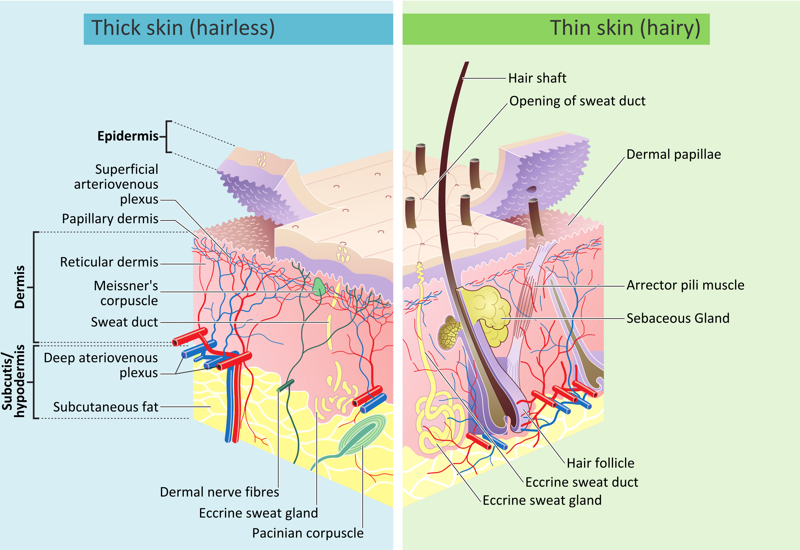
_By Madhero88 and M.Komorniczak - [link](https://en.wikipedia.org/wiki/File:Skin_layers.png), CC BY-SA 3.0, [link](https://commons.wikimedia.org/w/index.php?curid=21986708)_

Fibrocyty a fibroblasty
- fibrocyt je diferenciační prekurzor fibroblastu
- fibrocyt může diferenciovat ve fibroblast (a naopak), chondrocyt, hladkou svalovinu, tukovou buňku
- změna fibroblastu na tukovou buňku provázena změnou exprese genů
- fibroblasty vytváří desmozomy s jinými fibroblasty, vzniká síťovitá struktura
    - desmozomy jsou spojení buněk, při kterých mezi buňkami zůstávají mezery (cadheriny napojeny na intermediární filamenta)
- fibroblasty spolu s epiteliálními buňkami produkují složky bazální laminy

Mezenchymální kmenové buňky
- mají obrovský diferenciační potenciál
- dají se kultivovat in vitro v koktejlu růstových faktorů a cíleně diferencovat v různé typy buněk
- pluripotence: embryonální kmenové buňky
    - dají se izolovat z časného embrya
    - dají se in vitro kultivovat a geneticky manipulovat a poté vrátit do embrya

#### Epidermis

- jediná z vrstev kůže, která je epiteliálního původu
- sedí na bazální lamině, nejspodnější vrstvu tvoří keratinocyty
    - v záhybech na bazální lamině jsou kmenové buňky neschopné diferencovat v melanocyty, ale vznikají z nich keratinocyty
- je stále proliferována
    1. buňky jsou posouvány vzhůru
    1. časem jsou buňky dehydratovány a keratinizují
    1. takové mrtvé buňky se odloupnou
- obsahuje melanocyty a Langerhansovy buňky (= dendritické buňky)
- rozdíl mezi bělošskou a černošskou kůží je v pH endozomálního systému (běloši jsou kyselejší)

###### TODO
Lépe propracovat choroby spojené s melanocyty.

Melanocyty
- produkují melanin, kterým poté zbarvují okolní buňky
- ochrana před UV
- nevznikají v kůži, ale vlezou do ní z [neurální lišty](#Nervové buňky)
- obsahují _melanozomy_
    - deriváty lysozomů
    - naplněné melaninem jsou předávány epidermálním buňkám (keratinocytům)
- mutace
    - málo melanozomových prekurzorů => málo melanozomů => skvrny
    - mutace genu pro kit
        - receptor pro SCF faktor => je na epiteliální buňce v nice => udržuje buňky                     v kmenovém stavu
        - málo kmenových buněk => málo melanocytů
    - mutace v genu Pax3
        - homozygot => ztráta sluchu, depigmentace vlasů, očí, kůže

Porucha tvorby melaninu vede k albinismu. Tato porucha může být způsobena poruchou v enzymu tyrozinkináze nebo poruchou regulace pH v melanozomu.

Langerhansovy buňky
- derivované z kostní dřeně
- dendritická buňka nesoucí MHC II
- tvoří jednu vrstvičku rovnoměrně rozloženou pod kůží
- po pohlcení cizorodých substancí čekají v uzlině na rozpoznání T-lymfocytem, který poté obstará imunitní reakci

### Neuroepitely

_Pro více informací viz [oddíl o nervových tkáních](#Nervové buňky) a [oddíl o senzorických epitelech](#Senzorické epitely)._

- mají rozdílnou schopnost regenerace a rychlost obměny buněk
    - senzorický neuroepitel ve středním uchu ani ten na sítnici není schopen regenerace (máme ho jednou pro vždy)
    - čichový epitel prochází neustálou obměnou
        - je epidermálního původu
        - pro detailnější popis tkáně viz [oddíl o čichovém epitelu](#Čichový epitel)

## Patologie

Kartagenův syndrom (situs inversus)
- převrácená pravolevá symetrie vnitřních orgánů
- 50% jedinců trpí chronickou bronchitidou a sterilitou
- první popsaný případ v roce 1688
- způsoben mutací v molekulárním motoru zajišťujícím pohyb řasinek v řasinkovém epitelu

Průjem
- porucha funkce resorpčních epitelů trávicí soustavě
- u dospělého člověka je za jeden den sekrece sedmi litrů tekutin
    - 1l slin
    - 1,5l trávicí tekutiny v žaludku
    - 1l žluči
    - 1,5l trávicí tekutiny ze slinivky
    - 2l sukusu (všemožné tekutiny vylučované živými tkáněmi)
- resorpce tekutin ve střevě
    - 7,8l v tenkém střevě + dvanáctníku
    - 1l v tlustém střevě
- 0,2l ztrácíme stolicí

Cystická fibróza
- druhá nejčastější genetická porucha (po poruše konexinu vedoucí k poruše sluchu)
- způsobená mutací proteinu CFTR, který přenáší chloridové ionty ven z buněk
    - ve zdravé buňce dochází vylučování chloridových iontů
        - spolu s ionty opouští buňky voda
        - dochází ke zvlhčení epitelů a sliznice
    - v nezdravé buňce k tomu nedochází, sliznice jsou suché, hleny jsou husté
- trpí jí jeden člověk z 2500

Existují i určité poruchy mechanických vlastnosí kůže, které jsou způsobeny hlavně mutacemi v genech pro keratiny.

# Pojivová tkáň

- je tvořena různými buněčnými typy
- má rozmanitou strukturu, funkci i tvar
- produkuje velké množství ECM sekretorickou drahou (často více ECM než buněk)
- vazivo, chrupavky, kosti, tuková tkáň, krev

## Vazivo

- řídké, _areorální_
    - spojuje tkáně mezi sebou
    - obsahuje kolagenní, elastická i retikulární vlákna (obecně hodně ECM)
    - vyplňuje prostory, zpevňuje epitely, obaluje lymfatické a krevní cévy, je ve žlázách, sliznicích, dermis
    - typy
        - tukové
        - elastické (okolo páteře)
        - retikulární (vytváří prostot pro "výrobní buňky")
- husté
    - převládají kolagenní vlákna (obecně velmi málo ECM)
    - typy
        - neuspořádané
            - svazky kolagenu bez určité orientace
            - např. dermis (podkoží)
        - uspořádané
            - orientované podle stejnosměrných mechanických podnětů
            - např. šlachy

Extracelulární matrix (ECM)
- hlavní složkou je kolagen různých typů
- epitel nebývá vaskularizovaný, ale pod epitelem je vaskularizovaná pojivová tkáň
    - taková tkáň obsahuje velké množství buněk imunitního systému, především bazofilů

Retikulární pojivová tkáň
- houbovité uspořádání s volnými prostory uvnitř
- vyskytuje se v místech, kde jsou třeba malé dutiny
- fibroblasty produkují ECM pomocí extracelulárních vláken
    - tvoří architektonickou kostru krvetvorných orgánů (kostní dřeň, uzliny, slezina) z retikulárních buněk

###### TODO
Lépe formulovat to, co dělají fibroblasty.

Vaziva se speciálními vlastnostmi
- elastická vaziva
    - žluté vazy páteře, závěsný vaz penisu (ligamentum suspensorium penis)
- rosolovité vazivo
    - amorfní hmota, tvořená kyselinou hyaluronovou
    - rosolovitá konzistence jako výplň
    - základní složka pupeční šňůry, v pulpách vyvíjejících se zubů
- tukové vazivo
- hemopoetická tkáň
    - lymfatická a myeloidní tkáň

## Tuková tkáň

- jeden z největších orgánů v těle
    - muži: 15--20% hmotnosti
    - ženy: 20--25% hmotnosti
- hormonálně aktivní orgán
- vysoce inervovaná a vaskularizovaná
- po extrémním zhubnutí zůstane na ploskách nohou
- dělí se na žlutou a hnědou

Funkce tukové tkáně
- tvaruje povrch těla
- tlumí nárazy
- obstarává tepelnou izolaci, slouží k produkci tepla
- vyplňuje prostory
- slouží jako zásobárna energie

**unilokulární tuková tkáň**
V každé tukové buňce je jen jedna centrálně uložená tuková kapénka.

**multilokulární tuková tkáň**
V každé tukové buňce je mnoho drobných tukových kapének.

Žlutá tuková tkáň
- unilokulární
- nemá membránu, je formována hydrofobními interakcemi
- barva od bílé po tmavožlutou
- je rozdělena vazivovými přepážkami do neúplných lalůčků
- vzniká diferenciací z mezenchymálních buněk
- rozsah: všude mimo očních víček, penisu, skrota (šourku) a ušního boltce
    - existují oblasti s aktivní inhibicí tvorby tukové tkáně

Hnědá tuková tkáň
- multilokulární
- má mnoho mitochondrií, a tedy hodně cytochromu b, z čehož plyne její hnědé zbarvení
- připomíná endokrinní žlázu
- buňky jsou inervovány sympatikem
- slouží k produkci tepla (netřesová termogeneze)
    1. pokud je chladno, uvolní se norepinefrin
    1. aktivuje se senzitivní lipáza
    1. tuky jsou hydrolyzovány na triacylglyceridy
    1. protonový gradient v mitochondriích je díky UCP (uncoupling proteinu) transformován v teplo
- novorozenec ale využije protonový gradient k výrobě ATP a teplo vyrábí třesovou termogenezí
- u novorozence 2-5% hmotnosti

Regulace množství tukové tkáně
- čím více tukové tkáně, tím více proteinu leptinu tělo produkuje
- leptinový receptor je v hypokampu (centrální centrum hladu a sytosti)
- lidé jedí více, když mají málo leptinu
    - leptin je tedy negativní regulátor velikosti tukové tkáně

Nádory tukových tkání
- unilokulární adipocyty
    - lipomy (benigní)
        - kuličky hypertrofované tukové tkáně
        - díky vazivovému obalu snadné odstranění
    - liposarkomy (maligní)
- multilokulární adipocyty
    - hibernomy (benigní)
        - hypertrofovaná multilokulární tuková tkáň
        - poruchy produkce tepla

## Chrupavka

- mezibuněčná hmota nabývá pevné konzistence
- není inervovaná ani vaskularizovaná
    - nemůže bolet
    - je živena difúzí z přilehlé vazivové tkáně (perichondria)
- růst chrupavky
    - buňky jsou zalité v ECM, to jim umožňuje růst a dělení (v omezené míře)
        - čtyři buněčná dělení maximálně osmi buněk v lakunách (malých kanálcích)

###### TODO
Jakým způsobem je omezeno dělení?

Funkce
- podpora měkkých tkání
- tlumí nárazy
- umožňuje hladký klouzavý pohyb kostí
- zásadní pro vývoj kostí

Složení
- ECM (tedy hlavně kolagenní vlákna)
- proteoglykany orientované na kolagenních a elastických vláknech
- glykosaminoglykany
- chondrocyty

Chondroblasty
 - vznikají diferenciací mezenchymálních kmenových buněk na povrchu chrupavky
    - těmto buňkám se někdy také říká osteprogenitoriální buňky
- jedny z mála buněk schopné přežít v jedinci i po smrti
- fungují díky anaerobní glykolýze
- jejich proliferace je ovlivňována růstovými faktory
    - _somatotropin_ spouští produkci somatomedinu v játrech
    - nedostatek způsobuje metaplázii chrupavek
- tvoří a obalují se ECM, tím se dostávají dovnitř do chrupavky

Chondrocyty
- buněčná složka chrupavky
- většinou už ECM neprodukují, ale někdy ano
- nalézají se _v lakunách_ v tzv. isogenetických skupinkách (skupinkách chondrocytů, které všechny vznikly z jediné osteprogenitoriální buňky)
- odolávají nízkému parciálnímu tlaku kyslíku
    - jsou často vystaveny nedostatku kyslíku

###### TODO
Zjistit, co je EK.

Typy chrupavek
- hyalinní
    - nejběžnější
    - kolagen (40% suché váhy, hlavně typu II), chondroitin-6-sulfát, keratan sulfát, chondronektin
    - modravě bílá a průsvitná
    - v zárodku vytváří dočasný skeleton, který je nahrazen kostní tkání
    - např. artikulační plochy pohyblivých kloubů, nos, hrtan, trachea, bronchy, přední konce žeber
- elastická
    - ohebná, roztažitelná
    - nažloutlá barva
    - velké množství elastinových vláken, kolagen
    - např. ušní boltec, stěny zevního zvukovodu, Eustachova trubice, drobné chrupavky hrtanu
- vazivová
    - kolagen typu I
    - je především v místech s velkými nároky na mechanickou odolnost a zátěž
    - např. přechod mezi hustým vazivem a hyalinní chrupavkou: meziobratlové ploténky, spona pánevní, úpony některých vazů
        - výhřez meziobratlové ploténky (ruptura anulus fibrosu)
            1. vypuzení tekutého pulpózního jádra
            1. oploštění celého fibrózního prstence
            1. dislokace

Patologie
- benigní nádory (chondromy)
- maligní nádory (chondrosarkomy)
- kalcifikace (zvápenatění)
- záněty perichondria
- špatná regenerace v dospělém věku
- achondroplázie
    - z 99% je příčina v mutaci genu pro FGF-receptor-3
    - ovlivňuje vývoj chrupavek v dlouhých kostech

## Kost

- nejodolnější vůči mechanickým silám
- tvoří hlavní část skeletu dospělce
- je to specializovaná pojivová tkáň tvořená zvápenatělou mezibuněčnou hmotou
    - kostní matrix $+$ buňky (osteoblasty, osteocyty, osteoklasty)
    - odvápněná kost má tvar a ohebnost srovnatelnou se šlachou

Funkce
- dělá oporu měkkým tkáním
- chrání krvetvorné orgány, mozek, míchu
- slouží jako zásobárna vápníku a fosfátu

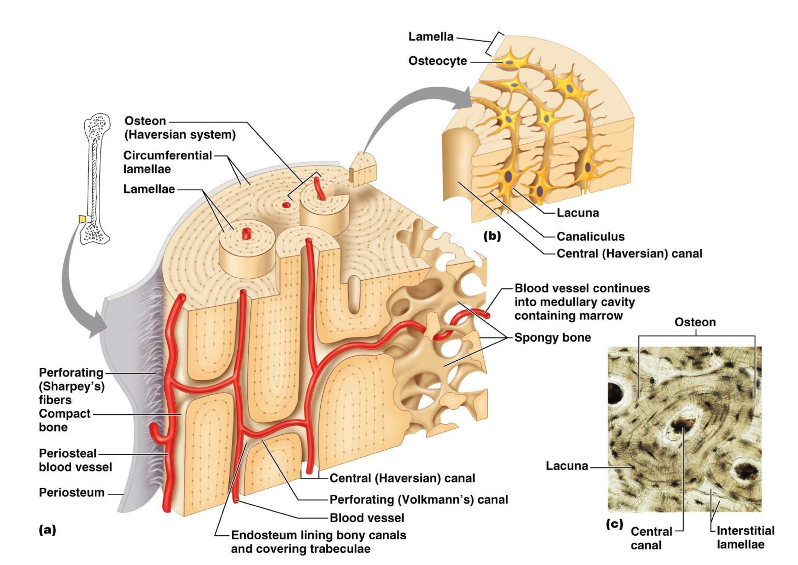

Stavba a složení
- látkové složení
    - 70% anorganické složky
        - krystaly solí, hydroxyapatit
    - 20% organické složky
        - 90% kolagen, z něj 90% kolagen I
    - 10% voda
- klíčové kostní proteiny: sialoprotein, osteokalcin, osteonektin
- topologické složení
    - kost je síťovina osteocytů pospojovaných výběžky, které jsou propojeny přes gap junctions
    - tato síťovina je koncentricky uspořádána do lamel kolem centrálního Haversova kanálku s cévami a nervy
    - Haversovy kanálky jsou propojeny příčnými Volkmanovými kanálky, které přivádí cévy
    - osteon roste dovnitř
    - Haversovy kanálky jsou rovnoběžné s hlavní osou diafýzy
- periost je vrstva na povrchu kosti
    - složen z kolagenních vláken a fibroblastů
    - tvoří vnitřní vrstvu osteoprogenitorové buňky
    - účel: výživa kostní tkáně, kontinuální přísun nových osteoblastů
- endost vystýlá vnitřní povrch kostních dutin
    - je v něm uložena vrstva osteoprogenitorových buněk
    - účel: výživa kostní tkáně, kontinuální přísun nových osteoblastů

Typy kostní tkáně
- primární nezralá vláknitá kost, sekundární zralá lamelózní kost
- kompaktní kost (diafýza), spongiózní kost (epifýza)
- krátké kosti jsou tvořeny spongiózním jádrem obklopeným kompaktní diafýzou
    - dutiny spongiózní kosti tvoří kostní dřeň
        - červená je krvetvorná
        - žlutá obsahuje tukové buňky
- ploché kosti lebeční klenby jsou tvořeny dvěma lamelárními kompakty oddělenými vrstvou spongiózní kosti (diploe)

Remodelace kostí
- kost se neustále přestavuje
- u dětí je remodelace 200$\times$ rychlejší než u dospělých
- za týden se odbourá 5--7% kostní hmoty
- houbovitá část je obnovována jednou za 3--4 roky
- kompaktní část je obnovována jednou za 10 let
- resorpce je regulována osteoklasty

### Kostní buňky

Osteoblasty
- vznik z mezenchymálních kmenových buněk
- po uhnízdění se mění v osteocyty
- vytvářejí organickou ECM
    - provádí syntézu kolagenu I, proteoglykanů, glykoproteinů
- jsou lokalizovány výhradně na povrchu kosti, těsně vedle sebe jako jednovrstevný epitel
- kontakt s ostatními buňkami skrz výběžky

Výstavbovou aktivitu kostní matrix můžeme měřit tetracyklinem, který se váže do kostní matrix, u níž je právě v průběhu mineralizace. Druhá dávka tetracyklinu se podá tři týdny po první a měří se rozdíl mezi pozorováními.

Osteocyty
- vznikají z osteoblastů, poté co jsou uzavřeny v kosterní hmotě
- zaniknou, když převáží resorpce matrix
- spočívají v lakunách mezi lamelami matrix
- jejich výběžky jsou mezi buňkami propojeny gap junctions
- mají tvar broušeného diamantu
- jsou odpovědné za mineralizaci kostí

Osteoklasty
- vznikají fúzí monocytů nebo makrofágů
- obrovské mnohojaderné buňky (i přes $\pu{100 \mu m}$) s 5--50 jádry
- jsou bohatě větvené, pohyblivé
- resorbují kostní hmotu
- podílejí se na přestavbě kosti
- extracelulárně snižují pH a naleptávají kostní osteon (Haversův systém)
    - v místě resorpce vznikají enzymaticky vyleptané prolákliny v matrix, tzv. _Howshipovy lakuny_

### Osifikace

###### TODO
Propracovat osifikaci více do detailu, opravit vývoj kostních buněk.

Osifikace
- vývoj kostních buněk: mezenchymální buňka -> chondroblast -> chondrocyt
- dělení
    - intramembranózní
        - probíhá ve vazivu, kost vzniká přeměnou vaziva
            - probíhá přímá mineralizace matrix produkované osteoblasty
        - růst plochých a krátkých kostí, zvětšování dlouhých kostí do šířky, formování lebky, hojení zlomenin
    - endochondrální osifikace
        - kost vzniká náhradou chrupavky
            - probíhá ukládání kostní matrix a anorganických složek na předem vytvořenou matrix chrupavky
        - vznik dlouhých a krátkých kosti
 - vhodné prostředí zajišťují mezenchymální buňky a fibroblasty
- kost může po splnění určitých podmínek vzniknout kdekoli v těle
- chrupavka může také osifikovat (speciální případ metaplazie)
    1. v chrupavce je zánět
    1. je vyslán signál nebezpečí k cévám
    1. cévy vysílají výběžky do chrupavky, směrem k zánětu, aby jej odstranily
    1. chrupavka je transformována v kost

Průběh intramembranózní osifikace
1. nahromadění mezenchymálních kmenových buněk (MSC)
1. vznik nidu, skupiny MSC
1. diferenciace MSC v osteoblasty
1. osteoblasty tvoří kostní matrix (vylučují mimo jiné osteoidy)
1. kostní matrix je mineralizována
1. radiální růst nidů vedoucí k jejich splynutí

Průběh endochondrální osifikace
1. vznikne periosteum, ze kterého se časem začnou uvolňovat osteoblasty
1. osteoblasty začnou uvolňovat osteoid, který se ukládá kolem existující chrupavky
1. chondrocyty se zvětší, žačnou produkovat alkalin fosfatázu, která přispěje k mineralizaci kostní matrix
1. osteoprogenitorové buňky začnou na matrix ukládat další osteoid

Počet osteoklastů zvyšuje parathormon. Při velkém množství parathormonu tedy dochází k odbourávání kosti, k osteoporóze a k následnému uvolnění $\ce{Ca^{2+}}$ do krve. Naopak kalcitonin resorpci matrix inhibuje.

### Patologie

Zlomeniny
- kost praskne
- existují mutace ovlivňující poměr odbourávání a budování kostní hmoty
    - důsledkem je např. osteopetróza, osteoporóza
- průběh zloměniny
    1. po zlomení se aktivují osteoblasty, namnoží se
    1. osteblasty vytvoří houbovitou kost
    1. houbovitá kost je postupně přestavena v kompaktní kost
- krátké kosti se hojí špatně, zatímco dlouhé jsou na mechanické změny zvyklé

Poruchy kostní tkáně
- rachitis
    - nedostatek vápníku u dětí, je narušen osifikační proces
- osteomalacie
    - nedostatek vápníku u dospělých (těhotenství), měknutí kostí
- osteoporóza
    - rozpad kostní hmoty (přílišná aktivita osteoklastů)
    - opakem je osteopetróza
- gigantismus
    - přílišný růst kostí, člověk je nadprůměrně veliký
    - příčinou je přebytek růstového hormonu
    - opakem je hypofyzární nanismus
- akromegalie
    - většinou zvětšení čela, nosu, lícních kostí, spojená s bolestí kloubů
    - příčinou je nadbytek růstového hormonu v dospělosti
- Pagetova choroba
    - kosti jsou deformované
    - příčinou je přílišné odbourávání kostí spojené s rychlým a neorganizovaným růstem nové kostní tkáně
        - problém v metabolismu a diferenciaci osteoklastů
    - je léčitelná transplantací kostní dřeně

## Krev

###### META
Tato kapitola bývá probírána až v rámci posledních přednášek, po nervové soustavě.

Linie krevních buněk
- erytroidní linie
    - zprostředkování transportu kyslíku do tkání
    - erytrocyty, retikulocyty
- lymfoidní linie
    - zásadní pro tvorbu adaptivní imunitní odpovědi
    - T-buňky, B-buňky a jejich blízcí příbuzní
- myeloidní linie
    - umožňuje vrozenou imunitní odpověď a podílí se na odpovědi adaptivní
    - granulocyty a makrofágy

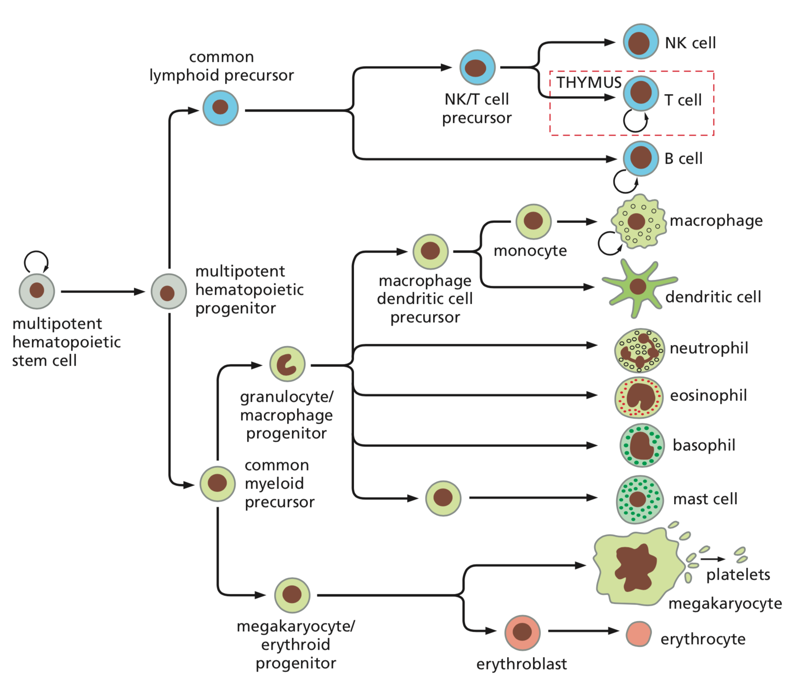

**hematokrit**
Celkový objem pevné složky krve.

Složení krve
- objev krve činí 6 až 8% tělesné hmotnosti
    - z toho hematokrit činí u žen 41%, u mužů 46%
- hodně mezibuněčné hmoty (plazma)
    - nestlačitelná
    - 5--6 litrů
- krevní buňky: erytrocyty, leukocyty, trombocyty
    - relativně mobilní, schopny opustit krevní řečiště
- červené krvinky (erytrocyty)
    - 45% objemu ($\pu{5e12}$ na litr)
- bílé krvinky (leukocyty)
    - 1% objemu ($\pu{4}$ až $\pu{6e9}$ na litr)
    - granulocyty ($\pu{5e9}$ na litr)
    - agranulocyty ($\pu{7e8}$ na litr)
- krevní destičky (trombocyty)
    - $\pu{150}$ až $\pu{300e9}$ na litr

Sedimentace
- její rychlost určována diagnostickou hematologickou metodou
- krev se nasaje do trubice, nechá se sedimentovat
    - nejrychleji klesají erytrocyty, pak leukocyty
    - nad nimi zůstane plazma
- vysoká sedimentace
    - když je v těle zánět, v plazmě je hodně imunoglobulinů
        - krev je hustější a krvinky klesají pomaleji
        - sloupec erytrocytů je vyšší, i když jich je stejně jako u zdravého jedince

**buffy coat**
Koncentrovaná suspenze leukocytů a trombocytů získaná sedimentací.

Rychlejší alternativou sedimentace je centrifugace. K dalším metodám zkoumání krve patří krevní roztěr a průtoková cytometrie (schéma funkce viz obrázek níže).

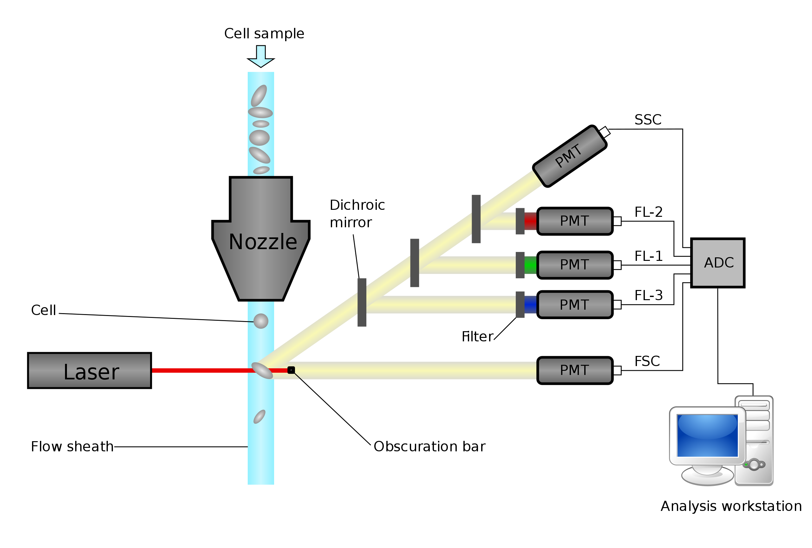
_By Kierano - Own work, CC BY 3.0, [link](https://commons.wikimedia.org/w/index.php?curid=22102570)_

Při cytometrii protékají měřičem buňky jedna po jedné. Přerušují u toho laserový paprsek, který je poté pomocí soustavy zrcadel a detektorů analyzován --- dá se zjistit počet buněk, z vlastností paprsku pak i jejich druh a obsah. Často se buňky fluorescenčně barví.

### Erytrocyty

- terminálně diferencované bezjaderné buňky
- zajišťují přenos plynů (u savců)
- bikonkávní tvar (maximální povrch vůči objemu)
    - ptáci a obojživelníci mají oválný
- průměr $\pu{5 \mu m}$
    - kapiláry mají jen tak velký průměr, jak velké je jádro erytrocytů, které limituje jejich velikost
- žijí cca 120 dní, poté jsou ve slezině či kostní dřeni odstaněny makrofágy
- fetální hemoglobin má vyšší afinitu ke kysíku než dospělý
    - váže kyslík za nižšího tlaku (který je v placentě)

**erytroblast**
Nezralý erytrocyt v kostní dřeni.

**retikulocyt**
Nezralý erytrocyt v krevním řečišti (tvoří 1% všech erytrocytů). Tyto erytrocyty neopouštějí krevní řečiště.

Vznik
- jako všechna pojiva pochází z mezenchymálních kmenových buněk
- odvozeny od kmenových buněk krevní řady (erytroidní linie)
    - ty mají extraembryonální původ (v prenatálním vývoji), vznikají ve žloutkovém váčku (trofoblastu)
- vznik v kostní dřeni ($\pu{5e11}$ za den vzniká a zaniká)
- při změně erytroblastu v erytrocyt ztrácí erytroblast RNA, jeho jádro kondenzuje, je vyloučeno a odklizeno makrofágy (ztrácí všechny organely)

Anémie (chudokrevnost)
- hypochromní anémie
    - erytrocytů je v krvi dost, je v nich ale nedostatek hemoglobinu
    - v důsledku toho špatně nesou kyslík
- srpkovitá anémie
    - způsobena bodovou mutací hydrofilní kyseliny glutamové (např. kodon GAA) na hydrofobní valin (např. kodon GUA)
    - v neokysličeném stavu se hemoglobin shlukuje (polymerizuje, vytváří vláknité útvary a agregáty) a mění tak tvar krvinek
    - krvinky mají kratší životnost, jsou méně flexibilní - blokují vlásečnice, což vede k ucpání cév

### Leukocyty

Leukocyty se dělí na granulocyty a agranulocyty.

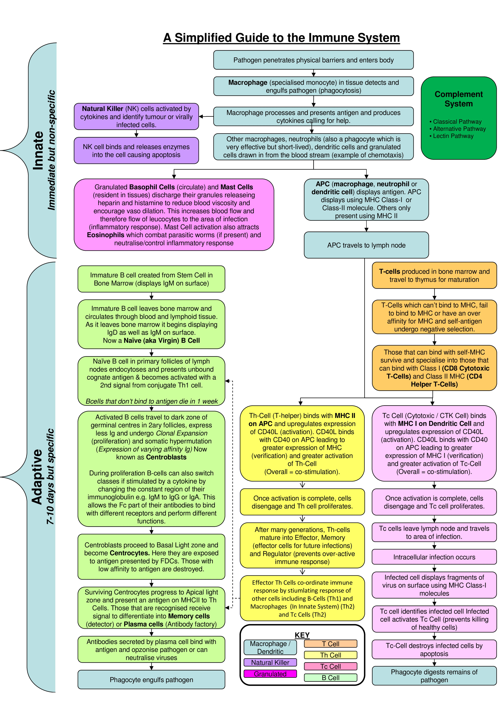

#### Granulocyty

- terminálně diferenciované nedělící se buňky
- polymorfonukleární leukocyty (velmi proměnlivé, polymorfní jádro)
- obsahují granula, což jsou obarvitelné částice
- $\pu{12}$ až $\pu{15 \mu m}$
- schopné pohybu
- neutrofily
    - fagocytují, zabíjejí a tráví bakterie
    - barví se neutrálními barvivy (do růžova)
- bazofily
    - při alergické reakci sekretují histamin a serotonin
    - barví se zásaditými barvivy (do tmavě modra)
- eozinofily
    - likvidují mnohobuněčné parazity
    - barví se kyselými barvivy (do červena)

Neutrofily
- polymorfonukleární leukocyty, dříve zvané mikrofágy
- 60--70%  bílých krvinek
- mají segmentované jádro
    - nezralé má tvar podkovy
    - čím starší, tím více segmentů (až 7)
        - hypersegmentované buňky
    - běžně je složeno z 2--5 laloků spojených můstky
    - ženy mají na jednom segmentu paličkovitý přívěšek, který obsahuje inaktivovaný chromozom X
- krátce žijící buňky (v krvi 6-7 dní, ve vazivu 1-4 dny)
- přichází v první vlně buněk do místa zánětu
- mohou být rychle nahrazeny z kostní dřeně

Neutrofilní aktivita
- receptory neutrofilů jsou schopny rozeznat např. bakterie, které poté fagocytují a ve fagozomech zlikvidují
- jejich fagocytická aktivita může být dále stimulována
    - nízkoafinními Fc receptory na neutrofilech
    - označením bakterie protilátkami, tzv. _opsonizací_
- látky pro rozklad bakterií
    - superoxidové anionty
    - peroxid vodíku
    - chlornanové kationty
- mrtvé neutrofily + bakterie + natrávený materiál -> hnis

Zvýšené množství neutrofilů v krvi (neutrofilie) tedy může značit infekci, a to akutní i chronickou.

**Multivalentní antigen**
Struktura obsahující větší množství vazebných míst pro protilátku.

Bazofily
- tvoří 1% krevních leukocytů
- na povrchu jsou receptory pro protilátky (imunoglobuliny E, IgE)
- při zvýšené hladině bazofilů v krvi se zvyšuje pravděpodobnost alergické reakce
- jsou schopny degranulace
    - granula splynou s membránou a vylijí se do okolního prostředí
    - ničí cizí struktury
- exocytóza je regulovaná vazbou antigenu na IgE, který je navázaný na IgE receptorech
    - vysokoafinní IgE receptor váže IgE i pokud není navázaný na antigen ( z čehož, hádám, plynou problémy s alergickou reakcí)
- pokud se v těle vyskytne multivalentní antigen, dojde k agregaci receptorů
    1. aktivace signalizační kaskády
    1. degranulace granulí
    1. vylití biologicky aktivních aminů (histamin, serotonin)

Eozinofily
- 2-4% leukocytů
- mají dvojlaločná jádra
- granula (cca 200 na buňku)
    - hlavní složku tvoří MBP (major basic protein)
        - má antiparazitickou funkci
        - aktivuje neutrofily, stimuluje žírné buňky
    - enzymy histamináza a arylsulfatáza
        - rozkládají histamin a leukotrieny
        - mohou tlumit účinek basofilů a žírných buněk

Eozinofilie
- ukazuje na  alergické reakce a parazitární infekce (např. helmintózy)
- při napadení organismu patogenem se počet eozinofilů drasticky zvedne
    - jejich počet se dá snížit kortikoidy

#### Agranulocyty

- nejsou obarvitelné
- monocyty ($\pu{4e8}$ na litr)
    - diferenciují se v makrofágy, dendritické buňky a osteoklasty
        - makrofágy
            - fagocytují parazity a vlastní poškozené a apoptotické buňky
            - produkují oxidační produkty
            - některé se mění na dendritické buňky
        - dendritické buňky
            - fagocytují na periferii, kde migrují do uzlin a prezentují antigeny prostřednictvím MHC II
        - osteoklasty
            - odbourá­va­jí kost­ní tkáň
- lymfocyty ($3 \cdot 10^8$ na litr)

**Fagocytární systém**
Soubor všech makrofágů v různých tkáních.

**MHC II**
Krátké úseky glykoproteinů (exogenní peptidy sic), které jsou charakteristické pro pohlcenou látku.

Monocyty
- největší krvinky
- součástí myeloidní linie
- oválné jádro, podkovovité nebo ledvinovité
- prekurzory mononukleárního fagocytárního systému
- před vstupem do tkáně osm hodin kolují v krvi
- prakticky nefunkční, v krvi mají jen funkci "zásobárny makrofágů"
- diferenciují na makrofágy a dendritické buňky
    - na makrofágy diferenciují po vstupu do tkáně kapilární stěnou

Makrofágy
- provádí endocytózu tkáňového debrisu včetně apoptotických tělísek
- na povrchu nesou MHC II. třídy
    - toto MHC kontrolují Th-lymfocyty, které případně spouštějí imunologický poplach, čímž upozorní B-lymfocyty
- při zánětu nastupují po neutrofilech

Dendritické buňky
- aktivita
    1. endocytují cizorodou látku
    1. přesunou se do mízní uzliny
    1. naštěpí endocytovanou látku a prezentují ji na povrchu
    1. Th-lymfocyt ji potenciálně rozpozná, aktivuje se a vyvolá imunitní reakci
- in vitro připravíme izolací z krve a použitím interleukinu-4a GM-CSF (granulocytární makrofágový colony stimulating factor)

Osteoklasty
- kostní buňky odbourávající kostní tkáň
- vznikají splynutím monocytů => jsou mnohojaderné
- funkce např. prořezávání zubů
    - proti špičce zubu se nachází speciální populace osteoklastů
    - je třeba odbourat kost čelisti, aby se mohl zub prořezat ven
- poruchy v myeloidní linii (především ve funkci monocytů a jejich diferenciačních produktů) mohou mít velký vliv na remodelaci kostní hmoty
    - Pagetova choroba: nadměrné odbourávání kosti a následné tvoření kosti neplnohodnotné

Lymfocyty
- tvoří 30% leukocytů
- různorodá velikost ($\pu{5}$ až $\pu{15 \mu m}$)
    - rozdíl v množství cytoplazmy (většina je zcela vyplněna jádrem)
- schopny aktivního pohybu (z krve do tkání --- do místa zánětu nebo do mízní uzliny)
- schopny vytvářet mnohočetná komplikovaná mezibuněčná spojení
    - interakce vícero párů membránových receptorů a jejich ligandů
    - regulace diferenciace (případně následné proliferace) a efektorové funkce (např. zabití cílové buňky cytotoxickým Tc-lymfocytem)

T-lymfocyty
- vznikají v kostní dřeni, dozrávají v thymu (brzlíku)
- tvoří 90% leukocytů
- dělení podle povrchových koreceptorů pro MHC glykoproteiny
    - CD4 (interakce s MHC II): pomocné (Th) a supresorové
    - CD8 (interakce s MHC I): cytotoxické (Tc)
- dělení podle genů, které byly přestavěny ve funkční T-receptor
    - rekombinací v nich vznikají nové geny a jsou syntetizovány nové proteiny
        - přeskupování genových segmentů je prováděno rekombinázami
    - $\alpha$$\beta$
        - výběr genů probíhá náhodně
        - jsou připraveny na cokoli
    - $\gamma \delta$
        - výběr genů probíhá na základě evoluce
        - jedná se o konkrétní poskládání genových segmentů, která jsou nejčastěji používaná a mají smysl
    - organismy se liší v poměru $\alpha$$\beta$ a $\gamma \delta$
        - např. člověk 95:5, přežvýkavci 70:30

Chyby při vzniku T-lymfocytů
- popletení substrátu; dojde ke spojení ramen dvou chromozomů, které spolu fyzicky vůbec nesouvisí
- např. filadelfský chomozom
    - je na něm fúzní chimérní gen (propojení částí genů Cbl a Abl)
    - vznik nedeaktivovatelné kinázy schopné transformovat postiženou buňku v buňku nádorovou

B-lymfocyty
- tvoří 5% leukocytů
- produkují protilátky
- afinitní maturace
    1. když se organismus setká s nějakým antigenem, vylepší svoje protilátky
    1. sekundární odpověď zahrnuje protilátky s vyšší afinitou k antigenu
    1. imunoglobulinové geny náhodně mutují, B-lymfocyty s mutovanými geny poté soupeří o navázání antigenu
    1. ty s nízkou afinitou jsou odstraněny a tak zůstanou pouze ty s vysokou

Efektorové buňky
- kategorie buněk tvořená zčásti buňkami ze skupiny T-lymfocytů a zčásti buňkami B-lymfocytů
    - z T-lymfocytů jsou to pomocné (Th) a cytotoxické (Tc) buňky
    - z B-lymfocytů jsou to plazmatické buňky, neboli buňky produkující velké množství protilátek
- jsou diferenciovány a aktivovány pro výkon své funkce

NK buňky
- tvoří 5% leukocytů
- ničí buňky bez MHC I (rakovinotvorné...), jsou součástí nespecifická imunita
- proděraví buňce buněčnou stěnu perforinem
- při špatné funkci chronický únavový syndrom

Zánět
- zvýšení průtoku v místě rány
- makrofágy, mastocyty a basofily vypouští histamin
    - zvýšení propustnosti cév (aby se bílé krvinky odstaly lépe na místo zánětu)
    - prosak krevní plazmy
    - otok
- makrofágy začnou uvolňovat chemoki(ni)ny
    - lákají další bílé krvinky
    - stimulují basofily k vylití hydrolytických enzymů
- poškozené buňky vylučují prostaglandiny
    - označují buňku pro Tc-lymfocyt, který v ní po nalezení spustí buněčnou smrt

### Krevní destičky

- nejsou to buňky, ale bezjaderné diskovité útvary
- velikost 3 mikrometry
- vznikají fragmentací polyploidních megakaryocytů sídlících v kostní dřeni
    - megakaryocyt vysílá výběžky přes stěny do kapilár a odštěpuje destičky přímo do krve
        - jeho rozpad je programovanou buněčnou smrtí, zbytky poté uklidí makrofágy
    - za den jich z jednoho karyocytu vznikne až 100 000
- v krvi přežijí 10 dní
- neopouští krevní řečiště

Stavba
- regulátory srážení krve
    - PDGF (platelet derived growth factor)
        - jako diferenciační faktor epiteliálních buněk se podílí na efektivní reparaci poškozené tkáně
    - serotonin
        - vasokonstriktor
        - jeho uvolnění je stimulováno vazbou na poškozené cévní stěny
        - schopen uzavřít i malé arterie

Průběh opravy poškozené tkáně
1. destička se dostane do kontaktu s kolagenními vlákny
1. nastane exocytóza faktorů aktivujících ostatní destičky
1. dojde k uvolnění aktivačních látek ze stěn poškozených cév
    - změna protrombinu na trombin
1. trombin katalyzuje přeměnu fibrinogenu na fibrin
1. fibrin polymeruje a vytváří vláknitou síťovinu vznikající krevní sraženiny
1. vznik trombu (sraženiny)

### Patologie

Leukémie
- rakovina krve
- dochází k nádorové přeměně některého z diferenciačních stádií buněk odvozených od kmenových buněk kostní dřeně
- zvýšený počet leukocytů jednoho typu v krvi
    - myeloblastické zvýšení
        - zvýšené množství granulocytů a monocytů
    - lymfoblastické zvýšení
        - zvýšené množství lymfocytů
    - obě mohou být akutní nebo chronická
- leukocyty nedozrávají, jsou nefunkční
- rizikové faktory
    - kouření
    - chemikálie (benzen)
    - radioaktivní záření
    - léčba jiného nádorového onemocnění
    - filadelfský chromozom
- efektivní řešení: chemoterapie a transplantace kostní dřeně

Mononukleóza
- EBV virus napadá B-lymfocyty, nebo jejich prekurzory
    - B-lymfocyty se pomnoží, tváří se jako cizí organismus a tělo se brání
    - dochází k narušení rovnováhy mezi jednotlivými složkami imunitního systému
- po vyléčení máme EBV na celý život

## Lymfatický systém

Lymfatické i lymfoidní tkáně jsou všude po těle, zejména v místech, kde do těla vstupují patogeny, nebo kudy během infekce putují.

**MALT**
Lymfoidní tkáň asociovaná s mukózou (sliznicí).

**GALT**
Lymfoidní tkáň asociovaná se střevem (gut).

**BALT**
Lymfoidní tkáň asociovaná s dýchacími cestami (bronchy).

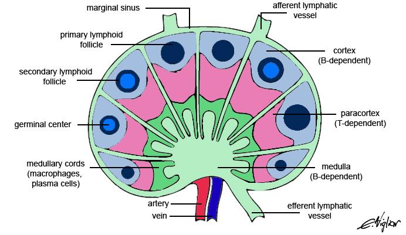

Lokalizace lymfatických cest
- pod epitely (lymfoidní tkáň asociovaná s epitely)
    - místa proliferace a diferenciace lymfocytů
    - MALT, GALT, BALT
- v lymfatických orgánech
    - anatomicky diferenciovaná množina lymfoidní tkáně
    - složeny pouze z lymfoidní tkáně
    - dělení
        - primární
            - zajišťují hematopoézu (krvetvorbu)
            - probíhá v nich selekce lymfocytů, které nereagují s tělěm
            - kostní dřeň, thymus (brzlík)
        - sekundární
            - napojeny na lymfatický i oběhový systém
            - zajišťují efektivní setkávání buněk imunitního systému a efektivní kompartmentaci imunitního dozoru
            - slezina, mízní uzliny (schéma mízní uzliny viz obrázek výše)
                - stromální buňky  jsou velmi důležité
                - tvoří "lešení" pro hematopoetické buňky
                - vytváří vhodné prostředí pro setkání lymfocytů s antigeny

**totipotentní buňka**
Někdy též _omnipotentní_ buňka --- buňka schopná vytvořit jakýkoli jiný druh buňky, ergo celý organismus. Takovými buňami jsou zygoty a dělivé meristémy.

**multipotentní buňka**
Buňka schopná diferenciace do mnoha typů buněk, pouze však v rámci jedné tkáně. Příkladem mohou být kmenové buňky.

Kostní dřeň
- veliký orgán
- sídlo hematopoézy, dochází zde k proliferaci buněk obou hematopoetických linií (lymfoidní i myeloidní)
- dělení podle barvy
    - červená kostní dřeň
        - hematopoetická
        - u fetu probíhá krvetvorba jen v játrech a slezině
        - po narození je v těle pouze červená k.d. a hematopoéza probíhá výhradně tam
        - v dopělosti pouze v plochých kostech a obratlích
    - žlutá kostní dřeň
        - tuková
    - šedá kostní dřeň
- 0,1% buněk kostní dřeně má na povrchu membránový protein CD34
- každý buněčný typ je nezávisle regulován
    - erytropoetin (EPO), kolonie stimulující faktory (CSF)
- kmenové buňky v kostní dřeni
    - stačí transplantovat 5000 buněk pro zajištění kompletní krvetvorby (<= myší model)
- typickou markerovou molekulou je C-kit CD117
    - je na povrchu buňky
    - obsahuje informace o buněčném typu, stádiu diferenciace a buněčné aktivitě

Hematopoéza se dá jednoduše sledovat in vitro. Nejprve se provede výplach z kostní dřeně (jako na praktikách), poté se nechají jednotlivé buňky růst na agaru. Vzniknou nepohyblivé kolonie, které se dají dobře pozorovat.

Embryonální krvetvorba
- vzniká cca třetí týden
    - ze žloutkového vaku se vytvoří krevní ostrůvky obsahující primitivní erytroblasty
    - větší než ty dospělé, mají jiný hemoglobin (Hb) a obsahují jádro
- od pátého týdne vzniká intraembryonální krvetvorba
    - v játrech, slezině, kostní dřeni

# Svaly

- účastní se **cytokinese**
    - proces je zprosdředkovaný aktino-myozinovým komplexem 26
    - aktinová vlákna omotána okolo buněk epitelu, ukotvena v adhezivních spojích
    - pomocí pohybu myozinu se změní jejich tvar, dojde k lokálnímu zaškrcení buňky
    - dojde k deformaci celé buněčné vrstvy
- celý epitel funguje jako jedna signalizační a morfologická jednotka
- aktinová vlákna jsou antiparalelně uspořádána a ukotvena do kotvících struktur (Z disky)
- čtyři typy svalových buněk: kosterní svaly, srdeční svaly, hladké svaly, myoepiteliální buňky

###### TODO
Doplnit a upravit celou sekci.

## Kosterní svaly

- specializace na ohyb kostry a spojení pák (kosti, chrupavky)
- pohyby ovládané vůlí, někdy i mimovolné (svalový třes)
- rychlost ovládání je zajištěna inervací volným nervstvem
    - okamžitá reakce pák a protipák je nutná např. k řeči
- každý sval by měl fungovat jako mechanická jednotka
    - to zajišťuje soustava vazivových pochev

Svaly vznikají z myoblastů, které jsou určeny expresí genů z rodin MyoD a MEF2.

Vznik
1. proliferace
1. diferenciace
1. splynutí myoblastů ve svalová vlákna
    - myoblasty se už nikdy nedělí ani nereplikují DNA
    - z toho plyne ztížená regenerace svalu

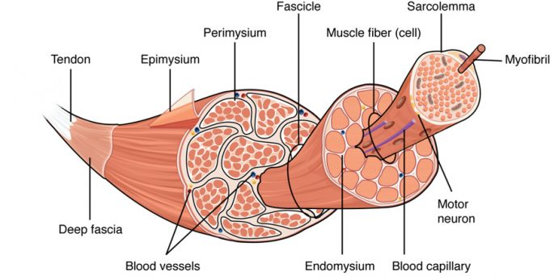

Stavba
- některé kosterní svalové buňky jsou velmi velké, je potřeba vícejadernost
- často splyne více myocytárních buněk a vznikne _syncytium_
- jsou $\pu{3cm}$ dlouhé a mají $\pu{100 \mu m}$ v průměru
- tvoří svalová vlákna
- obaly
    - endomysium: jemná vrstva vaziva obalující každé svalové vlákno
    - perimysium: vazivová pochva obalující svazky ($=$ snopce, fascia) svalových vláken
    - epimysium: obal celého svalu
- velice důležitá je inervace svalu
    - mechanická odolnost nervu je zajištěna mezibuněčnaou hmotou
- svalová hmota se zvětšuje narůstáním aktinomyozinových vláken v už existujících svalových jednotkách
- příčné svaly interagují s pojivovou tkání, musí tedy být ukotveny na kosti
    - k tomu slouží šlachy: struktury s orientovanými kolagenními vlákny, které jsou syntetizovány fibroblasty

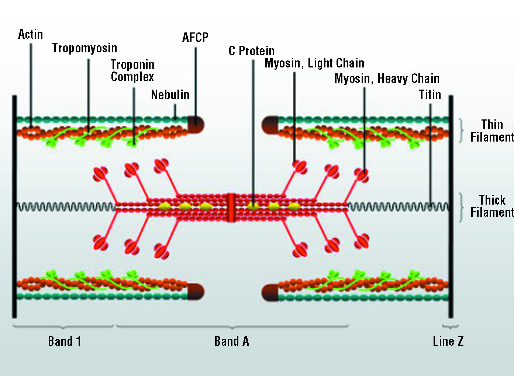

**svalové vřeténko**
Specializovaná struktura podávající informaci o napnutosti či relaxovanosti svalu do CNS.

Svalová vřeténka
- někdy probíhá specializace do mnohobuněčných syncytiálních útvarů se senzorickou funkcí místo mechanické, vznikají deriváty svalu, _svalová vřeténka_
- jsou zde intimní propojení senzorických nervových zakončení s něčím svalového původu
- signál o deformaci těchto svalů se přenáší do mozku, který tím získává zásadní informace o "zapnutí" našich svalů
    - pokud tato signalizace nefunguje, mozek nedokáže synchronizovat naše pohyby

Svalové kmenové buňky
- i v diferenciovaných příčně pruhovaných svalech máme kmenové buňky pro příčně pruhované svaly, tzv. _satelitní buňky_
- jsou pod pojivem na povrchu svalu, je jich málo, mají omezenou činnost
- aktivují MyoD

Svalová aktivita
- depolarizace membrány díky aktivitě Na/K ATPázy
- ve svalové buňce musí fungovat vápenaté pumpy => aktivní transport Ca2+ do ER - troponin-tropomyozinový komplex brání myozinu pohybovat se po aktinu
- po navázání komplexu na Ca2+ změní konformaci => myozinové hlavy můžou běžet po aktinu - pro mechanické vlastnosti důležité pospojování struktur => fungování jako 1 mechanická jednotka
- proužkování svalu
= linie, na které se napojuje aktinový cytoskelet v hexagonálním uspořádání
- ve všech volných dírách mezi aktinovými hexagony hexagonální myozinové hlavice - klíčový protein aktinin
30
- vyrůstá ze Z-disku jako krystalizační jádro = místo s pevným připojením aktinu - uvnitř buňky v jednom svalovém vlákně vytváří sarkomery několik soustav vedle sebe
- propojení subvláken díky intermediálním filamentům (molekuly desminu)

### Svalové proteiny

###### TODO
Detailněji popsat mechanismus práce svalu.

Myosin
- jediný protein tlustých vláken (myofibril)
- z celkového proteinu svalu tvoří 60-70%
- molekulová hmotnost 540 000
- tvořen 6 řetězci (dva těžké + čtyři lehké)
    - těžké jsou vzájemně uspořádané do dvoušroubovice o délce 150nm, mají globulární N-terminální konce

Troponin-tropomyozinový komplex
- molekulová hmotnost 72 000
- skládá ze tří podjednotek
    - troponin C
        - váže $\ce{Ca^{2+}}$
        - molekulová hmotnost 18 000
        - vazba na troponin T
        - podobný kalmodulinu
    - troponin I
        - intermediární, váže se mezi troponiny C a T
            - vazba na aktin a troponin T
        - molekulární hmotnost 23 000
        - inhibuje interakce mezi aktinem a myozinem do doby vazby Ca2+ na troponin C
    - troponin T
        - molekulová hmotnost 31 000
        - vazba na tropomyozin, troponin I a troponin C v místě styku 2 molekul tropomyozinu

Kreatinkináza
- katalyzuje přenos fosfátu z ATP na kreatin, který poté zásobuje svaly velmi rychlou energií
- hmotnost 86 000Da
- dvě podjednotky, které mohou být dvojího typu (M = muscle, B = brain)
    -> 3 isoenzymy
        - MM
        - MB
        - BB

Aldoláza
- hmotnost 160 000 Da
- 3 isoenzymy
    - A: sval
    - B: játra
    - C: mozek

Laktátdehydrogenáza
- hmotnost 135 000 Da
- 5 isoenzymů
- je ve všech tkáních
- různé zastoupení: LD1: srdce, LD2: srdce, LD3: svalstvo atd.

Myoglobin
- hmotnost 18 000 Da
- nachází se v červených svalových vláknech

Titin
- pružina relaxující sval
- největší známý protein, obsahuje 34 350 AK

Nebulin
- molekulární pravítko určující délku aktinové části sarkomery

### Inervace

_Viz také [schopnost regenerace axonů](#Schop­nost re­gen­er­ace)._

Perimysium
1. větvení axonů
1. rozšířená zakončení na povrchu svalových buněk
1. motorické ploténky
1. myoneurální spojení

Neurotransmiter (acetylcholin)
1. po vylití váčků z nervového zakončení v synaptické štěrbině se váže na acetylcholinový receptor
1. depolarizace membrány svalové buňky
1. šíří se dovnitř skrz systém příčných T-tubulů
1. signál je přenesen na sarkoplazmatické retikulum (SR)
    - membrána T-tubulu je propojena s membránou SR
1. uvolnění $\ce{Ca^{2+}}$ z SR do cytoplasmy
1. kontrakce svalu

Svaly jsou příkladem excitatorních buněk: mají nerovnoměrné uspořádání $\ce{K+}$ a $\ce{Na+}$ iontů. To napomáhá vedení vzruchu.

### Regulace stahu příčně pruhovaného svalu

- koncentrační gradient mezi SR a cytoplazmou je 10 000
    - potencuje rychlost vtoku vápenatých iontů do cytoplasmy
- kreatin ve svalech
    - je pomocí enzymu kreatin kinázy fosforyluován na kreatin fosfát
    - slouží jako zásobní energetický zdroj

Průběh svalového stahu
1. zvýšení koncentrace iontů $\ce{Ca^{2+}}$
1. deformace troponinu a tropomyozinu
1. interakce myozinové hlavice s aktinem
1. stah svalu

Složení relaxovaného svalu
- koncentrace ATP 4mM
- koncentrace ADP 0,013mM
- reakční kinetika posunuta ve směru ATP -> ADP + P
- koncentrace kreatinu 13mM
- koncentrace kreatin fosfátu 25mM
- reakce jde ve směru kreatin fosfát -> kreatin + fosfát

ATP vystačí svalu na 2s aktivity, kreatin fosfát na 8s. Poté dochází už jen odbouránvání organických sloučenin. Anaerobní zdroj energie je glykogen, který je odbouráván na pyruvát a vystačí na 60s. Další ATP je tvořeno glykolýzou, která je 2,5x rychlejší než oxidativní metabolismus.

### Motorická jednotka

Jedno nervové vlákno (axon) může inervovat různý počet svalových vláken, která poté tvoří tzv. **motorickou jednotku**.

Základní informace
- axon se může rozvětvit, pak vznikne nervosvalová ploténka s několika svalovými vlákny
- MJ jsou různě velké podle požadavku na typ svalového stahu (v bicepsu větší než na jazyku)
- vlákna nejsou schopna stupňované kontrakce
- počet axonů na sval se také liší
    - oční svaly: 1 axon
    - svaly končetin: 100 a více axonů inervovaných jedním neuronem
- designování velikosti MJ probíhá v prenatálním období a do třetího roku života

### Pomalá a rychlá svalová vlákna

- rychlá vlákna: bílá, málo myoglobinu, anaerobní metabolismus
- pomalá vlákna: červená, mnoho myoglobinu, aerobní metabolismus
- výskyt konkrétního typu závislý na typu inervace, frekvenci vylévání acetylcholinu, způsobu dráždění svalové buňky, zdroji příslušného nervu
    - přehozením nervů se dá z bílého udělat červené a naopak
- v rámci jednoho svalu různé typy svalových vláken v různé proporci
- smíšená vlákna mají znaky obou předchozích typů

### Růst svalů

- čím více svalů, tím větší signalizace k menšímu růstu pomocí produkce myostatinu - myostatin = negativní regulátor růstu svalu
    - receptor nefunguje => přírůstek svalové hmoty
- u AIDS zvýšená produkce myostatinu => úbytek svalové hmoty
- zvětšení svalové hmoty = zvětšování syncitií => přidělání dalšího systému sarkomer

### Svalová onemocnění

Myasthenia gravis
- autoimunitní
- postupující svalová ochablost
- B-lymfocyty v brzlíku tvoří protilátky proti acetylcholinovým receptorům
- receptor je interalyzován (= endocytován) do buňky => sval neschopen přijímat signál => postupná atrofie
- 2. možnost
    - imunitní systém rozpoznává acetylcholinový receptor jako cizorodou látku
    - myelic basic protein MBP v CNS
    - destrukce myelinových pochev díky aktivitě autoreaktivních cytotoxických T-lymfocytů
    - nelze ovládat postižené svaly => není inervován => atrofuje

Narušení inervace svalu
- po úraze, po narušení páteře
- neinervovaný sval atrofuje => zmenšuje se (od určitého stadia nevratně)
- možno změnit rychlý sval na pomalý změnou inervace

Svalová dystrofie – myopatie
- poškození svalových vláken nesouvisející s inervací či autoimunitou
- nefunkčnost konkrétních enzymů/syndromy patologií mitochondrií
- typy
    - glykogenosy
        - abnormální ukládání glykogenu ve svalu
        - dědičné autosomálně recesivní onemocnění
    - McArdle
        - chybí myofosforyláza b => svalová slabost, křeče
        - při cvičení se v plasmě nezvyšuje laktát => nedochází k poklesu pH
    - Tauri
        - svalová bolest
        - chybí fosfofrukokináza => hromadění prekurzorů ve tkáních (glc-6-P, fru-6-P)
    - Duchennova svalová dystrofie
        - gonosomálně recesivní onemocnění
        - chlapci věku 3-7let
        - nejdříve pánevní pletenec => ramenní pletenec
        - ve věku 10-12 let končí na vozíku
        - v séru zvýšeny enzymy (kreatinkináza) dlouho před prvními symptomy
        - způsobeno mutací genu pro dystrofin
            - propojuje receptor pro ECM s aktinovým cytoskeletem (vnitřek s vnějškem)
            - mutace => sval má špatné mechanoelastické vlastnosti => poškození => atrofie
    - proti acetylcholinovému receptoru se může vytvořit autoimunitní onemocnění
        - rychlá únava a obrna svalů
        => destrukce receptoru => nemůže přejít neuromuskulární signál

## Srdeční svaly

- optimalizované pro pomalé, opakované pohyby
- nepříliš ovladatelné vůlí
- exprese receptorů nastavená tak, aby po srdci běžely vlny signálů => nezbytné vodivé propojení => gap junctions + desmozomy (aby to fungovalo jako 1 mechanická jednotka)
- utilizuje široké spektrum látek
    - glukóza, laktát, ketolátky, aminokyseliny, (ne)esterifikované MK
- má příčné pruhování
- dobrý elektrický kontakt všech srdečních buněk => vzruch putuje z jednoho vlákna na další
- zákon "všechno nebo nic" (idealizovaný případ)
    - podráždění myokardu v určitém místě => vyvolání akčního potenciálu => rozšíření na celý myokard => kontrakce

Kardiomyocyt
- jednojaderná buňka
- centrálně uložené oválné jádro
- 40% mitochondrií, GA, glykogen, lipidy, kontraktilní aparát, SR
- 150$\mu$m velká

Purkyňova vlákna
- svalové buňky specializované pro přenos signálu po celém srdci
- málo myozinu
- T-tubuly tlusté a krátké => svalové jednotky jsou menší

Stavba
- "cik cak" desmozomální propojení => trojrozměrné => na základě propojení a orientace lze nastavit způsob stahu celého srdce
- tvořená z buněk splanchického mezodermu
- není to syncitiální struktura => struktura tvořená individuálními buňkami pevně propojenými desmozomálními spoji a proděravěné gap junctions => zároveň jedna mechanická jednotka i signalizační jednotka
- struktura rozvětvených buněk
    - místa propojení = interkalární disky = hypertrofované desmozomy s gap junctions
- specializované kardiomyocyty ke generaci pacemakerové neustále se opakující aktivaci iontových kanálů s konkrétní frekvencí => autonomie srdce v signalizace ke svalové aktivitě
    - funkce pacemakeru způsobena koordinací součinnosti různých iontových kanálů
    - tuto aktivitu lze posttranslačně měnit (fosforylací) => zrychlení/zpomalení tepu
    - endogenní vznik vzruchů (akčních potenciálů) ve specializovaných pacemarkerových buňkách => šíření na     ostatní vlákna

Regenerace srdečního svalu
- špatně regeneruje
- nejsou v něm kmenové buňky pro srdce
    - ale mohou do něj vstupovat a dodiferencovat se do kardiomyocytů
- při nedostatečném zásobení srdečního svalu kyslíkem => nekróza tkáně => vznik jizev => narušení přenosu signálu po srdci
    - velikost jizev ovlivňuje aktivita fibroblastů
- pruhováno ve stejném směru jako svalová vlákna

## Hladké svaly

- slouží k k tvorbě pomalých, mimovolných stahů
- je na místech, kde je třeba regenerovat, a v místech, kde se tkáň často obměňuje
    - dokáží dobře regenerovat a diferencovat z prekurzorů
    - mezenchymální kmenová buňka => fibrocyt => buňka hladkého svalu
- často okolo trubic v těle (alternativa k řasinkovému epitelu), v cévách (možnost změnit průměr)
- buňky blízko fibroblastů
- nevytvářejí syncitia => nejsou pevně propojeny interkalárními disky
- každá buňka obalena laminou a retikulárními vlákny
- ve stahu jsou autonomní struktury
    - řada z nich ovládána nervy neovladatelnými vůlí
- schopnost vytvářet mezibuněčnou hmotu
    - chrání je při mechanických stazích
    - přenos mechanického stahu veden přes navázání na stejnou oblast mezibuněčné hmoty

Stavba
- nemají T-tubuly, ale mají kaveoly = vchlípeniny do buňky udržované proteineme kaveolinem
- bohatě vyvinutá intermediální filamenta
    - napojena na membránu různě => struktury podobné izolovaným sarkomerám
    - uspořádány různosměrně
    - není příčně pruhovaná
- ve velkých buňkách více sarkomer za sebou => sepnuty alternativou Z-disku
- jádro buněk protaženo podle jejich tvaru

Mechanismus aktivace stahu
- hlavní přepínač je kalmodulin = vápník vázající protein
- kinázy regulované vápenatými ionty (proteinkináza C)
    - mohou nafosforylovat lehký řetězce myozinu => aktivace myozinu => rozeběhne se po aktinovém vlákně
- samotný mechanismus stahu je stejný
- kináza lehkých řetězců myozinu aktivní jen v přítomnosti kalmodulinu s navázaným vápníkem
    - $\ce{Ca}$ se neváže na kinázu, ale na kalmodulin => ten pak na kinázu
- vápník => fosforylace => stah => defosforylace fosfatázou

## Myoepiteliání buňky

- pomáhají sekreci produktů epiteliálních žláz (mléčné, slinné)
- váček vytvořený myoepiteliálními buňkami produkující sekret má kolem sebe roztažené výběžky myopetiliálních buněk => schopnost celý váček stáhnout
- malé žlázy si vystačí s jednou takovou buňkou

# Nervové buňky

- ontogeneticky i fylogeneticky odvozeny od epitelu
    - některé z nich mají polarizovanou strukturu
    - ependymální gliové buňky mají řasinky
- neurony, neuroepiteliální smyslové buňky, gliové buňky
- mnoho rozdílů mezi buňkami, patří zde nejmenší i největší buněčné typy

**centrální nervový systém (CNS)**
Je tvořen mozkem a míchou (šedá a bílá hmota).

**periferní nervový systém (PNS)**
Je tvořen nervovými buňkami a ganglii, dále buňkami vzniklými z neurální lišty.

**neurální lišta**
Neurální lišta je zbytek neuroepitelu, který zůstane v místě, kde se vchlípila neurální trubice.

Vznikají zde buňky s obrovským diferenciačním a migračním potenciálem: chromafilní buňky, melanocyty, odontoblasty, Schwannovy buňky, neurony senzorické, gangliové, atd. Tyto buňky nevznikají in situ, ale na liště, a na místo určení se dostanou už naprogramovány.

## Stavba CNS a PNS

V celém nervovém systému je asi $10^{11}$ nervových buňek, 3--10 krát více podpůrných gliových buněk a 1000-5000 krát více možných propojení neuronů. Nervy jsou zpěvněny třemi obaly, epineuriem, perineuriem a endoneuriem.

Metody zkoumání CNS
- skenovací metody často pracují s izotopy prvků, které mají liché počty neutronů
    - možnost vizualizovat pomocí funkční magnetické rezonance (FMR)
    - dá se zjistit, které oblasti mozku jsou aktivní a neaktivní
    - mozek je možno pozorovat in vivo, např. i to, jak reaguje na konkrétní vzruchy
    - PET (pozitronová emisní tomografie): vychytávání cukru označeného radioaktivní látkou aktivním rostoucím nádorem
- mozek je rozdělen na malé specializované části

Bylo zjištěno, že máme nějak mnoho druhů neuronů na to, jak málo máme genů, které je kódují. Zdá se, že příroda nejspíše využívá triky s exony a introny (alternativní splicing).

Vývoj CNS
1. v ontogenezi se tvoří obrovské množství buněk
    - některé projdou programovanou buněčnou smrtí
1. nezralé neurony během ontogeneze putují podél radiálních gliových buněk propojujících vnitřní  a vnější povrch nervové trubice (délka až 2cm)
    - gliové buňky slouží jako pravítko a určují tloušťku vrstev nervových buněk v mozku
1. nervové výběžky jsou poté naváděny pomocí chemoatraktantů (např. netrin) a chemorepelentů (např. některé semaforiny, proteiny Slit)
    - přesná diferenciace v konkrétní populaci je dána poziční informací od hormonů
        - rodiny Hox, Pax, Dbx, Irx
        - faktory sonic hedgehog, BMP
    - někdy se jeden výběžek plazí po druhém, který by pak byl tzv. _pioneer neuron_
1. pro přežívá neuronů jsou nutné neurotropiny, např. NGF (nerve growth factor)

Tvorba vrstev pomocí gliových buněk
1. první neuroblasty vytvoří vrstvu, která se stabilizuje tvorbou mezibuněčných spojení
1. poté se po gliových buňkách posunou nové buňky, projdou stávající vrstvu, vytvoří novou vrstvu atd.
1. poslední vrstva přidaných buněk, která je nejdál od zdroje kmenových buněk, je _neokortex_

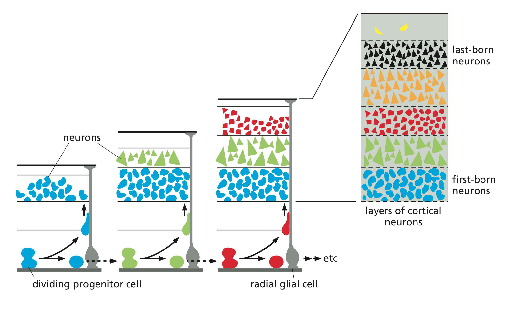

Nervové spoje
- různé neurální populace se aktivují při různých úkolech
    - např. při rozlišování hranatých a kulatých věcí
- dynamická struktura, která se "drátuje" v průběhu života
- součástí správného rozvoje CNS je i apoptóza
    - neurony, které nejsou za prvních pár týdnů prenatálního života použity, podléhají buněčné smrti
- podobně jsou i v rámci postnatálního života posilovány spoje, které jsou často používány, naopak nepoužívané spoje slábnou a zanikají
    - je důležité dávat dítěti (alespoň do sedmi let života) co nejvíce různých vjemů
    - příkladem může být absolutní hudební sluch, který silně souvisí s typem vjemů, kterým je dítě vystavováno
        - v Asii desetkrát vyšší incidence absolutního sluchu než u nás, snad kvůli tonálním jazykům
        - je s ním spojený jen jeden gen, který však způsobuje i nízkou hodnotu IQ (čili tímto genem běžný absolutní sluch způsoben není)
- tato plasticita mozku během života zaniká
    - netvoří se nové spoje, pouze se posilují a zeslabují ty stávající

Místům v mozku, která byla původně určena jako nefunkční či prázdná, bývá pomocí FMR přiřazena funkce --- objevujeme stále nové souvislosti mezi jednotlivými částmi mozku.

###### Poznámka
**mikrochimérismus**
Přítomnost dvou a více geneticky odlišných populací buněk, které jsou odvozeny z různých zdrojů, v jednom orgánu nebo jednotlivci.

Např. buňky myšátek během gravidity osidlují tělo matky, což se dá pozorovat na myšátkách GFP-tagovaného samce a netagované samice.

### Neurony

- schopné sčítat a odčítat signály z jiných neuronů, integrovat je, a pak vyslat signál
- jsou v podstatě zodpovědné za to, že myslíme
- neurony jdou připravit z kmenových buněk pomocí kyseliny retinové
    - na vytváření jednotlivých neurálních populací jsou potřeba ještědalší růstové faktory

Dendrity
- většina neuronů má mnoho dendritů
- větví se: co dendrit, to možnost napojit se na individuální nervovou buňku
    - např. Purkyněho buňky mohou integrovat až 200 000 signálů
- při větvení se tenčí
- zesilují se, nebo zeslabují, podle toho, jak jsou používány
    - buňka umí do dendritu transportovat proteiny, snad tam umí i lokalizovat část translačního procesu
    - tento proces nejspíše stojí za dlouhodobou pamětí

Axony
- většina neuronů má jeden axon, vzácně nula
- větví se, má ale konstantní šířku
- $\pu{1mm}$ -- $\pu{1m}$ na délku
- vyrůstají z místa zvaného _axonální kónus_
    - tam se provádějí všechny výpočty
    - jde o to, jestli je překročen akční potenciál
- plazmatická membrána axolemma, obsahuje axoplazmu
- úsek mezi kónem a počátkem myelinové pochvy se nazývá _iniciální segment_
    - jsou zde unikátní iontové kanály kontrolující generování nervového vzruchu
- mohou být myelinizované i nemyelinizované

Molecular fence
- zajišťuje diferenciaci na úrovni membrány
    - v axionálním výběžku jsou jiné iontové kanály než na dendritech
- buňka je díky ní polarizovaná
- brání průchodu signalizace zpět do dendritu
- pro správnou funkci NS je nezbytná dostředivá a odstředivá signalizace právě na základě membránových domén

#### Nervová zakončení

**aktivační zakončení**
Extracelulárně snižují polaritu nebo koncentraci sodných iontů a zvyšují potenciální vybuzení neuronu k vypálení signálu. Způsobují malou depolarizaci na postsynaptické membráně, otevírají gated kationtové kanály.

Ve spojení především s neurotransmitery acetylcholinem a glutamátem.

**inhibiční zakončení**
Znesnadňují signalizaci buňkám, které se zrovna vylijí. Způsobují malou hyperpolarizaci, otevírají postsynaptické $\ce{Cl-}$ a $\ce{K+}$ kanály. Ovlivňují prostorovou a časovou sumaci signálů. Rozhodují o tom, jestli bude či nebude na neuronu postsynaptický potenciál.

Ve spojení především s neurotransmitery GABA a glycinem.

V reálu záleží na tom, jak se posčítají hyperpolarizace a depolarizace.

Funkce svalů
- motorický neuron musí dostat dostatečné množství aktivačních signálů
- sval samotný už nic neřeší a pokud dostane signál, prostě se stáhne
- akční potenciál je pořád stejně velký, jak rychle se má sval stáhnout pozná z frekvence, ve které dostává signály

#### Schopnost regenerace

###### META
Na toto byl v přednášce kladen velký důraz.

Naproti všeobecné představě jsou nervové buňky schopny určité regenerace.

###### Poznámka
Nisslova substance (Nissl body) je granulární hmota v somě neuronu složená z endoplazmatického retikula obklopeného volnými ribozomy.

Průběh poškození axonu
1. Ve zdravém neuronu spojeném se svalem je jádro uprostřed a je v něm mnoho Nisslových substancí.
1. Když je axon přerušen, jádro se posune na periferii a počet Nisslových substancí se sníží. Část nervového vlákna, která je nyní spojená jen se svalem, degeneruje a je odklizena makrofágy.
1. Denervovaná svalová buňka atrofuje. Schwannovy buňky proliferují, tvoří silný kabel roustoucí ze svalové buňky.
1. Axon dorůstá a snaží se spojit a prorůst Schwannovými buňkami.
    - Když se mu to povede, sval je opět inervovaný, obnoví se jeho síla i funkce a neuron se vrátí do původního stavu.
    - Když se mu to nepovede, růst axonu je neorganizovaný, sval dál atrofuje. Po překročení určité doby je sval už nenávratně poškozen.

Axony málokdy najdou přesně tu správnou myelinovou pochvu a přesně to správné místo, kam původně vedly---jednotlivé svaly mají po regeneraci po zranění nejprve špatnou koordinaci a mozek se musí přeučovat, což trvá měsíce až roky.

U myši jsou schopna se zahojit i poranění páteře; při poraněních páteře u člověka je problém s tím, že je informační zmatek přerušených axonů obrovský, navíc axony by musely prorůst mnohem dál než u myši.

Léčba přerušených nervových spojů
- k léčení se snažíme využít i kmenové buňky
- stárnutí je spojeno s neurodegenerací, vymírají konkrétní populace nervových buněk
    - např. u Parkinsonovy choroby to jsou dopaminergní neurony v _substantia nigra_
- existují snahy diferencovat určité populace nervových buněk in vitro
- regenerace je ale omezenejší než u běžných epitelů
    - nejsilnější je regenerace v bulbus olfactorius (čichovém bulbu) a v hippokampu, který je plastický i v dospělosti

Příklady regenerace
- lze ji pozorovat u pacientů trpícími vážnými, život ohrožujícími epileptickými záchvaty
    - odstraní se velká část mozku s epileptickým ložiskem
    - původní práci této části zastane druhá hemisféra
- Phineas Gage
    - hlavou mu proletěla tyč
    - obnovila se mu skvěle řeč i hybnost
- víme, kde v myším mozku sídlí kmenové buňky

### Pomocné nervové buňky

Mají základ z neurální trubice, v PNS z neurální lišty. Někdy jsou označované jako **gliové buňky**.

**oligodendrocyty**
Tvoří myelinové pochvy axonů v CNS. Mohou se podílet na myelinizaci více než jednoho axonu.

Podobnou úlohu zastávají v PNS Schwannovy buňky. Každá Schwannova buňka však může vytvářet pouze jeden segment myelinové pochvy na jenom axonu.

**astrocyty**
Dělají strukturní a funkční podporu neuronům, ustanovují extracelulární homeostázi $\ce{K+}$ a $\ce{H+}$.

Funkce
- odstiňují synapse
- pomáhají vzruch vést, ale i ho zastavit
- dlouhé výběžky astrocytů slouží nervovým buňkám při jejich migraci do cílové struktury jako vodící struktury
- snižují hladinu draslíku a zvyšují hladinu sodíku v synapsi
- čistí extracelulární prostředí v mozku po proběhlých nervových vzruších

Za jejich přítomnosti také dochází k vychytávání neurotransmiterů a k jejich transformaci; např. glutamát -> glutamin, který není neurotransmiterem. Glutamin poté předají presynaptickému neuronu. To se děje proto, aby k nervovým vzruchům mohlo docházet častěji.

Stavba
- diferenciace podléhá růstovým faktorům
    - NGF (nerve growth factor), BDGF (brain derived GF), GDNF (glial cell-derived neurotrophic factor)
- navzájem propojeny gap junctions
- různé výběžky plní různé úkoly
    - nějaké výběžky obalují kapiláry a tvoří část hematoencefalytické bariéry

**mikroglie**
Imunokompetentní, mají podobnou funkci jako markofágy.

**ependymové buňky**
Pokrývají vnitřní dutiny CNS (trubice v míše a mozkové komory). Mají epiteloidní uspořádání a řasinky (povrch je velmi podobný epitelu dýchací trubic).

Jsou všude tam, kde je v CNS tekutina, kterou uvádějí v cirkulaci svými řasinkami.

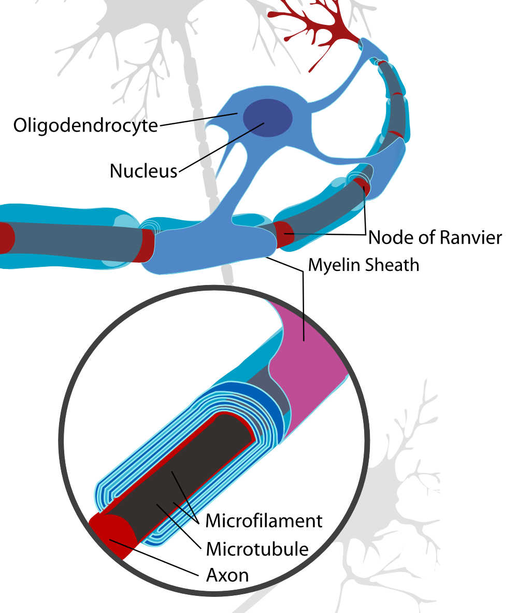
_By Neuron-with-oligodendrocyte-and-myelin-sheath.svg: *Complete-neuron-cell-diagram-en.svg: LadyofHatsderivative work: Andrew c (talk) - Neuron-with-oligodendrocyte-and-myelin-sheath.svg, Public Domain, [link](https://commons.wikimedia.org/w/index.php?curid=10888009)_

Pro gliové buňky je základním zdrojem energie glukóza, kterou anaerobně štěpí na laktát. Kyslík je šetřen pro neurony, kde je potřeba pro přenos nervových vzruchů.

Myelinizace
- panožka Schwannovy buňky nebo oligodendrocytu se několikrát obtočí kolem výběžku
- výsledná vtsva má výborné elektrické vlastnosti
- nabohaceny komplexní glykolipidy, sfingolipidy, gangliosidy
- mnoho axonů není myelinizovaných, musí ale být odstíněné
    - invaginace na periferii, vchlípení do těla oligodendrocytu; vzniká _mezaxon_
    - v jednom kanálku může být i více axonů

### Hematoencefalická bariéra

- odděluje mozek od zbytku těla a je běžně pro buňky neprůchodná
- propouští kmenové buňky, pokud je v mozku indukováno poškození; minimálně u myší, na kterých byl tento experiment proveden
    - pronikají přes ni kmenové buňky neznámého původu
        - diferenciace v nervové buňky i různé typy gliových buněk
        - zajištění regenerace poměrně velké části nervové tkáně

Na obrázku lze pozorovat výběžky astrocytů, které k sobě těsně doléhají. Samotná kapilára je pak z endoteliálních buněk, které jsou spojeny přes tight junctions.

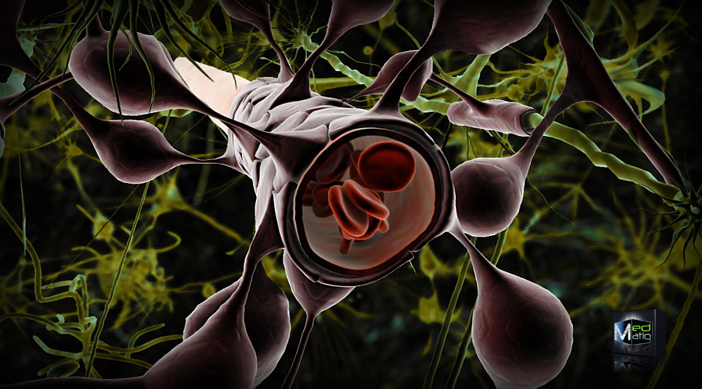
_By Ben Brahim Mohammed - Own work, CC BY 3.0, [link](https://commons.wikimedia.org/w/index.php?curid=12263975)_

Stavba
- endoteliání kapilární buňka je obklopena výběžky astrocytů
- všechny mezery mezi endoteliáními buňkami uzavřeny přes tight junctions
- kromě imunitních buněk by nemělo nic projít
- téměř vše, co se dostane k neuronům, prochází přes astrocyty

## Senzorické epitely

- buňky na pomezí epitelu a nervové buňky
    - historicky je od ektodermu odvozena celá nervová soustava i senzorické tkáně čichové, zrakové i sluchové
- mají apikální (detekční) a bazální (synaptický) konec

### Čichový epitel

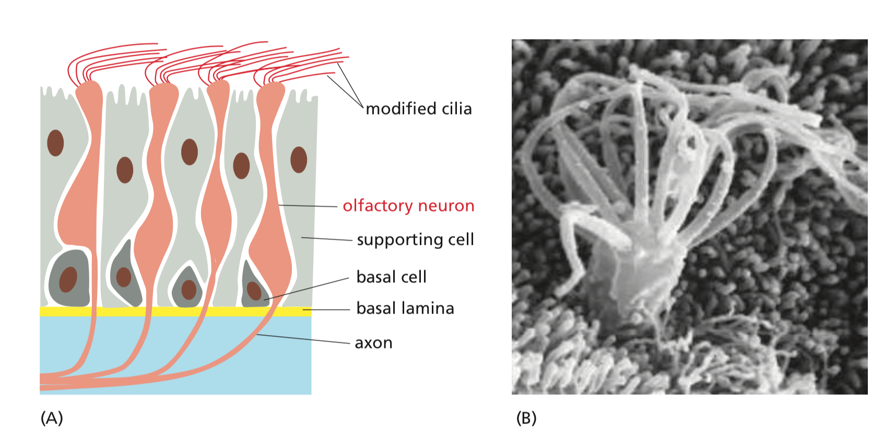

- jako jedna z mála neurosenzorických struktur se během života mění
    - senzorické neurony přežívají 1--2 měsíce
    - poté jsou nahrazeny diferenciací bazálních buněk
- skupina buněk se diferencuje v čichové (viz obrázek výše)
    - cilie jsou nepohyblivé, obsahují čichové receptory
    - na bazální straně jeden axon směřující do mozku
    - obklopeny podpůrnými buňkami s podobným významem jako gliové buňky
- každý senzorický neuron exprimuje jen jeden z několika set čichových receptorů
    - když jsou buňky obnovovány, nově vznikající buňka si náhodně vybere jeden receptor

Glomeru­ly
- axony senzorických neuronů se stejným receptorem jsou rozptýleny v čichové sliznici (=> nejsou nashromážděny na jednom místě)
- axony neuronů se stejným receptorem směřují do stejného glomerulu
    - u myší je v bulbus olfactorius na každé straně 1800 různých glomerulů
    - čím více glomerulů, tím více vůní umíme rozeznat, ale tím více druhů senzorických neuronů musíme mít
- jak axony nově vznikajících buněk najdou správnou cestu ke glomerulu
    - zdá se, že v tom hrají roli receptory pro čich spřažené s G-proteiny
    - tyto receptory jsou schopny homeotické adheze, tj. dva stejné receptory se "zazipují", ale dva různé ne
    - axon putuje po glomerulech, zkouší se navázat a zůstane tam, kde se váže nejsilněji
- existuje mnoho poruch této axonové navigace, lidé ztrácí schopnost kontinuity pachů

Studium navigace axonů se opět provádělo na zelených myškách; zeleně se obarvily jen neurony reagující na jednu konkrétní vůni. Po histologii mozku se ukázalo, že všechny zelené axony míří pouze do dvou míst na bul­bus ol­fac­to­rius (dvou glomerulů, jednom v každé hemisféře).

### Sluchový epitel

- morfologicky nejpropracovanější tkáň v těle
- hlemýžďová rezonanční struktura vzniká prenatálně
- záleží na tom, v kterém místě hlemýždě dochází k rezonanci s membránami, které obalují prostory vyplněné tekutinou
    - u ústí hlemýždě jsou rozpoznávány vysoké frekvence, uprostřed spirály naopak nízké
    - voda je nestlačitelná => přenáší vibrace
- senzorickými buňkami jsou sluchové vláskové buňky

Vláskové buňky
- leží ve struktuře **Cortiho orgánu** v hlemýždi, mezi podpůrnými buňkami, překryty extracelulární matrix
- převádějí mechanickou deformaci v elektrický signál
- všechny mají stejnou morfologii varhanovitých výběžků, _stereocilií_
    - stabilizovány aktinovým cytoskeletem
    - podobně jako výběžky na buňkách ve střevě
    - rozměry každé stereocilie pevně dány vzhledem k poloze ve středním uchu, odpovídají frekvencii zvukového podnětu, na který mají reagovat
- neregenerují se
- jsou propojené přes gap junctions _konexinem 26_

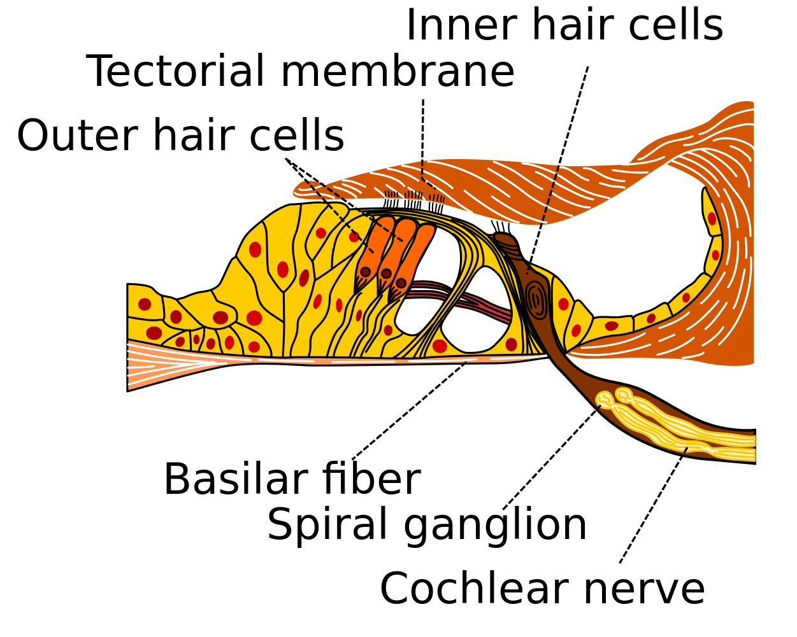
_By Madhero88 - Own work, CC BY-SA 3.0, [link](https://commons.wikimedia.org/w/index.php?curid=6888273)_

Princip funkce
1. zvukové vibrace deformují stereocilia na vláskových buňkách
1. otevírají se iontové kanály s mechanickými "vrátky" (mechanically gated ion channels)
    - reálně dochází ke změně konformace iontového kanálu
1. vzniká membránový vzruch, který se šíří vláskovou buňkou
1. na bazálním konci dojde v synapsi s neuronem k vylití neurotransmiteru

Choroby
- sluch se mění, hlavně ve stáří a hlavně mužům (špatný sluch zvláště ve vyšších frekvencích)
- celá řada poruch je genetického původu
    - mutace v konexinu 26 způsobují hluchotu (jedna z nejčastějších genetických chorob v Evropě)

### Zrakový epitel

- fotoreceptory se dělí na tyčinky a čípky
- senzorickou složkou jsou proteiny opsiny (_ópsis_ = zrak) s prostetickou skupinou **retinalem**
    - retinal je schopný cis-trans izomerizace, když pohltí foton
    - změna konformace retinalu změní tvar opsinu
- není schopný regenerace

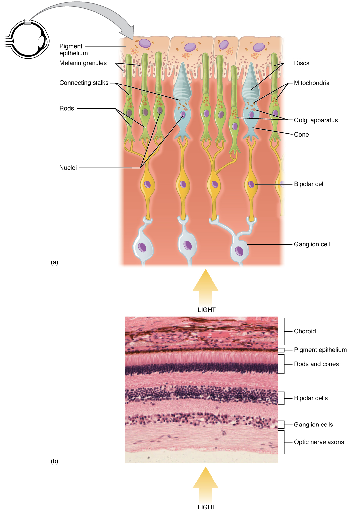
_[By OpenStax College - Anatomy Physiology, Connexions Web site. [author link](http://cnx.org/content/col11496/1.6/), Jun 19, 2013., CC BY 3.0, [wiki link](https://commons.wikimedia.org/w/index.php?curid=30148002)]_

Nejblíže u pigmentovaných epiteliálních buněk je senzorický epitel, poté jsou různé interneurony a gangliové neurony, které vysílají signál do mozku. Apikální vrstvu senzorické složy tvoří brva (či přetvořený bičík).

Princip funkce v rámci buňky
1. retinal změní konformaci
1. opsin změní tvar
1. aktivují se cGMP fosfodiesterázy, které štěpí cGMP
    - v očních buňkách je jinak vysoká koncentrace cGMP
1. otevřou se $\ce{Ca^{2+}}$ kanály, dojde k hyperpolarizaci membrány
1. uzavřou se $\ce{Na+}$ kanály
1. do synapse se přestane vylučovat neurotransmitter
1. zastaví se bazální signalizace

To, jakým způsobem vidíme, je vlastně negativ: při zachycení fotonu se sníží/zastaví bazální signalizace. To umožňuje rozlišovat jemnější nuance v signálech.

Tyčinky
- obsahují pigment rodopsin, který je součástí rodiny opsinů
- zajišťují vnímání kontrastu černé a bílé
Čípky
- obsahují pigment jodopsin (fotopsin)
- zajišťují vnímání barev
- každý obsahuje jeden ze tří druhů jodopsinu (citlivý na červenou, zelenou, nebo modrou barvu)
    - vlastní barva vzniká superpozicí tří čípků
    - mutace v jednom jodopsinu zapříčiní to, že člověk od sebe nebude schopen rozeznat určité barvy
        - např. daltonismus; jeden z jodopsinů je vázaný na chromozom X, takže se daltonismus vyskytuje častěji u mužů

Pigmentované epiteliální buňky
- odrážejí a pohlcují světlo, brání odleskům
- fungují jako makrofágy
    - senzorické buňky se nemohou během života měnit, proto jen vyměňují svůj obsah
    - odštěpují váčky s denaturovanými proteiny a kovalentně modifikovanými lipidy
    - tyto váčky uklízejí právě epiteliální buňky

Choroby
- výše zmíněná barvoslepost
- mutace mitochondriální DNA => ztráta zraku, atrofie očního nervu
    - např. syndrom LHON
        - degenerace gangliových buněk
    - zrakový nerv a funkce senzorického zrakového epitelu je zřejmě jedna z Achillových pat energetického metabolismu

## Patologie nervové soustavy

Roztroušená skleróza
- autoimunitní onemocnění proti MBP (myelin basic protein)
- destrukce myelinových obalů T-lymfocyty
- nemoc můžeme experimentálně vyvolat u myši
    - např. tím, že přeneseme aktivované T-lymfocyty do těla
- léčba je nákladná

Epilepsie
- nervová soustava dočasně upadá do stavu pozitivních zpětných vazeb
- způsobená různými úrazy, infekcemi, někdy je dědičná
- jednou z příčin je odumření neuronů a nahrazení gliovými buňkami (tzv. _gliová jizva_)

Parkinsonova choroba
- dochází ke svalovým třesům
- příčinou je nedostatek dopaminu
- v mozku jsou oblasti, kde jsou lokalizovány dopaminergní neurony (substantia nigra), ty často odumírají
- po Alzheimerovi druhá nejčastější choroba

Alzheimerova choroba
- některé proteiny mají narušené odbourávání
    - např. amyloidní protein, $\tau$ protein
- v mozku se hromadí plaky neodbouratelné substance, která tlačí, je cytotoxická a způsobuje neurologické patologie

Creutzfeld-Jacobova choroba
- prionové onemocnění
- chyby paměti, změny chování, špatná koordinace, časem slepota, slabost
- dost vzácná
- často se objeví zdánlivě bez příčiny, někdy je ale dědičná, dá se chytit i v rámci kontaktu s nakaženým nervovým systémem (např. při operacích)
- mozek po nakažení začne vypadat jako houba (s děrami)

Nádory CNS
- primární nádory mozku tvoří přibližně 1--2% všech zhoubných nádorů
- nejčastěji děti do pěti let, nebo dospělí od 60 let
- malé množství nádorů je dědičně podmíněno
- více než 50% nádorů jsou nádory z buněk podpůrné tkáně, _gliomy_
    - dělí se na low-grade a high-grade gliomy, podle toho, jak vysoký mají stupeň malignity
- neuroblastom, ganglioneurom, feochromocytom, chemodektom, retinoblastom, oligodendrogliom (druh gliových buněk), astrocytom (druh gliových buněk), meduloblastom, ependymom, meningiom, angioretikulom

Nádory PNS
- neurinom, neurilemom, neu­rofi­brom, Schwannom (nádor ze Schwannových buněk)
- neurogenní sarkom --- vzácná varianta neurinomu, maligní