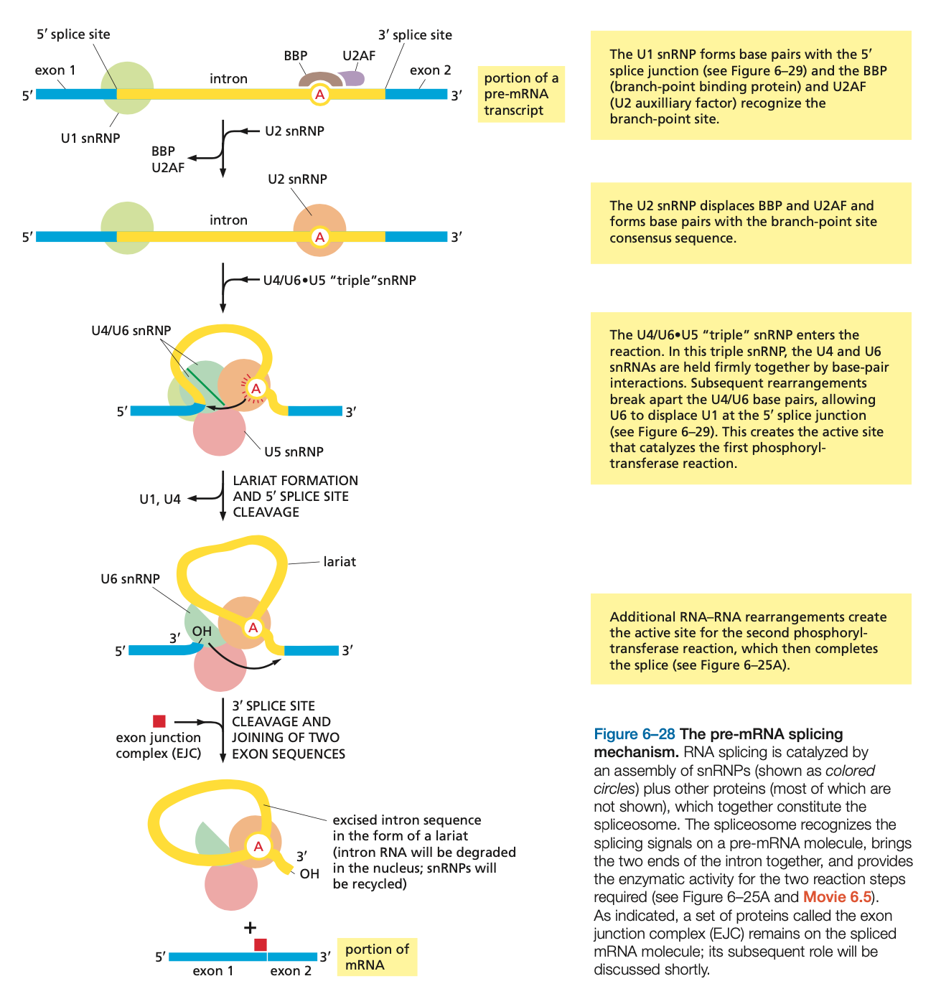

# Struktura makromolekul

_<Přednáška č. 1>_

DNA má několik forem, konkrétně především B, A a Z. Tyto se liší velikostí žlábku, tvarem ribóz a případně orientací báze (synklinální/antiklinální).

###### META
Další informace též odpovídající část zápisů ze základů bioinformatiky ([DNA](https://eugleo.github.io/bioinformatika/doc/zaklady-bioinformatiky/notes.html#Struktura%20nukleových%20kyselin), [proteiny](https://eugleo.github.io/bioinformatika/doc/zaklady-bioinformatiky/notes.html#Struktura%20proteinů)) a také zápisy z [celého druhého předmětu](https://eugleo.github.io/bioinformatika/doc/biopolymery/notes.html).

## Interakce mezi molekulami

Atomy (potažmo molekuly) jsou vázány kovalentně, nebo nekovalentně.

Nekovalentní vazby
- vodíkové můstky
    - interakce dvou elektronegativních atomů s jedním vodíkem
    - délka 3Å
    - s rostoucím úhlem klesá jejiich síla
    - u proteinů energie $\pu{10 kJ/mol}$
- iontové interakce
- stacking interakce
    - vznikají kvůli $\pi$ vazbám na aromatických sloučeninách
- Van der Waalsovy interakce
    - působí mezi všemi páry atomů, které jsou v určité vzdálenosti
    - přitažlivé
- interakce kvůli hydrofobnímu efektu
    - přitažlivé (voda se snaží zachovat si co nejvíce vodíkových můstků)
    - nejvíce mezi nepolárními sloučeninami

## Struktura proteinů

###### META
Předpokládají se základní informace o proteinech a o stavbě a složení aminokyselin. Viz popříadě [zápisky z bioinformatiky](https://eugleo.github.io/bioinformatika/doc/zaklady-bioinformatiky/notes.html#Struktura%20proteinů).

Proteiny jsou biopolymery složené z aminokyselin, které jsou vázané peptidickou vazbou. Peptidická vazba je ze 40% rezonanční, a proto je planární; rotace je dovolena pouze kolem chirálních $\ce{C\alpha}$. Volnost otáčení (tzv. torzní úhly) se zaznamnává na Ramachandranův diagram.

Stereoizomerie
- L a D forma AK (v těle je častější L)
    - buněčná stěna bakterií často obsahuje D formu, aby nebyly rozpoznány
- většina AK (až na glycin) má chirální uhlík, proto stáčí rovinu polarizovaného světla

###### META
L a D se dají "na papíře" jednoduše rozlišit; stačí najít chirální uhlík, zorientovat si jej vodíkem k sobě a poté sledovat, v jakém pořadí jsou jeho další vazební partneři. Pokud se ve směru hodinových ručiček dá přečíst pořadí **CO**, **R**, **N**, jedná se o **L formu**.

Rotamery
- jednotlivé AK, které se liší pouze rotacemi kolem jednoduchých vazeb ve svém postranním řetězci
- existují knihovny rotamerů

U proteinů rozlišujeme primární až kvartení strukturu.

Kvarterní struktura
- obligátní nebo neobligátní
    - obligátní = vyskytuje se jen v rámci daného "komplexu" a ne samostatně
- symetrická a asymetrická (evolučně mladší)
- obvykle obsahuje malé množství podjednotek
    - výjimku tvoří F0ATPáza se 13 podjednotkami

# Nástroje

_<Přednáška č. 2>_

Přehled metod
- rentgenová krystalografie
    - difrakce RTG na elektronech
    - nejpoužívanější
    - nemá velikostní limit
- NMR spektroskopie
    - využívá magnetické vlastnosti jader
    - zkoumaná látka musí být v roztoku
    - schopná zachytit i dynamiku molekul
    - má velikostní limit
- elektronová mikroskopie, cryoTEM
    - používá svazek elektronů s vysokou energií
    - vhodná pro velké komplexy
    - má nízké rozlišení
    - kombinuje se s RTG a NMR strukturami
- výpočetní metody
    - homologní modelování, strukturní bioinformatika
    - není potřeba vzorek, vše je ale nutno porovnat s experimentálními daty

## Rentgenová krystalografie

Obecný postup
1. příprava proteinu a krystalizace (dohromady kolem tří let)
1. difrakční experiment
1. vyřešení 3D struktury a její analýza

Historie krystalů
- (1840) první proteinové krystaly: Hemoglobin, Hünefeld
    - víceméně omylem, kapali krev na sklíčko, molekuly vysychaly a praskly, vylil se z nich hemoglobin a zkrystalizoval
- (1850) první metody krystalizace: Hemoglobin, Fünke
- (1909) The crystallography of Hemoglobins, Reichert Brown
    - cca 600 obrázků, hemoglobiny z různých živočišných druhů, na základě tvaru a velikosti krystalů se snažili evolučně propojit, jak jsou si různé druhy příbuzné
- (1915) krystaly séra albuminu
- (1925) první krystal enzymu
- (1935) první krystal viru (tabáková mozaika)

Historie RTG
- (1895) RTG záření, W. C. Röntgen
- (1910) teorie difrakce, Max von Laue
- (1912) difrakce na krystalu
- (1956) struktura myoglobinu, M. F. Perutz aj. C. Kendrew
    - viděli "párečky" (helixy)

RTG používáme místo běžného světla pro jeho kratší vlnovou délku; minimální rozlišení pozorování je totiž určeno jako $D_{min} = \frac{\lambda}{2}$ (poté již dochází k ohybu světla). Pokud se chceme dostat na atomární rozlišení $\pu{1e10 m}$, musíme používat RTG.

### Krystalizace proteinů

Jedná se o nejtěžší část RTG krystalografie. Jako srážedla se používají soli, polymery, organické látky (odebírají proteinu vodu). Přesné krystalizační podmínky nelze předpovědět, proto se dělá _screening_ (testování 96 různých podmínek). Díky automatizaci je nyní možné na každý pokus vypotřebovat pouze malé množství proteinu.

Vlastnosti proteinových krystalů
- malé, symetrické
- většinou bezbarvé
- krychlová vnitřní struktura (shodná s diamantem, $\ce{NaCl}$)
- malé styčné plochy, hodně prostoru mezi molekulami
    - kanály vyplněné krystalizační tekutinou (mateční roz­tok) tvoří až 70% krystalu
- struktura krystalu velmi připomíná nativní strukturu

Faktory ovlivňující krystalizaci
- fyzikální
    - teplota, povrchy, doba krystalizace, gravitace, tlak, vibrace, elektrické a magnetické pole
- chemické
    - pH, typ srážedla, koncentrace srážedla, iontová síla, specifické ionty, stupeň přesycení, koncentrace proteinu, neproteinové nečistoty
- biochemické
    - čistota proteinu, ligandy, inhibitory, efektory, biologické zdroje, historie vzorku, stabilita proteinu, genetické modifikace, post- translační modifikace, chemické modifikace, isoelektrický bod

### Popis funkce

Princip RTG krystalografie
1. krystal ozařujeme RTG zářením
1. výsledek vypadá jako odraz, ale je to difrakce
    - RTG interaguje s elektrony (předá jim energii), elektrony vyzáří sekundární vlnu
1. zaznamenáme intenzitu difrakce na detektor (kdysi fotografický papír, dnes elektronický detektor)
1. provedeme Fourierovu syntézu (matematická operace)
1. výsledkem je model proteinové struktury, konkrétně mapa elektronové hustoty

Difrakční experiment
- na krystal pouštíme jeden zaostřený paprsek RTG o vybrané vlnové délce
- zaznamenáme difrakční obrazce ve všech směrech kolem krystalu

Fourierova transformace
- matematická operace, díky níž můžeme spojitou funkci (s užitím Fourierovy analýzy) rozdělit na sadu periodických funkcí
- složky složíme zpět Fourierovou syntézou
- získáme tedy co, z čeho původně data vyšla, tedy mapu elektronové hustoty

Fázový problém
- nejsme schopni získat fázi elektronové hustoty experimentálně
- máme několik metod, kterými ji zjišťujeme
    - metoda molekulového nahrazení: odhad na základě předchozích výsledků
    - metoda anomálního rozptylu: zavedeme těžký kov (Se, Hg), do něj namočíme krystal, pak odhadujeme fázi
    - metoda izomorfního nahrazení

Všechna PDB data jsou tedy pouze něčí interpretace mapy elektronové hustoty. Proto je také nyní povinnost ukládat do databází kromě struktury i původní strukturní data (tedy přesnou podobu experimentálních dat), aby si každý mohl interpretaci udělat sám.

Rozlišení
- závisí na kvalitě krystalu a intenzitě RTG záření
- do jakého úhlu jsme schopni zaznamenat difrakce
- nejlépe pod 2Å, neboť poté už hůře vidíme vodíkové můstky

## Kryoelektronová mikroskopie

Hodí se spíše pro větší vzorky; její rozlišení je omezené, ale stále se zlepšuje. V současné době se pohybuje kolem 6Å.

Postup
1. vzorek vysušíme
    - ve vrstvě soli obsahující těžký atom (uranyl acetát)
    - _negativní barvení_ (negative staining): zvýšení kontrastu, kontrola homogenity vzorku
1. umístíme jej na mřížku
1. mřížku se vzorkem zmrazíme
    - v tekutém ethanu (cca 90°), rychlejší než dusík
1. umístíme mřížku do elektronového mikroskopu
1. ozáříme mřížku proudem elektronů a sledujeme stíny částic
1. vytvoříme 3D mapu rozmístění částic, z ní poté zhotovíme finální model

Požadavky na vzorek
- velikost > $\pu{150 kDa}$ (čím větší, tím lepší)
- symetrie (oligomery)
- rigidita a stabilita
- homogenita (někdy lze ovšem rozlišit i více složek)

Kromě toho je potřeba i vysokoenergetický dým s napětím $\pu{200}$ až $\pu{300 kV}$.

## NMR spektroskopie
_<Přednáška č. 3>_

Nukleární magnetická rezonance se často používá v analytické chemii, kromě toho je ale užitečná i při zjišťování struktury proteinů.

Způsoby měření
- v kapalné fázi
    - vysokorozlišená a nízkorozlišená NMR (ta je jedna z nejpoužívanějších metod, je přesná)
- v pevné fázi
    - druhá nejpoužívanější
    - látky nesmí být v krystalu (vzorek musí být amorfní)
    - vzorek je mikrokrystalický, nebo jeho molekuly tvoří agregáty
    - vysokorozlišená NMR, širokopásmová NMR, mikroskopie
- in vivo NMR
    - sledování buněk a živých tkání
    - MR imaging

Předměty studia
- prostorové uspořádání molekul (statický obraz)
- vzájemné interakce
    - zásadní pro strukturní biologii
- dynamické chování molekul
    - na úrovni postranních řetězců, celých molekul nebo domén
    - vhodná pro pozorování dějů trvajících mikrosekundy, nanosekundy
        - čím jsou molekuly pomalejší, tím méně je NMR vhodná

Princip funkce
- jádra mají spin (otáčejí se), a náboj -> chovají se jako magnety
    - konkrétně musí ještě mít lichý počet neutronů a/nebo protonů
    - když je vložíme do magnetického pole, budou se nějak orientovat
- na NMR měříme, kolik energie musíme vynaložit na to, aby se jádra přesunula do rezonančního stavu (jejich magnetické pole se vychýlí přesně proti vnějšímu magnetickému poli)
    - tato energie je ovlivněna počtem elektronů v blízkosti atomu
    - přesunu do rezonančního stavu se říká _precesní pohyb_, má konkrétní frekvenci a potřebnou energii pro konkrétní jádro v konkrétním elektronovém kontextu
- energii dodáme atomům pomocí radiofrekvenčního vysílače
    - po vypnutí se atomy vrátí do původní polohy
    - tento pohyb indukuje v cívce proud, který zpracujeme jako NMR signál
- odezvu (měření rezonančních frekvencí jednotlivých atomů) měříme v závislosti na čase a analyzujeme ji pomocí Fourierovy transformace

NMR malých molekul je základním nástrojem analytické chemie. V naměřených spektrech je ale více signálů a šířka čar odráží velikost systému. U komplikovanějších molekul, kde dochází k překryvu signálů, je třeba použít vícedimenzionální spektra a/nebo NMR aktivní heterojádra.

NMR biomolekul velice závisí na velikosti těchto molekul; čím je molekula větší, tím pomaleji se v roztoku pohybuje. A pomalé rotace vedou k rozšiřování čar signálů. To je zároveň **největší nevýhoda NMR**: systém musí být jen tak veliký, aby čáry signálů nepřesáhly šířku, za kterou už je nemůžeme analyzovat.

Zdroj magnetického pole
- magnet (ve tvaru nádoby)
- supravodivá cívka chlazená héliem, na ní několik plášťů (mezi nimi vakuum kvůli izolaci), další kryokapaliny (dusík)
    - musí být ve stabilním prostředí, je nutné neustále doplňovat kapaliny
- samotná nádoba má průměr asi $\pu{2 m}$
- uprostřed cívky je šachta, zespoda sonda
    - k sondě je nutné přivést radiofrekvenční záření

### NMR proteinů

Právě u proteinů se objevuje problém s citlivostí NMR.

Metody pozorování
- proteiny jsou velké, rotují pomalu, jejich NMR signály jsou široké
- komplexní a repetitivní sekvence způsobují překryvy čar
- čím vyšší energii bude mít použité záření, tím necitlivější naše metoda bude
- $\ce{^12C}$ ani $\ce{^14N}$ nejde na NMR vidět, musí se proto substituovat $\ce{^13C}$ a $\ce{^15N}$
    - stavíme _korelační mapu_, kde zjišťujeme korelaci mezi protony a dusíky a korelaci mezi protony a uhlíky

###### META
Následující odstavec prý zcela jistě bude ve zkouškovém testu.
Narozdíl od RTG krystalografie pozorujeme u NMR **přímou odezvu konkrétních atomů a skupin**, z těchto jednoduchých dat poté můžeme sestavit model popisující interakce těchto částí. Jedná se tedy o **přímé porovnání**.

Postup získání strukturní informace
1. přiřazení signálu jednotlivým skupinám a atomům
1. získání strukturních omezení
    - intenzita signálu klesá se vzdáleností (s šestou mocninou)
    - nevidíme přes helixy
1. tvorba matice strukturních zobrazení
    - soubor konformací vyhovujících omezením
        - pouze upřesnění modelu, ne přesný výpočet
        - na periferiích jsou větší omezení
    - vypadá jako mapa elektronové hustoty
    - nejprve se skládají lokální části

## Biomolekulární hmotnostní spektrometrie

- pozorujeme složení, stechiometrii, vazbu malých molekul, homogenitu, čistotu
- vidíme spektra s atomárním rozlišením, zjistíme co je na molekulu připojeno (různé modifikace)
- jsme schopni separace podle iontové mobility
- velmi cenná v kombinaci s krystalografií

Princip funkce
- potřebujeme molekuly převést do plynné fáze a z neutrálního stavu je dostat do iontového
    - ESI (electrospray ionization), MALDI (matrix- assisted laser desorption/ionization)
- molekuly prochází přes spektrometr
    - v plynné fázi prochází přes vlastní spektrometr, který má více úseků
    - je vhodné použít i jiné způsoby dělení
- na základě velikosti a náboje se molekuly oddělí a my je snímáme na hmotnostních spektrech
    - vzniká více čar, kde každá odpovídá jednomu náboji
    - z toho lze zjistit, jak daný komplex vypadá a jaké má složení

Předměty studia
- velice podobné NMR
- chemický crosslinking
- výměna vodíku za deuterium (**HDX**, hydrogen-deuterium exchange)
- prostorové uspořádání molekul
- vzájemné interakce
- dynamické chování interakcí

HDX experiment
- protein se dá do $\ce{D2O}$, tedy vody, kde je vodík nahrazen deuteriem
- deuterium proniká do proteinu (vyměňuje se s vodíkem na páteři proteinu), protein je těžší
- rychlost výměny $\ce{D <-> H}$ závisí na tom, jestli má protein v daném místě navázaný ligand (pokud ano, je pomalejší)
- stačí tedy změřit rychlost HDX s různými ligandy (globální HDX), popřípadě je možné protein rozsekat proteázou a změřit HDX u každého kousku
    - z toho zjistíme, která část proteinu váže jaký ligand
    - používá se LC-MS (kapalinová chromatografie s hmotnostním spektrometrem)

## Bioinformatika (výpočetní metody)

Výpočetní metody studují stejné problémy jako NMR a hmotnostní spektrometrie: prostorové uspořádání molekul, jejich dynamické chování a vzájemné interakce.

###### META
Další informace lze najít v oddílu [predikce struktury](https://eugleo.github.io/bioinformatika/doc/zaklady-bioinformatiky/notes.html#Predikce%20struktury).

Dělení
- homologní modelování
    - na základě podobnosti v sekvenci
    - jsme schopni porovnat primární sekvence molekul jako takové
    - počty struktur jsou veliké, chemický prostor je už ale dobře mapován, proto jsme schopni vyřešit minimálně části proteinů
    - podobnost velmi vysoká
- ab initio metody
    - de novo návrh struktur
    - Rosetta
- MD simulace, hybridní modelování
    - folding, molecular docking
    - simulace pohybů na časových škálách, které neumíme pozorovat jinými metodami

Základní principy
- srovnáme sekvence, hledáme homologii
    - pokud nalezneme, můžeme zjistit sekvenci, strukturu
    - pokud ne, musíme přistoupit k tvoření ab initio
- ab initio výpočet struktury
    - velký problém s parametrizací
    - Rosetta (David Baker)
        - vychází ze známých pdb struktur rozsekaných na malé fragmenty
        - porovnává sekvence, skládá fragmenty a hádá, jak by mohla vypadat další sekvence
        - poté vybere model a provede validaci
- simulace molekulární dynamiky (MD simulation)
    - je používána homologním modelováním i ab initio metodami
    - poskytuje různá rozlišení
    - slouží k testování strukturního efektu mutací (např. u HIV reverzní transkriptázy)
- konstrukce hybridních strukturních modelů
    - umožňuje integrovat informace z různých metod

# Enzymy
_<Přednáška č. 4>_

- oxidoreduktázy (přenášejí $\ce{H+}$ nebo $\ce{O}$)
- transferázy
- hydrolázy
- lyázy
- isomerázy
- ligázy

Mechanismus funkce
- funkce je ovlivněná strukturou
- váží se na substrát a snižují energetickou bariéru, takže reakce může proběhnout rychleji
- mechanismus zámku a klíče
    - enzym má preformované aktivní místo, do kterého se vejde pouze jeden substrát s určitými vlastnostmi
    - pouze pro tento substrát reakce proběhne
- mechanismus induced fit (indukovaného přizpůsobení)
    - aktivní místo nemusí být připravené na daný klíč
    - na enzym se může navázat substrát, který indukuje změnu vazebného místa
    - hexokináza: po vazbě obou substrátů se aktivní místo přizpůsobí tak, že reakce může proběhnout
- některé enzymy potřebují "pomocníky"
    - kofaktory
    - koenzymy
    - prostetické skupiny
    - allosterické regulátory (molekuly vázající se mimo aktivní místo)

Inhibitory
- kompetitivní
    - přímo se váží na aktivní místo
    - kompetují se substrátem
- nekompetitivní
    - váží se mimo aktivní místo

## Karbonátlyáza

- anglicky carbonic anhydrase (CA)
- katalyzuje reakci
$$\ce{CO2 + H2O <=> H+ + HCO3-}$$
    - tato reakce je samovolná
- nejrychlejší enzym na světě, hydratuje $10^6$ molekul $\ce{CO2}$ za sekundu (zrychluje reakci $10^7$ krát)
- pět tříd: $\alpha, \beta, \gamma, \delta, \zeta$ (a nově objevená šestá třída $\eta$)
    - všechny mají jako kofaktor nějaký kov ($\ce{Zn}$, $\ce{Mo}$, $\ce{Cd}$)
    - v těle máme $\alpha$

###### TODO
Vysvětlit, jak přesně se zinek účastní enzymatické reakce.

Zinečný kofaktor
- konkrétně $\ce{Zn^{2+}}$
- je koordinován histidinovými zbytky
- koordinuje vodu, snižuje pKa vody na 7
- stará se o odštěpení protonu
- hydroxid zůstane navázaný na iontu, přichází substrát, dochází k nukleofilnímu ataku, odchází produkt a celá reakce pokračuje

### Lidské CA

- pomáhají udržovat acidobazické prostředí v organizmu
- účastní se $\ce{CO2}$ a $\ce{HCO3}$ transportu
    - respirace, resorpce kostí, glukoneogeneze, urogeneze, lipogeneze
- 16 izoforem
    - CAII
        - ve všech buňkách, je jí hodně
        - je stabilní, dobře krystalizuje
        - má dobře definované aktivní místo, od něj vede cestička k C konci vystlaná His
        - slouží jako off target: často chceme cílit léky na CAIX, ale zároveň nechceme inhibovat žádné její isoformy (to se právě těstuje na CAII)
    - CAIX: nadprodukce u nádorů, marker rakoviny, cíl vyvíjených léků

Inhibitory CA
- známe strukturu CA => místo substrátu můžeme navrhnout kompetitivní inhibitor
    - např. sulfanomid
- inhibitory lidské CA
    - všech 16 izoforem si je velice podobných
    - CAII anti-glaucoma drugs (glaukom je zelený zákal)
    - CAV je cílem léků proti obezitě
    - CAVII je v mozku, je cílem léků na bolest hlavy a epilepsii

Strukturou inspirované inhibitory
- cesta od ihibitoru k léku je drahá a dlouhá
- pokud známe enzym a jeho inhibitor (a určíme jejich strukturu), můžeme inhibitor upravit tak, aby se vázal lépe (specifičtěji, s větší afinitou)
    - jedná se o iterativní proces vývoje z lead structure do finální struktury, která poté může jít do klinických testů

## HIV proteáza

Enzym vyskytující se v retroviru HIV. V buňce se přepíše z RNA do DNA. Je jedním z hlavních cílů pro léky HIV.

Struktura
- zcela symetrický dimer
- dva řetězce, dvě podjenotky; každý řetězec je složek z 99 AK
- obě podjednotky jsou u sebe drženy svými N a C konci, kromě toho také aktivním místem ("zakousnou" se do sebe)
- v aktivním místě jsou Asp (podobně jako u pepsinu)

Funkce
- štěpí polyprotein na jednotlivé proteiny nutné k fungování viru
    - klíčová pro správnou funkci viru
- pro katalýzu je důležitá molekula vody
- aktivní místo nemá předpřipravené, vytvoří se až po navázání substrátu (induced fit)
    - po navázání substrátu vypudí všechnu přebytečnou vodu
- je _promiskuitní_, rozpoznává celou řadu substrátů (devět)
- na začátku musí rozštěpit i sebe

Podle tvaru substrátu se vyvinula léčiva, která funkci enzymu inhibují (např. ritonavir). Deset takových inhibitorů je v klinické praxi; virus ale díky reverzní transkripci, která často chybuje, velice rychle mutuje a rychle si vyvine proti léčivu rezistenci. Tyto (primární) mutace často musí být kompenzovány mutacemi sekundárními.

**primární mutace**
Snižují afinitu k inhibitoru, vyskytují se především na aktivním místě.

**sekundární mutace**
Kompenzují efekt primárních mutací na aktivitu, zaručují, že primární mutace nebudou mít na aktivitu negativní dopad. Vyskytují se dále od aktivního místa.

## ATP syntáza

- v membráně mitochondrií, chloroplastů a bakterií
- katalyzuje reakci
$$\ce{ADP + Pi + H_{out} <=> ATP + H2O + H_{in}}$$
    - syntetizuje ATP z ADP a fosfátu, využívá k tomu protonový gradient
- dodává všem organizmům energii
- funguje trochu jako molekulární motor: $\ce{F0}$ podjednotku v membráně pohání protony, zatímco $\ce{F1}$ podjednotku pohání ATP
- $\ce{F0}$ podjednotka se dá inhibovat oligomycinem

# Membrány

- zajišťují tvar buněk, komunikaci, obranu, přichycení, rozpoznávání a přenos signálů
- urdžují specifické prostředí buňky: koncentraci iontů, malých metabolitů a makromolekul
- eukaryota mají membrány i uvnitř buňky
- složení
    - lipidová dvojvrstva
    - proliny
    - glycerocalyx, "cukerný obal"
    - steroly vložené v lipidové dvojvrstvě
- velmi dynamická struktura --- model fluidní mozaiky
- cytoplazmatická část je negativnější než exoplazmatická

Tloušťka membrány
- nemá konstantní tloušťku
    - záleží na typu membrány, teplotě apod.
    - v literatuře $4$ až $\pu{10 nm}$, obvykle $5$ až $\pu{6 nm}$
- $\pu{3 nm}$ hydrofobní jádro a $1$ až $\pu{1,5 nm}$ polární hlavy
- apikální membrána jaterní buňky je asi o 7Å širší než basolaterální membrána
- membrána v uspořádaném stavu (nižší teplota) je užší než v neuspořádaném stavu
- ohyby membrány způsobeny složením lipidů a proteinů (fosfatidylcholin a sfingomyelin způsobují konvexní pohyb)

## Lipidy

Lipidů je až 200 typů.

Glycerofosfolipidy
- nejčastější
- glycerol + 2 alifatické řetězce
                - jeden zahnutý (nenasycený), druhý přímý (nasycený)
- přes esterovou vazbu návázán fosfátový zbytek a další alkohol
- různé typy se liší v navázaném alkoholu
- některé fungují jako signální

Sfingolipidy
- často v mozku
- účastní se zánětlivých reakcí
- často v části směřující do extracelulárního prostoru

Steroly
- 20-- 30% všech membrán
- Produkují se v obrovském množství (1--2g/den/člověk)
- ovlivňují tekutost (fluiditu) membrány (mohou zvyšovat i snižovat)
- nezbytná součást membrán
- polarizované
- aromatické kruhy a OH skupina
- např. cholesterol

Ethery
- díky nim mohou archea přežívat i v extrémních podmínkách

Distribuce lipidů na membráně
- lipidy jsou na membráně distribuovány asymetricky, vznikají **lipidové rafty**
    - ostrůvky bohaté na proteiny, membránové mikrodomény
    - vznik po laterálním pohybu proteinů
    - organizační centra pro uspořádávání signálních makromolekuul
    - ovlivňují membránovou fluiditu a transport membránových proteinů
    - regulují neurotransmisi
- enzymy schopné přehazovat lipidy na druhou stranu vrstvy
    - flipázy, flopázy, skramblázy

## Membránové proteiny

Většina léků je založena na interakci s membránovými proteiny.

Tvary
- sedminásobný helix
- beta barel
- periferální
- zanořený alfa helix

**prenylace**
Připojení isoprenoidů (např. farnesylu, geranyl-geranylu) k cysteinům cílového proteinu.

**mytistoylace**
Druh acylace. Připojení zbytku kyseliny myristové ke koncovému glycinu proteinu.

**palmitoylace**
Druh acylace. Připojení zbytku kyseliny palmitové na $\ce{SH}$ skupinu cysteinu.

Proteiny asociované s lipidy
- kovalentní interakce
- periferální proteiny
- způsoby připojení
    - prenylace, acylace (mytistoylace, palmitoylace)
    - připojení pomocí GPI kotvy (přes glykofosfatidylinositol)

**positive inside rule**
Intracelulární rezidua mají kladnější náboj než ta extracelulární. Souvisí to se záporným nábojem vnitřní strany mebrány. Tento jev se využívá při predikci orientace proteinu.

S tímto pravidlem souvisí také jev tzv. "šnorchlování", což je interakce polárních skupin proteinů s polárními skupinami lipidů hluboko v membráně.

### Primární struktura

- aminokyselinové složení odlišné od ostatních proteinů
    - relativně vysoký obsah Gly a Pro
    - vysoké zastoupení Tyr a Trp (3x vyšší než u cytosolických proteinů)
    - vysoké zastoupení Lys a Arg v cytoplazmatické části (smyčky)
- ze sekvence lze z 98% určit, zda se jedná o membránový protein či ne
- výrazně hydrofobní transmembránové (TM) úseky o délce okolo 20AK

### Sekundární struktura

Proline kink
- zlom na helixu způsobený proliny
- okolo zlomu jsou časté Ser a Thr
- prolin dělá ostrou zatáčku v membráně
    - někdy vhodné pro regulační vlastnosti, někdy pro přizpůsobení se
    - může zvětšit flexibilitu toho, co je třeba navázat

Reentrant loops
- helix neprojde skrz celou membránu, ale otočí se a vyjde tam, kde vešel
- obsahuje je 10% membránových proteinů
- s rostoucím počtem TM úseků roste pravděpodobnost výskytu

Experimentální určení struktur
- náročné --- potřebujeme protein vyizolovat a dostat do roztoku
- průlomem bylo objevení detergentů a kryoelektronové mikroskopie
- detergenty
    - citlivě rozrušují membránu
    - obalí hydrofobní části
- MemProtMD
    - databáze struktur membránových proteinů
    - 150 000 struktur, z toho 3000 membránové proteiny
    - první struktura 1982

### Příklady membránových proteinů

Poriny
- objeveny v bakteriích, u eukaryot se nalézají v mitochondrální membráně
- kanály tvořící v membrně pór
- v kanálu často váží vápenaté ionty, jsou zde často kladně nabité
- častý je trimerní porin
    - tři díry ve specifické orientaci
    - není většinou příliš specifický

G-protein-coupled receptors
- receptory spřažené s G-proteiny
- struktura G-proteinu objevena roku 2007, struktura G-proteinu v komplexu objevena roku 2011
- více viz [oddíl o GPCR](#G-protein-coupled receptors) v tomto textu

Draselný kanál
- tetramer: čtyři podjednotky, tři slabiky, dva transmembránové helixy, jeden otvor
- úzký průchod, extrémně selektivní --- prochází pouze draslík
    - sodík je sice menší, a měl by tedy procházet také, ale draslík se umí lépe zbavit vody --- na rozdíl od sodíku, který proto kanálem neprojde
- karboxylové skupiny draslík dobře koordinují

Sting
- aktivátor a stimulátor genů
- nachází se v membránách ER
- má imunitní povahu, spouští protizánětlivou reakci při styku s cizí DNA
- po navázání cAMP dochází k otočení transmembránové části o 180strong°

Bakteriální ATP syntáza
- enzym produkující ATP
- byla za něj udělena Nobelova cena
- struktura nebyla určena celá

Kardiolipin
- tvoří až 20% fosfolipidů

# Struktura DNA

Většina strukturních informací je z elektronové mikroskopie.

Makrostruktura DNA
- do $\pu{5 \mu m}$ je potřeba složit více než metr DNA, proto je DNA silně kondenzovaná
- DNA je namotána na **histonové oktamery** (viz níže)
    - komplex histonů a DNA se nazývá **nukleozom**
- kromě histonů jsou na DNA i další non-histonové proteiny; komplex histonů a těchto proteinů s DNA se souhrnně nazývá **chromatin**
    - chromatin tvoří **30nm vlákno**
    - tetranukleozomy se uspořádají do superhelixu, jeho dynamika se řídí délkou linkerů mezi nukleozomy
        - úlohu hrají i postranní řetězce histonů 3 a 4

**linker DNA**
DNA mezi nukleozomy, která není na nic navinutá. Mívá délku 20--30pb.

Cohesiny a condensiny
- po replikaci se skládá chromozom ze dvou chromatid, které musí držet u sebe; to zajišťuje cohesin
- naopak kondenzaci chromatid a rozvolnění vazeb mezi nimi má na starosti condensin
    - condensin je tak velký, že jím projde nukleosom
- obojí jsou proteinové komplexy
    - coiled-coil helixy
    - vytváří velkou smyčku a ATPázovou doménu
- vyvíjí se v jádře
- k funkci potřebují ATP

## Histony

- jádro nukleozomu je proteinový oktamer složený ze čtyř párů identických _histonů_ (H2A, H2B, H3, H4)
    - všechny tyto histony mají konkrétní strukturní motiv "histone fold", složený ze tří helixů a dvou smyček
    - tímto histone foldem drží jednotlivé části oktameru u sebe
- namotá se na ně 164 bazí DNA ve dvou otáčkách
- mají nestrukturované konce s Lys a Arg, kde dochází k posttranslačním modifikacím
- namotané DNA nelze dobře přečíst, proto existují histonové chaperony a chaperoniny, které umí nukleozomy po DNA různě posouvat, případně je odstranit
- histon H1
    - spojuje nukleosom do solenoidu (širšího vlákna)
    - není součástí oktameru jako takového
    - interaguje s DNA (drží ji na nukleosomu)
    - má řadu regulačních funkcí
- histon H3
    - nejvíce prozkoumané modifikace

Histonové modifikace tvoří epigenetický kód, který upravuje genovou expresi nebo podává informace o DNA, jako např. informace o úrovni poškození, nebo o tom, že byl daný úsek DNA zrovna nově replikován. Tento kód je zpracováván komplexy _readers_ a psán komplexy _writers_. Kromě toho může být i mazán pomocí _erasers_.

Readers
- slouží ke čtení histonového kódu
    - poznají množství methylace, ale někdy naopak rozpoznávají neupravený úsek
    - větši­na k tomu má motiv zvaný _aro­mat­ick­á klec_, tj. část struktury s aro­mat­ick­ý­mi AK
- jeden reader často rozpoznává více značek najednou
    - takový reader specificky reaguje na kombinaci těchto značek
    - pro stejný účel se někdy spojí dva readery do komplexu
        - dva readery mohou být v konfiguraci cis nebo trans, podle toho, na jaké straně DNA čtou
- např. chromodomény, promodomény, tudor domény, BD pro­teiny, WD40 Tu­dor, PWWP
    - tudor WD40 čte methylace na Arg

Writers
- mají složitou strukturu
- někdy jsou v komplexu s readerem
    1. reader se naváže na modifikovaný nukleozom
    1. writer se dostane blízko sousedního nukleozomu a modifikuje ho
    1. reader přeskočí na tento nově modifikovaný nukleozom
    1. writer se dostane do blízkosti dalšího nukleozomu
    1. GOTO 1
- H3K4
    - přináší methyl na lysin --- střed­ní část umí ze sub­strá­tu získat methyl, zbytek se váže na DNA a his­ton
    - fun­gu­je jako pinze­ta: krajní části uchopí nuk­leo­zom a střed­ní část se při­blíží k his­tonu a methyluje ho
- H3K79
    - je potřeba signální ubiquitinilační značka
    - má méně domén, pro­tože neváže methyl na zák­ladě DNA, která je hod­ně daleko
    - má více stavů
    - nes­tačí mu na­jít jen H4 tail, ale také další konce jiných his­tonů se speci­fick­ý­mi značka­mi

## Replikace

Aby byl systém co nejvýkonnější, dochází k velkému množství replikačních reakcí najednou.

Topoizomeráza
- rozvolní superhelix

Replisom
- vyšší dynamická struktura
- sdružuje více proteinů: ORC, helikázu, DNA polymerázu, topoizomerázu

ORC (origin recognition complex)
- trochu DNA ohne, ta je lépe přístupná pro další proteiny (např. helikázy)
- ATPáza složená z 6 podjednotek (hexamer)
- má specifické vnitřní rozhraní, které rozpozná specifickou sekvenci DNA (až 17 bazí)
- často bohatý na AT báze
    - <= mají slabší vazby a jdou tak lépe oddělit

Helikáza
- rozdělí vlákna DNA, vytvoří replikační vidličku
- tvořena dvěma hexamery
    - na začátku je hexamer otevřený (tvar písmene C) potom se zavře, přistoupí další proteiny, dochází k vlastnímu rozplétání
    - hexamery na sebe nasedají s posunem, protože jsou mimo osu, na DNA je vyvíjen tlak a začne se rozplétat
- např. MCM (minichromosome maintenance protein complex)

DNA polymeráza
- má schopnost tvořit i štěpit DNA
- na jednom vlákně vytváří nové vlákno lineárně, na druhém přerušovaně přes okazakiho fragmenty
- jeden z nejkonzervovanějších a nejprozkoumanějších proteinů

Topoizomeráza
- přeštípne jeden řetězec, rozmotá jedno překřížení a zase vlákno spojí
    - za polymerázou dochází k nechtěné torzi (tlačí před sebou otočky DNA), přesně toto řeší TOPOI
- ATPáza (potřebuje ATP pro vznik dimeru, tj. k vlastnímu sestřihu)
- striktně alfa-helikální struktury
- v aktivním místě má Tyr schopné navázat se na báze
- existují různé druhy
    - např TOPOI štěpí jen jeden řetězec a TOPOII štěpí dva

Telomeráza
- polymeráza neumí dojít až na úplný konec vlákna, replikací přicházíme o několik posledních párů bazí
- proto jsou na koncích chromozomů telomery s repetitivními sekvencemi
- enzym telomeráza je umí doplňovat
    - nese si vlastní templátovou RNA, podle které ony konce dosyntetizuje
- multikomplex proteinové části (enzymatická aktivita) a RNA (templát)
    - templát: RNA sbalená do pseudoknotu (pevná struktura, chová se jako protein)

### DNA repair

- při replikaci dochází k mnoha chybám
- poškození DNA
    - chybějící báze
    - nežádoucí spojování bazí
    - kovalentně modifikované báze v určitých pozicích
- musí existovat řízený opravný mechanizmus

DNA-proteokináza
- strukturní element, který pojme DNA konec a ochrání ho před dalšími reakcemi
- má kinázovou doménu
- některé části nají tvar solenoidu tvořeného helix-smyčka-helix úseky
- rozpozná celý systém
- vytvoří synapsi a přivolá další proteiny včetně ligázy

Proteiokináza je na místo potřeby "zavolána" **KU proteinem**, který našel chybu (break). Přerušené vlákno jsou poté schopny spojit **ligázy**.

## Transkripce

Regulace transkripce
- posttranslační modifikace na histonu
    - methylace, acylace atd.
    - jsou k tomu třeba modifikující enzymy (readers, writers, protein 14-3-3)

Kontrolní elementy transkripce
- promotory, enhancery
- chromatin v superorientaci
    - potřebujeme ho remodulovat --- rozvolnit více organizované shluky
- enhancery
    - oblasti DNA, na které se vážou regulační proteiny
    - na DNA vzniká smyčka, společně s velkým mediátorovým komplexem to má za následek přiblížení enhancerové části a polymerázy
        - tím páem mohou být enhancery až stovky bazí daleko od vlastního genu

Transkripční faktory
- dokáží rozpoznávat specifické sekvence DNA (promotorové regiony, enhancery)
- faktory lze rozdělit podle konformací, které zaujímají
    - většinou tvoří heterodimery, mají tvar alfa helixu
    - specifita daná dvěma úseky DNA vedle sebe
    - motivy
        - zinc finger
            - koordinuje zinkové atomy, které drží konformaci v aktivním stavu
        - leucinový zip
            - motiv pomocí něhož některé bílkoviny vytvářejí dimery
            - strany zipu se k sobě koordinují hydrofobními interakcemi
- pioneer faktor
    - umí vázat histonový oktamer
    - např. faktor FoxA
        - strukturou se podobá histonu H1
        - dokáže napodobit interakci H1 přes vazebnou doménu

Eukaryotická transkripce
- polymerázová reakce
- RNA polymeráza
    - v aktivním místě se nalézá $\ce{Mg}$
    - 3 typy, které se liší složením podjednotek a svým účelem
        - I umí syntetizovat RNA prekurzor
        - II transkribuje mRNA a malé nekódující RNA
        - III transkribuje tRNA
    - regulace pomocí fosforylace nestrukturovaného C konce
- přenos polymeráz
    - vytvoření většího množství komplexů
    - chaperonové proteiny pomohou jednotkám k přechodu přes nukleární pór do jádra

### Splicing

- vystřižení intronů, spojení exonů
- exony jsou různě kombinovány, pre-mRNA může být spliceována více způsoby
- začátek a konec intronu, stejně jako místo, kde se má připojit lariát (viz obrázek), mají své typické "konsenzuální" sekvence
    - tyto sekvence jsou rozpoznány spliceosomem

Spliceosom
- jádro tvořeno snRNP (small nuclear RNA + protein subunit)
- snRNP umí rozpoznat signální sekvence na pre-mRNA, které označují introny

### Chromatine remodeling

- k DNA na nukleozomech není možné se dostat, je proto nutné chromatin _remodelovat_ tak, abychom si DNA mohli přečíst
- potřeba dodat ATP
- způsoby remodelingu
    - posunutí nukleozomu
        - odhalení té části DNA, kterou potřebujeme
        - velmi energeticky náročné (překonávání elektrostatických interakcí)
    - zbavení se nukleozomu
        - díky chaperonům ale zůstává stále poblíž, "naskočí" rychle zpátky
    - zhušťování a ředění vzdálenosti nukleozomů
    - výměna histonu (nejčastěji H2)

Fáze
1. recruitment
1. ATP depending pumping
1. uvolnění interakce
1. pootočen dalšími faktory (může dojít k rozpadu celého nukleozomu)

ATP-dependent chromatin remodeling complexes
- známe 4 typy
- SWI-SNF family
- INO80 family
    - vícejednotkový
    - základem je hexamer z proteinů Rvb1/Rvb2
    - nemá ATPázovou aktivitu
    - funguje jako stator pro molekulární motor
        - recyklací ATP je schopen se otáčet
        - jsou k tomu potřeba další proteiny, které uchopí nukleozom
- ISWI family

## Translace

**translace**
Syntéza proteinu na základě informace zakódované v mRNA. Probíhá na ribozomu.

Zainteresovaná RNA
- mRNA
    - výsledkem transkripce z jádra
    - transportována z jádra do cytoplazmy
    - tam je rozpoznána ribozomem a ukotvena
- tRNA
    - struktura trojlístku s rameny (ve 3D tvoří písmeno L)
    - struktura je konzervovaná, ale s variabilní smyčkou
    - akceptorové rameno
        - 3' konec: ACC
        - váže aminokyselinu
- rRNA
    - tvoří ribozom

Ribozymy
- nukleové kyseliny s katalytickou funkcí
- enzymaticky aktivní
- umí štěpit cukrfosfátovou kostru

### Ribozom

- má tři významná místa
    - A místo, akceptorové místo pro nově přicházející tRNA
    - T místo, kde se váže tRNA na tvořící se polypeptidový řetězec
    - E místo, kde prázdná tRNA opouští ribozom
- první schéma už z 60.--70. let
- 2000 struktur v PDB

Malá podjednotka
- 30S
- molární váha 0,85 MD
- cca 1600 nukleotidů
- 21 proteinů (S1, ..., S21)
- odpovídá za rozpoznání
- váže se na ni mRNA
- dekódování genetické informace
- nasedá jako první

Velká podjednotka
- 50S
- molární váha 2,5 MD
- cca 3000 nukleotidů
- 34 proteinů (L1, ..., L34)
- dva RNA řetězce
- enzym, který vytváří peptidovou vazbu
- elongace peptidového řetězce a jeho ochrana
- odpovídá za katalýzu peptidové vazby - elongaci

Antibiotika
- řada z nich se váže na ribozom bakterie
- zastavují translaci
- váží se přímo do aktivního místa
    - zabraňují vzniku peptidické vazby na tvořícím se proteinu

### Životní cyklus proteinů

1. připojení AK na tRNA
1. syntéza
1. folding
1. degradace

Připojení AK
- aminoacyl tRNA syntetáza (aaRS)
    - umí připojit AK na tRNA
    - dvě vazebná místa (jedno pro tRNA a druhé pro AK)
- strukturní variabilita enzymů
    - velice se liší celkovou strukturou, ale aktivní místo mají všechny skoro stejné
    - dvě třídy (a několik podtříd)
        1. OH skupina na 2' uhlíku
            - Rosmannův fold (kombinace beta listů a helixů)
            - aktivní místo na povrchu
        1. OH skupina na 3' uhlíku
            - antiparalelní beta listy
            - aktivní místo uvnitř
- opravy enzymů

Isoleucyl-RS je vyjímka; má dvě ak­tivní mís­ta.
-  snaha zaručit, že se místo Ile nenaváže Val, který je Ile tvarem velice podobný
    - Ile je zpravid­la velice důležitý pro fold­ing pro­teinu
- do prvního místa se může navázat Ile nebo Val, do druhého jen Val
- pokud se do prvního místa naváže Val, naváže se i do druhého (obě místa jsou blízko sebe)
    - enzym si toho všimne a Val odštěpí
- pokud se do prvního místa naváže Ile, druhé místo zůstane prázdné

Syntéza proteinu
- probíhá na ribozomu
- nasednutí malé podjednotky na templát
- přicházející tRNA nasedne do T místa ribozomu
- přikrytí velkou podjednotkou
- další tRNA nasedne do akceptorového místa (EF-Tu protein, "pošťák")
- G-faktor tvoří peptidovou vazbu
- tRNA odejde a řetězec se posune

Folding proteinu
- jednoduché proteiny se umí sbalit samy
- složitější potřebují chaperony, chaperoniny
    - pomáhají sbalování proteinů, zvlášť těch multidoménových
    - chaperony jsou monomery, chaperoniny oligomery z chaperonů
    - např. HSP (heat shock protein)
        - pozorován při vystavení bakterií vysoké teplotě
    - GroEL-GroES
        - bakteriální chaperoniny
        - HSP 90, HSP 10
        - dutina na začátku vyplněna hydrofobními AK, tvoří víčko
            - když se zavře, dutina se zvětší a dochází ke konformačním změnám
            - do lumen komplexu se dostanou nabité AK
                - ideální prostředí k foldingu

Degradace proteinů
- když přestanou být potřeba, buňka je recykluje
- proteázy
    - volně putují v cytoplazmě
    - degradují proteiny
- proteasom
    - velký komplex proteáz
    - 19S jednotka rozpozná ubiquitinované proteiny a jen ty pustí dovnitř
    - v centrální části má "mlýnek" (20S jednotka)
        - štěpí proteiny na krátké úseky (5--7 peptidů)
        - v cytoplazmě je rozštěpí další proteázy
        - ubiquitin se recykluje
    - některé proteasomy berou všechny proteiny co najdou
        - ukáží je na povrchu
        - buňky imunitního systému pak mohou rozpoznat infekční proteiny
- ubiquitin-proteasome pathway
    - enzymy ve všech prokaryotech i některých bakteriích kromě archeí
    - ubiquitin ligáza
        - připojí ubiquitin s lysiny
        - jeden ubiquitin nemusí znamenat degradaci
            - připojují se další, nastane _polyubiquitinace_

# Přenos signálu v buňce

## Receptory

Části
- extracelulární vazebná doména
- transmembránová doména
    - alfa-helikální
    - "spojka" --- spojuje extracelulární a intracelulární
- intracelulární
    - spojena s enzymatickou funkcí
    - probíhá sled reakcí, které mohou vést až ke změně genové exprese

Typy
- ligand-gated iontové kanály
    - reagují na vazbu ligandu otevřením/zavřením
    - nejrychlejší reakce
- receptory spojené s G proteiny
    - také relativně rychlé
    - produkují sekundární posly
- receptory spojené s kinázami
- jaderné receptory
    - pod membránou
    - nemají transmembránovou část
    - ligandem jsou většinou melé hydrofobní molekuly

### Fosforylace

- nejběžnější typ posttranslační modifikace
- až 13 000 fosforylovaných proteinů, 230 fosforylačních míst
- spotřeba ATP/GTP pro přenos fosfátu na protein
- reverzibilní proces (fosfatázy)
- kinázová doména je dobře konzervovaná
- funkce
    - vytvořit interakci (fosfátová skupina interaguje přes hydroxylovou skupinu) nebo naopak interakci zabránit
    - spustit enzymatickou reakci
    - přidání náboje (fosfátová skupina je záporně nabitá)
- tyrosinová fosforylace
    - reader: SH2 doména
        - rozpoznává tyrosiny
    - writer: tyrosin kináza
        - modul, který fosforyluje
    - eraser: P-Tyr fosfatáza
        - modul, který defosforyluje

Src kináza
- tyrosin kináza
- má unikátní doménové uspořádání
- SH4 doména
    - krátký úsek několika málo AK
    - slouží k ukotvení do membrány
- unique doména
    - asi 100 AK
    - neuspořádaná oblast (čili pro ni nemáme strukturu)
- SH3 doména
    - interaguje s SH4 a unikátní doménou (přes dvě smyčky)
    - polyprolinový helix
        - výskyt v linkeru
        - dojde-li k rozvolnění struktury, linker se uvolní do struktury
    - delece SH3 vede  narušení regulace kinázové aktivity -> leukemie
- SH2 doména
    - asi 100 AK
    - umí rozpoznat fosforylovaný tyrosin
- SH1 doména

###### Poznámka
Proteiny bez konformace, intrinsically disordered proteins (IDP): více informací například [IDP v zápiscích z bioinformatiky](https://eugleo.github.io/bioinformatika/doc/zaklady-bioinformatiky#Intrinsically disordered proteins).

Příklady
- E1A
    - váže pRB (retinoblastomový protein) a CBP (cap binding proteins)
- PKA
    - fosforylací aktivuje CREB a změní neuspořádané domény KIY v uspořádané

### G-protein-coupled receptors

- rodina eukaryotních proteinů
- sedm transmembránových úseků
- variabilní ligandy (vůně, neurotransmitery, feromony, hormony, peptidy)
- přes 800 genů u člověka (4% všech protein-kódujících genů)
- snad každý fyziologický proces je regulován GPCR

Princip funkce
- na GCPR je navázaný G-protein složený z $\alpha$ a $\beta / \gamma$ podjednotek
- po navázání ligandu na receptor se z GCPR stane GEF (guanine nucleotide exchange factor), pomůže G$\alpha$ uvolnit GDP
    - opačný vliv by měl GAP (GTPase activating protein), který GTPázy inhibuje
- uvolněná G$\alpha$ naváže GTP, změní konformaci, G-protein je uvolněn z receptoru a rozpadá se na dvě části (G$\alpha$ + G$\beta / \gamma$)
    - G$\alpha$ je tedy GTPáza
    - obě části se mohou navázat na něco dalšího a tím před signál dál
- G$\alpha$ se vydá k adenylcykláze, která produkuje sekundární posly (cAMP)
    - cAMP spustí fosfatidyl inositolovou dráhu; její koncentrace se během krátké chvíle může zvýšit až dvacetkrát
    - proto G$\alpha$ štěpí GTP (=deaktivuje se) velice rychle; stačí totiž i malá chvíle

###### Poznámka
Adenylát cykláza má podobný fold jako reverzní transkriptáza a DNA polymeráza (asi společný předek).

Malé GTPázy
- malé molekuly, kolem 180 AK
- molekulární přepínače
- schopny fungovat autonomně
- ukotvené v membráně
    - když jsou v membráně, jsou aktivní, a inaktivují se, když se z ní dostanou ven
    - důsledek konformační změny při navázání GTP/GDP
- RAS rodina
    - Ras
        - proliferace
        - často mutovaný v nádorech
        - účastní se velkého množství drah
        - SOS protein
            - při vazbě na Ras způsobí uvolnění navázaného ligandu (urychluje výměnu ligandů)
    - Rho
        - morfologie: regulace aktinového cytoskeletu
    - Rab, Arf
        - váčkový transport
    - Ran
        - jaderný transport
- struktura
    - beta sheet, kolem 3-4 helixy
    - 2 switche
    - vyžadují $\ce{Mg+}$
