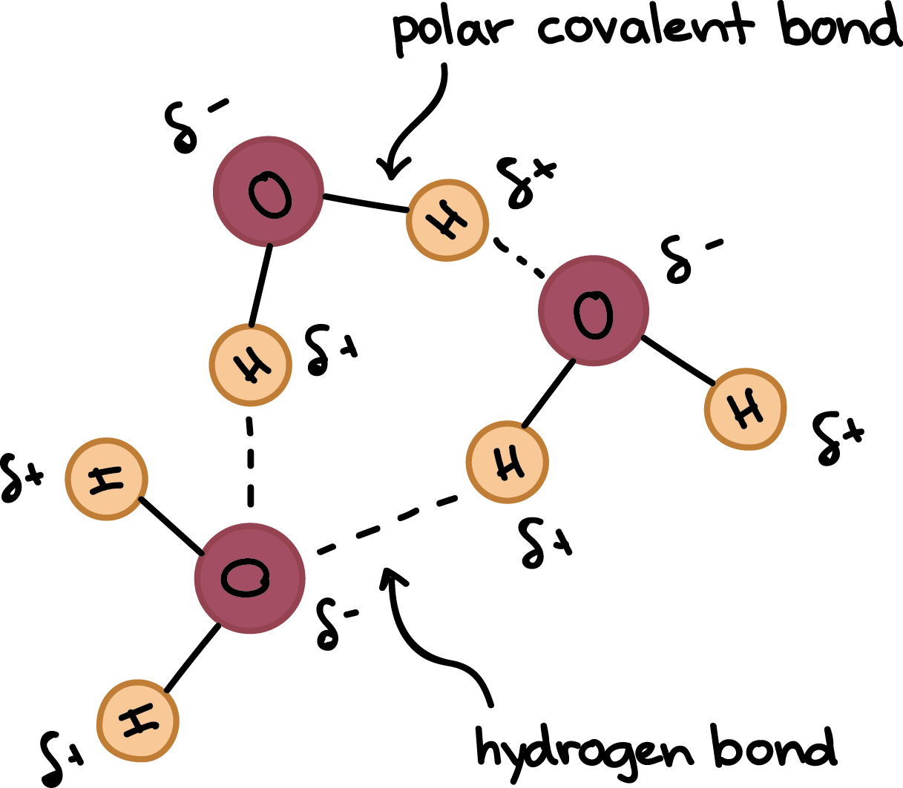
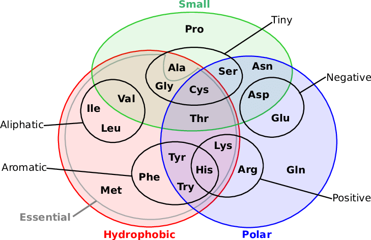

# Úvod

Biochemie pomáhá vysvětlovat rozmanitost přírody --- všechno tvorstvo staví na několika základních principech, 20 AK, třech druzích biopolymerů... A složitost v přírodě vzniká hierarchicky kombinací těchto faktorů. Zároveň mnoho jevů, které jsou na makroúrovni těžko vysvětlitelné, má svůj základ právě v biochemii (nebo související molekulární biologii).

Historie oboru
- L. Pasteur (19. stol.)
    - položil základy biochemie
    - fermentaci způsobují mikroorganismy
    - každý život pochází ze zárodku (žába nevznikne z bahna)
- E. Buchner (přelom 19. a 20. stol.)
    - fermentaci je schopen navodit buněčný extrakt
    - popření vitalismu: to, čeho je živý organismus schopen, _je možné_ analyzovat, není to dáno žádnou "životní silou" (_vis vitalis_)
    - fermentace je chemický proces, je nutné se ptát, co je to na chemické úrovni => počátek studia glykolytické dráhy
    - dostal Nobelovu cenu
- A. Harder, Hans von Euler-Chelpin
    - dialýza

###### Dialýza
Postup
1. do kádinky přidáme pufr
1. do kádinky přidáme střívko (semipermeabiní membrána)
1. přes póry projdou jen molekuly s určitou velikostí, cut-off point je několik tisíc $\pu{Da}$
    - malé molekuly (fruktóza) přes střívkou projdou
    - stejná koncentrace uvnitř i vně střívka

Zjistilo se, že velké molekuly, které přes membránu neprošly (tedy proteiny, pozn. profesora) jsou termolabilní. Došlo poprvé k separaci, frakcionaci, rozdělení kvasinek.

- dále pak výzkumy malých molekul (byly dobře dostupné), objevy vitamínů, základních metabolických drah
- J. Summer (1926)
    - krystalizace proteinu ureázy z bobů: velký milník, čistý materiál, navíc uměl katalyzovat štěpení močoviny => proteiny jako nositelé enzymové aktivity
- popisy glykolýzy, cyklu kyseliny citrónové, určení struktury DNA, krátce na to určení krystalové struktury myoglobinu(protein z vorvaně)
- poznání transformace energie (oxidativní fosforylace), fungování buňky a regulace jejího metabolismu
    - objevy všech velkých metabolických drah, počátek hledání jejich regulace
- později (90. léta -- součastnost) spíše už **systémové studium**
    - jak se soubory molekul v buňce chovají, studium celého souboru proteinů v buňkách (např. jak se liší soubory proteinů kvasinek žijících v různých podmínkách)
    - studium proteomu, metabolomu, etc., pomocí molekulárně biochemických a hmotnostně spektromektických přístupů, které umožňují vše pozorovat najednou
    - velký posun v popisu diverzity – víme o všem, co se organismu týká => můžeme skoro definitivně rozhodnout, čemu jsou organismy příbuzné, ptáme na celé soubory genů a proteinů

###### Co je potřeba k pochopení přednášky
- stavba atomu (elektronová konfigurace základních biogenních prvků, jak dochází k hybridizaci, co jsou orbitaly, prostorová struktura v hybridizacích)
- stavba jednoduchých molekul, zejména těch založených na uhlíku
    - znát jeho elektronovou konfiguraci a záležitosti hybridizace
    - pouze uhlík z celé tabulky je schopen tvořit tak akorát stabilní řetězení $\ce{C-C-C-C-...}$
        - $\ce{N-N-N-N-...}$ nestabilní
        - $\ce{O-Si-O-Si-...}$ až příliš stabilní
- periodické vlastnosti prvků: jak se v tabulce mění elektronegativita, velikost iontu, elektronová afinita, ionizační energie, velikost elektronového obalu
- co je to kovalentní vazba, vodíkové můstky a další interakce
- základní poznatky o chemických rovnováhách
- základy termodynamiky: první a druhý zákon, zachování energie, entropie
- kyseliny, zásady, pufry

# Biomolekuly

## Voda

- molekula vody je asymetrická
    - sp3 hybridizace: vazby směřují do vrcholů čtyřstěnu, ve dvou jsou vodíky a ve dvou nevazebné elektronové páry
- tvoří elektrický dipól: na části molekuly je parciální elektrický náboj
    - kyslík je mnohem elektronegativnější, elektronegativita rozhoduje o distribuci elektronů na vazbě; kyslík přitahuje vazebný pár větší silou, elektronová hustota bude tedy posunuta ke kyslíku

###### Důležité vlastnosti vody
- vysoká dielektrická konstanta => umí účinně separovat náboje
    - voda je v tom v rámci běžných rozpouštědel nejlepší => ionty, které by spolu normálně reagovaly, se udrží ve vodě zvlášť
- vysoká tepelná kapacita (pufr planety)
- vysoká měrná skupenská tepla => odpařováním účinně ochlazujeme systém
    - včely musí mávat křídly, když chtějí ochladit úl
- vyšší hustota vody ve srovnání s ledem => vodní nádrže zamrzají od povrchu
- vysoké povrchové napětí => týká se řady věcí
    - souvisí s tvorbou vodíkových můstků
- vysoká vodivost

Strukturu a vlastnosti vody silně ovlivňuje tvorba vodíkových můstků.

Vodíkové můstky
- $\ce{O-H}$ vazba má ze 33% iontový charakter
- tvoří se hlavně mezi dvěma molekulami vody
    - mohou se ale tvořit i s jinými (částečně) polárními látkami => polární látky se ve vodě dobře rozpouštějí
        - příklady skupin reagujících s vodou: hydroxylová, keto, karboxylová (dokonce se třemi molekulami)
- parciálně kladně nabitý $\ce{H}$ se naváže na volné el. páry, které také míří do vrcholů čtyřstěnu
    - nic jiného než vodík není tak malé, aby to dovedlo
- energie vazby cca $\pu{20 kJ/mol}$, asi o řád méně než typická kovalentní vazba (např. $\ce{C-C}$ má asi $\pu{350 kJ/mol}$).
    - vzniká jich ovšem mnoho, čili i přes nízkou energii mají velký vliv
- vzdálenost je jen 1.8 Å, což je méně než VdW vzdálenost (2.6 Å) bez této interakce
- každá molekula vody může vázat 4 partnery (dva jako donor, dva jako akceptor)
    - u ledu tomu tak opravdu je, jeho krystaly mají hexagonální tvar => má nižší hustotu než voda
    - v kapalině je tato vlastnost také skoro zachována: vysoké procentomoekul má 4 partnery, samotní konkrétní partneři se ale stále mění
        - fluktuující struktury obsahující desítky molekul: stále se tvoří a zanikají (co 10--11 sekund) => tvorba až sedmičlenných clusterů
        - vysoká mobilita molekul; donedávna jsme netušili, jak extenzivní ty interakce jsou (jde o celou jejich síť)
- ionty $\ce{OH-}$ a $\ce{H3O+}$ jsou vysoce mobilní (viz obrázek)

Srovnání vody s jinými rozpouštědly
- dielektrická konstanta zdaleka nejvyšší, i když ty molekuly jsou si jinak podobné
    - dielektrická konstanta udává míru odporu při vytváření elektrického pole v rámci nějaké látky vzhledem k vakuu
    - např. aceton je také asymetrický s dipólovým momentem => tento jev není způsoben dipolaritou
- má vysoká měrná skupenská tepla
    - např. při odpařování musíme dodat kromě normálního tepla ještě teplo navíc, abychom rozbili H-můstky
- dobře separuje ionty => ve vodě mohou být látky rozpuštěné v daleko vyšší koncentraci než v jiných rozpouštědlech

Tvorba micel
1. nepolární látka $L$ (nebo látka s nepolární částí) s vodou neinteraguje, molekuly vody jsou maximálně na VdW vzdálenost
1. kolem $L$ vzniká vrstvička vody s omezenou pohyblivostí (nemůže se k ní přiblížit)
1. tato vrstvička se váže přes H-můstky na další molekuly, ty zase na další, ... => mnoho molekul má najednou omezený počet stupňů volnosti
1. systém směřuje k maximální entropii => molekuly se $L$ shlukují k sobě, v součtu tím omezí (= uspořádají) nejmenší možný počet molekul vody

Body 1. a 2. probíhají ve všech polárních rozpouštědlech, avšak chování a unikátnost vody v tomto (opět) silně ovlivňují H-můstky. Tento princip stojí za tvorbou _biologických membrán_. Dal by se popsat následující rovnicí

$$\Delta G = \Delta H - T \Delta S,$$

kde $\Delta S$ značí změnu entropie, $\Delta H$ změnu entalpie. Pokud je $\Delta G > 0$, děj samovolně neprobíhá; při rozpouštění nepolárních látek ve vodě je $\Delta S < 0$ a tedy $\Delta G > 0$.

**Hydrofobní kolaps**
Hypotetický způsob vzniku terciální struktury proteinů; podle této hypotézy se proteiny zfoldují na základně hydrofobického efektu popsaného výše.

Hydrofobní interakce jsou vlastně **negativně vyvolané reakce**: jsou vyvolané absencí přitahování molekul rozpouštědla a rozpouštěné látky

### Acidobazické vlastnosti vody a kyselin

**Brønstedova kyselina**
Látka, která může poskytnout protony. Obdobně zásada je látka, která může protony přijmout. Po ztrátě protonu se Brønstedova kyselina stává svou **konjugovanou zásadou**.

****

**pufr**
Acidobazický pufr je směs slabé kyseliny a její konjugované zásady v roztoku, který má pH blízké $pK_a$ kyseliny.

$$\text{pH} = \log \frac{1}{[\ce{H+}]} = -\log [\ce{H+}] = pK_a - \log \frac{[\ce{HA}]}{\ce{A-}} \stackrel{\text{pro vodu}}{=} -\log [\ce{H3O+}],$$

přičemž předposlední rovnosti se říká Hendersonova-Hasselbalchova rovnice a popisuje vztah mezi složením pufru a jeho kyselostí. Pro vodu zároveň platí

$$K_{eq} = \frac{[\ce{H+}][\ce{OH-}]}{[\ce{H2O}]},$$

což vychází z obecnější rovnice

$$\ce{A + B <=> C + D}: K_{eq} = \frac{[\ce{C}][\ce{D}]}{[\ce{A}][\ce{B}]}.$$

Z měření vychází, že při 25 strong° C $[\ce{H2O}] = 55.5$, a tedy

$$K_{eq} = \frac{[\ce{H+}][\ce{OH-}]}{55.5} \implies 55.5 K_{eq} = [\ce{H+}][\ce{OH-}] = K_w,$$

kde $K_w$ značí _iontový součin_ vody a je za běžných podmínek roven $10^{-14}$.

Titrace
- používá se k zjištění množství kyseliny v roztoku
- do roztoku se přidává $\ce{NaOH}$ (nebo jiná silná zásada) o známé koncentraci, dokud se roztok neneutralizuje
- z koncentrace a objemu použité zásady se spočítá pH původního roztoku
    - vývoj pH roztoku v závislosti na množství přidané zásady se zaznamnává do tzv. _titrační křivky_, viz obrázek
        - křivku lze popsat Hendresson-Hasselbachovou rovnicí
        - v inflexním bodě platí $\text{pH} = pK_a$
        - v části, kde pH roste jen pomalu, se systém chová jako pufr

Pokud budeme vybírat pufr, musím volit tak, aby poměr soli a kyseliny byl roven jedné právě v oblasti, ve které budeme pracovat.

Polyprotní kyseliny
- acidobazické skupiny v jedné molekule se navzájem ovlivňují
- pokud se $pK_a$ jejich různých ionizačních stupňů liší více než o 2 až 3 jednotky pH, můžeme je při výpočtech pH úspěšně považovat za směs jednotlivých slabých kyselin
    - pro polyprotní kyseliny s hodnotami pK lišícími se méně než o tuto hodnotu jsou pozorované molekulové ionizační konstanty prostě vztaženy na mikroskopické ionizační konstanty disociujících skupin.

## Aminokyseliny

###### META
Předpokládají se základní znalosti struktury a vlastností AK, viz např. [Zápisy z bioinformatiky](https://eugleo.github.io/bioinformatika/doc/zaklady-bioinformatiky/notes.html#Struktura%20proteinů) nebo [zápisy z biopolymerů](https://eugleo.github.io/bioinformatika/doc/biopolymery/notes.html#Stavba%20proteinů). Je nutné znát i jendotlivé zkratky a umět nakreslit chemickou strukturu každé AK.

Důležité vlastnosti AK
- náboj, titrační křivka (viz dále)
- velikost (viz obrázek níže)
- charakter skupin na R, zda jsou či nejsou aromatické
    - pozn. prolin není aromatický, jeho cyklus ale významně ovlivňuje vlastnosti řetězce --- je v daném místě méně pružný
- leucin, izoleucin, valin, jsou vybaveny větveným alifatickým řetězcem
    - izobutylová skupina je chováním podobná alifatickému uhlovodíku => je hydrofobní
- $\ce{S-H}$ skupina v cysteinu bude oxidovaná či redukovaná v závislosti na prostředí, může tvořit $\ce{S-S}$ můstky ať už s jiným cysteinem, nebo s jinými látkami
- jeden konec lysinu se chová polárně, druhý ne
    - aminoskupina má kolem pH 7 kladný náboj
    - alifatický řetězec je hydrofobní
- optická aktivita
- všechny až na Gly jsou asymetrické
    - Gly má na flexibilitu řetězce opačnou vlastnost než Pro, zvyšuje ji

Všechny tyto vlastnosti se různě kombinují a přispívají tak k celkovým vlastnostem dané AK.

Optická aktivita AK
- AK tvoří stereoizomery, tzv. _entantiomery_, jsou svým zrcadlovým obrazem
- nejsou chemicky rozlišitelné, ale stáčejí rovninu polarizovaného světla na různé strany
    - pozor, ne vždy L doleva a D doprava
- běžně se vyskytují L-formy
- jejich názvosloví se odvozuje od Fisherovy projekce u cukrů
- Thr a Ile mají více center asymetrie (více chirálních uhlíků)
    - tvoří tzv. _diastereomery_ (narozdíl od enantiomerů nejsou svým zrcadlovým obrazem)
    - rozlišuje se pak například L-Thr a L-allo-Thr

Existuje i jiný systém pojmenovávání stereoizomerů L a D, a to tzv. _R/S systém_ (neboli Cahn-Ingold-Prelog).

R/S systém
- nakreslíme šipku od substituentu s nejvyšší prioritou k tomu s nejnižší prioritou
    - priorita substituentů je určována podle velikosti skupiny
    - vodík se umístí tak, aby byl za uhlíkem
- pokud jde šipka po směru hodinových ručiček, jedná se o R sloučeninu (rectus = pravý), jinak se jedná o S sloučeninu (sinister = levý)
- všechny AK v těle, s výjimkou cysteinu, jsou (S)- sloučeniny

Biologicky aktivní látky odvozené od AK
- histamin: význam v alergických reakcích (nastane dekarboxylace histidinu, vznikne histamin)
    - histidin získáváme z potravy, neumíme ho syntetizovat
- dopamin: prekurzor neurotransmiterů, regulačně aktivní látka
- kyselina gama-aminomáselná (vzniká dekarboxylací kyseliny glutamové)
- látky odvozeny jednoduchými reakcemi z AK (velmi důležité)
- některé AK jsou součástí metabolismu látek, které se běžně v proteinech nevyskytují
    - citrulin (~ Arg) a ornitin (~ Lys) jsou součástí cyklu močoviny

### Acidobazické vlastnosti AK

Příklad disociační křivky na Gly.

###### Poznámka
Tato křivka se týká volné AK – pro Gly vázaný v proteinu by takto nevypadala. Gly na C- nebo N- konci si však jednu skupinu zachová, což může hrát roli.

Jedná se o zjednodušený model toho, jak se chová látka s více disociovatelnými skupinami. Např. Lys se bude chovat mnohem složitěji, protože má tři acidobazické skupiny, které navíc nejsou dostatečný počet pH bodů od sebe, čili se ovlivňují.

Disociační křivka Gly
- při velice nízkém pH je glycin plně protonovaný
- tvar křivky vychází z Hendersonovy-Hasselbachovy rovnice
- obě disociace jsou si velmi vzdálené => neovlivňují se
- v bodě PI, tzv. _izoelektrický bod_, má AK nulový náboj => nepochybuje se v elektrickém poli
- v bodech $pK_1$ a $pK_2$ jsou už plně disociované skupiny $\ce{COOH}$ a $\ce{NH3}$, respektive
- $pK$ karboxylové skupiny je asi 2.2, $pK$ aminoskupiny je asi 9.4

###### META
Je prý důležité umět popsat chování oněch dvou disociujících se skupin (jednoduché, oba body daleko od sebe a neovlivňují se). Kromě toho je také nutné umět nakreslit disociační křivku.

Protein se skládá z řádově stovek AK, bude proto mít velice složitou disociační křivku. Některé AK budou acidobazicky zajímavé pouze, když budou na konci proteinu; jiné budou zajímavé i jindy, a to při různých hodnotách pH (viz obrázek).

Jakmile se např. Asp dostane do pH7, bude ze větší části již naprosto disociovaná a nebude se již chovat jako kyselina. Obecně, pokud zvyšujeme pH (= zvyšujeme zásaditost prostředí), budou se skupiny zbavovat protonů --- mění se ale to, jaký náboj tímto AK získají.

Důležitá je imidazolová skupina, která ma jako _jediná_ $pK_a$ blízké pH fyziologických systémů (konkrétně kolem 6), čili kolem tohoto neutrálního pH bude mít právě polovinu skupin deprotonovanou.

### Posttranslační modifikace AK

- úpravy proteinu po translaci
- methylace: důležité na histonech
- fosforylace: zásadní regulační funkce
    - serin, threonin, tyrosin
- acetyace: typicky Lys, vnik amidové vazby, která mění pH (při pH 7 pak už Lys nebude kladně nabitý)
    - když Lys acetylujeme v jádře, ovlivňujeme interakce proteinů s NK (ty jsou totiž záporně nabité)
- karboxylace

Například kurděje jsou avitaminóza poškozující schopnost hydroxylace prolinu, který je potřeba pro pojivové tkáně: první projev je krvácení z
dásní, způsobené problémy s extracelulární matrix.

## Kovalentní struktura proteinů

###### META
Primární, sekundární, terciární i kvarterní struktura proteinů je rozebrána i zde: [Zápisy z bioinformatiky](https://eugleo.github.io/bioinformatika/doc/zaklady-bioinformatiky/notes.html#Struktura%20proteinů) nebo [zápisy z biopolymerů](https://eugleo.github.io/bioinformatika/doc/biopolymery/notes.html#Stavba%20proteinů).

Proteiny jsou tvořeny AK spojenými peptidickou vazbou, nebo $\ce{S-S}$ vazbou mezi cysteiny (nejedná se o můstek, nýbrž o plnohodnotnou vazbu). Např. u inzulinu tím vzniká složitejší kovalentní struktura.

Pojmy
- cis, trans uspořádání
    - vazby po prolinu i v cis, asi z 10%
- torzní úhly $\psi$ a $\phi$
- rezonance ve vazbě, planarita
    - pokud chceme planaritě zabránit, musíme udělat z rezonanční vazby vazbu jednoduchou (ovlivněním náboje, ovlivnění $\ce{C-O}$)
- rotace kolem $\text{C}\alpha$
- denaturace (ztráta pevné 3D struktury)
- primární, sekundární, terciární, kvarterní struktura
- fibrilární a globulární proteiny
    - fibrilární jsou založené na neustálém opakování sekundárních struktur
    - první analýzy se dělaly na fibrilárních proteinech, je to jednodušší
- tři druhy helixů
- paralelní a antiparalelní uspořádání beta-řetězců

Všechny tyto pojmy lze nalézt popsány v odkazech výše.

Alfa helix
- $\ce{NH}$ a $\ce{CO}$ skupiny, které jsou součástí peptidové kostry, nejsou volné, ale jsou vůči sobě orientovány a interagují H-můstky
    - můstky budou téměř rovnoběžné s osou helixu
    - všechny vnitřní skupiny jsou angažovány => stabilizace struktury
- $\ce{NH}$ a $\ce{CO}$ skupiny na koncích nejsou součástí H-můstků a tak získáváme částečně nabitou strukturu, která má dipólový moment a podle toho se bude orientovat v el. poli
    - $\ce{NH}$ parciální kladný náboj, $\ce{CO}$ parciální záporný
- R skupiny AK směřují vně helixu
- jedna rotace helixu je dlouhá ~3.6 AK => pokud např. každou 4. AK vybavíme hydrofobicitou, budeme tvořit válec, který bude z jedné strany hydrofobní
    - a  když máme dva takové, tak bude docházet k hydrofobním interakcím, přilnou k sobě
- uprostřed struktury není místo, nevejde se tam molekula rozpoštědla
- stabilita záleží na řetězcích R (např. dva kladně nabité R vedle sebe by mohly snižovat stabilitu helixu)

AK tedy můžeme rozdělit dle dalšího kritéria, _kompatibility s helikální strukturou_ --- dá se změřit např. tak, že z helixu odebíráme jednu AK po druhé a vždy změříme jeho stabilitu. Díky toho lze poté z (části) primární struktury proteinu predikovat, zda zaujme tvar helixu, či nikoli.

Podobně se dají predikovat i jiné sekundární struktury, například levotočivý **polyprolinový II helix**, který se nachází v kolagenu a obecně všude tam, kde je mnoho Pro.

Beta list
- R míří nad a pod řetězec, můžeme opět tvořit strukturu s různými vlastnostmi na dvou stranách
- většinou max 6 AK na 6 AK, někdy ale i větší (např. beta-keratiny)

Supersekundární motivy
- beta-alfa-beta
- beta vlásenka
- alfa-alfa
- motiv řeckého klíče

Kombinace sekundárních a supersekundárních struktur tvoří **domény** --- útvary, které zaujmou stabilní konformaci i když jsou exprimovány odděleně od zbytku proteinu (= samostatné jednotky, co se foldu týče).

Domény
- alfa domény
    - svazky čtyř helixů v cytochromu b562 u E. coli, lidský růstový hormon
- beta domény
    - beta sendvič: imunoglobulinový motiv
        - dva přeložené beta-listy tvoří sendvič, stabilizace je dána tím,že vnitřní strana je hydrofobní
    - beta barel: retinol-vazebný proteinu
        - pokud budeme beta list stáčet jako papír, bude mít tendenci se zkrucovat, vytvoří soudek (beta barel)
        - může sloužit jako pór pro molekuly vody
    - kombinace řeckých klíčů: bakteriální amidáza
    - beta-listy, které dělají částečně plošné struktury
        - na okrajích listů se tvoří vazebná místa, aktivní centra
- alfa-beta domény
    - alfa-beta barel: součást trióza-fosfát-izomerázy
        - jeden z nejstabilnějších proteinových tvarů v přírodě

Takovýchto struktur jsou řádově stovky (tj. relativně málo).

### Síly udržující stabilitu proteinů

K pro rozrušení nativní konformace proteinu dlouhého ~100 AK je třeba dodat cca $\pu{40 kJ/mol}$.

###### Poznámka
Energie $\pu{40 kJ/mol}$ k rozrušení proteinu se může zdát jako málo --- energie kovalentní vazby je přeci cca $\pu{300 kJ/mol}$. Struktura proteinu je ale udržována mnoha silami, a to často i protichůdnými, navzájem se oslabujícími.

Protein musí být po splnění své funkce snadno degradovatelný, aby z jeho částí mohl být syntetizován protein nový. Pokud se tak neděje, a v těle se objeví nějaká superstabilní struktura, bývá to často příčinou onemocnění (Alzheimer, prionové choroby, atd.).

**Solvatace**
Obalení rozpuštěné látky molekulami rozpouštědla.

Iontové elektrostatické interakce
- jsou sice silné, ale přispívají ke stabilitě proteinů relativně málo
- tvorba iontového páru není provázena velkým poklesem volné energie vzhledem k solvataci
- velmi málo iontových párů se nachází uvnitř proteinu
- iontové páry na povrchu proteinu nejsou konzervovány v evoluci

H-můstky
- přispívají ke stabilizaci proteinů jako takových relativně málo (kolem $2$ až $8$ $\pu{kJ/mol}$), ale jsou významné pro sekundární struktury
- silnější jsou můstky v hydrofobním vnitřku proteinu
- většina vodíkových můstků se vytváří pouze mezi blízko se nacházejícími AK, jsou tedy pouze lokální
- 68 % můstků v proteinech se vytváří mezi atomy peptidové kostry, zbylé můstky jsou většinou mezi atomy vzdálenými max 5 AK
- neangažované můstky na koncích dodají struktuře parciální náboj, který může být dále využitý (např. k reakci s R skupinami či s okolím)
    - ve sbalené struktuře ale bývají angažované (skoro) všechny donory i akceptory

S-S disulfidické můstky
- tvoří se spojením skupin cysteinu, jsou nekovalentní
- nejsou rozhodující pro zaujetí nativní konformace, ale jsou důležité

Interakce dipól--dipól
- jsou sice slabé, ale přispívají ke stabilitě proteinu významně

Hydrofobní interakce
- přispívají rozhodujícím způsobem je stabilitě nativní konformace

Například sbalení hemoglobinu (globulární struktura) je zapříčiněno především hydrofobními interakcemi --- uvnitř sbaleného proteinu skončí AK s hydrofobními skupinami, na povrchu AK polární. Kdybychom tuto strukturu narušili nějakým činidlem (např. 8M močovina), a pak jím přestali působit, opět se sbalí do původního tvaru.

Chaotropní ionty
- soli, které mají destabilizující vliv na hydrataci proteinu a způsobují jeho denaturaci
- reagují s vodou méně, než molekuly vody samotné, a proto málo interferují s H-můstky

**Hofmeisterova lyotropní řada**
Řada aniontů a kationtů, seřazená podle toho, jak velká koncentrace daného iontu je potřeba k vysrážení vaječného bílku (tedy podle snižujícího se molárního povrchového napětí).

### Protein folding

**Levinthalův paradox**
Pokud bychom měli protein se 100 AK, pro každý torzní úhel uvažovali pouze 3 hodnoty a každou sekundu vyzkoušeli $10^{13}$ různých možností, potřebovali bychom k vyzkoušení všech prostorových konfigurací našho proteinu $10^{87}$ sekund (což je asi $\pu{2e69}$-krát více než je předpokládáné stáří vesmíru, pozn. redaktora).

Jak se zdá z Levinthalova paradoxu, dělá to příroda nějak jinak.

Protein folding teoreticky
- obr. a) popisuje představu z Levinthalova paradoxu (musíme se po ploše náhodně pohybovat, dokud nenalezneme bod N)
- obr. b) popisuje starou a překonanou představu, že se proteiny foldují po cestě mezistavů
- obr. d) popisuje současnou představu: proteiny hledají stav energetického minima (obrázek představuje hladinu volné energie)

Protein folding v praxi
- po odstranění denaturačního činidla proteiny v řádu ms zaujmou tvar, který pak připomíná nativní konformaci
    - nastává rychlý **hydrofobní kolaps**
- pak následuje několik vteřin, kdy se to sesypává, stabilizuje, dochází ke drobným úpravám
- až po desítkách vteřin či minutách dostáváme finální konformaci
- celková struktura je podmíněná částečnými, například sekundárními, strukturami (folding probíhá hierarchicky)
    - lokální úsek má svou autonomii, nehledě na okolí se (zpravidla, s vyjímkami) poskládá do své jedné sekundární struktury
    - potažmo tedy lokální složení AK rozhoduje o vzniku vyšších struktur

Někdy se může protein dostat do "pasti" (je nutné překonat stav s vyšší energií, než se bude možné dostat ke globálnímu minimu) --- tu mu mohou pomoci překonat **chaperony**.

Proteinové struktury
- alfa-keratin je příkladem superhelixu
    - helixy se skládají do dimerů, ty do protofilament a ty do mikrofibril
        - na obrátku je ve dvojitém helixu pouze 5.1, na rozdíl od 5.4 v alfa-helixu
        - každá 4. a 6. (tj. poslední na otáčku) AK je hydrofobní a dva helixy se tak zazipují do dimeru (hydrofovními AK k sobě)
    - pružnost keratinu klesá s rostoucím množstvím příčných disulfidových vazeb mezi protofibrilami
- fibroin je příkladem beta skládaného listu, je to složka např. hedvábí nebo pavučin
    - v β-strukturách se střídají vrstvy postranních řetězců glycinu s řetězci alaninu a serinu
- kolagen, složka např. chrupavek, je příkladem trojitého helixu
    - každým třetím zbytkem jeho polypeptidu je glycin, obsahuje ale také relativně mnoho prolinu a hydroxyprolinu
    - vytváří strukturu podobnou lanu, která je velice pevná v tahu
    - molekuly kolagenu agregují v posunutém (střídavém) uspořádání a vytvářejí fibrily, které jsou kovalentně příčně spojeny skupinami, odvozenými od postranních řetězců histidinu a lysinu
    - prolyl-hydroxyláza vyžaduje jako kofaktor vitamin C
- elastin, jak napovídá jeho název, má elastické vlastnosti a tvoří prostorovou síť vláken s nepravidelnou strukturou
    - jeho polypeptidová vlákna jsou spojena podobným způsobem jako u kolagenu.

### Struktura a funkce globinů

###### Poznámka
Přenos kyslíku je dobrý příklad, neboť je důležitý pro všechny větší organismy --- jeho rozpustnost v krvi je omezená, všechny organismy si proto musí nějak vypomáhat. To většinou dělají sloučeninami založenými na železu nebo mědi, například hemoglobinem (v savích tetramer), myoglobin (monomer).

- organismy žijí v různých parciálních tlacích kyslíku
    - kyslík je vázaný s různou afinitou
- křivky (vynesené pro různé organismy) mají sigmoidní tvar (viz obrázek): daný organismus má přenašeč, který v nízkých koncentracích nebude vázat nic, a až ve vyšších všechno
    - systém je nastaven tak, že funguje v určitém rozmezí kyslíku a právě v tom jej umí vázat či uvolnit
    - tato vlastnost je dána tím, že se jedná o oligomerní molekuly, které jsou schopny spolu kooperovat
    - v jiném případě by se mohlo stát, že organismus sice bude vázat kyslík, ale nebude schopen jej v tkáních uvolňovat

**Saturační křivka**
Na ose $x$ je tlak $\ce{O2}$ v torrech, na ose $y$ je saturace $\ce{O2}$ v procentech. $p50$ je parciální tlak, při kterém jsou přenašeče saturována z 50%.

**Hemerythrin**
Obdoba hemoglobinu, je také vícepodjednotkovým komplexem. Mají ho hlavatci, ramenonožci.

**Hemocyanin**
Má jej třeba ostrorep, také existuje jako oligomer.

**Myoglobin**
Monomer, není tedy schopen zajistit kooperativní sigmoidní chování. Saturační křivka má tvar hyperboly (viz obrázek).

#### Hemoglobin

- tetramer se dvěma alfa a dvěma beta podjednotkami, každá z nich má konjugovaný heterocyklický systém s $\ce{Fe2+}$ (HEM), hemoglobin tedy jejich prostřednictvím umí vázat 4 molekuly kyslíku
- po vazbě kyslíku se mění kvartérní struktura
    - např. u konce molekuly jedné podjednotky vůči druhému konci jiné
    - dále se mění i díra uprostřed (oxygenací se zmenší)
    - dochází k natočení dvou podjednotek vůči ostatním

Ve interakci podjenotek spočívá sigmoidní chování.

- podjednotky jsou nekovalentně spojené, ale přesto se významně ovlivňují
- máme-li situaci bez kyslíku, přicházejí molekuly postupně (1., 2., 3. 4.)
- vazba první molekuly _pozitivně ovlivní_ vazbu těch dalších => když už je tam jedna, ostatní se váží snáz

Změny při vazbě kyslíku
- v deoxygenovaném stavu (= **R**, relaxed) je molekula porfyrinu deformována, není rovinná => vázaný hem je umístěn v dutině (kavitě)
    - to má za následek řadu dalších změn, ke kterým v rámci podjednotky dochází
    - mám tzv. _domovou strukturu_, kyslík se setkává s nižší afinitou, než kdyby byl hem "vystrčený"
    - je to způsobeno vazbavi u železa, které jsou bez vázaného kyslíku delší a vytvoří onu proláklinu
- po vazbě kyslíku (= **T**, tense) se porfyrin narovná a přes blízký histidin (_proximální histidin_) přesune část pohybu i na helix F (viz obrázek), ten přesune pohyb i na zbývající podjednotky v molekule
    - struktura funguje jako mechanický převodník
    - hem se trochu vystrčí a má vyšší afinitu ke kyslíku

Kontakty mezi podjednotkami
- α1 + β1: 35 AK kontaktů
- α1 + β2: 19 AK
- α1 + α2: vlastně žádný
- analogicky pro α2

Podjetnotky α1 + β1 jsou tedy téměř nepohyblivě spojené, struktura se tedy dá vnímat jako dva dimery spíše čtyři monomery. Mezi těmito dvěma podjednotkami bude docházet k pohybům, při oxygenaci se vůči sobě otočí o 15 strong°. Také sezmění pozice tyrosinu z C helixu vůči histidinu, viz obrázek.

###### Poznámka
Změny stavů a posouvání molekul se dají srovnat s pohybem a vzájemným posunem dvou pěstí; vždy se posunou o jeden prst, jakýkoli mezistav bude náročné udržet.

Sigmoidní tvar je tedy způsoben tím, že první kyslík se váže relativně složitě (hem je zastrčený), po jeho navázání ale vnutní daná podjednotka rovnější tvar porfyrinu i ostatním podjednotkám a další kyslíky se už váží čím dál snadněji. Po nasycení hemoglobinu se saturační křivka opět vyrovná. Kdybychom měli oligomer s více než čtyřmi podjednotkami, mohl by se chovat ještě více kooperativně a mít ještě prudší křivku.

Pokud bychom oslabili nějaká spojení, získali bychom plošší křivku, oslabilo se kooperativní chování (jednotky by se tak neovlivňovaly). Pokud by se naopak posílily vazby, dlouho by se nic nevázalo, dokud by parciální tlak nevzrostl až do určité hodnoty --- první navázání kyslíku by mělo před sebou více práce; čím pevnější vazby mezi podjednotkami budou, tím se bude celek chovat kooperativněji, stylem všechno nebo nic.

**Homotropní efekt**
Druh alosterického efektu, při kterém látka ovlivňuji afinitu molekuly k sobě samé (jako např. zde s kyslíkem, kdy kyslík usnadňuje vázání kyslíku). Rozděluje se na pozitivní a negativní (kyslík je příkladem toho pozitivního). Opakem by byl heterotropní efekt.

Hemoglobin tedy umožňuje při určité koncentraci kyslík vázat a při jiné uvolňovat. Tuto jeho vlastnost je ale možné dále regulovat.

Regulace afinity
- slouží k přizpůsobení změnám v koncentraci kyslíku v prostředí
- dá se vypozorovat například ze saturačních křivek v 0 m.n.m. a 4500 m.n.m.
    - běžně je v kapilárách tlak as 25 torrů, v plicích (a v prostředí) 100: při 100 saturujeme, při 25 desaturujeme
    - ve 4500 m.n.m.: tlak je asi 50, pracovali bychom tedy s nižší kapacitou, musíme snížit afinitu ke kyslíku

O tyto změny se stará **kyselina bisfosfoglycerová**.

Kyselina bisfosfoglycerová
- odvoditelná z glykolýzy, v erytrocytech se jí dají tvořit různé koncentrace
- váže se na pozitivně nabité zbytky (má fosfátové skupiny a karboxyskupiny)
- váže se do dutiny v hemoglobinu, a váže se tam silnou vazbou, pokud je dutina dostatečně velká, aby se uplatnily všechny interakce s kyselinou –-- a to je pouze v deoxygenovaném stavu
- 2,3-BPG po vazbě posouvá rovnováhu oxy-deoxy k deoxy stavu
- skrze BPG tedy máme schopnost změnou koncentrace jedné látky ovlivnit afinitu pro kyslík
    - podobně i změna pH vede k posunu afinity pro kyslík (opět prostřednictvím BPG) –-- pohybujeme-li se ke kyselejšímu, snižujeme afinitu ke kyslíku

V souvislosti s oxy a deoxy hemoglobinem můžeme psát rovnici

$$\ce{xH+ + Hb(O2)_n <=> Hb(O2)_{n-1} H_x + O2},$$

kde se $x$ protonů váže na hemoglobin, který váže $n$ kyslíků. Zleva doprava probíhá deoxygenace, zároveň se s tím váže proton nebo dva podle parametru $x$ –-- vazba protonů je spřažena s vazbou kyslíku a obráceně, stejně jako pro protony to platí právě pro kyselinu BPG a i pro další látky.

Látky modifikující afinitu ke kyslíku
- BPG
    - ta funguje těmto způsobem např. u savců, u ptáků máme jinou, všeobecně to bývají nějaké nabité sloučeniny
- protony (potažmo pH)
    - v plicích bude vyšší pH, méně $\ce{CO2}$, méně uhličitanu, méně chloridových iontů => hemoglobin naloží hodně nákladu a putuje do kapilár
    - svalová námaha vede k okyselení a poklesu pH, což sníží afinitu pro kyslík => ve svalech se vyloží ještě více kyslíku
- $\ce{CO2}$
    - při dýchání vzniká v tkáních, snižuje tam afinitu hemoglobinu ke kyslíku a hemoglobin tak vyloží víc kyslíku, než kdyby tam nebyl
- $\ce{Cl-}$
    - do erytrocytů se dostává v souvislosti s rozpouštěním $\ce{CO2}$

Celý orchestr je zorganizován tak, aby se využila maximální transportní kapacita. Efekt ovlivnění desaturace Hb pomocí pH a $\ce{CO2}$ (a teploty) se jmenuje **Bohrův efekt**.

Bohrův efekt
- usnadňuje transport kyslíku
- deoxyHb je zásaditější než nasycený Hb
    - změna konformace proteinu mění bodové pK' o několik procent
- způsoben tím, že se k imidazolu přiblíží záporný náboj, čímž stabilizujeme výskyt kladného náboje na něm (jeho protonovanou formu)
    - posouváme pK' imidazolu
    - jen přiblížením-oddálením (aspartát-imidazol, v tomto případě) měníme acidobazické vlastnosti, schopnosti vázat a uvolňovat protony v daném pH
    - disociovatelné skupiny ovlivňují okolí
        - v pH 6.5, což je pK' imidazolu, by ho byla protonována cca polovina, ale je-li tam přiblížený aspatát, tak je protonována větší část

Bohrův efekt je vlastně v principu analogický k působení bisosfoglycerové kyseliny, chloridových iontů a podobně.

BPG nemění strmost křivky, pouze ji celou posouvá doprava (měníme p50). Strmost křivky se mění pouze změnou proteinu samotného, protože je závislá na míře kooperativního chování. Je sice jednoduché udělat křivku méně strmou (např. denaturací), ovšem opaku je relativně složité dosáhnout.

#### Modely alosterie

Popisujeme v nich chování hemoglobinu jako modelu, obdobně se budou chovat i další systémy, saturace se dá nafitovat. Dnes se již používají pokročilé postupy, zde jsou uvedené dva historické.

Symetrický model
- vychází z představy, že hemoglobin je symetrický oligomer identických protomerů
    - každý protomer může existovat ve stavech T (tensed) a R (relaxed), které mají nízkou a vysokou afinitu ke kyslíku, respektive
    - změna stavů protomerů se děje pouze konformační změnou, a to u všech protomerů najednou (aby zůstala zachována symetrie)
- vychází z konceptu zámku a klíče
    - vazba kyslíku je možná jen do aktivního centra s danými vlastnostmi
    - ligand je klíč, zámek je molekula (místo, kam se kyslík váže)
- vazbou se posouvá koncentrace směrem z T do R

Sekvenční model
- používá koncept indukovaného přizpůsobení, oligomer nezachovává symetrii
- vazba ligandu na jeden protmer vyvolá konformační změnu, která ovlivní sousední protomery
    - síla kooperativních interakcí je závislá na typu spojení podjednotek
    - na počátku jsou všechny ve stavu T
- afinita protomeru pro vazbu ligandu se mění s množstvím ligandu navázaného v oligomeru
- není to vše nebo nic
    - vazba ligandu vede k částečné změn, tzv. _iduced fit_
    - tento model proto více odpovídá realitě

# Enzymy a enzymová kinetika

**Enzymy**
Buněčné katalyzátory, proteiny s katalytickými schopnostmi. Katalyzátory jsou látky urychlující chemické reakce, aniž by do nich přímo vstupovaly – ovlivňují reakci, ale samy se chemicky nemění.

_Thomas R. Cech_, objevil to, čemu se dnes říká ribozymy, což jsou proteiny

**Katabolické dráhy**
Metabolické dráhy, které rozkládají složité látky na jednodušší za vzniku energie. Opakem jsou dráhy **anabolické**.

Historie
- Jönz Jacob Berzelius
    - jako první použil pojem enzym a vyslovil teorii, že reakce v živých organismech neprobíhají neasistovaně, že existují nějaké molekuly, které se na reakcích podílí a urychlují je
    - byl to chemik
- L. Pasteur
    - popsal, že v buňkách je něco navíc, co způsobuje např. kvašení (pozoroval kvasinky)
    - byl to vitalista; věřil tomu, že živé organismy mají v sobě něco nehmatatelného, vis vitalis, a dokazoval to tak, že když kvasinky zabil povařením, tak už glykolýzu neprováděly
- Eduard Büchner
    - vyvrátil kocept vis vitalis, zabil kvasinky jinak než povařením (rozdrtil je, vytvořil tím bezbuněčné lyzáty, a enzymy stále fungovaly)
- Emil Fischer
    - pracoval na cukrech; cukry mají spoustu izomerů, které se jen mírně liší strukturou, ale přesto jen některé z nich jsou katalyzovány enzymy
    - přišel s teorií zámku a klíče, která tvrdí, že enzym má vazebné místo, které tvarově odpovídá molekule substrátu a to tak dokonale, že většina enzymů může katalyzovat jen jeden substrát
 - Maud Leonora Mentenová
    - kanadská badatelka, pracovala v Německu, věnovala se enzymové kinetice
 - James B. Sumner
    - jako první izoloval čistý enzym, ureázu
        - ureáza je protein, který rozkládá močovinu
    - dokázal, že enzymy jsou proteiny

###### Poznámka
James B. Sumner měl jen jednu ruku, tu druhou mu v mládí ustřelili při honu. _insert joke about single-handedly solving big enzymology problems_

Enzymy urychlují reakce, jsou tedy nezbytné pro život --- například energie z cukru by bez nich nešla vydolovat, protože cukr se sám o sobě protě nerozloží a energii neuvolní.

Zásadní vlastnosti enzymů
- pro reakce stačí mírnější podmínky
    - oproti anorganickým katalyzátorům, které potřebují extrémní teploty, tlaky, pH
    - většina dalších organismů žije a má teplotní optimum v normálním tlaku, neutrálním pH a teplotě 30--40strong°
- vyšší specificita reakce
    - enzymy se málokdy pletou, pracují jen se svým substrátem a to ještě k tomu velice rychle
    - např. proteosyntéza umí syntetizovat dlouhý řetězec bez chyby, naproti tomu u anorganické syntézy je pouze 30--40 AK nasyntetizováno neomylně
- schopnost regulace
    - anorganické katalyzátory někam nasypeme a tam dělají to, čeho jsou schopny, zatímco enzymy mohou být regulovány
    - regulace rychlosti je velice důležitá pro spolupráci katabolických drah s anabolickými

## Stavba enzymů

**Koenzym**
Neproteinová část enzymu; ne všech enzymy ji však mají.

**Apoenzym**
Proteinová část enzymu.

$$\text{(holo)enzym} = \text{apoenzym} + [\text{koenzym}]$$

Koenzymů je celá řada.

Koenzymy: anorganické ionty
- nabité molekuly, které se podílí na struktuře holoenzymu
- měďnaté ionty
    - důležitým enzymem je **cytochrom oxidáza**, je členem elektrontransportního řetězce v mitochondrii, který se stará o přenos elektronů a tvorba ATP
    - cytochrom oxidáza je posledním enzymem této dráhy, kde se kyslík redukuje na vodu --- měďnaté ionty slouží jako akceptory elektronů, které jsou v rámci této dráhy přenášeny
- železité ionty
    - opět cytochrom oxidáza, fungují úplně stejně jako ty měďnaté
    - hemoglobin
- draslík
    - pyruvát kináza, důležitý enzym glykolýzy
 - hořečnaté ionty
    - většina enzymů, které pracují s ATP, obsahují hořečnaté ionty, protože jejich náboje interagují s fosfátovými skupinami ATP
- zinek
    - alkohol dehydrogenáza, důležitý enzym sloužící k syntéze nebo k odbourávání ethanolu
    - karbonát anhydráza, enzym důležitý pro přenos oxidu uhličitého v organismu při dýchání

Koenzymy: vitamíny
- větší molekuly, hlavně ze skupiny B
- několikero druhů
    - molekuly pevně vázané na povrch enzymu
    - molekuly, které se mohou oddisociovat (fungují jako jeden ze substrátů enzymu)

Druhý zmíněný druh poté může sloužit k různým účelům:
- mohou akceptovat nějakou funkční skupinu, pak se zase odpojit a přenést ji dále
- podílejí se na karboxylacích (přenáší karboxylovou skupinu z jedné části enzymu na jinou, slouží jako takové pohyblivé raménko)
- důležité jsou koenzymy flavin adenin dinukleotid (FAD), který přenáší elektrony, a nikotinamid adenin dinukleotid (NAAD), který přenáší hydridové ionty

## Názvosloví enzymů

Jméno enzymu vždy končí na "---áza". Kromě toho má každý enzym přidělený kód Evropskou enzymovou komisí: `ECXXXX`, kde X značí číslo a EC je zkratka pro Enzyme Commision.

První číslo je vždy v rozmezí 1--6, protože se jedná o rozdělení enzymu do jedné z následujících kategorií, podle toho, jaký druh reakce katalyzuje:
1. **oxido-reduktázy**: katalyzují reakce, při kterých se přenáší redukční ekvivalenty, směr přenosu je řízen redoxním potenciálem
    - dehydrogenázy, peroxidázy, reduktázy... (biologické oxidace často probíhají jako dehydrogenace)
1. **transferázy**: enzymy, které přenáší nějakou funkční skupinu z jedné molekuly na druhou
    - typické jsou fosfo-transferázy, které přenáší fosfátovou skupinu z ATP na nějakou jinou molekulu
        - např. v glykolýze, první glykolytický enzym přenáší fosfát na glukózu a tvoří se glukóza-6-fosfát
1. **hydrolázy**: za adice vody štěpí nějakou molekulu na dvě
1. **lyázy**: enzymy, které provádí syntézu molekuly ze dvou molekul
1. **izomerázy**: provádí přestavbu nějaké molekuly
1. **ligázy**: lepí molekuly dohromady, za současného odštěpení nějaké malé molekuly
    - např. spojování Okazakiho fragmentů

###### Příklad 1
Pokud máme například následující reakci:

$$\ce{ATP + glukosa -> ADP + glugosa-6-fosfat}$$

Jedná se o první reakci glykolýzy;  glukóza, která vstoupila do buňky, je fosforylována. Význam této reakce je dvojí:
1. energizace cukerné molekuly
1. strukturní změna, která zabrání tomu, aby se glukóza dostala zase ven z buňky (dostává se tam pomocí přenašeče, který je univerzální na obě strany)

Enzym by se dal nazvat ATP:glukózo fosfotransferáza (přenáší fosfát z ATP na glukózu). Pro zjednodušení by byl také možný název _glukokináza_ (kinázy jsou enzymy, které něco fosforylují). A jak bychom tento enzym očíslovali?

- `[2]`, patří mezi transferázy, tedy do druhé enzymové třídy
- `[7]`, přenáší fosfát
- `[1]`, ...na hydroxylovou skupinu glukózy
- `[2]`, cílová skupina se nachází na glukóze

Jedná se tedy o protein `E.C. 2.7.1.2`. Podobný enzym, hexokináza `E.C. 2.7.1.1`, je schopen fosforylovat i jiné hexózy (proto ta jednička na konci).

###### Příklad 2
Enzym `E.C. 1.1.1.1` je

- oxido-reduktáza
- působí na $\ce{CHOH}$ skupinu donoru
- využívá NAAD
- donorem $\ce{CHOH}$ skupiny je ethanol

Je to tedy akoholdehydrogenáza.

## Regulace enzymatické aktivity

Probíhá buďto změnou kvantity samotného enzymu (musí nastat aktivace proteosyntézy toho enzymu, změna exprese apod.), nebo regulací samotného enzymu --- to je mnohem rychlejší.

Regulace enzymu
- regulace změnou dostupnosti reaktantu
    - netýká se to přímo regulace aktivity enzymu, ale pokud nedodáme substrát, nemůže reakce běžet
    - např. glykolýza
- alosterická regulace
    - alosterické enzymy jsou takové, jejichž aktivita je regulována navázáním molekuly, jiné, než samotný substrát
- regulace kovalentními modifikacemi
    - např. pomocí protein-kinázy (adenylát-cykláza aktivuje protein-kinázu A a ta zase fosforyluje něco jiného)
    - opět dochází ke změnám konformace
- regulace prostřednictvím regulačních proteinů
- regulace proteolýzou, ovlivněním konformace, změnou lokalizace
- regulace zastoupením izoenzymů
    - izoenzymy jsou různé proteiny se stejnou funkcí, které katalyzují stejnou reakci, i když nejsou chemicky totožné

Alosterická regulace
- nejčastější typ enzymové regulace
- existují alosterické aktivátory i inhibitory
- např. enzym na počátku metabolické dráhy může být alostericky inhibován produktem té stejné dráhy, naopak aktivátorem může být ATP
    - časté řízení metabolické dráhy
    - produkt váže se na alosterické místo a tím snižuje aktivitu enzymu (negativní zpětná vazba)
    - je-li ho v buňce hodně (a málo produktu dráhy), tak se ATP váže na jiné alosterické místo a tvorbu produktu zrychluje
- funguje na základě změny konformace enzymu, který má poté k substrátu jinou afinitu

Regulace proteolýzou
- některé enzymy se syntetizují v buňce v ER jako tzv. preenzymy: tvoří je jedno vlákno, jeden různě poskládaný a spojený řetězec pomocí disulfidických můstků
- tyto enzymy jsou zpočátku v inaktivním stavu, aby neškodily a neodbourávaly proteiny, které nemají
- teprve při po procestování ER a GA jsou z nich některé úseky vyštípnuty a tím se z nich vytvoří funkční enzym

Příkladem regulace zastoupením izoenzymů je laktát-dehydrogenáza.

- laktát-dehydrogenáza katalyzuje přeměnu pyruvátu na kyselinu mléčnou
- běžně se to děje v lidských svalech za nedostatku kyslíku, za intenzivní námahy (=> zásobení tkáně kyslíkem není dostatečné na to, aby došlo k aerobnímu odbourávání)
- existují dva izoenzymy laktát-dehydrogenázy, M (muscle) a H (heart)
    - jsou ze čtyř podjednotek a existuje řada forem enzymu, které se liší zastoupením M a H podjednotek
    - srdce poměrně často využívá kyselinu mléčnou jako zdroj energie, na rozdíl od kosterních svalů
    - v srdci je stálé a dokonalé zásobení kyslíkem a tam ta laktát-dehydrogenáza funguje opačným směrem: přeměňuje laktát na pyruvát
