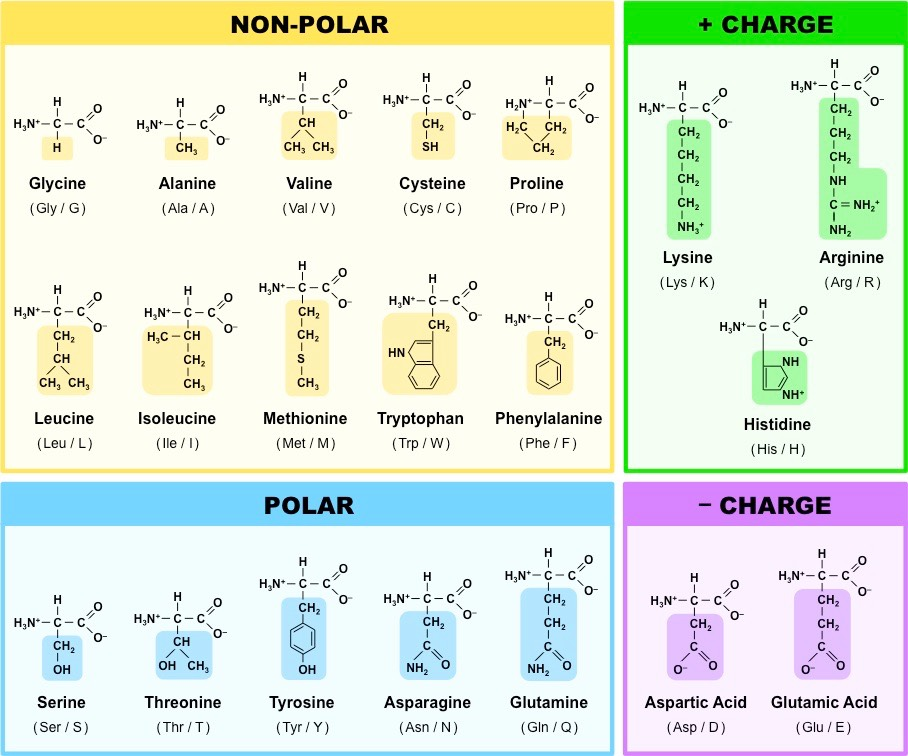

# Struktura nukleových kyselin
_<Přednáška č. 2>_

1. první
    - druhý
        - třetí
1. první
    - druhý
    - druhý
- první
    - druhý

Objev struktury DNA: Watson, Crick, Franklin (50. léta 20. století).

Centrální dogma molekulární biologie
1. transkripce DNA do RNA
1. translace RNA na proteiny
1. proteiny jsou _finální manifestací_ genetické informace

[Pr. 1, slide 10]
Stavební kameny
- puriny (adenosin, guanin), pyrymidiny (thyrosin, uracil, cytosin)
- ribosa, 2-deoxyribosa
- fosfát

[Pr. 1, slide 11]
**guanin**
viz slide, běžná purinová báze

**guanosin**
nukleosid guaninu, tj. guanin + cukr vázaná N-glykosidickou vazbou

**guanosin trifosfát**
nukleotid guaninu, tj. guanosin + fosfát navázaný fosfodiesterovou vazbou

[Pr. 1, slide 12]
Deoxynukleotid
- na druhém uhlíku má cukr $\ce{H}$ místo $\ce{OH}$
- vznik z nukleotidu redukovaného ribonukleotid reduktázou
- deoxyribóza je flexibilnější a chemicky stabilnější (výhoda pro DNA, které by se němělo měnit), protože $\ce{OH}$ skupina je reaktivní
- stabilizace vede k tvoření delších vláken

[Pr. 1, slide 13]
Párování
- díky něj vzniká sekundární struktura
- A + T páruje dvěma $\ce{H}$ můstky, C + G třemi $\ce{H}$ můstky
- AT bohaté úseky jsou tedy pružnější a GC úseky stabilnější

Vodíková vazba
- nekovalentní přitažlivé interakce
- interakce dvou elektronegativních atomů, které jsou "spojeny" vodíkem
- vodík je připojen kovalentně k donoru a elektrostaticky k akceptoru (na vodíku vzniká parciální kladný náboj)
- délka 3Å

[Pr. 1, slidy: 17, 18]
Struktura DNA
- dvoušroubovice (většinou pravotočivá)
- tři druhy: A, B, Z
    - A má skoro stejně velké žlábky, mezeru uprostřed
    - B je nejběžnější, má velký a malý žlábek
    - Z není příliš častá, je levotočivá (na rozdíl od zbytku)
- žlábky hrají důležitou roli při vázání enzymů (přes žlábek lze vidět, jaké nukleotidy v DNA jsou)

[Pr. 1, slide 19]
Struktura RNA
- loop, hairpin, pseudoknot
- většinou je tvořena pouze jedním vláknem


# Struktura proteinů
_<Přednáška č. 3>_

[Pr. 1, slide 21]
Primární až kvartnerní; struktura určuje funkci proteinu (proto nás zajímá), například s čím reaguje, jakými membránami projde a za jakých podmínek atp.

###### TODO
Doplnit linky na zápisky z biopolymerů (až zde budou k dispozici).

## Primární struktura

Primární struktura je určená pořadím aminokyselin (AK). AK je 20+2.

[Pr. 1, slidy: 22, 51]
Struktura AK
- $\ce{C_\alpha}$ je chirální, jsou na něm navázány čtyři různé skupiny
- $\ce{NH2}$ se váže na $\ce{COOH}$ za vzniku peptidické vazby, uvolňuje se $\ce{H2O}$
    - peptidická vazba je planární, vzniká pomyslný čtyřúhelník s rohy v $\ce{C_\alpha}$
    - ze 40% má charakter dvojné vazby
        - je kratší než jednoduchá
        - je planární
        - má cis a trans kofiguraci
    - rotace je tedy možná pouze v $\ce{C_\alpha}$, existují dva torzní úhly ($\phi, \psi$)
        - teoreticky možné a prakticky spočítané hodnoty torzních úhlů se zaznamenávají do _Ramachandranova diagramu_

[Pr. 1, slide 23]
Stereoizomery
- chirální uhlík stáčí rovinu polarizovaného světla
- rozližujeme L a D enantiomery
    - v laboratoři vznikají přibližně v poměru 1:1
    - v živých organismech je většina AK druhu L
    - buněčná stěna baterií bývá často D, aby nebyla rozpoznána jinými (imunitními/nepřátelskými) buňkami

[Pr. 1, slide 26]
Rotamery
- rotamery jsou AK se stejným složením, u nichž se liší konformace jejich postranního řetězce
- vytváří se knihovny rotamerů (dle naměřených dat), odráží variabilitu jednotlivých AK

[Pr. 1, slide 33]
Stacking interakce
- interakce mezi aromatickými kruhy ($\pi$-$\pi$ interakce)
- sandwich, T-shaped, parallel-displaced
- jsou významné pro stabilitu DNA i proteinů

### Seznam aminokyselin

AK se dají rozdělit do několika skupin; nejdůlěžitější rozdělení je asi podle hydrofobicity, protože podle toho se poté jednotlivé AK vyskytují uvnitř nebo naopak na povrchu proteinů. Další významnou vlastností, která navíc s hydrofobicitou souvisí, je elektrický náboj.

###### META
Na zkoušku bude požadována znalost všech AK včetně jejich vzorce, vlastností, a zkratky.

Polární AK jsou hydrofilní, nepolární jsou hydrofobní.



###### AK s alifatickým postranním řetězcem
**glycin**
často v kolagenu, často ve smyčkách, nejmenší a tedy dobře konzervovaný

**alanin**
také velice častý, existuje i D forma (buněčná stěna, antibiotika), také velice malý a tedy dobře konzervovaný

**valin**
často v helixech a listech

**isoleucin**
má dva chirální atomy a tedy čtyři formy, je častý v helixech i listech

**leucin**
součástí leucinového zipu při interakci proteinů s DNA

###### AK s kyselou (karboxylovou/amidovou) skupinou
**asparagová kyselina**
bývá v aktivních místech enzymů

**asparagin**
první izolovaná AK (z chřestu, viz jméno), tvoří vodíkové můstky, účastní se cappingu (neutralizuje parciální náboj na N' koncích alfa helixů)

**glutamová kyselina**
může fungovat jako neurotransmiter, je podobná ASP

**glutamin**
je zdrojem energie pro mozek

###### AK se zásaditou (aminovou) skupinou
**arginin**
může být methylován, bývá na povrchu, kvůli kladného náboje tvoří vodíkové můstky se záporně nabitými strukturami (DNA)

**lysin**
může být postrtranslačně modifikován

###### AK s aromatickým jádrem nebo hydroxylovou skupinou
**histidin**
tvoří imidazol (další nukleotid, někdy součástí wobblingu), má neutrální pKa --- malá změna pH vede he změně náboje, takže je často používán jako vypínač závislý na pH, účastní se koordinace kovů

**fenyalanin**
je prekurzorem neurotransmiterů

**serin**
katalyzuje reakce (je to alkohol), především O-glykosylace a fosforylace, nervové plyny jej blokují v acetylcholinesteráze

**threonin**
má dva chirální atomy, taktéž účasten O-glykosylace a fosforylace (je to alkohol)

**tyrosin**
podobný PHE, prekurzor neurotransmiterů, účasten forsforylací (je to alkohol)

**tryptofan**
je největší a tedy dobře konzervovaný, účasten hydrofóbních interakcí (s cukry), prekurzor serotoninu a niacinu

###### AK se sírou v postranním řetězci
**methionin**
má jen jeden kodon, může být na povrchu oxidován

**cystein**
často v hydrofobním jádře protein§ (přestože je polární), tvoří disulfidické můstky, iteraguje s ionty kovů (často v aktivních místech enzymů)

###### AK obsahující sekundární amin
**prolin**
nemá vodík na dusíku => netvoří vodíkové můstky, nebývá v alfa-helixech ani listech

může být i v konformaci cis (většinou uhlovodíková zbytek AK bývá trans) => může fungovat jako vypínač, protože mění konformaci

jeho cyklus je extrémě rigidní, tvoří zlomy v proteinech


Pro popis aminokyselin se někdy využívá i _B_ (Asn/Asp) a _Z_ (Gln/Glu). Kromě výše zmíněných dvaceti AK se vydělují ještě následující dvě.

[Pr. 1, slide 49]
**pyrolysin**
kódovaný UAG stop kodonem

**selenocystein**
kódovaný UGA stop kodonem, využíván pro určení struktury proteinů, je v řadě enzymů

## Další proteinové struktury

Kromě primární struktury proteinu rozlišujeme ještě sekundární, teriární a kvarterní. Sekundární struktura proteinu je určena lokálními konformacemi jeho částí.

[Pr. 1, slide 55]
Důvody vzniku
- snaha o tvorbu stabilního hydrofobního jádra
    - důvod: entropie klesne, ale tento pokles je vyvážen růstem entalpie, která je negativně ovlivněná výskytem náboje v jádře proteinu
    - způsob: neutralizace polárních amino a karboxylových skupin na hlavním řětězci vznikem vodíkových můstků

Vodíková vazba a stabilizace
- síla vodíkové vazby závisí n atypu atomu a geometrii vazby
    - cca 1--60 kJ/mol, v proteinech většinou okolo 10 kJ/mol
    - se zvětšujícím se úhlem vazby klesá její síla: odklon o 20° snižuje energii o 10%

[Pr. 1, slide 57]
Folding
1. protein je nesbalený, všichni donoři i akceptoři reagují s vodou
1. protein se sbalí, počet vodíkových můstků klesne
    - entalpicky nevýhodné, ale entropicky výhodné
1. protein je nyní neustále na hranici rozbalení, aby bylo možné jej případně rozložit (a nezůstal v buňce napořád)

[Pr. 1, slidy: 59, 60]
Helix
- teoreticky popsaný Linusem Paulingem
- model potvrzen strukturou myoglobinu
- může být levotočivý (Ala, Leu, Val) i pravotočivý (Gly, Pro)
- několikero druhů
    - $\alpha$ helix, nad sebou jsou AK $i$ a $i + 4$
    - $3_{10}$ helix, nad sebou jsou AK $i$ a $i + 3$
    - $\pi$ helix, nad sebou jsou AK $i$ a $i + 5$
- zobrazování pomocí helix-wheel diagramu
    - barvení podle typu AK
    - všechny hydrofilní budou na jedné straně, hydrofobní na druhé (vznik snopců)

[Pr. 1, slidy: 63, 64, 65]
Beta list
- teoreticky jej popsal William Astbury a Linus Pauling
- složen z $\beta$ hřebenů (strand)
- uprostřed bývají Tyr, Thr, Trp, Val a Ile, na krajích spíše Pro
- vzdálenost mezi $\ce{C_\alpha}$ asi 3,5Å
- dvě formy
    - paralelní, jsou méně stabilní (vázané atomy napříč hřebeny nejsou přesně naproti sobě)
    - antiparalelní, jsou stabilnější, planární
- vznik $\beta$ barelu
    - poslední hřeben se váže na první ve stejném listu, vzniká kanál
    - často bývá stočený
    - často v membránách

[Pr. 1, slide 66]
Smyčky
- nepravidelné struktury
- často hodně Gly (protože je malý)
- spojují helixy a listy
- bývají krátké, většinou kolem 4,5 AK
- existuje více druhů (vlásenky, loopy, atd.)

[Pr. 1, slide 67]
Terciární struktura proteinu
- někdy také _konformace_, _topologie_ nebo _folding_
- celková 3D struktura proteinu
- dva typy
    - globulární, nepříliš uspořádaná
    - fibrilární, uspořádaná do vláken
- rozhoduje o solubilitě
- vytváří vazebná a antivazebná místa

[Pr. 1, slide 68]
Kvarterní struktura proteinu popsiuje uspořádání několika terciárních struktur (například v dimerech).

# Sequence alignment
_<Přednáška č. 4>_

Základní bioinformatická metoda užíváná k porovnání dvou sekvencí (DNA, proteinů). Obecně se jedná o nějaké seřazení sekvencí pod sebe. Dobrý alignment dvou sekvencí má však důležitou vlastnost: pod sebou jsou jednotky (nukleotidy, AK), které se vyvinuly ze stejného předka. Někdy byly určité jednotky v průběhu evoluce přidány nebo odebrány, což se v rámci alignmentu značí pomlčkami (viz níže).

Než se dostaneme k samotnému procesu alignmentu (tj. zjišťování, které jednotky a potažmo celé sekvence jsou evolučně spřízněné), ukážeme několik jeho praktických využití.

[Pr. 2, slidy: 26, 27]
**A je homolog B**
A a B mají společného předka, jejich původní funkce však nemusí být zachována. Homologii můžeme (opatrně) odvodit z vyokého procenta sekvenční identita A a B (viz dále). Musíme však dát pozor na paralogii.

Na základě homologie můžeme (opatrně) odvodit funkční a strukturní podobnost. Například můžeme hledat homology problémových lidských proteinů v modelových organismech, na které budeme cílit vývíjená léčiva.

**A je ortolog B**
Poddruh homologie; A a B vznikly speciací ze společného předka, jejich funkce by tedy měla být zachována.

**A je paralog B**
Poddruh homologie; A a B vznikly genovou duplikací ze společného
předka --- jejich funkce tedy nemusí být zachována
(protože jedna kopie genu ji zastará, zatímco A a B se mohli vyvinout v něco jiného).

**A je ohnolog B**
Podobný vztah jako paralog, vzniká ale celogenomovou duplikací.

**A je xenolog B**
A a B vznikly horizontálním transferem (například mezidruhovým).

**A je analog B**
A a B mají podobnou funkci, avšak je to jen náhoda --- společného předka nemají.

**globální alignment**
Srovnávání celé sekvence.

**lokální alignment**
Srovnávání pouze částí sekvence, vybírá kousky, které k sobě sedí nejlépe.

Důvod srovnávání sekvencí
- nalezení evoluční podobnosti (analogie, homologie)
- získání informací o struktuře, funkci, a evolučním vývoji proteinu
    - pomocí srovnání s proteiny, které už mají známou strukturu, funkci a původ
- nalezení aktivních (konzervovaných) míst
- nalezení mutantů
- možno pomocí něj dát smysl velkému množství biologických dat

Snažíme se ze znalosti struktury a funkce určitého proteinu odvodit funkci jiného, podobného (homologního) proteinu. To, jestli je vůbec možné z kvantitativní veličiny sekvenční identity (SI) vyvodit kvalitativní rozhodnutí o homologii, zkoumali **Chotia, Lest** (1986) a **Rost** (1999). Zjistilo se, že **změny ve struktuře jsou korelovány se změnami v sekvenci**, neboli z %SI si můžeme troufnout odvodit homologii a podobné vztahy, a z nich poté hádat věci jako je funkce nebo evoluční původ.

[Pr. 2, slidy: 31, 32, 39]
Sekvenční identita (SI)
- hranice relevatní pro potenciální homologii (určené Rostem)
    - $\text{SI} > 35%$ naznačuje možnou homologii
    - $20% < \text{SI} < 35%$ je takzvaná _twilight zone_, homologie je možná
    - $\text{SI} < 20%$, o homologi nemůžeme s jistotou říct vůbec nic
- průměrná SI náhodných sekvencí je asi 5,9%
- průměrná SI vzdálených homologů je asi 8,5%
- existuje více metod, jak SI vypočítat (a SI se u každé metody liší)
    - počet náhodných pozic / délka alignmentu
    - počet shodných pozic / délka kratší sekvence
    - počet shodných pozic / průměrná délka sekvencí

Jakým způsbem se rozhodnout, když jsme v twilight zóně? Na to existuje několik triků.

Jak z twilight zóny?
- pokud jsou vyměněny kladně nabité AK za jiné kladně nabité AK, alanin za valin atp. (zkrátka tzv. _konzervativní záměny_), sekvence jsou nejspíše homologní
- pokud se snažíme zjistit něco více o homologii A a B, stačí najít C, které je homologické s A a zároveň je i homologické s B; z toho totiž plyne, že A i B jsou také homologické

Výše bylo zmíněno, že srovnávání sekvencí funguje jak pro proteiny, tak pro DNA. Přesto se ale častěji, minimálně k určování homologie, používají proteiny, a to ze dvou důvodů:
1. protože AK je dvacet, je menší šance, že budou na jednom místě dvě shodné AK náhodou (oproti čtyřem nukleotidům v DNA, kde je náhodná shoda pravděpodobnější)
1. různé kodony kódují stejné AK, čili určité změny v DNA kódu se vůbec nemusí projevit v jeho exprimaci; jinými slovy, i relativně hodně odlišné sekvence mohou kódovat stejné, nebo velice podobné proteiny

Srovnávání sekvencí DNA ale má svá uplatnění. Používá se v místech, která se v proteomu vůbec neobjeví; při zkoumání regulačních oblastní genů a definování genů a při celogenomovém srovnávání.

Metody jsou v zásadě dvě, **dotploty**, které slouží spíše k hrubému odhadu situace, a **pairwise sequence alignment**, což je aby se řeklo _the real deal_.

## Dotplot

[Pr. 2, slidy: 45, 50, 55, 57]
Nejpřímější a nejjednodušší metoda: do tabulky se zaznamenávají místa, na kterých jsou dvě sekvence shodné (viz slidy). Někdy se místo jednotlivých stavebních jednotek sekvencí používají celé domény na sekvencích.

Na dotplotu byly sledovány i první dvě známé struktury, hemoglobin a myoglobin.

Silné stránky
- jednoduchý a rychlý
- odhaluje repetice, inverze, přeházené domény, oblastni s nízkou komplexitou
- poskytuje návod, kde má vůbec smysl dělat podrobnější sequence alignment
- vhodný pro odhad podobnosti sekvencí

[Pr. 2, slidy: 60, 61, 62, 63, 64]
[Pr. 2, slidy: 67, 68, 69]
Slabé stránky
- neumí rekonstruovat evoluci (odhalovat homologii atp.)
- generuje příliš mnoho signálu, velký šum
    - toto se často "řeší" tak, že se koukáme hned na několik nukleotidů za sebou, a křížek v daném políčku uděláme pouze tehdy, když v tomto našem _klouzavém okně_ je více než $k$ shod
- ukazuje i náhodné podobnosti

V praxi se často používá **self-dotplot**, tedy dotplot, kde je sekvence srovnávána sama se sebou. Ten opět vyhledává symetrické úseky, repetice, odhaluje místa s nízkou komplexitou a palidromy.

## Pairwise sequence alignment

_Může samozřejmě probíhat i na DNA, pro jednoduchost jej ale popíšeme pouze na proteinech. Pro DNA funguje analogicky._

Předpokládáme, že sekvence A a B mají společného předka. Poté, když je srovnáme (naalignujeme) "pod sebe", můžeme na každém jednotlivém místě pozorovat následující:
- **shoda**: AK v A i v B jsou na daném místě stejné
- **neshoda**: AK v A je na daném místě odlišná od AK v B
- **mezera** (gap): v jedné ze sekvencí došlo při vývoji od společného předka k inzerci nebo deleci

###### META
Gap (mezera v sekvenci při procesu alignmentu) se Švédsky řekne _lucka_.

Proces alignmentu je vlastně proces umisťování mezer a pozorování toho, jak si poté dvě sekvence navzájem odpovídají. Příklad alignmentu:
```text
VLSEGKTEAPV[...]
|||..    ||
VLSPA----PV[...]
```

Toto je další příklad alignmentu těchto sekvencí; tentokrát dosti nepovedeného:
```text
---VLSEGKTEA--PV[...]
   .  ..
V-LS--PA----PV--[...]
```

Substituce jedné AK za jinou je pravděpodobnější než inzerce/delece. V rámci substitucí je pravděpodobnější substituce podobných jednotek (Val <-> Leu, G <-> A) než těch nepodobných (Trp <-> Gly, G <-> C).

[Pr. 2, slidy: 87, 97]
Měřítko kvality alignmentu
- alignmentů je nekonečně mnoho, musíme vybrat ty nejpravděpodobnější, pokud z nich chceme něco vyvozovat (společnou strukturu, funkci atp.)
- většinou alignment skórujeme po jednotkách
    - shoda/neshoda jsou za určitý počet bodů (klidně záporných)
    - mezery jsou za záporné body (tzv. _gap penalty_, GP), většinou za začátek mezery je více záporných bodů než za její rozšíření
- skóre pro všechny kombinace shod/neshod bývá uloženo v tabulkách
- tyto tabulky, společně s určením hodnot gap penalty, velice ovlivňují výsledný (vybraný) alignment
    - z toho plyne snaha o optimalizaci tabulek i GP tak, aby co nejvíce odpovídali biologickým empirickým datům (netvořily nesmyslné alignmenty)
    - optimální tabulky/GP se liší protein od proteinu
    - vznikají experimentální variabilní GP založeny na strukturních datech proteinů (v pravidelných sekundárních strukturách je nizší pravděpodobnost výskytu mezery)

K hledání optimálního (nebo suboptimálního) alignmentu používá algoritmus, který projde mnoho různých možncých alignmentů a vybere z nich ten s nejvyšším skóre dle přidělené skórovací tabulky. Pozor, ani nejlepší alignment nemusí odpovídat reálu.

### Skórovací tabulky

Neboli **scoring matrices**.

Určení hodnot skóre
- skóre původně určeno z fyzikálněchemických, tedy teoretických, vlastností AK
- nyní máme mnoho empirickcýh dat, skóre tvoříme na základě nich
    - skóre záměny jedné AK za jinou je tedy postaveno na základě pravděpodobnosti toho, že tato záměna v reálu proběhne, kterou zjistíme z pozorovaných sekvencí

Tabulky jsou tedy symetrické --- nejsme schopni z empirických dat zjistit, jakým směrem proběhla substituce (pokud máme na daném místě v jedné sekvenci Ile a v druhé Val, nevíme, které AK z těch dvou tam byla původně, a která tam bylo substituována dodatečně).


[Pr. 3, slidy: 26, 23]
Tabulka PAM
- název z _percent accepted mutations_
- autorkou je Margarette Dayhoff (70. léta)
- založená na pravděpodobnostních mírách mutace kalkulovaných z globálních alignmentů blízce podobných sekvencí
$$\text{hodnota(X, Y)} = \log \frac{\text{počet pozorovaných záměn X za Y}}{\text{počet očekávaných záměn}}$$
- pozitivní je tedy skóre jen u zbytků, u kterých záměna proběhla častěji než by bylo očekáváno při náhodném zaměňování
- PAM tabulek je mnoho
    - PAM $x$ -> $x$ AK ze 100 bylo nahrazeno
    - nízké $x$ se tedy hodí pro evolučně blízké sekvence, vysoké $x$ pro ty vzdálené
    - nejoblíbenější PAM 250
        - každá AK byla v průměru zaměněna 2,5 krát
        - některé AK jsou ale mutovány vícekrát, proto jsou i takové sekvence asi z 20% složené ještě z původních AK
- nyní už existují novější tabulky, které jsou generované stejným způsobem, ale z většího množství dat: PET

[Pr. 3, slide 29]
Tabulka BLOSUM
- název z _BLOck SUbstitution Matrix_
- autoři Henihoff a Henihoff (90. léta)
- založena na experimentálních datech, není extrapolována jako některé PAM tabulky
- opět více druhů
    - BLOSUM $x$: založena na lokálních alignmentech bloků AK s $\text{SI}=x$ (u homologních proteinů), bez mezer
    - nejoblíbenější BLOSUM 80 (tedy popsiující proteiny se sekvenční identitou 80%)

Další tabulky
- STR, SDM
    - informace ze struktur
    - záměny ve smyčkách jsou pravděpodobnější než v helixech a listech
- PHAT, SLIM [Pr. 3, slide 33]
    - vhodné pro specifický výběr proteinů (například hydrofobní)
    - SLIM je asymetrická

[Pr. 3, slide 31]

Výběr tabulky se snažíme přizpůsobit sekvencím, které srovnáváme, abychom získali co nejlepší výsledky; především rozlišujeme evolučně blízké sekvence od těch vzdálených. Krátké sekvence skórujeme podle tabulek pro krátký evoluční čas.

### Algoritmy

Needleman-Wunsch
- hledá globální alignment
- pracuje na principu dynamického programování
- jeden z nejstarších (1970)
- zaručuje nalezení optimálního alignmentu (vzhledem k dané GP a skórovací tabulce)

[Pr. 3, slidy: 44, 45, 49, 51, 54]
Průběh NW
1. první a druhou sekvenci napíšeme na první sloupec a řádek tabulky (respektive)
1. pro každou pozici v alignmentu s pomocí scoring matrix počítáme skóre, které bychom dostali:
    - při shodě
    - při neshodě
    - při inzerci nebo deleci
1. z těchto možností vždy vybereme tu nejvyšší na napíšeme šipku příslušného směru
1. postupujeme od konce alignmentu (políčka vpravo dole), a uvažujeme, odkud jsme se na současné políčko dostali

Smith-Waterman
- hledá lokální alignment
- k hledání podobností mezi proteiny, motivů a domén je vhodnější než NW
- funguje podobně jako NW, s několika rozdíly
    - všechna dílčí negativní skóre jsou nahrazena 0
    - při backtrackingu nezačínáme vpravo dole, ale na políčku s nejvyšším skóre
    - končíme, jakmile narazíme na 0
- vzniká alignment pouze dobře konzervovaných úseků

Nejznámějším programem na hledání alignmentu je Clustal $\Omega$ (kdysi Clustal W).


## Multiple sequence alignment
_<Přednáška č. 5>_

Když srovnáváme více sekvencí najednou, je to sice složitější, ale má to několik velkých výhod:
1. výsledný alignment je přesnější
1. data z alignmentu se dají použít pro fylogenetické studie
1. máme větší šanci nalézt strukturně nebo funkčně významné AK
    - takové AK budou v sekvencích konzervované
1. alignment slouží jako základ pro studie funkce proteinu

[Pr. 4, slide 16]
Jak dělat MSA
- _dynamické programování_ už není tak dobrá volba
    - počet rozměrů matice roste lineárně s počtem sekvencí, čili počet nutných srovnání roste exponenciálně
- používají se _hierarchické progresivní metody_
    - všechny dvojice sekvencí jsou alignovány v rámci PSA
    - alignmenty jsou hierarchicky seřazeny dle míry podobnosti do fylogenetického stromu (viz níže)
    - finální MSA je budován v krocích --- nejprve jsou naalignovány dvojice nejpříbuznějších sekvencí, poté jsou alignovány dvojice nejpříbuznějších sekvencí z těchto alignmentů atd.
    - Clustal $\Omega$, T-Coffee
- nevýhody hiearchických metod
    - chyby vytvořené v úvodních alignmentech se dostanou až do finálního výsledku
        - zavedení iterativních metod (optimalizace ohodnocení pomocí _objective function_): Muscle, ProbCons
        - zavedení učících metod: hidden Markov models, genetické algoritmy, simulated annealing FSA


Programy pro MSA
- ProbCons
    - využívá informace z MSA při PSA
    - mívá nejlepší výsledky
- FSA (fast statistical alignment)
    - používá machine learning metodu _simulated annealing_ na základě PSA
    - GP i skórovací tabulky jsou odhadovány pro každý set sekvencí individuálně
    - funguje i pro velice dlouhé sekvence
- MAFFT
    - metoda pro veliké soubory dat (například fylogenetické analýzy)
    - homologické oblasti identifikovány pomocí rychlých Fourierových transformací (objem a polarita AK)
    - výsledný alignment je kombinací progresivních a iterativních metod

###### Poznámka bokem --- HMM
HMM je probabilistický model, který se využívá k tvoření obdoby skórovacích tabulek---takových, které jsou alignovaným sekvencím šité na míru. Pro každou pozici ukládá HMM, s jakou pravděpodobností se tam vyskytne jaká AK, s jakou pravděpodobností na daném místě dojde k inzerci a s jakou k deleci. Z těchto údajů dokáže HMM předpovědět sekvence, které do daného modelu zapadají, ale také určit, jak dobře do modelu "sedí" nějaká zadaná sekvence.

Je samozřejmě velice důležité co možná nejlépe určit parametry HMM (ony pravděpodobnosti zmíněné výše). To se většinou dělá _trénováním_, kdy se HMM zadají nějké sekvence a on z nich sám vypočítá potřebné pravdepodobnosti, které si poté uloží. HMM poté může rozhodnout, jak velká šance je, že je nějaká zadaná sekvence příbuzná s těmi, na kterých byl vytrénován.

Kvalita alignmentu
- kvalitu lze hodnotit ze strukturních informací
- výsledný MSA je porovnáván s databází strukturních alignmentů **BALiBase**, HomFam
- hodnotící programy
    - APDB, který je součástí T-Coffee (což program na MSA)
    - QuanTest (2017), za pomoci přesnosti predikce sekundárních struktur
- umožňuje vybrat nejlepší z alternativních alignmentů
- kvalita uvnitř alignmentu
    - není uniformní, MSA programy ale často neoznačují, kterým částem věří a kterým ne
    - pro účely fylogenetických analýz se často vyřazují oblasti se spoustou mezer
    - pogramy TrimAl, JalView, UGENE

# Hledání v databázích

Jak roste množství biologických dat, roste i nutnost umět v nich dobře vyhledávat; zpravidla se snažíme najít sekvenci podobnou nějaké jiné, kterou zrovna máme. Je tedy samozřejmé, že **alignment** je součástí procesu vyhledávání, a to často i lokální alignment (vhledávání na základě podobných domén, motivů).

**true positive (TP)**
To, co jsme hledali a našli.

**false positive (TP)**
To, co jsme nehledali a přesto našli.

**true negative (TN)**
To, co jsme nehledali a nenašli.

**false negative (FN)**
To, co jsme hledali, ale nenašli.

Při vyhledávání je nutno brát ohledy na selektivitu a senzitivitu: obě tyto veličiny ale nelze optimalizovat zároveň.

**senzitivita**
Pravděpodobnost, s jakou budou nalezeny sekvence příbuzné k vyhledáváné sekvenci. Čím nižší je, tím méně skutečných výsledků program najde.
$$\text{senzitivita} = \frac{\text{TP}}{\text{TP} + \text{FN}}$$

**selektivita**
Pravděpodobnost, s jakou jsou nalezené sekvence příbuzné s vyhledávanou sekvencí. Čím nižší je, tím více nevýsledků se objevuje v rámci výsledku (=> je těžší najít ve výsledcích zajímavé údaje).
$$\text{selektivita} = \frac{\text{TP}}{\text{TP} + \text{FP}}$$

**specifita**
Udává s jakou pravděpodobností nebudou nalezeny sekvence, které nejsou příbuzné s vyhledávanou sekvencí.
$$\text{specifita} = \frac{\text{TN}}{\text{TN} + \text{FP}}$$

**negative predictive value (NPV)**
Udává s jakou pravděpodobností budou nenalezené sekvence nepříbuzné s vyhledávanou sekvencí.
$$\text{NPV} = \frac{\text{TN}}{\text{TN} + \text{FN}}$$

## Algoritmy

- tradiční algoritmy příliš pomalé, využívají se heuristiky
    - vedou rychle k výsledku, který je blízko tomu optimálnímu
    - trocha přesnosti obětována pro rychlost
    - FASTA, BLAST
    - obě použitelné pro proteiny i DNA
- někdy se používá i machine learning
    - HMM (hidden Markov models)
    - profiling methods

### FASTA

V 80. létech byl vyvinut algoritmus **FASTA**, který využívá globální alignment. Funguje následovně:
1. známé sekvence v databázi jsou rozděleny na krátké úseky o délce $k$ a uloženy vdo vyhledávací tabulky
    - u proteinů $k \in \{2, 3\}$
    - u DNA $4 \leq k \leq 6$
1. na stejně dlouhé úseky je nyní rozdělena i hledaná sekvence
1. úseky z hledané sekvence jsou porovnány s úseky uloženými ve vyhledávací tabulce, jsou zaznamenány shodné úseky i jejich offsety
    - například úsek AB je v hledané sekvenci na začátku, ale AB ve vyhledávací tabulce začíná až na pátém místě, offset je tedy 5
1. nejlepší matche dvojic úseků jsou rozšířeny a oskórovány příslušnou skórovací tabulkou (bez mezer)
1. nejlepší takové úseky jsou naalignovány s hledanou sekvencí (tentokrát už s mezerami)
1. výstupem jsou sekvence z databáze, jejichž úseky mají celkově nejvyšší skóre

Z výše zmíněného i vyplývá, jaká je největší nevýhoda FASTA algoritmu. Může se stát, že FASTA některé příbuzné sekvence nenajde --- konkrétně ty, které s tou hledanou nemají $k$ identit v řadě. Jsou totiž srovnávány úseky o délce $k$ a v bodě 3. postupují jen úseky 100% shodné s nějakým úsekem hledané sekvence.

### BLAST

V 90. létech následoval algoritmus **BLAST** (Basic Local Alignment Search Tool), který funguje na bázi lokálního alignmentu.

[Pr. 4, slidy: 44, 46, 47, 48]
Funkce BLASTu
1. známé sekvence v databázi jsou rozděleny na úseky délky $k$, tzv. _slova_ (words)
    - u proteinů je často $k = 3$
1. na stejně dlouhé úseky je nyní rozdělena i hledaná sekvence
1. slova z hledané sekvence jsou porovnávána se slovy získanými ze sekvencí v databázi a podobnosti jsou oskórovány tabulkou (bez mezer); jsou vybrána taková slova z databáze, která dosáhnou předem nadefinovaného minimálního skóre (threshold)
    - pro proteiny se většinou používá běžná Blosum 62 tabulka
1. vybraná slova jsou rozšířována dokud skóre jejich alignmentu roste, dál postupují opět jen dvojice slov s určitým skóre, tzv. _high scoring pairs_ (HSPs)
    - dvojicí slov je myšlen pár [slovo z hledané sekvence + odpovídající slovo z databáze slov známých sekvencí]
1. výstupem jsou HSPs seřazené podle svého skóre, je u nich dostupná i [E-value](#Parametry významnosti alignmentu)

Základní rozdíl oproti FASTA tkví v bodě 3. Nejsou vybrána pouze 100% shodná slova, nýbrž všechna slova, která dosháhnou určitého bodového ohodnocení.

Algoritmus BLAST se vyskytuje v několika verzích, mnohé z nich jsou na internetu, například [zde](https://blast.ncbi.nlm.nih.gov/Blast.cgi).

Druhy BLASTu
- BLASTn: hledá DNA sekvenci v DNA databázi
- BLASTp: hledá proteinovou sekvenci v proteinové databázi
- BLASTx: hledá DNA sekvenci (6 čtecích rámců) v proteinové databázi
- tBLASTn: hledá proteinovou sekvenci v DNA databázi
- tBLASTx: překládá DNA v překládané DNA databázi
- megablast: zvládne více dotazů (queries) najednou

### Srovnání FASTA a BLAST

[Pr. 4, slide 60]
Výhody BLASTu
- je rychlejší
- lépe pracuje s proteiny
- má dobré lokální a krátké globální alignmenty
- vytváří HSP (high scoring pairs)
- umí najít blízké sourozence (co se evoluce týče)

Výhody FASTA
- lépe pracuje s DNA
- má dobré lokální a krátké globální alignmenty
- vytváří Smith-Waterman alignmenty
- umí najít vzdálenější sourozence ("sestřenice a bratrance")

Existují také SSearch a GSearch, což jsou rigorózní globální/lokální alignmentovací algoritmy. Jejich běh trvá hodiny.

### Parametry významnosti alignmentu

**Z-score**
Říká nám, jak moc je naše skóre odlišné od toho průměrného. $\text{ZS} > 15$ je statisticky významné, pro $5 \leq \text{ZS} \leq 15$ se pravděpodobně jedná o homology a při $\text{ZS} < 5$ sekvence sice mohou, ale nemusí být homologní.

Postup výpočtu
1. uděláme alignment dvou sekvencí a zaznamenáme skóre
1. jednu sekvenci náhodně přeházíme
1. znovu uděláme alignment a zaznamenáme skóre
1. spočítáme průměr a standardní odchylku skóre

$$\text{Z-score} = \frac{\text{průměr skóre}}{\text{standartní odchylka}}$$

**P-value**
Existují dvě různé definice, přičemž druhá z nich lépe odpovídá realitě a poskytuje lepší výsledky.
1. pravděpodobnost, že alignment nepříbuzných sekvencí (FP hit) bude mít stejné nebo vyšší skóre
1. pravděpodobnost, že bude stejného nebo vyššího skóre dosaženo náhodou

[Pr. 4, slidy: 68, 69]
Rozdělení skóre není normální (podle Gaussovy křivky), ale odpovídá EVD křivce (extreme value distribution). Při normálním rozdělení by docházelo k přeceňování významu dosažených skóre.

Pro skóre $S > x$ platí
$$\text{P-value} = 1 - e^{-e^{-\lambda (x - u)}},$$
kde
- $u$ je charakteristická hodnota, $u = Kmn / \lambda$
- $m, n$ jsou délky sekvencí
- $K$ je konstanta
- $\lambda$ je "decay factor"
$K$ a $\lambda$ se dají spočítat ze skórovací tabulky.

**E-value**
Pravděpodobnost, že bude v databázi o dané velikosti náhodou dosaženo stejného nebo vyššího skóre.

$$\text{E-value} = \text{P-value} \cdot \text{velikost databáze}$$

_Cutoff_ skóre v BLASTu udává, kolik lze v databázi o dané velikosti průměrně čekat FP. Je to vlastně způsob vyvažování selektivity a senzitivity (nižší cutoff zvyšuje selektivitu).

### Profilové algoritmy
_<Přednáška č. 6>_

BLAST přistupuje ke všem sekvencím stejně, existují ale i citlivější metody --- **profilové**.

[Pr. 5, slide 5]
Profily
- skórovací tabulka šitá na míru (pozičně specifická tabulka pro danou proteinovou rodinu)
- pro každou pozici v alignmnetu jsou generována specifická skóre (jak pro záměnu AK, tak pro inzerci a deleci)
- $$\text{profilové skóre} = 10 \cdot \text{četnost AK na pozici} \cdot \text{hodnota z tabulky}$$
- zvyšují citlivost dané metody

Zroku 1997 pochází PSI-BLAST (_position specifix iterative BLAST_). Oproti běžnému BLASTu používá _position specific scoring matrix_ (PSSM), což je tabulka obsahující specifická skóre pro každou pozici v sekvenci.

PSI-BLAST
1. průběh nejprve jako BLAST, z nejlepších výsledných alignmentů je vytvořena PSSM
1. další kolo BLASTu, pro počítání skóre je ale použita vypočítaná PSSM
    - po konci druhého kola je vytvořena nová PSSM
1. GOTO 2 (dokud nacházíme nové hity)

Z roku 2009 je CS/CSI BLAST, _context-specific iterative BLAST_.

CS/CSI BLAST
- kontext vytváří 12 AK v okolí sledované AK
- je schopen najít dvakrát více vzdálených homolgů než běžný BLAST při zachování rychlosti a chybovosti
- po dvou iteracích CSI BLAST dostaneme stejné výsledky jako po pěti iteracích PSI-BLAST

Poslední profilovou metodou jsou HMM, _hidden Markov models_.

[Pr. 5, slide 9]
HMM
- velice citlivá metoda, vytváří statistický model pro definovanou skupinu sekvencí
    - z modelu počítá pravděpodobnosti výskytu dané AK, ostatních AK, inzerce, delece, ale i výskytu mezery a přechodu mezi jednotlivými stavy
- používána při rozhodování, zda protein spadá do určité skupiny proteinů, typicky pro sekvence s nízkou %SI
- na základě “tréninku” na sekvencích patřících do jedné skupiny (globiny) generuje pravděpodobnost nejen pro jednotlivé záměny a inzerce a delece, ale i pro přechody mezi nimi
- dovede do modelu zahrnout i aminokyseliny, které se v tréninkové skupině nevyskytují

# Analýza sekvencí

Co dělat, když vyhledávání v databázích nepřineslo nic zajímavého? Jak přesto nějak využít sekvenci, kterou máme?

Co dělat se sekvencí?
- „pattern search“ --- hledání domén, motivů
- hledání posttranslačních modifikací --- glykosylace, fosforylace, methylace
- hledání buněčné lokalizace
- určení, zda se nejedná o membránové proteiny
- HCA - Hydrofobic Cluster Analysis
- hledání procentuální zastoupení AK – kalmodulin
- promotorové oblasti --- hledání DNA vazebných míst
- predikce struktury

Aneb, ano, máme co dělat, i když nám MSA nic moc neprozradil.

## Hledání motivů

PROSITE
- databáze motivů spojená s databází Swissprot
- motivy jsou kontrolovány ručně
- umožňuje hledání motivů v sekvenci, hledání sekvencí se specifickým motivem, vytvoření vlastního motivu

**profile**
[Pr. 5, slide 17]
Kvantitativní popis toho, jak vypadá sekvence --- udání vyskytujících se AK a frekvence výskytu. Většinou se jedná o domény.

**pattern**
Funguje podobně jako regex --- pattern udává, které AK se (ne)můžou vyskytovat na daném místě, případně kolikrát.

```text
[STAIV]-{ERDL}-[LIVMF]-[LIVM]-D-
-[DSTA]-G-[LIVMFC]-X(2,3)-[DNH]
```
AK jsou označeny jednopísmenným kódem, mezi nimi jsou pomlčky. V hranatách závorkách jsou vyskytující se AK, naopak ve složených jsou nevyskytující se AK. Číslo v závorce udává počet pozic.

Pattern jako jediný dovede jednoznačně přidělit či vyloučit motiv.

[Pr. 5, slidy: 23, 24]
Další databáze motivů
- BLOCKS: funguje na podobném principu jako BLAST: automaticky generovaná databáze alignmentů konzervovaných úseků
- PRINTS: kde je více motivů kombinovaných do fingerprints, které popisují protein
- PRODOM: oblíbeno strukturními biology
- PFAM: používá HMM, dobře anotovaná, informace o tom, jak dobře proteiny interagují, jestli mají známou strukturu atd.; jde o databázi proteinových rodin a domén
- Gene3D: založena na 3D strukturních alignmentech
- INTERPRO: shromažďuje informace z více databází, jde o metaserver

## Další možnosti analýzy sekvencí

Druhy posttranslačních modifikací
- fosforylace, methylace: součástí signálních kaskád, regulace exprese
- $\ce{N}$-, $\ce{O}$- glykosylace
- myristoylace, palmitoylace: uchycení proteinů do membrán
- biotynylace: na lysinech

Hledání posttranslačních modifikací
- predikce probíhá na AutoMotif Serveru, nebo na některé z neuronových sítí: NetPhos, NetOGlyc, NetNGlyc
- často ale nalézáme false positives

[Pr. 5, slide 30]
Zjišťování buněčné lokalizace
- nástroj určování funkce proteinu a může usnadnit vývoj nových léků
    - sekretované a mebránové proteiny jsou dobře dostupné pro léky
    - bakteriální povrchové proteiny jsou dobrými kandidáty pro vakcíny
- proteiny obsahují signály (sekvenční i strukturní), které je návádějí z cytoplazmy do místa jejich určení
    - jaderné proteiny, membránové proteiny, sekretované proteiny, chloroplastové proteiny, proteiny v ER
- tradičním nástrojem je PSORT
    - dnes updatovaný na WoLF PSORT (80% přesnost, 14 000 sekvencí)
- BaCelLo, LOCtree, SherLoc2, SEcretomeP, PredictNLS

[Pr. 5, slide 31]
Určování membránových proteinů
- určování pomocí TMHMM (transmembrane helices HMM) nebo Phobius
    - membránové proteiny mají totiž často transmembránové helixy
- ne příliš početné, ale velice důležité
- integrální proteiny musí alespoň jednou projít hydrofóbní membránou
    - musí mít alespoň dvacet hydrofóbních AK

Určování promotorových oblastí
- zajímá nás, zda se před určitým genem vyskytuje motiv, který by byl dobře rozpoznatelný nějakým transkripčním faktorem (TF)
- existuje databáze TRANSFAC obsahující DNA sekvence, které na sebe vážou TF
    - databázi můžeme využít při prohledávání promotorových oblastí
- existují i novější databáze, ale ty jsou placené a velice drahé

Další nástroje k analýze sekvencí
- porovnání složení z hlediska AK
- vazba iontů
- řada specializovaných serverů pro specifické skupiny proteinů (například protilátky)

# Databáze

Databáze jsou strukturovaný soubory dat v počítači, které je možné prohledávat a stahovat. Zakládají se z důvodů organizace, zálohování a proto, aby měl k datům kdokoli relativně jednoduchý přístup.

Vlastnosti databáze
- četnost aktualizace dat
- četnost aktualizace software
- redudance dat
- anotace dat (přidělení biologického významu sekvencím)
- anotace databáze (kdo databízi vytvořil a co bylo jeho cílem, jak se s daty nakládá, jestli existuje kontrola dat)

V databázích nejsou uložena jen data o proteinech:
- databáze DNA
    - GebBank, EMBL, DDJB
    - data si denně vyměňují, takže mají stený obsah
- databáze proteinů
    - UniProt (tj. Swissprot + TrEMBL + PIR): lepší než americké databáze
    - SwissProt, GenPept, PRF
- genomové databáze (obsahují nukleotidové sekvence a mapování, z genové mapy umíme předpovědět funkci) [Pr. 5, slidy: 52, 53]
    - enembl, sanger
- strukturní databáze (obsahují 3D struktury molekul)
    - primární: RCSB (USA), PDBe (EU), PDBJ (Japonsko)
        - pravidelně si vyměňují data
    - "added-value" databáze: OCA, PDBSum
    - odvozené databáze, které hodnotí kvalitu dat: EDS, WhatCheck

## Strukturní databáze

Způsoby získávání dat
- rentgenová krystalografie
    - libovolná velikost proteinu nebo komplexu
    - potřebujeme ale krystal, který je velmi složité vyrobit
    - vhodná pro statickaé struktury
    - má velké rozlišení
- NMR (nuclear magnetic resonance)
    - limitovaná velikostí proteinu (kolem 50 kDa)
    - potřebujeme čistý vzorek v roztoku
    - nezískáme tolik detailů jako u krystalografie
    - vidíme i vzdálenosti vodíkových atomů a torzní úhly, výsledkem je několik struktur => vidíme i dynamiku
- elektronová mikroskopie
    - má limitované rozlišení
    - vhodná pro velké komplexy
    - většinou používána v kombinaci s krystalografii pro dosažení velkého rozlišení

###### TODO
Doplnit odkazy na zápisky ze strukturní biologie (až zde budou).

### PDB

[Pr. 5, slidy: 63, 65]

PDB (protein data bank) je strukturní databáze.

Historie PDB
- založena 1971 Walterem Hamiltonen v Brookhaven National Laboratory
- na začátku 7 struktur, nyní přes 150 000 struktur
- v dnešní době ji řídí konsorcium tří institucí

Soubory jsou v PDB uloženy ve formátu `.pdb`. Ten má dvě části; první popisuje, o jakou strukturu se jedná, druhá popisuje už samotnou strukturu (rozložení atomů a vazeb v prostoru). Ve sloupcích jsou pak zapsaná různá další data, viz slide. _Temperature factor_ určuje plochu, kde se popisovaný atom vyskytuje; buďto důsledkem nepřesnosti našich měření, či jeho dynamikou.

V databázích nejsou uloženy jen struktury samotné, ale i daší doplňující informace, například:
- popis kvality struktury
- seznam strukturních motivů
- seznam 3D modelů celých proteinů i s ligandy

Problémy PDB databází
- databáze nemůže odmítnout žádná data
    - tím pádem může obsahovat --- a také vskutku obsahuje --- mnoho chyb
    - kontrola přes WhatCheck, ProCheck, nebo kontrolou Ramachandranova diagramu, nebo použití EDS (electron density server)
- struktury jsou pouze modely, které ne nutně vyhovují experimentálním datům (existují více interpretací těchto dat)
- změnit data může jen jejich autor (po smrti autora už nikdo)

Problémy .pdb formátu 
- počet atomů ve struktuře je omezený na 99 999 AK
- málo strukturovaný typ souborů, což je nevýhoda při automatické extrakci dat
- nekonzistetní pojmenování polí v řádcích

Existují ale nov strukturní formáty, jako `mmCIF` nebo `XML`, které jsou pro počítače dobře čitelné.

# Strukturní alignment
_<Přednáška č. 7>_

Struktura proteinu je lépe konzervovaná, než sekvence --- struktura totiž určuje jeho funkci, jejíž změna je jen zřídkakdy výhodná, naproti tomu i různé sekvence mohou mít podobnou strukturu, a tedy funkci.

Proč se zajímat o stukturu?
- můžeme pozorovat změny konformace při vazbě s ligandem
- můžeme odhalit evoluční vztahy mezi proteiny
    - můžeme dokonce odhalovat homologie v twilight (a midnight) zone
- proteiny lze na základě struktury dále třídit, můžeme v nich vyhledávat motivy atd.
- můžeme pomocí ní vylepšit MSA [Pr. 6, slidy: 41, 43, 45]
    - pozice mezer závisí na (viz [oddíl o PSA](#Pairwise sequence alignment))

Najít strukturní alignment je složité (NP-složité), navíc ani optimální alignment (podle nějaké naší metriky) nemusí odpovídat reálným biologickým poznatkům.

Postup strukturního alignmentu
1. najdeme nějaký alignment pomocí heuristických metod
1. optimalizujeme jej dle předem stanovených kritérií
1. zhodnottím jeho statistickou významnost

[Pr. 6, slidy: 50, 51]
**ad 1)** Toto lze dělat několika způsoby:
- srovnáním pravidelných úseků sekundární struktury (SS)
- srovnáním tabulek vzájemných vzdáleností (_distance matrices_) návzájem si odpovídajích atomů
- rozebráním struktury na jednotlivé motivy, z nichž každému je přiřazeno jeno písmeno, a přepsáním proteinů do této nové abecedy; textové sekvence motivů edáním alignmentu těchto dvou sekvencí
- rozebráním struktury na jednotlivé motivy, z nichž každému je přiřazeno jeno písmeno, a přepsáním proteinů do této nové abecedy; textové sekvence motivů jsou poté srovnány běžným PSA (BLAST, Yakusa)

**ad 2)** Optimalizovány většinou bývají superpozice atomů. Superpozice je vzdálenost dvou $\ce{C\alpha}$ měřená jako RMSD (root mean square distance); hledají se pak takové konformace/rotace, aby se součet všech takových vzáleností minimalizoval.

$$\text{RMSD} = \sqrt{\frac{d^2}{N}},$$

kde $d$ je (Euklidovská) vzdálenost dvou atomů $\ce{C\alpha}$ a $N$ je počet atomů $\ce{C\alpha}$.

**ad 3)** RMSD je k hodnocení nevhodné, protože je to globální parametr citlivý na lokální změny a protože koreluje s délkou alignmentu. Existuje ale několik alternativ:

[Pr. 6, slide 57]
- SAS: řeší problém korelace hodnoty RMSD s délkou sekvence
  $$\text{SAS} = \frac{\text{RMSD}}{N}$$
- Z-score a E-value, viz [para­me­try výz­nam­nos­ti align­men­tu](#Parametry významnosti alignmentu)
- TM-score: není závislé na délce, je citlivější (od 0=úplně jiné do 1=shodné)

[Pr. 6, slide 58]
Metody (stránky, algoritmy)
- vyplatí se použít více metod
- CE, DALI, MATRAS, atd. (viz slide)

## Klasifikace proteinů

Strukturní alignment lze využít k tvorbě systému struktur (většinou podle domén). Takovýchto "opakovaných" struktur je konečné množství, proto se vyplatí je klasifikovat.

**doména**
Někdy je uvažována jako jednotka evoluce. Je globulární, při foldingu nezávislá na zbytku proteinu, má více kontaktů uvnitř sebe než se zbytkem proteinu. Může se vyskytovat i samostatně.

[Pr. 6, slide 66]
Klasifikační systémy
- SCOP (Single Curious and Overworked Person?)
    - spíše historická kuriozita
    - srovnávání struktur bylo manuální, o klasifikaci rozhodoval člověk na základě svých znalostí a zkušeností
- CATH (Class Architecture Topology Homology) [Pr. 6, slide 62]
    - class: jsou struktury proteinu spíše alfa nebo beta
    - architecture: kolik jakých SS protein obsahuje (sandwich, roll, TIM barrel) [Pr. 6, slidy: 64, 65]
    - topology: jak vypadajíc smyčky propojující jednotlivé SS
    - homology: jak jsou si struktury sekvenčně podobné

Jak je ze slidů vidět, skoro třetina známých super-rodin spadá do deseti foldovacích skupin. Konkrétně TIM barrel například ukazuje na struktury, které mohou mít mnoho různých enzymatických funkcí. Není to ale možno říct s jistotou, stejně jako u jiných složitých struktur.

_<Přednáška č. 8>_

## Predikce struktury

Primární struktura (sekvence) proteinu bývá často určena experimentálně, můžeme se tedy pokusit predikovat vyšší struktury. Tato predikce nebývá příliš přesná, mívá tzv. _confidence level_, který udává, jak moc je odhad pravděpodobný.

Anfinsen ukázal, že se ribonukleáza po denaturaci sama renaturuje tak, že je schopna vykonávat svou původní funkci a z toho usoudil, že veškerá informace potřebná pro zaujetí struktury je obsažena v sekvenci.

Určení struktury ze sekvence je ale výpočetně velice náročné a někdy ani není možné.

### Intrinsically disordered proteins

Proteiny (nebo jejich části), které nemají v nepřítomnosti vazebného partnera nebo ligandu pevnou sekundární a terciární strukturu.

Proč jsou zajímavé?
- bývají pro protein (nebo minimálně pro vědce) důležité
- přechod z nestruktorované do strukturované formy je často nezbytný pro funkci proteinu
- komplikují alignmenty, znemožňují krystalizaci
    - je tedy dobré je před krystalizací oddělit

V rámci proteinu jdou části bez pevné struktury často alespoň přibližně poznat, protože mají několik specifických vlastností.

Vlastnosti oblastí bez struktury
- mají typické složení
    - malé AK
    - jen málo hydrofobních AK, jinak by se daná část sbalila do SS
    - často se opakují stejné AK, mají nízkou sekvenční komplexitu
- nejsou moc dobře konzervované

[Pr. 7, slide 15]
Predikce oblastí bez struktury
- machine learning, meta servery (spojující několik metod dohromady)
- predikuje se sekundární struktura, AK složení, dostupnost AK pro rozpuštědlo, hot loops atd.
- typická přesnost předpovědí je mezi 60% a 70%
- Disembl, FoldIndex, DisoPred, SEG, SPOT-dis, AUCpreD [Pr. 7, slidy: 16, 17, 18]
    - vyplatí se používat kombinaci těchto programů

### Predikce sekundární struktury

[Pr. 7, slide 20]
Často chceme určit, který druh SS se v proteinu vyskytuje nejčastěji, případně na kterém místě je jaká SS, abychom podle toho mohli vylepšit alignment, či abychom dané informace využili při stavění kompletního 3D modelu proteinu. Druhy SS většinou rozlišujeme pouze tři: helix, list a "zbytek".

Metody dříve
- predikce založená na jedné sekvenci
- založeno na preferencích jednotlivých aminokyselin být v určité SS, které byly experimentálně zjištěny a statisticky zpracovány
    - struktur, ze kterých jsme tado data získávali, bylo sedm
- pouze semiautomatické
- přesnost predikce kolem 60 %
- Chou-Fasman, GOR

Metody dnes
- známe více sekvencí a jejich srtuktur, máme tedy více dat
- nové "učící se" algoritmy, jako HMM a neuronové sítě
    - často využití MSA, které napomáhá správné predikci SS
- přesnost predikce 75%--80% (Q3 skóre, neboli predikce tří různých stavů), navíc dostaneme i odhad významnosti predikce pro každou aminokyselinu
- JPred, PsiPred, APSSP2
- metody jsou benchmarkovány, například benchmarkem EVA

**SS propensity**
Udává, v jaké SS se daná AK nejčastěji vyskytuje; to zjistíme z experimentálně naměřených dat.

$$\text{P}[X \text{ je helixový typ}] = \frac{\text{frekvence } X \text{ v helixu}}{\text{frekvence } X}$$

[Pr. 7, slide 25]
Průkopníci
- Chou-Fasman (1974,1978) - původně na 15 strukturách
- klasifikuje AK dle statistik jako silné/slabé makers nebo breakers helixu, listu
    - skóre 1/0/-1 (breakers, ani-ani, makers)
- postup (dva kroky) [Pr. 7, slidy: 26, 28, 29]
    1. počátek (tzv. _nukleace_)
        - helix, když má okno o velikosti šest skóre alespoň 4
        - list, když má okno o velikosti pět skóre aspoň 3
    1. růst
        - postupuj oběma směry od počátku tak dlouho dokud je v okně o velikosti čtyři skóre alespoň +1
- má omezenou přesnost, kolem 60%
    - částečně způsobená malým datasetem, ze kterého byly vypočítány parametry
    - SS je určena i jinými věcmi než jen propensitami AK
    - existují "chameleón" sekvence, ve kterých je na stejné místo predikován list i helix

Trochu lepší výsledky než Chou-Fasman má metoda GOR, která scie také počítá propensities pro všech 20 AK na určité pozici, ale závisí u ní i na 16 okolních AK. Výsledná tabulka s čísly je tedy $20 \times 17$, místo $20 \times 1$.

Moderní metody
- například PHD, která má úspěšnost přes 70%
    - používá neurální sítě na dvou stupních, MSA
    - vychází z databáze nepříbuzných proteinů

###### Vsuvka
Arteficiální neurální sítě (ANN) jsou adaptivní systémy založené na biologickém modelu nervové soustavy. Dají se trénovat: máme určitý test dataset, na kterém daná ANN optimalizuje své parametry.

Kromě ANN se používají i metody konsenzu: kombinace několika různých metod pro dosažení optimálního výsledku. Například JPRED a NPS. [Pr. 7, slide 37]

### Predikce membránových proteinů

[Pr. 7, slide 41]
Charakteristiké vlastnosti MP
- transmembránové helixy mají typickou délku 20--30 AK
- AK jsou hydrofobní, aby mohly protnout membránu
    - na konci bývají Trp a Tyr (procházejí kolem polárních hlav lipidů)
    - na vnitřní straně bývají Lys a Arg
- mívají krátké smyčky
- pravidlo _pozitive inside_, kladně nabité AK jsou uvnitř buňky [Pr. 7, slide 44]

[Pr. 7, slide 47]
Predikce MP
- viz také [určování membránových proteinů](#Určování membránových proteinů)
- TMHMM, PHOBIUS, HMMTOP, TMAP, PHD, SPLIT
- metody s vysokou (> 98%) pravděpodobností rozlišují membránové proteiny od globulárních
    - topologii určí správně v 70% případů (horší pro začátky a konce helixů)
    - úspěšnost se dá zvýšit použitím více metod najednou

Predikce je komplikována tím, že ne všechny helixy procházejí celu membránou: existují přerušované helixy, které jsou přerušeny uvnitř membrány, a _reentrant loops_, což jsou helixy, které se vrací zpět na stranu, ze které vyšly. [Pr. 7, slide 50]

Beta barelům je věnována menší pozornost, jelikož je jich málo a jsou často bakteriální či mitochondriální.

Vlastnosti beta barelů
- jsou méně hydrofobní než transmembránové helixy
- antiparalalelní beta listy jsou spojené s nejbližším sousedem
- $\ce{N}$- a $\ce{C}$- konec jsou v periplazmatickém prostoru
- mají lichý počet hřebenů (strands)

### Homologní modelování

Homologní modelování umožňuje predikci 3D struktury proteinu na základě evoluční příbuznosti (homologie) s proteinem, jehož strukturu už známe (_templátem_). Ta je většinou stanovena pomocí sequence alignmentu.

Předpokládáme, že určitý sekvenční motiv má dobře známou strukturu, a není tak důvod, aby podobný protein se stejnou sekvencí měl úplně jinou strukturu.

[Pr. 7, slide 58]
Postup
1. najdeme příbuzné proteiny
1. vybereme z nich vhodný templát
1. uděláme alignment templátu a modelu
1. postupně tvoříme model (4.1 model building) a kontrololujeme jeho kvalitu (4.2 model evaluation)

**ad 1. Nalezení příbuzných proteinů)** Hledáme ve velkých databázích (pomocí BLAST, FASTA, PSI-BLAST), nejlépe včetně strukturních (PDB, pomocí HMM). Nevhodný templát nám zkazí celou budoucí práci, proto je důležité volit dobře.

**ad 2. Výběr templátu)** Obecně čím vyšší %SI, tím lepší daný templát je.

Strategie výběru
- pokud je na výběr z několika stuktur stejného proteinu
    - EDS (electron density server): jak moc odpovídá model proteinu experimentálně zjištěným datům
    - B-faktor: jak je struktura stabilní; čím vyšší, tím je nestabilnější
    - rozlišení
- roli hrají i biologické faktory: jakou má kvarterní strukturu, jestli váže ligandy, jestli tvoří komplexy
    - může pro nás být zajímavější templát vázající GTP, takže nevybereme templát vázající GDP, i když má vyšší %SI

Lze vybrat i více templátů, nebo použít různé templáty pro různé části proteinu.

Validace výběru
- zjištění normálnosti
- srovnání délky vazeb, Ramachandranova diagramu
- WhatCheck, ProCheck, EDS

**ad 3. Alignment)** Toto je nejdůležitější část celého procesu. MSA algoritmy předpokládají, že jsou jejich proteiny homologické, proto je důležité dobře volit templát, aby vzniklý model nebyl nesmyslný.

Je dobré alignment ručně upravit (pokud například známe konzervovaná aktivní místa), případně k jeho tvorbě využít znalost SS. Zbytek informací viz [MSA](#Multiple sequence alignment).

**ad 4.1 Model building)** Na základě alignmentu můžeme vytvořit 3D model sekvence; záleží hlavně na kvalitě templátu, existující programy a modelovací postupy se přesností příliš neliší. Počátečním modelem bývají SS templátu, ve kterých se poté doplňují nebo upravují AK.

Doplnění modelu
- použití energetické minimalizace
    - vazeb, torzních úhlů, smyček
    - není garantováno, že přinese lepší model
    - není nidky úplně přesná (ignoruje se roztok atd)
- modelování smyček
    - smyčky se často podílejí na vazbě ligandů, udělují specifitu nebo jsou součástí aktivních míst
    - často nemají protějška v templátu
    - je složité je nafoldovat
        - _ab initio_: fold začínáme od nuly, hledáme ten s nejnižší energií
        - _databázové modely_: v PDB hledáme podobné sekvence smyček a jejich struktury
- hledání rotamerů
    - z možných orientací vybíráme rotamer podle podobnosti s templátem a podle energetických preferencí
    - platí i pro disulfidické můstky
    - použijeme obvykle stejný rotamer jako u templátu
        - pokud AK není konzervována, tak se použije nejčastější rotamer
        - pokud je nejčastější rotamer v kolizi s jinou AK, použijeme druhý nejčastější rotamer
        - atd. => _dead-end elimination theorem_

Model je nutné nějak zkontrolovat; nikdy ale nebude zcela odpovídat pravdě. Časté chyby (množství a závažnost roste s klesající %SI):  chybný rotamer či pozice AK, chyby v oblastech s nedostatečnou homologií (smyčky), chyby v alignmentu.

**ad 4.2 Model evaluation)** Modely se hodnotí jednodušeji než alignmenty, proto se často na chybu přijde až v této fázi. Nejlepší je použít WhatCheck, který zkontroluje celou škálu veličin, které nás zajímají.

Programy pro homologní modelování
- Swiss-Modeler: plně automatický
- WhatIf: umožňuje vytvářet vlastní alignment
- Modeller: standartní nástroj
- Phyre, Tasser

WhatIf a Modeller vyžadují větší zkušenosti, jsou ale věrohodnější.

### Fold recognition

Fold recognition metody používáme, když neumíme najít templát se známou strukturou, který by byl homologní k naší sekvenci. Snažíme se najít nehomologní proteiny, které přesto mají alespoň část své struktury shodnou s částí struktury naší sekvence. V tom nám pomáhá to, že dovolených foldů je omezené množství a stejné foldy se často opakují (na 130000 známých strukturách je jen 1375 různých foldů) --- pokud uvažujeme nějaký protein bez detekovatelného %SI, ze 70--80%, bude mít fold, který už je známý.

Existují dva základní postupy, které se liší svou metodikou i úspěšností: _profile_ a _threading_ metody.

[Pr. 8, slide 46]
Profile metody
1. uděláme profil naší sekvence
    - každá AK zařazena do jedné z 18 skupin na základě predikce její oblíbené SS (helix, beta list, zbytek) a toho, kde se nachází (uvnitř, na povrchu, atd. --- 6 skupin)
1. stejný profil uděláme pro všechny známé sekvence
    - z 3D informací (struktura) tedy tvoříme 1D informace (profil)
1. pro takto vzniklé profily počítáme alignment a z něj pak predikujeme vlastnosti struktury naší sekvence
    - například programy 3D PSSM, Phyre

Na rozdíl od profile metod se threading metody se nesnaží ze známých struktur vytvořit profily (3D -> 1D), ale naopak chtějí z naší sekvence získat nějaké informace o struktuře (1D -> 3D).

Postup
1. naší sekvenci přiřazujeme nějaký fold z databáze foldů (tzv. threading)
1. tento fold zkoušíme různě naalignovat na naší sekvenci a pro každý alignment spočítáme jeho skóre
    - skóre se většinou počítá energetickou funkcí, která optimalizuje energii párových interakcí a solvatace
    - oskórováním vlastně zjistíme, jak moc je naše sekvence kompatibilní se strukturou, kterou jsme jí přisoudili
1. výsledný fold a alignment použijeme pro tvorbu modelu, která probíhá podobně jako při homologním modelování

Threading metody jsou sofistikovanější než profile metody a přináší lepší výsledky (například program Threader2). Alfa proteiny (proteiny s více helixy než beta listy) se predikují lépe než beta proteiny, protože alfa helixy tvoří lokální vodíkové můstky, zatímco beta listy tvoří vodíkové můstky spíše mezi AK, které jsou od sebe v sekvenci více vzdálené.

### Ab initio predikce

Homologní modelování ani fold recognition nemohou uspět, pokud má protein zcela nový fold. Když hledáme takovýto nový fold, řešíme vlastně nejobecnější problém foldingu (hledání struktury pouze se znalostí dané sekvence).

Předpokládáme, že správně nafoldovaný protein bude mít nejnižší energii; náš problém tedy převedeme na problém hledání struktury s nejnižší energií.

Problémy s hledáním struktury
- je to výpočetně velice náročné
- je to stále dosti nepřesné, protože nemáme dost detailní rovnice na výpočet energie proteinu
- nativní konformace proteinu často není energeticky příliš odlišná od jeho nestabilní (nesbalené) konformace

Způsoby hledání struktury
- používáme pravidla, která jsme odvodili z pozorovaných struktur
- užíváme zjednodušené reprezentace
    - rozpouštědlo je pouze jedna entita
    - nemodelujeme celé AK, ale pouze $\ce{C\alpha}$
- definujeme energetické funkce, které popisují fyzikálně--chemické vlastnosti proteinu
- hledáme konformaci, pro kterou bude hodnota takové funkce minimální
    - používáme [Monte Carlo metody](https://cs.wikipedia.org/wiki/Metoda_Monte_Carlo), abychom unikli z lokálních minim (a měli šanci najít globální minimum)
    - nejsme shopní identifikovat vhodný templát pro celou strukturu, ale pro ~5 AK jej umíme poskládat

Jeden z nejlepších nástrojů pro predikci struktur je **Rosetta**. $\ce{C\alpha}$ RMSD je méně než 1,5Å mezi modelem a experimentálně určenou strukturou. Rosetta kombinuje fragmenty, používá NMR a energetické funkce.

CASP
- Critical Assesment of Techniques for Protein Structure Prediction
- soutěž predičních metod
- sekvence, jejichž struktury jsou těsně před objevením, se zašlou několiak výzkumným týmům, které poté predikují jejich strukturu
- vypočítaný model je poté porovnán s experimentálně objevenou strukturou

### Predikce interakce

Proteiny, které spolu interagují, se obvykle vyvíjejí společně a synchroně; mutace v jednom z proteinu jsou kompenzovány mutacemi v druhém. Používá se proto **in silico dvouhybridní systém**: udělá se MSA obou proteinů a pokud vykazují podobnou frekvenci mutací, může se jednat o inerakční pár.

Nástroje na predikci interakcí
- Bayesiánské metody (někdy kombinují i více přístupů)
- InterProSurf, PIP

###### TODO
Udělat pořádek v nadpisech a hierarchii: například na tomto místě bylo srhnutí predikce struktury.

# Souvislost struktury a funkce

Ze sekvence proteinu lze (s omezenou přesností, viz předchozí část) odvodit jeho strukturu. Podobně lze, opět s omezenou přesností, z jeho struktury odvodit jeho funkci. [Pr. 8, slide 69]

**Hlavní paradigma** tedy zní: podobná sekvence <=> podobná struktura <=> podobná funkce.

Co je funkce? (příklad: alkohol dehydrogenása)
- biochemická funkce: enzymatická, na zinku závislá, alcohol dehydrogenásová aktivita
- buněčná funkce: metabolizmus alkoholu
- buněčná lokalizace: cytoplazma
- fenotypická funkce: alkoholismus

Existuje databáze **Gene Ontology**, která ukládá definované atributy genů a proteinů; popisuje proteiny na třech úrovních: molecular function, biological process, cellular component.

Bohužel, hlavní paradigma ne vždy funguje; jeden protein (jedna struktura) může mít více různých funkcí a jedna funkce může být splněna několika různými strukturami.

###### TODO
Jak je to s lysozymem a alpha-lactalbuminem? Jsou nebo nejsou to enzymy?

Vady v paradigmatu
- jeden protein více funkcí, neboli _moonlighting_
    - dva crystalliny, 94% SI, jeden je pouze v čočce, druhý zvládne být i argininosukcinát
- jeden fold více funkcí
    - TIM barell (25 EC čísel), alpha/beta hydroláza (17 EC čísel)
        - jedno EC (enzyme commission) číslo popisuje jednu konkrétní enzymatickou reakci
    - lysozyme a alpha-lactalbumin, pouze 40% SI, ale oba jsou enzymy
- jedna funkce více struktur
    - beta-lactamáza A a beta-lactamáza B

## Hledání funkce

- analýza kvarterní struktury proteinu
    - často ji neznáme, protože struktury proteinů nejsou vždy určeny ve své nativní konformaci, musíme ji tedy odhadnout
    - zjistíme, zda protein funguje jako monomer, dimer, atd.
    - provedeme analýzu intermolekulárních kontaktů
    - nástroje PQS, PISA
- fold comparison se známými strukturami
    - hledání podobné struktury v databázi
    - funguje na základě strukturního alignmentu, tedy i pro sekvence s nízkým %SI [Pr. 8, slide 81]
    - program LSQMAN [Pr. 9, slide 22]
- kombinace strukturních a evolučních metod
- hledání 3D motivů
    - motivy lze automaticky extrahovat z dobře anotovaných struktur
    - hledání odpovědi na otázku: objevuje se alespoň jeden z takových motivů v nové struktuře?
        - programy JESS, PINTS
    - definování libovolný strukturní motiv
        - pogram SPASM
    - "reverse templates" - rozsekání struktury na motivy a hledání podobneách fragmentů v databázi
        - program SiteSeer
- kombinace výše uvedených, například server [ProFunc](http://www.ebi.ac.uk/thornton-srv/databases/ProFunc/)

One way of obtaining such information experimentally is through two-hybrid interactions, where large number of protein-protein combinations can be tested for reasonably strong binding. In this method, a library of proteins is expressed together with a “bait” protein in cells, and using a genetic trick only those cells where a protein

Zjišťování protein-protein interakcí
- najít interakce s malými molekulami (ionty) je relativně snadné zjistit, neboť jsou na povrchu proteinu často "výdutě" speciálně přizpůsobené danému ligandu
- najít interakce s jiným proteinem je naopak složité, protože často interagují velkou částí svých povrchů
- tyto interakce se pozorují pomocí _two-hybrid interactions_
    - velké množství proteinů "z knihovny" je exprimováno v mnoha buňkách, společně s jedním _bait_ proteinem
    - trikem zařídíme, že proliferují jen ty buňky, kde protein "z knihovny" interaguje s bait proteinem

### Solvent-accessible surface area

Solvent-accessible surface area (ASA) je metoda, kterou se zjišťuje "povrch" proteinu (viz slide). [Pr. 8, slide 84]

Využití ASA
- určování kvartérní struktury proteinů
- skórování "docking solutions"
    - docking solution je predikce místa a způsobu vázání ligandu
- srovnávání příbuzných struktur
- charakterizace interakčních povrchů

### Enzymy

Zjišťování funkce enzymů je pro vědce běžně nejdůležitější. Práci nám někdy ulehčuje to, že určité motivy či části sekvencí se vyskytují pouze ve spojitosti s určým ligandem nebo konkrétní fukncí.

#### Speciální případy motivů

Motivy obecně bývají spíše vzácné, protože jsou energeticky nevýhodné; když už tedy v proteinu jsou, je to často v jeho aktivním místě (kde jsou nezbytné). [Pr. 9, slide 33]

[Pr. 9, slide 29]
HTH motiv
- nejčastější DNA vazebná doména
- pouze 0,5% FP, když skenujeme strukturu proti databázi HTH templátů (má-li naše struktura co dočinění s DNA)

[Pr. 9, slide 31]
Katalytická triáda
- specifická trojice AK, která se často vyskytuje v aktivních místech enzymů, hlavně hydroláz a transferáz
- trojici tvoří kyselá, zásaditá a nukleofilní AK
    - například Ser-His-Asp, Cys-His-Asp

[Pr. 9, slide 32]
NESTS
- oddíl 3 AK
    - první a třetí AK míří stejným směrem, tvoří "dutinu", na jejich NH skupiny se váže anion
    - druhá AK většinou míří opačným směrem
- v nestu (hnízdě) se tedy střídají AK s pozitivními a negativními torzními úhly
- v jednom "hnízdě" může být i více aniontů

[Pr. 9, slide 37]
Levotočivý helix
- velice vzácný; když už se někde vyskytuje, nejpíše to nebude náhoda
- a vskutku, velice často je levotočivý helix přímo součástí aktivního místa nebo je v jeho bezprostřední blízkosti

#### Detekce ligand-vazebných míst

Základní způsoby detekce
- u enzymů bývá obvykle největší žlábek na povrchu => detekujeme žlábky
    - zpřesnění při použití evolučních informací (SurfNet + Consurf)
        - po odstranění slabě konzervovaných aminokyselin zmenšuje FP o 30%
        - přitom FN jsou pouze na 13%

Pokud najdeme podobnost v ligand-vazebných místech dvou různých proteinů, dá se předpokládat, že váží podobné ligandy a mají podobnou funkci. Vazebná místa proto popisujeme matematickými metodami --- získáme real sphere harmonic coefficient --- a srovnáváme tento koeficient mezi proteiny.

**promiskuita**
Jev, kdy se některé ligandy (např. ATP, NAD) na proteiny vážou v mnoha různých konformacích, viz slide. [Pr. 8, slide 42]

**virtual screening**
Bioinformatická metoda, jejímž cílem je odhadnout, jak dobře se daná nizkomolekulární sloučenina váže na protein; lze ji tedy v principu využít k predikci ligandů pro danou strukturu. Pro svou funkci používá docking (viz níže).

Je využívána farmaceutickými firmami, které navrhnou mnoho takovýchto látek, pro všechny udělají virtual screening a z nich vyberou několik nejlepších kandidátů, kteří půjdou do dalších testů.

**docking**
Molecular docking je proces, který se pokouší nalézt nizkoenergetické vazebné módy dvou molekul (obvykle proteinu a jeho ligandu, případně dvou proteinů). Je to spíše chemická ne bioinformatická metoda.

Postup při dockingu
- konformační hledání (binding poses)
    - cílem je efektivně obsáhnout možné rotace a translace ligandu i proteinu, aby byla mezi vzniklými řešeními i nativní konformace ligandu a proteinu
    - náročné na výpočetní techniku
        - kdysi byly jen metody, kdy je ligand i protein rigidní, dnes už i semiflexibilní metody (ligand flexibilní), a objevují se i metody flexibilní (ve kterých alespoň část proteinu může během hledání měnit konformaci)
    - nejlepší metody se dostávají na 1,5Å až 2Å RMSD mezi predikovanou a skutečnou pozicí ligandu
- skórování vzniklých řešení
    - obvykle se jedná o energetickou funkci, která počítá energii vazby a vybírá orientace s nejnižší energií
        - nejlepší metody se dostávají na 7--10 kJ/mol od experimentálně měřených volných energií vazby
    - nejsložitější část dockingu

Někdy lze k predikci vazebných partnerů využít i strukturní informace.

###### META
Tak, a teď si dejte čokoládu.